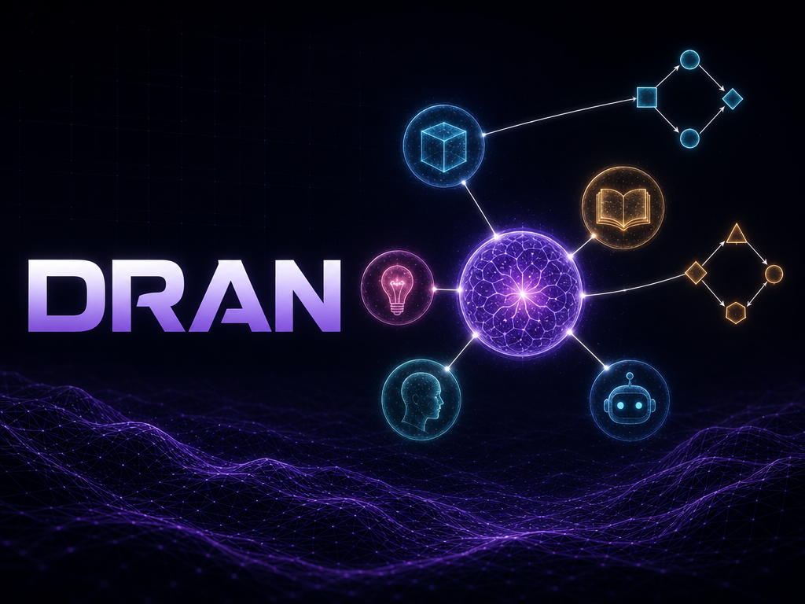

<div align="center">

# 🧠 Dran

### Knowledge base, shared memory & execution ledger for AI agents

[](LICENSE)
[](https://elixir-lang.org)
[](https://www.phoenixframework.org)
[](https://www.postgresql.org)
[](https://modelcontextprotocol.io)



</div>

## What is Dran

Dran gives your AI agents a place to **know**, **remember** and **prove** — in one system, shared with you:

- **Knowledge** — typed pages (`note`, `entity`, `concept`, `reference`) linked by typed relations: a queryable knowledge graph. You edit it in the browser; agents read and write it over MCP/REST.
- **Memory** — atomic, deduplicated facts with trust scores, shared by every agent. What one agent learns, all recall.
- **Ledger** — workflows whose runs record what an agent claimed and what was verified. Execution evidence, not vibes.

Humans get a wiki. Agents get 35 MCP tools and a REST API. One graph, one attribution model: every write is tied to the API key's actor, server-side.

## Knowledge

- **4 page types** — `note`, `entity`, `concept`, `reference`; goals, collections and reports are first-class entities in their own tables
- **TipTap markdown editor** — tables, code blocks, mermaid, `![[slug]]` embeds; read-only render by default
- **13 relation types** — `related`, `part_of`, `supersedes`, `contradicts`, `embeds`… plus machine-owned ones (`semantic`, `mentions`, props-derived) created by the augmenter, not by hand
- **Props → edges** — `role`, `tier`, `location`, `language`, `framework` auto-materialize into typed edges
- **Version history** with diff view; **machine-owned summaries** (written only by API/nightly job)

## Workflows — the ledger

- **DAGs of steps** authored in a visual canvas editor; each step is a **contract**: intent, pre-registered claims, gates (what must be true when done)
- **Execution loop**: open session → claim a ready run → work → report ✓NN checkpoints → close `passed`/`failed`/`skipped` → retry reopens failures
- Agents pull work via `dran_list_pending_runs`; row-level auth + locks prevent double claims
- **Runs are evidence**: a run closed without re-running its gates is a false checkpoint

**Riel**: Dran is the board, Riel is the discipline — the agent-side execution protocol (local ledger, briefs, delegation). Step contracts declare *what to verify*; runs store the durable evidence. The `skills/` suite executes that loop over MCP.

## Memory

- Atomic facts per workspace, idempotent on content (duplicates return the existing row)
- Asymmetric trust: helpful `+0.05`, unhelpful `−0.10`; search ranks relevance × trust
- REST `/api/memory` + a **Hermes plugin** (`hermes_plugin/dran/`): auto-recall at turn start, `dran_memory_add/search/feedback` tools, auto-capture on session end (facts extracted server-side, transcripts never persisted)
- Not on the MCP surface — by design

## The app

- **Wiki** at `/:workspace_slug` — read-first browser: search, type index, pinned pages, collections, clusters, graph
- **Workflows** `/:ws/workflows` — board + DAG detail with run state · **Goals** `/:ws/goals` · **Memory** `/:ws/memory` · **Reports** `/:ws/reports/:slug`
- **3D graph** (`/:ws/graph`), **clusters** with LLM summaries, **hybrid search** (fts/fuzzy/semantic), **smart collections**, activity feed, journey timeline
- **Instance dashboard** at `/`; admin (owner-only) at `/admin`: users, workspaces, models, system, jobs
- **Multi-workspace** with per-workspace visibility and page-type toggles

## Automation

- **3 workers** — `curator` (duplicate/conflict detection), `link_gardener` (relations for orphans), `graph_rag` (GraphRAG Q&A with citations); start over MCP, poll the session
- **6 scheduled jobs** (Quantum cron, toggleable + run-now in admin): curator, pagerank, cluster summaries, graph maintenance, link gardener, page summaries
- **Entity linker** — auto-creates entity pages from names detected in bodies

## APIs

**MCP** — `POST /api/mcp`, Streamable HTTP (spec 2025-03-26): 35 tools (pages, search, goals + checklist, workflow/session/run lifecycle, workers, lint), 3 resources (`page://`, `goal://`, `home://`), 2 prompts. 22 write tools require a `write_access` key — enforced by a permission-matrix test.

**REST** — token-protected `/api/*` (kebab-case): read routes always allowed; writes (pages, relations, run lifecycle, memory) require `write_access: true`. Attribution (`owner`/`created_by`) is injected server-side from the key's actor — never client-settable.

## Security

- First-run `/setup` creates the owner; Google OAuth optional (domain-restricted)
- Instance owner + per-workspace roles (`owner`/`admin`/`editor`/`viewer`)
- Per-user API keys, read-only by default, scoped to the creator's workspaces
- Row-level auth on executions, `FOR UPDATE` locks on run claims, audit tooling in precommit

## Agent skills

`skills/` ships 8 skills for Hermes (or any skill-loading agent) — one per operating flow: `dran` (router), knowledge, relations, goals, create-workflow (authoring), workflow (the Riel loop), workers, memory. Shared rules: one key = one actor; a write is not done until a readback confirms it; irreversible ops need human confirmation.

## Installation

### 1 · Dran (the server)

**Requirements:** Elixir ~> 1.15, Erlang/OTP 26+, PostgreSQL 14+ with **pgvector**, Node (asset tooling only).

```bash
git clone git@github.com:alvarolizama/dran.git && cd dran
cp .env.example .env && $EDITOR .env
mix setup && mix phx.server
```

Open [localhost:4000](http://localhost:4000) — first run redirects to `/setup`.

### 2 · Connect an agent (Hermes)

One Dran instance serves every agent. Per agent profile:

**a. Credential.** In Dran → **Settings → Agents**: create the agent and its key, ticking the **workspace × access-level matrix** (`write` on the workspace that will hold the agent's memory). The token is shown once. Every write is attributed server-side to this key's actor.

**b. Secret (once per profile).** Store the token in the profile's `.env` — single source of truth, shared by MCP and the memory plugin:

```bash
# ~/.hermes/profiles/<profile>/.env
DRAN_API_KEY=<paste-token>
```

**c. MCP server** (35 tools). In the profile's `config.yaml`:

```yaml
mcp_servers:
  dran:
    url: http://localhost:4000/api/mcp
    headers:
      Authorization: Bearer ${DRAN_API_KEY}
```

**d. Memory plugin** (auto-recall, `dran_memory_*` tools, session ingest). Symlink from this repo and select it:

```bash
ln -s /path/to/dran/hermes_plugin/dran ~/.hermes/profiles/<profile>/plugins/dran
```

```yaml
memory:
  provider: dran
```

Configure it from the dashboard panel (**Memory → Dran**: base URL, memory workspace, recall/capture toggles) or `hermes memory setup`. Stored at `$HERMES_HOME/dran/config.json`; the API key stays in `.env`. The memory workspace must be one the key can reach — the plugin validates against `GET /api/agent/config` and falls back to the first permitted workspace (with a warning) if the matrix changes.

**e. Skills** (8: router + knowledge, relations, goals, create-workflow, workflow/Riel, workers, memory flows). Symlink the suite into a dir the profile already scans:

```bash
mkdir -p ~/Workspace/Skills
for s in dran dran-create-workflow dran-goals-flow dran-knowledge-flow dran-memory-flow \
         dran-relations-flow dran-workers-flow dran-workflow-flow; do
  ln -s /path/to/dran/skills/$s ~/Workspace/Skills/$s
done
```

```yaml
skills:
  external_dirs:
    - ~/Workspace/Skills
```

Restart the Hermes session, then verify: MCP → "list my Dran goals"; memory → "¿qué recuerdas de …?"; skills → the agent should route Dran questions through the `dran` skill.

Non-Hermes agents: skip d/e, point any MCP client at `POST /api/mcp` with the Bearer key, or use the REST API directly.

## Configuration

Via environment variables — see [`.env.example`](.env.example) for the full list. Essentials: `SECRET_KEY_BASE`, `DATABASE_URL`, `PHX_HOST/PORT/SCHEME`, `DRAN_API_TOKEN`, `DRAN_WORKSPACE_SLUG/NAME`, session salts (prod), `UPLOADS_DIR`. Optional: Google OAuth vars and `DRAN_INFERENCE_API_URL/KEY` (OpenAI-compatible endpoint powering embeddings, summaries, workers, semantic search — without it Dran still works, minus those features).

## Production

```bash
MIX_ENV=prod mix deps.get --only prod
MIX_ENV=prod mix compile && MIX_ENV=prod mix assets.deploy
MIX_ENV=prod mix release   # start with bin/server
```

A `Dockerfile` ships with the repo (Coolify-ready; `/app/bin/migrate` as pre-deploy step). Runtime env vars only — never bake secrets into the image.

## Tech stack

Phoenix 1.8 + LiveView · PostgreSQL + pgvector · TipTap v3 · MDEx · Tailwind v4 + daisyUI · 3d-force-graph · Bandit · Quantum · Req · MCP 2025-03-26

## Pre-commit

```bash
mix precommit   # compile --warnings-as-errors → deps.unlock --unused → format → deps audit → sobelow → test
```

## License

MIT
