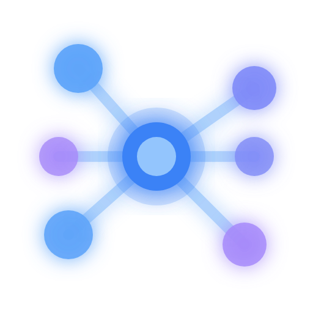

<div align="center">



# Dran

### *Dran* — Tibetan for "remember". What one agent learns, none forget.

### Shared memory & knowledge base for AI agent swarms

[](LICENSE)
[](./mix.exs)
[](https://elixir-lang.org)
[](https://www.phoenixframework.org)
[](https://www.postgresql.org)

</div>

## What is Dran

Dran is the **shared brain an agent swarm reads and writes** — one instance, one graph,
one memory store, shared by every agent and by you. What one agent learns, none forget.

Two pillars:

- **Knowledge** — a typed, queryable **knowledge graph**. Pages (`note`, `idea`,
  `knowledge`, `technical`, `entity`, `concept`, `reference`, `food`) linked by typed
  relations. You browse and edit it in the browser; agents read and write it through the
  Hermes plugin tools and the REST API.
- **Memory** — atomic, deduplicated **facts with trust scores**, shared by every agent.
  What one agent learns, all recall. Written through the Hermes plugin and REST,
  never hand-edited in the UI.

Humans get a wiki. Agents get plugin tools and a REST API. One attribution model: every write
is tied to the API key's actor, server-side.

## Knowledge

- **8 page types, each with `meta.kind` subtypes and type-specific meta fields** — defined
  in one place, `Dran.PageRegistry` (`lib/dran/page_registry.ex`):

  | Type | Purpose | `meta.kind` values | Extra meta fields |
  |---|---|---|---|
  | `note` | free capture | *(free — none validated)* | `date`, `due_date` *(kind `reminder`)* |
  | `idea` | sparks & thinking | `idea` `question` `hypothesis` `spark` | — |
  | `knowledge` | captured wisdom | `quote` `summary` `highlight` `excerpt` | `source_url`, `date` |
  | `technical` | code & how-to | `code` `snippet` `debug` `recipe` `config` `command` `template` `pattern` `method` | `language` *(kind `code`)*, `version` |
  | `entity` | named things | `person` `company` `product` `tool` `place` `event` `language` `framework` `hardware` `protocol` | `location`, `external_url` |
  | `concept` | abstract ideas | *(free)* | `domain`, `parent_concept` |
  | `reference` | external sources | `article` `paper` `video` `podcast` `book` `newsletter` `spec` `code` `release` `website` `repo` `api` | `source_url`, `published_at` |
  | `food` | cooking & gastronomy | `recipe` `ingredient` `dish` `meal` `cuisine` `restaurant` `drink` `technique` | `cuisine`, `servings`, `prep_time`, `cook_time`, `source_url` |

  Every type also accepts `meta.props` (free-form key-value bag, indexed). `meta.kind` is
  validated by the changeset (free on `note`/`concept`); it classifies and filters — it
  never changes behavior. Collections and reports are first-class entities in their own
  tables, not page types. See [docs/page-types.md](docs/page-types.md) for when to pick
  which type and how to use each kind.

- **13 relation types** — 5 you set by hand (`related`, `contradicts`,
  `supersedes`, `part_of`, `embeds`) plus 8 machine-owned, created by Dran and never by
  hand: `semantic` (augmenter), `mentions` (entity linker), `works_in` / `has_tier` /
  `based_in` / `written_in` / `built_with` (props-derived) and `informs` (memory → page,
  at ingest).
- **Props → edges** — `role`, `tier`, `location`, `language`, `framework` auto-materialize
  into typed edges.
- **TipTap markdown editor** — tables, code blocks, mermaid, `![[slug]]` embeds; read-only
  render by default.
- **Version history** with diff view; **machine-owned summaries** (written only by
  API/nightly job).

## Memory

- Atomic facts per workspace, **idempotent on content** (duplicates return the existing
  row); rewordings in the grey zone (cosine 0.88–0.95, typically cross-language) return
  `409 near_duplicate` — refine via `PATCH /api/memory/:id` (trust preserved) or re-add
  with `force=true`.
- **Auto-relations at ingest**: `informs` (memory → top-3 closest pages) and `semantic`
  (memory ↔ related memories, ~0.72–0.88 cosine band) — derived from the dedupe embedding,
  zero extra inference; visible in the 3D graph and as "related facts" in the memory UI.
- **Nightly hygiene**: re-derive edges, sweep edges touching dead memories (both
  endpoints), decay trust of facts that were never retrieved *and* never rated
  (−0.02/30d, floor 0.15; feedback-earned trust never decays).
- **Asymmetric trust**: helpful `+0.05`, unhelpful `−0.10`; search ranks relevance × trust.
- **Ingest efficiency**: the extractor's negative context includes the semantic neighbours
  of the known top-10 (skips related variants, not just dupes); the Hermes plugin sends
  only the session's message delta (cursor per session).
- REST `/api/memory` + a **Hermes plugin** (`hermes_plugin/dran/`): auto-recall at turn
  start, `dran_memory_add/update/search/feedback` tools, auto-capture on session end (facts
  extracted server-side, transcripts never persisted).

## The app

- **Wiki** at `/:workspace_slug` — read-first browser: search, type index, pinned pages,
  collections, clusters, graph
- **Memory** `/:ws/memory` · **Reports** `/:ws/reports/:slug`
- **3D graph** (`/:ws/graph`), **clusters** with LLM summaries, **hybrid search**
  (`fts`/`fuzzy`/`semantic`), **smart collections**, activity feed, journey timeline
- **Instance dashboard** at `/`; admin (owner-only) at `/admin`: users, workspaces, models,
  system, jobs
- **Multi-workspace** with per-workspace visibility (public/private) and page-type toggles

## Automation

- **3 background workers** — `curator` (duplicate/conflict detection), `link_gardener`
  (relations for orphans), `graph_rag` (GraphRAG Q&A with citations). Start them with
  `dran_start_worker` (plugin tool or `POST /api/workers`), then poll the session
  (`dran_get_worker_session` or `GET /api/workers/:id`).
- **7 scheduled jobs** (Quantum cron — toggleable, run-now from `/admin`): curator,
  PageRank, cluster summaries, graph maintenance, link gardener, page summaries, memory
  re-link
- **Entity linker** — auto-creates entity pages from names detected in bodies

## APIs

**Hermes plugin tools** — the agent surface. The `dran` plugin
(`hermes_plugin/dran/`) registers a toolset via `register(ctx)`: search, page lifecycle,
relations, workers and lint (`dran_*`, 16 tools), plus the memory provider tools
(`dran_memory_*`, 4). Every write carries `X-Hermes-Agent` (the active profile), which the
server persists as `agent_name`; attribution (`created_by`/`owner_user_id`) is derived
server-side from the key's actor — never client-settable. See
[hermes_plugin/dran/README.md](hermes_plugin/dran/README.md).

**REST** — token-protected `/api/*` (kebab-case): read routes always allowed; writes
(pages, relations, workers, memory) require `write_access: true`. The plugin tools are a
thin client over these routes, so non-Hermes agents use the same API directly.
Attribution (`owner_user_id`/`created_by`/`agent_name`) is injected server-side — never
client-settable. Reads are filtered by the workspace sharing policy
(`Dran.ContentVisibility`): `share_memory`/`share_pages` decide whether the workspace
shares content, and each user's `content_scope` ("all" | "own") narrows it further.
Full endpoint reference: [docs/api.md](docs/api.md).

## Security

- First-run `/setup` creates the owner; Google OAuth optional
- Instance owner + per-workspace roles (`owner` / `admin` / `editor` / `viewer`)
- Per-user API keys, read-only by default (per-workspace `access_level`, default `read`),
  scoped to the creator's workspaces
- Row-level auth on resources; audit tooling in precommit (`sobelow`, `deps.audit`)

## Agent skills

`skills/` ships 5 skills for Hermes (or any skill-loading agent) — one router plus one per
operating flow: `dran` (router), `dran-knowledge-flow`, `dran-relations-flow`,
`dran-workers-flow`, `dran-memory-flow`. Shared rules: one key = one actor; a write is not
done until a readback confirms it; irreversible ops need human confirmation.

## System prompt initialization

Paste this block into `soul.md` (or an injected system prompt) so the agent
loads the Dran skills on match:

```
## Frameworks — activation lines

- **Dran (second brain)** — when operating the Dran workspace (knowledge
  pages, typed relations, memories, or its workers), load the `dran` skill
  and whichever apply: `dran-knowledge-flow` (pages), `dran-relations-flow`
  (typed links), `dran-memory-flow` (durable facts), `dran-workers-flow`
  (curator / link_gardener / graph_rag). Dran stores and returns what is
  known — it does not decide it.
```

Keep it this short: the soul references the skills, it never embeds them
(embedding desyncs and costs tokens every turn). The same block lives at
`system-prompt.md`. Name your default workspace in the line if the
deployment pins one.

## Installation

### 1 · Dran (the server)

**Requirements:** Elixir ~> 1.15, Erlang/OTP 26+, PostgreSQL 14+ with **pgvector**, Node
(asset tooling only).

```bash
git clone git@github.com:alvarolizama/dran.git && cd dran
cp .env.example .env && $EDITOR .env
mix setup && mix phx.server
```

Open [localhost:4000](http://localhost:4000) — first run redirects to `/setup`.

### 2 · Connect an agent (Hermes)

One Dran instance serves every agent. Per agent profile:

**a. Credential.** In Dran → **Settings → Agents**: create the agent and its key, ticking
the **workspace × access-level matrix** (`write` on the workspace that will hold the
agent's memory). The token is shown once. Every write is attributed server-side to this
key's actor.

**b. Secret (once per profile).** Store the token in the profile's `.env` — single source
of truth, shared by the plugin's memory provider and its toolset:

```bash
# ~/.hermes/profiles/<profile>/.env
DRAN_API_KEY=<paste-token>
```

**c. Enable the plugin** in the profile's `config.yaml` — it registers the knowledge
toolset (`dran_*`, 16 tools) **and** the memory provider (`dran_memory_*`) from one module:

```yaml
plugins:
  enabled:
    - dran
```

**d. Symlink the plugin** (auto-recall, tools, session ingest). Symlink from
this repo and select it:

```bash
ln -s /path/to/dran/hermes_plugin/dran ~/.hermes/profiles/<profile>/plugins/dran
```

```yaml
memory:
  provider: dran
```

Configure it from the dashboard panel (**Memory → Dran**: base URL, memory workspace,
recall/capture toggles) or `hermes memory setup`. Stored at `$HERMES_HOME/dran/config.json`;
the API key stays in `.env`. The memory workspace must be one the key can reach — the
plugin validates against `GET /api/agent/config` and falls back to the first permitted
workspace (with a warning) if the matrix changes.

**e. Skills** (5: router + knowledge, relations, workers, memory flows). Symlink the suite
into a dir the profile already scans:

```bash
mkdir -p ~/Workspace/Skills
for s in dran dran-knowledge-flow dran-memory-flow \
         dran-relations-flow dran-workers-flow; do
  ln -s /path/to/dran/skills/$s ~/Workspace/Skills/$s
done
```

```yaml
skills:
  external_dirs:
    - ~/Workspace/Skills
```

Restart the Hermes session, then verify each piece: tools — ask it to "list my pages";
memory — "what do you remember about …?"; skills — it should route Dran questions
through the `dran` skill.

Non-Hermes agents: use the REST API directly (`docs/api.md`) with the Bearer key.

## Configuration

Via environment variables — see [`.env.example`](.env.example) for the full list.
Essentials: `SECRET_KEY_BASE`, `DATABASE_URL`, `PHX_HOST/PORT/SCHEME`, session salts
(prod), `UPLOADS_DIR`. Optional: Google OAuth vars and `DRAN_INFERENCE_API_URL/KEY`
(OpenAI-compatible endpoint powering embeddings, summaries, workers, semantic search —
without it Dran still works, minus those features).

Not env vars (admin UI only, stored in the database): the default workspace and the
legacy admin API token — both live in `/admin/system`. Per-user API tokens are
managed in `/admin/users`; workspace-scoped API keys in each workspace's settings.

## Production

```bash
MIX_ENV=prod mix deps.get --only prod
MIX_ENV=prod mix compile && MIX_ENV=prod mix assets.deploy
MIX_ENV=prod mix release   # start with bin/server
```

A `Dockerfile` ships with the repo (Coolify-ready; `/app/bin/migrate` as pre-deploy step).
Runtime env vars only — never bake secrets into the image.

## Tech stack

Phoenix 1.8 + LiveView · PostgreSQL + pgvector · TipTap v3 · MDEx · Tailwind v4 + daisyUI ·
3d-force-graph · Bandit · Quantum · Req

## Pre-commit

```bash
mix precommit   # compile --warnings-as-errors → deps.unlock --unused → format → deps audit → sobelow → test
```

## Versioning

This project follows [Semantic Versioning](https://semver.org/). The current version
lives in [`mix.exs`](mix.exs) (`version:`), mirrored in `assets/package.json` and
`hermes_plugin/dran/plugin.yaml`. The Hermes plugin and the agent skills ship with
the server and are versioned together with it — the skills carry their own
frontmatter versions, bumped independently as each flow evolves.

## License

Released under the [MIT License](LICENSE) — Copyright (c) 2026 Álvaro Lizama.
The license covers the whole repository: the Elixir/Phoenix server, the Hermes
memory plugin (`hermes_plugin/dran/`), and the agent skills (`skills/`).
Third-party dependencies keep their own licenses; vendored assets
(`assets/vendor/daisyui`) are subject to their upstream licenses (daisyUI — MIT).
