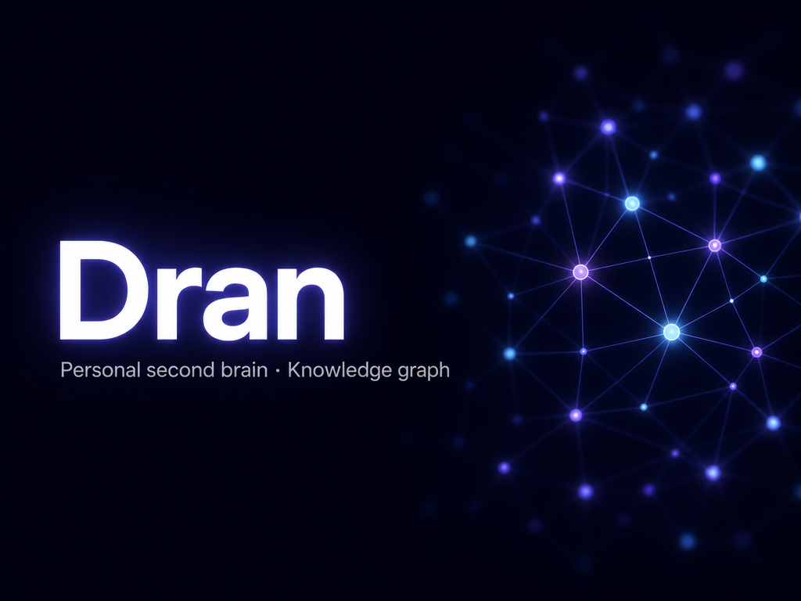

# Dran

A personal second-brain application built with **Phoenix 1.8 + LiveView**. It stores your knowledge as **typed pages** (notes, concepts, entities, references, goals, plans, todos, queries, projects) and links them with **relations**, forming a queryable knowledge graph.

Includes a full markdown editor (TipTap WYSIWYG), three autonomous agents, an MCP endpoint for AI agent integration (with per-user token auth and context scoping), and a REST API.

> **[SKILL.md](SKILL.md)** — Agent operating manual for the Dran MCP server: tools, agent rules, page types, recipes, and pitfalls. If you're building an AI agent that connects to Dran via MCP, start there.

## What is a second brain?

Dran is a networked knowledge base for a single human. It captures notes and structured knowledge, then connects them with semantic and explicit relations so you (and AI agents) can traverse, summarize, and answer questions against a live graph — not a pile of isolated files.

## Key features

- **9 page types** with type-specific metadata — note, concept, entity, reference, project, goal, plan, todo, query
- **Markdown editor** — TipTap WYSIWYG with bidirectional markdown, tables, code blocks, mermaid diagrams, and file embeds `![[slug]]`
- **Autonomous agents** — background ReAct agents (`ask`, `curator`, `link_gardener`) that plan, act, and log every step
- **Knowledge graph** — visual graph at `/graph` with pan/zoom and 3D view, built from explicit and semantic relations; every page detail surfaces a per-page subgraph
- **Bidirectional semantic relations** — `PageAugmenter` creates `semantic` links after every capture, with an adaptive cosine-distance threshold tunable in settings
- **Multi-user auth with Google OAuth** — per-user accounts, per-user API tokens, and context membership control
- **Per-context page type disabling** — restrict which page types are available in a given context
- **Version history with diff** — every edit saves the previous body to `page_versions`
- **Activity feed** — real-time log of all brain actions in a dedicated LiveView
- **Hybrid search** — unified search picks full-text, fuzzy, semantic or hybrid with RRF fusion and an optional PageRank authority boost
- **Runtime settings** — tune the brain without a redeploy via an admin-only `/settings` page organized in tabs
- **MCP server** — 17 tools for AI agents to search, read, create, update, delete, relate, lint, and manage the graph (see [SKILL.md](SKILL.md))
- **Full context export** — export an entire context (pages, relations, versions, uploads) as a JSON backup

## Quick start (local dev)

### Prerequisites

- **Elixir 1.15+ and OTP 26+** — managed via [mise](https://mise.jdx.dev) (see `mise.toml`)
- **PostgreSQL 14+** (with `pg_trgm`, `uuid-ossp`, and `pgvector` extensions)
- **Node.js 18+** (for asset building)

### First-time setup

```bash
# 1. Clone and enter the project
git clone git@github.com:alvarolizama/dran.git
cd dran

# 2. Copy the env template and edit values
cp .env.example .env
$EDITOR .env    # set SECRET_KEY_BASE, admin credentials, etc.

# 3. Install deps, create the DB, run migrations, build assets, and seed
mix setup
```

> **mise auto-loads `.env`:** If you use `mise`, the `.env` file is loaded automatically via `mise.toml` (`_.file = ".env"`). No need to `source .env` manually. Otherwise use `direnv allow` or export the vars in your shell.

`mix setup` runs: `mix deps.get` → `mix ecto.create` → `mix ecto.migrate` → `mix assets.setup` → `mix assets.build` → `mix seed` (creates the default context from `DRAN_CONTEXT_SLUG` / `DRAN_CONTEXT_NAME`).

### Running the dev server

```bash
mix phx.server
```

Visit [localhost:4000](http://localhost:4000). You'll be redirected to login.

## Authentication & multi-user

Dran supports two ways to log in: **Google OAuth** (recommended) and **legacy credentials**.

### Users

Every user is a row in the `users` table with `email`, `name`, `google_id`, `avatar_url`, `is_admin`, and a single `api_token`. A user can access only the contexts assigned to them (via the `user_contexts` join table). Admins can access everything and are the only role that sees **Settings**.

### Google OAuth

Google login appears on the login page **only when** both `GOOGLE_CLIENT_ID` and `GOOGLE_CLIENT_SECRET` are set. On first login a user is auto-created; on every login the email in `DRAN_ADMIN_EMAIL` is auto-promoted to admin.

### Legacy credentials

For a single-admin setup without Google, set `DRAN_USERNAME` / `DRAN_PASSWORD`. The seed step creates an admin account from these. The legacy `DRAN_API_TOKEN` is treated as an **admin token** (full access) and continues to work for MCP/REST. All three preserve backward compatibility.

### Per-user API tokens & context scoping

Each user has one `api_token` (shown/managed in Settings → Users) used for the API and MCP. A token grants access **only** to the contexts assigned to that user:

- MCP returns **`401`** for an invalid/missing token, and **`403`** when a user's token tries to access a context they're not assigned to.
- Set `context` on a request to target a specific context; otherwise it falls back to the user's first assigned context.

## Environment variables

See [`.env.example`](.env.example) for the full annotated list. Key variables:

| Variable | Required | Notes |
| --- | --- | --- |
| `SECRET_KEY_BASE` | yes | Output of `mix phx.gen.secret` |
| `DATABASE_URL` | yes | Postgres connection string |
| `PHX_HOST` | yes | Public hostname (e.g. `localhost`, `dran.example.com`) |
| `DRAN_PASSWORD` | no* | Legacy admin login password |
| `DRAN_API_TOKEN` | no* | Legacy admin Bearer token for API / MCP |
| `DRAN_USERNAME` | no | Legacy admin username (default `admin`, seeded) |
| `DRAN_ADMIN_EMAIL` | no | Google email auto-promoted to admin on login |
| `GOOGLE_CLIENT_ID` | no | Enables Google OAuth when set |
| `GOOGLE_CLIENT_SECRET` | no | Enables Google OAuth when set |
| `DRAN_CONTEXT_SLUG` | no | Default context slug (default `personal`) |
| `DRAN_CONTEXT_NAME` | no | Default context name (default `Personal`) |
| `PORT` | no | HTTP listener port (default `4000`) |
| `POOL_SIZE` | no | DB connection pool size (default `10`) |

\* At least one of `DRAN_PASSWORD` (web login) or `DRAN_API_TOKEN` is needed unless you use Google OAuth. **Never use the dev defaults (`admin`/`dran`/`dran-token`) in production.**

### Inference API (optional)

Dran can talk to an OpenAI-compatible inference server to add embeddings, reranking, and chat to the second brain.

| Variable | Notes |
| --- | --- |
| `DRAN_INFERENCE_API_URL` | Base URL (`…/v1`). Set to enable inference. |
| `DRAN_INFERENCE_API_KEY` | API key (required when URL is set) |
| `DRAN_INFERENCE_CHAT_MODEL` | Chat/text model (default `Ornith-1.0-9B`) |
| `DRAN_INFERENCE_EMBEDDING_MODEL` | Embeddings model (default `Qwen3-Embedding`) |
| `DRAN_INFERENCE_RERANK_MODEL` | Rerank model (default `Qwen3-Reranker`) |

How it's used: **unified/semantic search** (embeddings in `pgvector`), **reranking** of candidates, and **automatic semantic relations** (`PageAugmenter`). The models are selectable per-purpose at runtime in Settings → Models. The current local server typically exposes `Qwen3-Embedding`, `Qwen3-Reranker`, and a chat model — verify at runtime with `GET /v1/models`.

### Agents (optional)

| Variable | Notes |
| --- | --- |
| `AGENT_MAX_STEPS` | Max steps per agent run (default `150`) |
| `AGENT_PER_STEP_TIMEOUT` | Per-step timeout in ms (default `120000`) |

## Settings

Only admins see Settings (`/settings`, and `/settings/:tab`). It's organized in tabs:

| Tab | Purpose |
| --- | --- |
| `users` | Create users, set API tokens, promote admins — and manage which contexts each user can access |
| `contexts` | Create/delete contexts, edit a context's page types (see below) |
| `brain` | Brain tuning — semantic thresholds, agent limits, daily-note toggle |
| `models` | Per-purpose inference models (chat/agents, embeddings, reranking), selectable from the API server with env defaults marked `(env)` |
| `system` | Read-only environment configuration |
| `danger` | Destructive actions (e.g. reset context) |

Context CRUD and user/context membership management all live in Settings now — there is no standalone `/contexts` page.

## Per-context page type disabling

Each context can disable any subset of page types via `contexts.disabled_page_types` (an array). Disabling a type:

- **Hides** it from the web sidebar (no kanban/todos/projects/goals/plans/notes/concepts/entities/references links for that type)
- **Excludes** it from `list_pages` on the MCP server
- **Rejects** creation via web or MCP with the error `page type 'X' is disabled in context 'Y'`

Manage disabling in **Settings → Contexts → "Page types"** modal per context.

## Page types

Every piece of knowledge is a page with a `page_type`. Some types have a `kind` sub-type (in `meta.kind`):

| Type | Purpose | Subtypes (meta.kind) |
| --- | --- | --- |
| `note` | Thoughts, journal, ideas | thought, journal, idea, meeting, question, quote, reminder |
| `concept` | Abstract ideas, techniques | technique, pattern, discipline, theory |
| `entity` | People, companies, tools | person, company, product, tool, place, event |
| `reference` | External sources | article, paper, video, podcast, book |
| `project` | Executive dashboards (derived health, status, priority) | — |
| `goal` | Objectives with target dates and health | personal, coding, business, learning, health, finance, other |
| `plan` | Time-horizoned plans | personal, coding, business, learning, health, finance, other |
| `todo` | Actionable items (kanban) | personal, coding, business, learning, health, finance, other |
| `query` | Questions to answer | factual, conceptual, how_to, opinion |

Page links use three independent, orthogonal `meta` slugs — `meta.project_slug`, `meta.goal_slug`, `meta.plan_slug` — each optionally materializing its own `part_of` relation. There is no rigid hierarchy; every page is an orphan by default.

### Relative `created_by` / `assignee`

Pages track who created and owns them; todos carry an `assignee` (free-form string, e.g. `alvaro` for a human, `hermes` for an agent) so you can delegate between humans and AI agents. Filter in the kanban or via `dran_list_pages` with `assignee` (`"none"` for unassigned).

### Embeds

- `![[slug]]` — embed a file (renders as image/video/audio/PDF)
- `![[slug|Alt Text]]` — embed with alt text

Embeds auto-create `embeds` relations. Plain `[[slug]]` wikilinks are no longer supported — link pages explicitly with `dran_create_relation` or let `PageAugmenter` create `semantic` relations.

### Relations

Relations are **directed** (source → target) and typed:

- `related` — generic connection (create manually)
- `part_of` — hierarchy (A is part of B)
- `supersedes` — replacement (A replaces/obsoletes B)
- `contradicts` — conflict (A contradicts B)
- `embeds` — source embeds target (auto-created from `![[slug]]`)
- `semantic` — auto-created by `PageAugmenter` when pages are semantically similar

For explicit typed relations, use the MCP `dran_create_relation` tool or `POST /api/relations`.

## Autonomous agents

Dran can delegate longer tasks to autonomous ReAct agents. There are **three** agent types:

| Agent | Trigger | What it does |
| --- | --- | --- |
| `ask` | Manual (`dran_start_agent`) | Q&A — answers questions from the knowledge graph using **GraphRAG**: searches seed pages, then traverses typed relations to pull in the context text search missed, and cites sources |
| `curator` | Quantum cron (daily 06:00) | Finds duplicates and flags contested knowledge via embedding distance + graph community overlap; creates a cleanup report |
| `link_gardener` | Manual (`dran_start_agent`) | Proposes semantic relations between orphaned and weakly-linked pages, including transitive `part_of` candidates with `via` evidence |

- Start a session with `dran_start_agent` and poll with `dran_get_agent_session`.
- Agents run asynchronously, persist every step, and broadcast live updates to the UI.

**Quantum scheduled crons:** `curator_daily` (daily 06:00) runs the curator agent on the default context; `pagerank_nightly` (daily 03:00) recomputes weighted **PageRank** and detects **communities** via Label Propagation (persisted to `meta.pagerank` / `meta.community_id`).

## Use as MCP server

Dran exposes an MCP (Model Context Protocol) endpoint at `POST /api/mcp` using the **Streamable HTTP** transport (MCP spec 2025-03-26). This lets any MCP-compatible client — Claude Desktop, Hermes Agent, custom scripts — use Dran as a knowledge tool.

| Item | Value |
| --- | --- |
| Endpoint | `POST http://<host>/api/mcp` |
| Auth | `Authorization: Bearer <user-api-token>` |
| Transport | Streamable HTTP, MCP spec 2025-03-26 |
| Auth failures | `401` invalid token; `403` context not assigned |
| Context scoping | token only reaches the user's assigned contexts |

The server returns an `mcp-session-id` header on `initialize`; include it in subsequent requests of the same session.

### Client config

```json
{
  "mcpServers": {
    "dran": {
      "url": "http://localhost:4000/api/mcp",
      "headers": { "Authorization": "Bearer <your-api-token>" }
    }
  }
}
```

### Quick test with curl

```bash
curl -X POST http://localhost:4000/api/mcp \
  -H "Authorization: Bearer <your-api-token>" \
  -H "Content-Type: application/json" \
  -d '{"jsonrpc":"2.0","id":1,"method":"initialize","params":{"protocolVersion":"2025-03-26","capabilities":{},"clientInfo":{"name":"test","version":"1.0"}}}'
```

### Tools, resources, prompts

For the full operational guide — all tools, resources, prompts, recipes, and pitfalls — see [**SKILL.md**](SKILL.md). The available MCP tools are:

`dran_search` · `dran_get_page` · `dran_list_pages` · `dran_get_links` · `dran_create_page` · `dran_update_page` · `dran_delete_page` · `dran_create_todo` · `dran_update_todo` · `dran_create_relation` · `dran_delete_relation` · `dran_rename_slug` · `dran_reaugment_page` · `dran_get_stats` · `dran_lint_brain` · `dran_start_agent` · `dran_get_agent_session`

## REST API

All API endpoints require a bearer token: `Authorization: Bearer <user-api-token>`. Scoped to the user's assigned contexts (pass `?context=<slug>`). Notable routes:

| Method | Path | Description |
| --- | --- | --- |
| `GET` | `/api/pages?context=personal` | List pages (`?include=body` for full) |
| `POST` | `/api/pages` | Create a page |
| `GET`/`PUT`/`DELETE` | `/api/pages/:slug?context=personal` | Get / update / delete a page |
| `GET` | `/api/pages/:slug/links?context=personal` | Page relations (outbound + inbound) |
| `GET` | `/api/pages/:slug/graph?context=personal` | Page subgraph |
| `POST` | `/api/relations` | Create a relation |
| `DELETE` | `/api/relations/:id` | Delete a relation |
| `GET` | `/api/search?q=...&context=personal` | Unified search |
| `GET` | `/api/todos`, `/api/goals` | List todos / goals |
| `GET` | `/api/graph?context=personal` | Full knowledge graph |
| `GET` | `/api/lint?context=personal` | Quality lint report |
| `GET` | `/api/log?context=personal` | Audit log |
| CRUD | `/api/contexts` | Context management |
| `POST` | `/api/mcp` | MCP JSON-RPC endpoint |

## Migrations / reset (development)

```bash
mix ecto.create    # create the database
mix ecto.migrate   # run migrations
mix seed           # create the default context (idempotent)
mix ecto.reset     # drop + create + migrate + seed (destructive)
```

## Production deployment

Dran ships as a standard Elixir release with helpers in `rel/overlays/bin/`:

| Script | What it does |
| --- | --- |
| `bin/server` | Starts the Phoenix server. Use as the **start command**. |
| `bin/migrate` | Runs pending migrations only. Use for incremental deploys. |
| `bin/setup` | Idempotent: creates DB (if missing) → migrates → seeds. Use for the **first deploy** or pre-deploy hooks. |

Build with:

```bash
mix local.hex --force && mix local.rebar --force
MIX_ENV=prod mix deps.get --only prod
MIX_ENV=prod mix compile
MIX_ENV=prod mix assets.deploy
MIX_ENV=prod mix release
```

The release lives in `_build/prod/rel/dran/` and is self-contained — copy it to the target machine or build a container image. The repo also ships a multi-stage **Dockerfile** (with an entrypoint that runs pending migrations before boot). Coolify/Railpack/Nixpacks auto-detect the Elixir app; set the env vars above (Runtime env vars only — never bake secrets into a Dockerfile) and start command `bin/server`.

**Platform env vars:** `PHX_PORT` (default 443), `PHX_SCHEME` (`https`/`http`), `UPLOADS_DIR` (default `priv/static/uploads`), `UPLOADS_MAX_SIZE` (default 100 MiB), `ECTO_IPV6`, `DNS_CLUSTER_QUERY` (multi-node), `DISABLE_FORCE_SSL=1` (build-time, for plain-HTTP deployments behind a tunnel without TLS).

### Health check

```bash
curl -fsSL https://dran.example.com/health
```

## Tech stack

- **Phoenix 1.8** with LiveView
- **TipTap v3** markdown editor with `@tiptap/markdown` for bidirectional markdown
- **MDEx** (comrak) for server-side markdown rendering with GFM + sanitization
- **MCP** (Model Context Protocol) for AI agent integration
- **Quantum** (`~> 3.5`) — cron scheduler for the `curator` (daily) and `pagerank_nightly` (03:00) jobs
- **Tailwind CSS v4** + daisyUI for styling

## Pre-commit checks

Before committing, always run:

```bash
mix precommit
```

This runs `compile --warnings-as-errors`, `deps.unlock --unused`, `format`, and `test`. Fix any issues it reports before pushing.

## License

MIT
