# second-brain — Dran MCP Skill

## Entry router

¿Estás en el skill correcto? Sigue este diagrama:

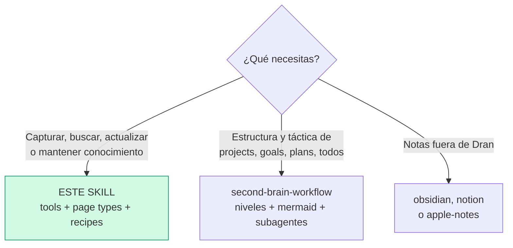

Ejecuta SOLO la sección a la que llegaste (page types §3, tools §4, recipes §9).
Si el diagrama te manda a otro skill, **paras aquí** y haces hand-off — no
absorbes ese trabajo.

## Parse contract

### Qué CONSUME este skill
- Pedido de Álvaro (thought, nota, research, URL, goal, plan, todo, pregunta)
  o página Dran existente
- Estado de la página: `page_type`, `meta`, `tags`, relations, contexto
  (default **`personal`**)

### Qué PRODUCE este skill
- Páginas Dran vía `dran_create_page` (todo tipo **excepto todos**) o
  `dran_create_todo`
- `meta` válido según `page_type` (kinds en §3), relations tipadas (§4),
  status según §8; todos con `kanban_status` + `priority` + `assignee`
  (SIEMPRE clarify) y auto-move a `in_progress`
- Actualizaciones: `dran_update_todo` (merge `meta`) para status de todos;
  `dran_update_page` con **solo `body`** si la página tiene mermaid

**Sin `page_type` + `meta.kind` correctos el output está mal formado** — la
página se crea, pero búsqueda, kanban y relations la tratan mal.

## 1. What is Dran

Dran is a **personal second-brain / knowledge-graph server**. Every piece of
knowledge is a typed **page** connected by typed **relations**, all operated
through a single MCP endpoint.

- **Pages** are the atoms. Each has a `page_type`, a markdown `body`, and a
  JSONB `meta` whose valid fields depend on the type.
- **Relations** are directed links. `semantic` relations are created
  automatically by the augmenter after every create/update; the rest
  (`related`, `part_of`, `supersedes`, `contradicts`, `embeds`,
  `works_in`, `has_tier`, `based_in`, `written_in`, `built_with`) are explicit
  or materialized from `meta.props`.
- **Search** fuses FTS + semantic via reciprocal-rank fusion with a PageRank
  authority boost — well-linked pages rank higher.
- **Contexts** partition the brain (e.g. `personal`, `work`). Pages, relations
  and search are always scoped to one context.

## 2. Connection

| Item | Value |
| --- | --- |
| Transport | Streamable HTTP, MCP spec **2025-03-26** |
| Endpoint | `POST http://<host>/api/mcp` |
| Auth | `Authorization: Bearer *** — legacy admin, per-user, or context API key |
| Default context | **`personal`** — do not ask, do not switch unless Álvaro says so |

Auth accepts three token kinds, checked in order:

1. **Legacy admin** — the `DRAN_API_TOKEN` env token: access to all contexts.
2. **Per-user token** — one `api_token` per user, covering their assigned
   contexts.
3. **Context API key** — scoped to a single context (managed in Settings →
   API Keys; plaintext shown once at creation, revocable, restorable,
   regenerable).

Requests return `401` for invalid/revoked tokens and `403` for contexts the
token isn't allowed to touch.

## 3. Page types (9)

Cada página tiene UN `page_type`. Este decide qué `meta` acepta y cómo la
trata la búsqueda / kanban / grafo.

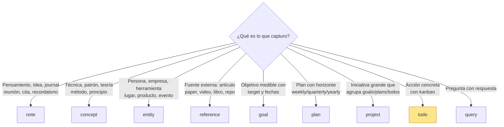

| Type | Use it for | Subtypes (`meta.kind`) |
| --- | --- | --- |
| `note` | Thoughts, journal, ideas, meetings, questions, quotes, reminders | thought, journal, idea, meeting, question, quote, reminder, fleeting, permanent, moc, comparison, code, snippet, recipe, debug, checklist, outline, summary, decision, draft, template, log, brainstorm |
| `concept` | Techniques, patterns, disciplines, theories | technique, pattern, discipline, theory, principle, framework, method, model, law, heuristic, strategy, convention |
| `entity` | People, companies, products, tools, places, events | person, company, product, tool, place, event, language, framework, service, hardware, protocol, course, community, asset, brand |
| `reference` | External sources | article, paper, video, podcast, book, document, code, design, deliverable, file, tweet, docs, course, newsletter, forum, spec, release, website, repo, api, guide, interview, talk |
| `project` | Larger initiatives grouping goals/plans/todos | — |
| `goal` | Objectives with a measurable target | personal, coding, business, learning, health, finance, other, investing, marketing, product, writing, career, relationship, travel |
| `plan` | Time-horizoned plans (weekly/monthly/quarterly/yearly) | personal, coding, business, learning, health, finance, other, investing, marketing, product, writing, career, relationship, travel |
| `todo` | Actionable items with kanban status | personal, coding, business, learning, health, finance, other, investing, marketing, product, writing, career, relationship, travel |
| `query` | Questions with answers | factual, conceptual, how_to, opinion, exploration, report, status, decision, comparison |

Default to `note` with `meta.kind: "thought"` when unsure — promote later.

Notes with `meta.kind: "code"` may carry `meta.language` (e.g. `elixir`,
`python`) to filter by programming language.

### Meta fields por tipo (los que de verdad acepta cada uno)

Fuente: `dran_create_page` en `lib/dran/mcp.ex`. Campos clave:

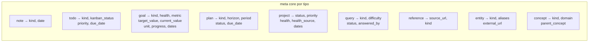

- **goal**: `health` (green/yellow/red), `metric` + `target_value` +
  `current_value` + `unit` para medir, `progress`, `start_date`, `target_date`.
- **plan**: `horizon` (weekly/monthly/quarterly/yearly), `period` (ej
  `2026-Q3`), `status` (draft/active/done/archived), `due_date`.
- **project**: `status` (draft/active/on_hold/done/archived), `priority`,
  `health`, `health_source` (manual/derived), fechas.
- **todo**: `kanban_status` (backlog/this_week/today/in_progress/done/
  cancelled), `priority` (low/medium/high/urgent), `due_date`.
- **query**: la pregunta + respuesta; `status` es **`answer_status` a nivel de
  negocio** (open/answered/verified), `difficulty`, `answered_by`.

### Custom properties — `meta.props`

Every page may carry `meta.props`: a namespaced, free-form key-value bag for
metadata that doesn't fit the typed fields (e.g.
`props: {"role": "sales", "tier": "vip"}`). Props survive round-trips and are
covered by the meta GIN index.

**Props the graph can see (materialized into typed relations)** — these keys
auto-create edges during augmentation (Dran.PropsMaterializer):

| Prop key | Relation | Target page | Example |
|---|---|---|---|
| `role` | `works_in` | entity | `role: "sales"` → person works_in Sales |
| `tier` | `has_tier` | concept | `tier: "vip"` → person has_tier VIP |
| `location` | `based_in` | entity | `location: "cdmx"` |
| `language` | `written_in` | entity | `language: "elixir"` |
| `framework` | `built_with` | entity | `framework: "phoenix"` |

Any other key is stored but generates no edge. Edge weight 0.7, joins
community detection. Materialization runs on create/update (augmenter) and
is inference-independent — works even with the LLM off.

**Backfill**: Settings → Brain → "Run backfill" re-materializes props for
every existing page with non-empty `meta.props` (Dran.PropsBackfill).

### Per-context page type disabling

Each context can **disable page types** (`disabled_page_types`). A disabled
type is hidden in the web UI and **rejected by the MCP API**: creating or
listing it returns an error (`page type 'X' is disabled in context 'Y'`).
Before creating a page of an unusual type in an unfamiliar context, expect the
possibility that it's disabled.

### Link model — independent slugs

Any page may carry any combination of `meta.project_slug`, `meta.goal_slug`
and `meta.plan_slug` — **0, 1, 2, or all 3**. Each one materializes its own
`part_of` relation automatically. No precedence, no derivation. Orphans (no
links) are legitimate GTD-style inbox items. In `dran_list_pages`, the value
`"none"` filters pages without that link.

## 4. Tools (18)

Grouped by workflow: capture → read/find → organize → maintain → automate.

### Capture

| Tool | Purpose |
| --- | --- |
| `dran_create_page` | Create any page type **except todos** |
| `dran_create_todo` | Create a todo with kanban status, priority, due date, and independent project/goal/plan links |

### Read & find

| Tool | Purpose |
| --- | --- |
| `dran_search` | **Use FIRST** — unified FTS/fuzzy/semantic/hybrid search, PageRank-boosted. Supports `limit`, `offset`, `type` filter |
| `dran_get_page` | Full markdown body of one page — always read before answering |
| `dran_list_pages` | Filtered list (type, tag, status, owner, assignee, project/goal/plan slug, `"none"` for orphans) |
| `dran_get_links` | Inbound + outbound relations for a page |

### Organize

| Tool | Purpose |
| --- | --- |
| `dran_update_page` | Update title/body/tags/meta — **replaces `meta` entirely**. ⚠️ When updating a page with mermaid diagrams, pass only `body` (no `meta`) or TipTap re-parses and strips the mermaid blocks |
| `dran_update_todo` | Update todo status/priority/date/links — **merges `meta`** (the only safe way to change todo status) |
| `dran_rename_slug` | Rename a slug; rewrites all `![[old-slug]]` embeds in the context |
| `dran_create_relation` | Explicit typed relation: `related`, `part_of`, `supersedes`, `contradicts`, `embeds`, plus prop-materialized types `works_in`, `has_tier`, `based_in`, `written_in`, `built_with`. **Never `semantic`** (automatic) |
| `dran_delete_relation` | Delete relations between two pages |
| `dran_delete_page` | Delete a page — **irreversible**, confirm with Álvaro first |

### Maintain

| Tool | Purpose |
| --- | --- |
| `dran_get_stats` | Totals, pages by type, todos by status, orphans, relations |
| `dran_lint_brain` | Orphans, stale pages (>90d), contested knowledge. Surface results — don't auto-fix |
| `dran_reaugment_page` | Re-run augmentation (summary/tags/embedding/relations) for a page |
| `dran_generate_community_summaries` | Generate LLM summaries for all detected graph communities |

### Automate

| Tool | Purpose |
| --- | --- |
| `dran_start_agent` | Launch an autonomous agent (`curator`, `link_gardener`, `graph_rag`) |
| `dran_get_agent_session` | Poll an agent session for status, steps, summary |

## 5. Resources & prompts

Resources (read-only, prefer over looping `dran_list_pages`):
- `page://{context}/{slug}` — full page markdown
- `goal://{context}/{slug}` — goal + linked todos/plans as JSON
- `wiki://{context}/index` — full context index in one call

Prompts: `brainstorm` (generate interlinked idea pages), `goal_review`
(review a goal with its todos/plans).

## 6. Autonomous agents (3)

| Agent | Trigger | Purpose | Limits |
| --- | --- | --- | --- |
| `curator` | Cron diario 06:00 + manual | Finds near-duplicates (embedding distance < 0.05), flags contested knowledge, writes a report note | max 20 flags/session |
| `link_gardener` | Cron semanal (dom 07:00) + manual | Proposes typed relations for orphan/under-linked pages, incl. verified transitive `part_of` (A→C via B) | max 10 proposals/session |
| `graph_rag` | Manual | Answers questions via GraphRAG: local (fan-out to neighbors), global (community summaries), or drift (hybrid). Creates query pages with cited sources | 10 searches, 5 expands, 3 community contexts, 1 query page/session |

Lifecycle: `dran_start_agent` returns a `session_id` immediately → poll
`dran_get_agent_session` until `completed`/`failed`. Sessions persist every
step and track `meta.tokens_used` + `meta.model`.

Quantum crons: `curator_daily` (06:00), `pagerank_nightly` (03:00),
`community_summaries_nightly` (03:30), `graph_maintenance_nightly` (03:45),
`link_gardener_weekly` (dom 07:00).

## 7. Working rules

1. **Default context `personal`.** Don't ask, don't switch.
2. **Search before create.** 2-3 `dran_search` variants before every create.
   If it exists, update it.
3. **Read before answer.** Never answer from search excerpts — `dran_get_page`
   the top 2-3 results first.
4. **Edit > duplicate.** Updating beats creating a near-copy.
5. **Right `page_type` + `meta.kind`.** Action item → `todo` via
   `dran_create_todo`. External source → `reference`. Named thing in the world
   → `entity`. Abstract knowledge/technique → `concept`. Loose thought → `note`.
6. **Ownership defaults:** `owner: "alvaro"`, `created_by: "agent"` on
   everything you create. For todos, ALWAYS `clarify` the `assignee`
   (`alvaro` / `agent` / other) before creating.
7. **Ask when risky, infer when obvious.** Ask before deleting, renaming, or
   when goal/plan/project required fields (metric, horizon, priority) aren't
   inferable.
8. **Never create `semantic` relations manually.** They're automatic.
9. **Link liberally.** `part_of`/`related`/`embeds` boost PageRank → better
   search recall.
10. **Archive over delete.** Pages have an `archived` flag (set via
    `dran_update_page` with `archived: true`) — hidden from lists/search but
    recoverable. Delete only true junk, after confirmation.
11. **Todos without links are fine.** They land in the global kanban inbox —
    don't force links.
12. **`[[slug]]` wikilinks don't exist.** Use `![[slug]]` for embeds,
    `dran_create_relation` for typed links.

## 8. Status workflows

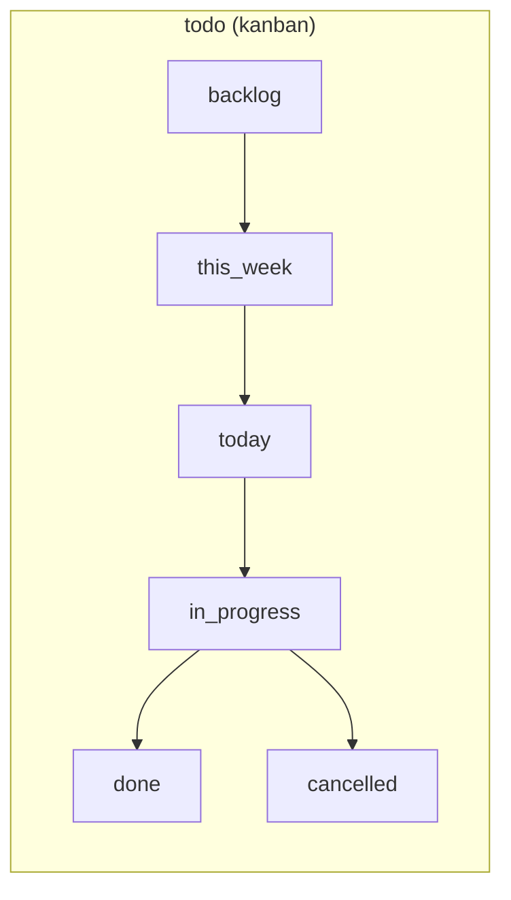

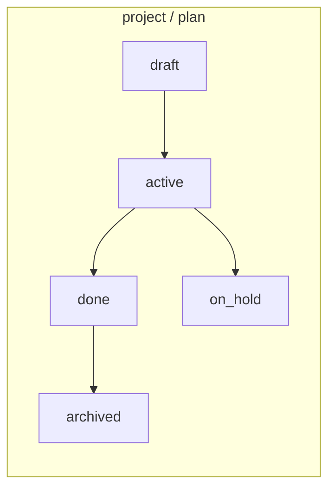

- **todo** — create in `backlog`, move to `in_progress` immediately with
  `dran_update_todo`, `done` only after verifying + committing. One
  `in_progress` at a time.
- **project** — create `draft`; auto-`active` when linked to a plan/todo/goal;
  `done`/`on_hold`/`archived` manual.
- **plan** — create `draft`; auto-`active` when a task executes; auto-`done`
  when ALL linked todos are done/cancelled; `archived` manual.
- **goal** — fully manual (`health`, `progress` only when Álvaro asks).
- **goal.progress** — auto-calculated from linked todos unless
  `progress_manual: true`.
- **project.health** — derived from linked goals unless
  `health_source: "manual"`.

## 9. Recipes

Recetas prácticas de USO — cómo crear cada tipo, escoger tipo cuando dudas,
buscar y leer. No son flujos de proyecto; son instrucciones operativas.

### 9.0 Escoger el page_type cuando el agente duda

Si tras el router de §3 todavía no queda claro el tipo, **pregunta con
`clarify`** ofreciendo 2-3 candidatos reales — no adivines.

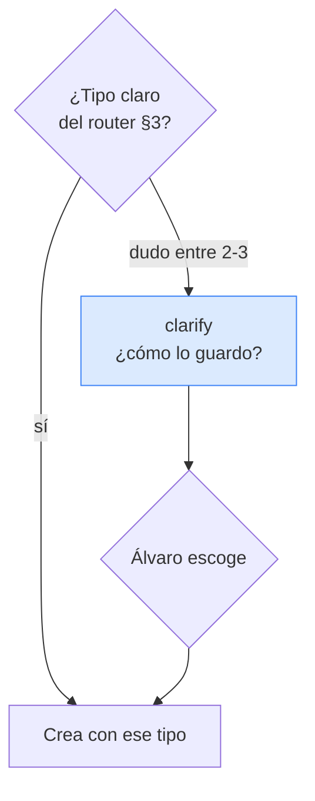

```
# Ejemplo: "guarda lo de la reunión con el proveedor"
clarify(
  question: "¿Cómo lo registro?",
  choices: [
    "note (kind: meeting) — solo el resumen de la reunión",
    "entity (kind: company) — la empresa como entidad reutilizable",
    "reference — si hay un documento/contrato externo"
  ]
)
```

Regla: clarify SOLO cuando el tipo cambia lo que capturas (nota vs entidad vs
referencia). Si es obvio (un pendiente → todo), no preguntes.

### 9.1 Crear páginas por tipo

Patrón base — **siempre** search antes:

```
1. dran_search({ context: "personal", query: "<keywords>" })   → existe? UPDATE, no crees
2. dran_create_page({ context, page_type, title/body, meta, tags, owner: "alvaro", created_by: "agent" })
```

**note** (thought/idea/journal):
```
dran_create_page({ page_type: "note", body: "...", meta: { kind: "thought" }, tags: ["elixir"] })
# kind=code → añade meta.language: "elixir"
```

**concept** (técnica/patrón):
```
dran_create_page({ page_type: "concept", title: "Circuit Breaker", meta: { kind: "pattern", domain: "resilience" } })
```

**entity** (persona/empresa/herramienta):
```
dran_create_page({ page_type: "entity", title: "Anthropic", meta: { kind: "company", external_url: "https://..." } })
```

**reference** (fuente externa):
```
dran_create_page({ page_type: "reference", title: "Paper X", meta: { kind: "paper", source_url: "https://arxiv.org/..." } })
```

**query** (pregunta con respuesta):
```
dran_create_page({ page_type: "query", title: "¿Cómo funciona X?", body: "Respuesta...",
                   meta: { kind: "how_to", difficulty: "simple", status: "answered", answered_by: "agent" } })
# ⚠️ el campo es status/answer_status: open/answered/verified — NO "status: done"
```

### 9.2 Crear goal, plan, project

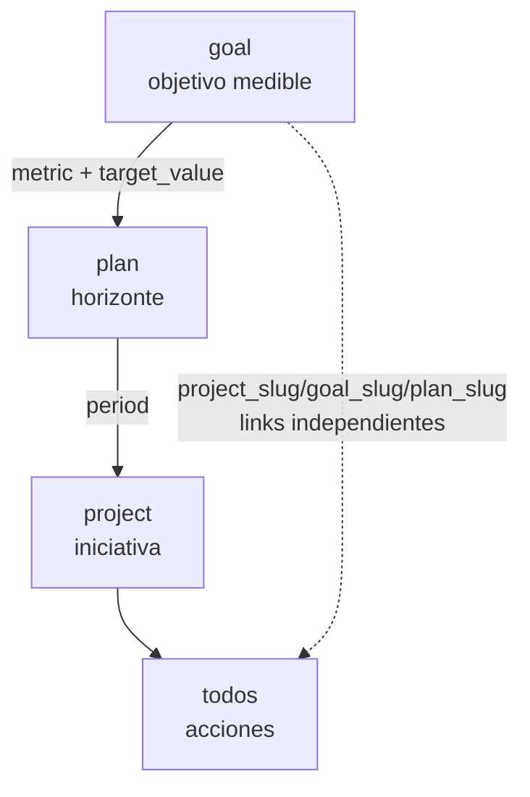

**goal** — objetivo medible:
```
dran_create_page({ page_type: "goal", title: "Ship v1 con 100 usuarios",
  meta: { kind: "business", metric: "active_users", target_value: 100, current_value: 0,
          unit: "users", health: "green", start_date: "2026-08-01", target_date: "2026-12-31" } })
# clarify metric/target si no son inferibles
```

**plan** — con horizonte:
```
dran_create_page({ page_type: "plan", title: "Plan Q3",
  meta: { kind: "business", horizon: "quarterly", period: "2026-Q3", status: "draft",
          goal_slug: "ship-v1", project_slug: "dran-saas" } })
```

**project** — iniciativa que agrupa:
```
dran_create_page({ page_type: "project", title: "Dran SaaS",
  meta: { status: "draft", priority: "high", health_source: "derived" } })
# health se deriva de los goals ligados salvo health_source: "manual"
```

### 9.3 Crear una tarea (todo)

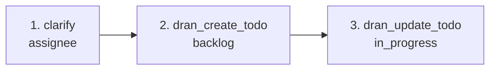

```
1. clarify assignee → alvaro / agent / otro          (SIEMPRE pregunta)
2. dran_create_todo({
     context: "personal",
     title: "Refactor MCP controller",
     project_slug: "<project>",   → opcional, independiente
     goal_slug: "<goal>",         → opcional, independiente
     plan_slug: "<plan>",         → opcional, independiente
     kanban_status: "backlog",
     priority: "high",
     assignee: "alvaro"
   })
3. dran_update_todo({ slug: "<slug>", kanban_status: "in_progress" })   → auto-move
```

Los 3 links son **independientes**: pon 0, 1, 2 o 3. Sin links = inbox legítimo.

### 9.4 Usar props (meta.props)

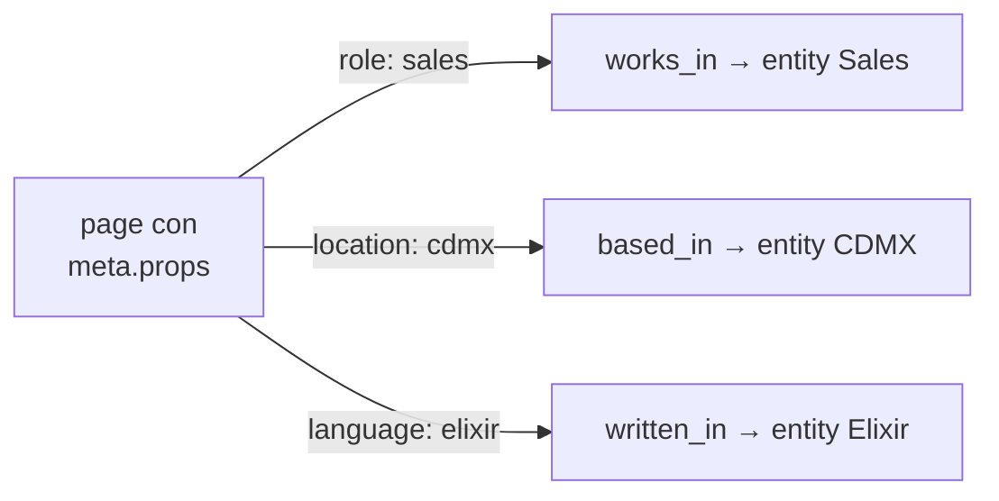

Solo 5 keys crean aristas (`role`, `tier`, `location`, `language`,
`framework`). El resto se guarda sin arista.

```
dran_create_page({ page_type: "entity", title: "María",
  meta: { kind: "person", props: { role: "sales", location: "cdmx" } } })
# → crea edges works_in→Sales y based_in→CDMX automáticamente
```

### 9.5 Leer y buscar info

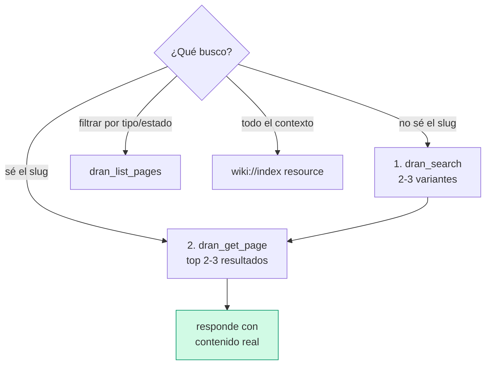

Reglas:
- **Nunca respondas desde el excerpt del search** — `dran_get_page` primero.
- `dran_search` acepta `type` para acotar (ej `type: "todo"`).
- `dran_list_pages` con `status` filtra todos por kanban; `"none"` = huérfanos.
- Para overview completo, lee el resource `wiki://{context}/index` (una llamada).

### 9.6 Usar agentes

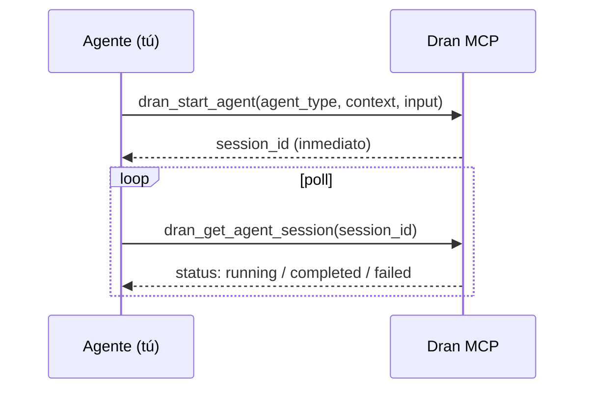

Cuándo usar cada uno:
- **`curator`** → "limpia duplicados / detecta contradicciones". (También corre solo a las 06:00.)
- **`link_gardener`** → "conecta páginas huérfanas". (También corre los domingos 07:00.)
- **`graph_rag`** → "investiga esta pregunta usando el grafo" (búsqueda profunda con citas).

```
dran_start_agent({ agent_type: "link_gardener", context: "personal", input: "orphaned pages" })
dran_get_agent_session({ session_id: "<id>" })   → hasta completed/failed
```

### 9.7 Brain hygiene

```
1. dran_lint_brain({ context: "personal" })   → MUESTRA orphans/stale a Álvaro, NO auto-arregles
2. dran_start_agent({ agent_type: "link_gardener", context: "personal", input: "orphaned pages" })
3. dran_get_agent_session({ session_id: "..." })   → poll hasta completed
```

## 10. Common mistakes

- **Creating without searching** — always search 2-3 variants first.
- **`dran_create_page` for todos** — use `dran_create_todo`.
- **`dran_update_page` for todo status** — use `dran_update_todo` (merges meta).
- **`meta` + `body` together on pages with mermaid** — strips the diagrams;
  pass only `body`.
- **Manually creating `semantic` relations** — automatic only.
- **Assuming link precedence** — project/goal/plan slugs are independent.
- **Passing `status` for `query` pages** — the field is `answer_status`.
- **Forgetting `progress_manual: true`** on goals not measured by todos.
- **Deleting without confirmation** — irreversible; prefer archive.
- **Answering from search excerpts** — read the page first.
- **Not clarifying the type when it changes what you capture** — a meeting
  note, a company entity and a contract reference are 3 different pages; ask.
