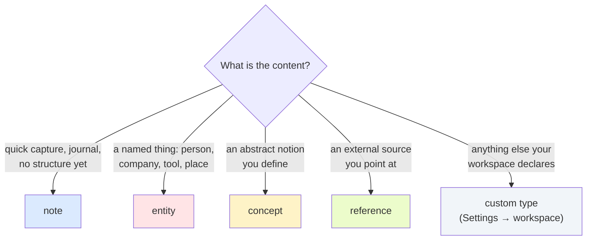

# Page types

Single source of truth: `Dran.PageRegistry` (`lib/dran/page_registry.ex`) for
the built-ins, `Dran.Workspace` (`lib/dran/workspace.ex`) for the custom ones.
This document explains **how to use each type** — the registry defines them;
this page tells you when to pick which.

There are exactly **four built-in page types** and a workspace may **declare
its own**. `meta.kind` **does not exist**: the type is the only classifier, and
every page accepts `meta.props` — a free-form key-value bag (e.g.
`%{"role" => "sales"}`) that survives round-trips and is indexed. Type-specific
meta fields are declared per type and validated as ordinary meta keys.

## Choosing a type



## The four built-in types

| Type | Purpose | URL path | Meta fields (besides `props`) |
|---|---|---|---|
| `note` | free capture | `/notes` | `date` |
| `entity` | named things | `/entities` | `location`, `external_url` |
| `concept` | abstract ideas | `/concepts` | `domain`, `parent_concept` |
| `reference` | external sources | `/references` | `source_url`, `published_at` |

`Dran.PageRegistry.meta_fields/1` is the contract for the four built-ins.

### `note` — free-form capture

The journal, the inbox, the default. Use `dran_create_note` /
`dran_update_note` — title+slug shorthands where `dran_update_note`
**merges** meta (unlike `dran_update_page`, which replaces it).

- `date` — when it happened

When unsure between `note` and a structured type: start as `note`, promote
later. Notes are full citizens (graph, journey, embeddings, agent create).

### `entity` — named things

People, companies, products, tools, places, events, languages, frameworks,
hardware, protocols.

- `location` — where it lives
- `external_url` — its homepage/profile

The entity linker auto-creates entity pages from names detected in bodies —
expect entities to appear without you creating them. Machine-owned
relations (`mentions`, `works_in`, `built_with`…) attach them to pages.

### `concept` — abstract ideas

Definition-style pages: fermentation, zero-trust, Zettelkasten.

- `domain` — the area it belongs to
- `parent_concept` — another concept's slug; build hierarchies with it

### `reference` — external sources

Articles, papers, videos, podcasts, books, newsletters, specs, repos, APIs —
anything you point at.

- `source_url` — the canonical URL (required in practice)
- `published_at` — publication date

References are pointers; your own take goes in `note` or in a custom type.

## Custom types per workspace

A workspace **adds** page types on top of the built-ins by declaring
`workspace_page_types` (ordered jsonb list; edited in the workspace settings
UI). No schema migration is involved — the list is data.

```json
[
  {
    "slug": "recipe",
    "label": "Recipe",
    "plural": "Recipes",
    "path": "recipes",
    "icon": "hero-book-open",
    "color": "#F59E0B",
    "meta_fields": [
      ["text", "cuisine", "Cuisine"],
      ["text", "servings", "Servings"]
    ]
  }
]
```

| Key | Required | Meaning |
|---|---|---|
| `slug` | yes | identifier, `^[a-z0-9][a-z0-9_-]*$`, never a built-in slug |
| `label` | no | singular label (falls back to the slug) |
| `plural` | no | plural label |
| `path` | yes | URL segment (`/recipes`), **explicit** — never a blind pluralization. Same format as `slug`; must not be a reserved route segment |
| `icon` | no | heroicon name (default `hero-document-text`). A missing `hero-` prefix is added for you |
| `color` | no | hex color (default `#94A3B8`) |
| `meta_fields` | no | editor field definitions for the type's `meta` keys |

### Validation is fail-closed

`Dran.Workspace` validates the whole list on save; an invalid entry is an
error, never a silent drop or a silent dedupe:

- `slug` and `path` are **required** on every entry.
- **Slugs are unique** and **paths are unique** within the workspace.
- The slug must match `^[a-z0-9][a-z0-9_-]*$`.
- The **path** must match the same pattern — it becomes a URL segment, so
  `/`, `..`, spaces and uppercase are refused.
- The **path** must not be a **reserved route segment**. The router matches
  these *before* the generic `/:workspace_slug/:type` route, so declaring one
  would make the type unreachable or shadow a real page — the full set is
  `collections clusters reports search activity journey graph memory collection
  letter settings api dev login session auth health docs admin` plus the
  built-in paths `notes entities concepts references`.
- A slug that repeats a built-in type (`note`, `entity`, `concept`,
  `reference`) is rejected — built-ins cannot be redefined.
- The list must be a list of objects.

The `icon` is **normalized, not validated**: a value without the `hero-`
prefix gets it (`beaker` → `hero-beaker`), and an empty one falls back to
`hero-document-text`. This runs on read as well as on write, so a value stored
before normalization existed is repaired instead of crashing the render —
`<.icon>` only matches `hero-*` names.

At **write** time the API validates `page_type` against the workspace's
**effective types** — the 4 built-in ∪ the custom ones. A type that is not in
that set (a retired slug, or another workspace's custom type) is refused;
`Knowledge.create_page/1` / `update_page/2` are the gate.

### Effective types

```
effective_page_types(workspace) = built-in (note, entity, concept, reference)
                                  ∪ workspace_page_types (declaration order)
```

`Dran.Knowledge.effective_page_types/1` is the accessor. It is what the web
UI renders (sidebar, filters, editor) and what `GET /api/agent/config` returns
to agent clients (see [api.md](api.md)) so the Hermes plugin and other agents
discover the vocabulary instead of hardcoding the built-in four.

`disabled_page_types` still exists and is still validated against the
workspace's effective types — a workspace can disable a type, but only for
types it actually has.

## Adding or changing a BUILT-IN type

Everything derives from the registry: `@registry` (capabilities, `ui` attrs,
`meta_fields/1` clauses), `@types` order, and the `if false do gettext(...) end`
marker block. Then:

```bash
mix gettext.extract --merge   # fill the new es translations
mix precommit                 # test/dran/page_types_test.exs pins the list
```

See the repo skill `dran-dev-page-types` for the full procedure including data
migrations and the hardcoded-surface audit.

Adding a **custom** type needs no code change at all: declare it in the
workspace settings and it is immediately usable on the web and through the API.
