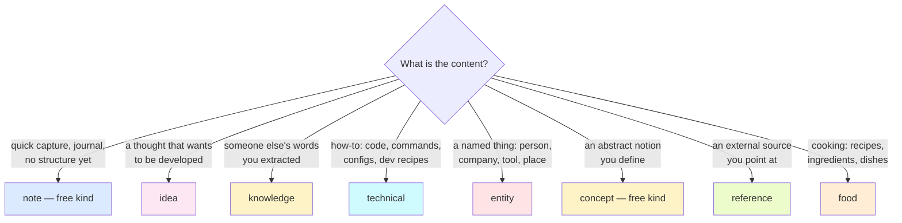

# Page types and kinds

Single source of truth: `Dran.PageRegistry` (`lib/dran/page_registry.ex`).
This document explains **how to use each type and kind** — the registry
defines them; this page tells you when to pick which. It describes only what
currently exists in the codebase.

Every page also accepts `meta.props` — a free-form key-value bag
(e.g. `%{"role" => "sales"}`) that survives round-trips and is indexed.
`meta.kind` classifies and filters; it never changes behavior.

## Choosing a type



## The eight types

| Type | Purpose | URL path | Extra meta fields |
|---|---|---|---|
| `note` | free capture | `/notes` | `date`, `due_date` (when kind is `reminder`) |
| `idea` | sparks & thinking | `/ideas` | — |
| `knowledge` | captured wisdom | `/knowledge` | `source_url`, `date` |
| `technical` | code & how-to | `/technical` | `language` (when kind is `code`), `version` |
| `entity` | named things | `/entities` | `location`, `external_url` |
| `concept` | abstract ideas | `/concepts` | `domain`, `parent_concept` |
| `reference` | external sources | `/references` | `source_url`, `published_at` |
| `food` | cooking & gastronomy | `/food` | `cuisine`, `servings`, `prep_time`, `cook_time`, `source_url` |

### `note` — free-form capture (kind is free)

The journal, the inbox. No kind validation: any string lands (journal,
meeting, reminder, decision appear as legacy values in existing rows). Use
`dran_create_note` / `dran_update_note` — title+slug shorthands where
`dran_update_note` **merges** meta (unlike `dran_update_page`, which
replaces it).

- `date` — when it happened
- `due_date` — shown in the editor only when kind is `reminder`

When unsure between `note` and a structured type: start as `note`, promote
later. Notes are full citizens (graph, journey, embeddings, agent create).

### `idea` — sparks & thinking

Kinds: `idea`, `question`, `hypothesis`, `spark`.

- `idea` — a seed you may develop
- `question` — something you want answered; link answers back with
  `related` relations
- `hypothesis` — a claim you intend to test; contradicting evidence goes in
  a `contradicts` relation
- `spark` — unprocessed fragment too small to be an idea yet

No extra meta. Link sparks → ideas as they mature with `related`/`part_of`
relations. Efforts with deadlines are plain `note` pages (set `due_date`
and kind `plan` — a legacy kind that still renders) linked via `part_of`.

### `knowledge` — extracts from sources

Kinds: `quote`, `summary`, `highlight`, `excerpt`.

- `source_url` — where it came from
- `date` — when captured

When you capture a whole external item to keep immutable, that is
`reference`; when you extract your own distilled piece from it, that is
`knowledge` (link them with `related`).

### `technical` — code & how-to

Kinds: `code`, `snippet`, `debug`, `recipe`, `config`, `command`,
`template`, `pattern`, `method`.

- `language` — editor shows it only when kind is `code` (e.g. `elixir`)
- `version` — the version this applies to

`recipe` here means a **procedural recipe** (steps to get something done in
a system). Cooking recipes belong to `food`.

### `entity` — named things

Kinds: `person`, `company`, `product`, `tool`, `place`, `event`,
`language`, `framework`, `hardware`, `protocol`.

- `location` — where it lives
- `external_url` — its homepage/profile

The entity linker auto-creates entity pages from names detected in bodies —
expect entities to appear without you creating them. Machine-owned
relations (`mentions`, `works_in`, `built_with`…) attach them to pages.

### `concept` — abstract ideas (kind is free)

Definition-style pages: fermentation, zero-trust, Zettelkasten. Free kind
(legacy values like `technique`, `theory`, `principle` render from old
rows). Meta: `domain`, `parent_concept` — build hierarchies with
`parent_concept` naming another concept's slug.

### `reference` — external sources

Kinds: `article`, `paper`, `video`, `podcast`, `book`, `newsletter`,
`spec`, `code`, `release`, `website`, `repo`, `api`.

- `source_url` — the canonical URL (required in practice)
- `published_at` — publication date

References are pointers; your own take goes in `knowledge` or `note`.

### `food` — cooking & gastronomy

Kinds: `recipe`, `ingredient`, `dish`, `meal`, `cuisine`, `restaurant`,
`drink`, `technique`.

- `cuisine` — free text (e.g. `mexican`, `italian`)
- `servings` — free text (e.g. `6`)
- `prep_time` / `cook_time` — free text (e.g. `15 min`)
- `source_url` — where the recipe came from

Structure a cookbook with relations: ingredient pages linked to recipe
pages via `part_of` (a recipe's parts are its ingredients), recipes to a
`cuisine` page, restaurants kept as `restaurant`-kind pages with
`location`-style info in `props`. `technique` (knife cuts, sous-vide,
mother sauces) is the culinary counterpart of `technical`'s method pages.

## Kinds across types (shared slugs)

A kind slug may appear in several types; each type validates its own list:

| Slug | Types | Meaning |
|---|---|---|
| `recipe` | `technical`, `food` | procedural steps — dev recipe vs cooking recipe |
| `technique` | `concept` (legacy), `food` | a named method/skill |
| `language` | `entity` (kind), `technical` (meta field) | careful: different roles |

## Validation notes (current behavior)

- `meta.kind` **is validated by `PageMeta.changeset/3`** against the type's
  list — but `Knowledge.create_page/1` casts `meta` as a plain map and does
  not run that changeset, so an invalid kind currently persists without
  error. Treat the lists above as the contract regardless.
- `note` and `concept` are free types (`kinds: nil`): no kind select in the
  editor, no kind filter for them.
- Page type itself is validated at creation (`page_type` must be in the
  registry list) and can be disabled per workspace.

## Adding or changing a type

Everything derives from the registry: `@registry` (capabilities, kinds,
ui attrs), `@types` order, `meta_fields/1` clauses, `kind_labels/0`,
and the `if false do gettext(...) end` marker block. Then:

```bash
mix gettext.extract --merge   # fill the new es translations
mix precommit                 # test/dran/page_types_test.exs pins the list
```

See the repo skills (`dran-page-types` in the Hermes profile) for the full
procedure including data migrations and hardcoded-surface audit.
