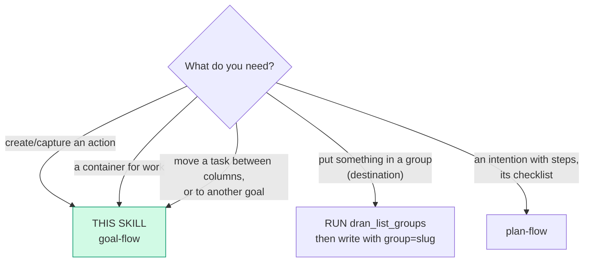
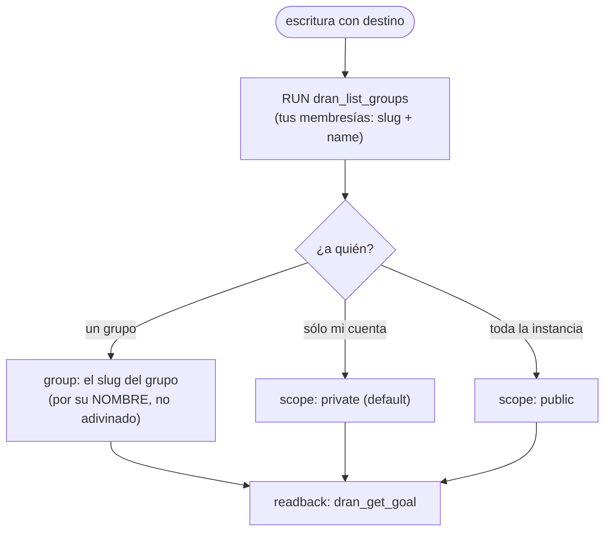

# goal-flow — Goals, their tasks and the destination

The **container and the action**: a goal holds tasks (a task does not exist
without a goal) and the board is one goal's tasks. Everything is a thin client
over the REST (`/api/goals`, `/api/tasks`, `/api/capture`, `/api/groups`)
through the plugin tools. The **plan** — an intention with steps — is its own
flow: `plan-flow`.

## Entry router

## Parse contract

CONSUMES: an intent over work items (create, capture, edit, move, check off a
TASK item, delete) + the profile's `DRAN_API_KEY`. PRODUCES: confirmed state via
readback (the item appears/lands where it was sent in the `list`/`get` tool).
**Never** invent an id or a destination, and never assume a write landed.

## The doors

| Change | Tool | Why this one |
|---|---|---|
| Content of a **goal** or a **task**: título, cuerpo, prioridad, horizonte/fechas, asignado, pasos, recurrencia, archivado, `completed_at` | `dran_update_goal` · `dran_update_task` | Es la puerta del contenido (`status` NO está acá) |
| **Estado / posición / goal de una task** | `dran_move_task` | Única puerta de la columna: mantiene las posiciones de ambas y exige `lock_version` (409 si perdió la carrera) |
| Un ítem del checklist de una **task** | `dran_toggle_checklist` (`target: "task"`) | Un ítem, por `index` o `text`. El checklist de un **plan** vive en `plan-flow` |
| Alta | `dran_create_goal` · `dran_create_task` · `dran_capture` | `capture` = captura rápida, sin goal, a la bandeja del dueño |
| Lectura | `dran_list_goals` · `dran_get_goal` · `dran_list_tasks` · `dran_get_task` | El readback: el `ok` de una escritura no es estado |

`dran_create_task` sin `goal` también aterriza en la **bandeja del dueño**. El
goal de una task es su contenedor: **una task no existe sin goal**.

## Destinations (`scope`): privado, público o un grupo por NOMBRE

- El destino se declara **por escritura** y **nunca** como estado del cliente.
- El **alta** de un goal sin destino toma el default del perfil (*Write scope* /
  *Group slug* del panel). Una **edición** sólo mueve el destino si lo declara.
- Un grupo del que el dueño de la credencial no es miembro, o inexistente, es
  **422 y no deja fila**: falla cerrado, nunca `private` en silencio.
- **Las tasks no declaran visibilidad**: la heredan del goal. Por eso mover una
  task a un goal que no podés leer es **404 y no mueve nada** — y por eso
  alcanza con compartir el goal.

## Pitfalls

- **Cambiar el estado con `dran_update_task`**: el `status` no está en la
  whitelist de escritura de la task, así que se **ignora en silencio** (200 y
  nada cambió). Es `dran_move_task`.
- **Adivinar el slug del grupo**: `dran_list_groups` existe para eso; un slug
  inventado es 422.
- **Dar una escritura por hecha sin readback**: el `ok` de la tool es
  transporte, no estado. Confirmá con `dran_get_task` / `dran_get_goal`.
- **Buscar el checklist de un plan acá**: `dran_set_plan_checklist` y el
  `toggle` con `target: "plan"` son de `plan-flow`.
- **Borrar sin preguntar**: `dran_delete_goal` se lleva sus tasks (FK
  `delete_all`) y `dran_delete_task` borra aristas del grafo. Irreversible:
  **ASK** antes.

## Cross-references

- Plugin-side surface (schemas + dispatch): `hermes_plugin/dran/__init__.py`
- Routes y la puerta de escritura: `lib/dran_web/router.ex`
- Quién lee qué: `Dran.ContentVisibility` (own ∪ public ∪ shared con tus grupos)
- El plan y su checklist: `plan-flow`