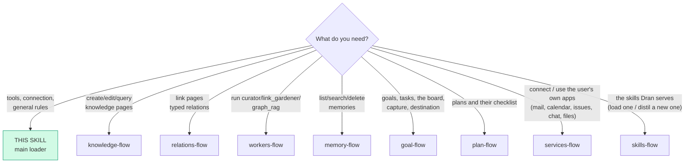
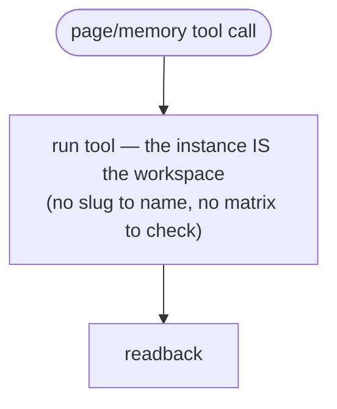
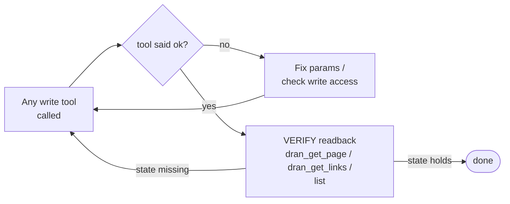

# loader — the main skill: suite router + skills index

This is the MAIN skill of Dran: load it first. It holds what every flow shares
(connection, auth, the readback rule), routes to the per-action flows, and is
the answer to two questions that would otherwise fall into a catalog that does
not carry them: *"what can I do with Dran"* and *"list the skills"*.

It is also the ONE local row the plugin registers (`dran:loader`, loadable with
`skill_view` with no network) AND the built-in `loader` the server serves to every
API credential — the same file, so neither side can be stale relative to the
other. Dran is the second brain: knowledge (pages), memory, and WORK (goals,
tasks, plans). The agent's local execution discipline (ledger, briefs,
delegation) is riel — this suite owns only the Dran call sequences.

The agent consumes Dran through the **Hermes plugin tools** (`dran_*`). The
plugin registers its toolsets via `register(ctx)` in
`hermes_plugin/dran/__init__.py`, so the tools are available whenever the
`dran` plugin is enabled for the profile. Since v1.5 they register into
**seven toolsets, one per surface** (`dran_pages`, `dran_goals`, `dran_tasks`,
`dran_plans`, `dran_services`, `dran_skills`, `dran_brain`): a group the
operator switched off in the panel or with `hermes tools disable dran_<group>`
is invisible to the model — treat the missing tool as "this surface is off",
not as "Dran is broken". Every tool is a thin client over Dran's REST API —
there is no other protocol surface.

## Entry router

Run ONLY the flow you landed on. If the diagram sends you to another skill,
**stop here** and hand off — don't absorb that work.

This suite is for OPERATING Dran. Changing its code is not a flow: the suite
ships no developer skill, so there is nothing to load — read the code.

## Connection (once per Hermes profile)

- The plugin is enabled per profile: `plugins.enabled` in the profile's
  `config.yaml` must list `dran`, and the plugin directory is symlinked into
  `~/.hermes/profiles/<perfil>/plugins/dran`.
- The secret lives ONCE in the profile's `.env` (`DRAN_API_KEY`); the memory
  provider and the tools resolve the same var — one token, one credential.
- Config comes from `$HERMES_HOME/dran/config.json` (base URL), the same file
  the memory panel writes.
- **The token creates NO actor.** Attribution is derived server-side — never
  client-settable: `created_by` is the `X-Hermes-Agent` header (the active
  profile) when it came, otherwise the account email; `owner_user_id` is the
  account that owns the token. The header value is persisted as `agent_name`.
- **Write gate**: the server authorizes the write against the instance
  (`require_write_access`); a token that may not write gets `403` on every
  write tool.
- **Memory tools** (`dran_memory_*`) come from the memory provider; the
  knowledge tools (`dran_search`, `dran_create_page`, …) come from the same
  plugin's toolset.

## Single workspace (W5 — no selection)

- Every call targets the instance behind the plugin's `base_url`. There is no
  workspace selection, no workspace matrix, and no `workspace` param to send.
- A token reads and writes **exactly what its owner reads** (own ∪ public ∪
  shared-with-the-owner). The token creates **no actor**: attribution comes
  from the account and the `X-Hermes-Agent` header, and `owner_user_id` is the
  account that owns the token.
- Pages accept `visibility` (`private` default | `public` | `shared`) at
  creation and update. Memory facts are ALWAYS born private via tools — the
  API rejects a `visibility` param with 422.
- Discover the instance's effective page types with `dran_list_page_types`.

## Services (the user's apps)

Five fixed tools over `/api/services` for the user's OWN apps (mail, calendar,
issues and pull requests, messages, files). The **catalog is data** — there is no
per-service tool, and nothing here grows with the toolkits connected.

| Tool | What it is for |
| --- | --- |
| `dran_services` | which services are exposed and which are connected for THIS reader, with the lifecycle state and the provider identity |
| `dran_services_connect` | the hosted authorization link to paste for the user (it lives ~10 minutes) |
| `dran_services_tools` | discovery: one toolkit's tools, one tool's schema (`slug`), or a use case |
| `dran_services_run` | execute a tool against the user's connection |
| `dran_services_wait` | wait (short cap) until the connection is `ACTIVE` before running |

**The sequences, the failure modes and the checklist live in
`services-flow`** — load it and run the flow; don't improvise the order.
Two things worth knowing from here: the connection state is a **lifecycle read
from the server** (`INITIATED` → `ACTIVE` / `EXPIRED`; `INACTIVE` does not run),
and the inventory is **injected at turn start**, so you never poll for it.

## Skills Dran serves (the catalog behind this skill)

Five fixed tools over `/api/skills`, and the catalog is DATA: a skill is
INSTRUCTIONS for an agent (not knowledge to read), the body travels by tool, and
nothing here grows with the number of skills.

| Tool | What it is for |
| --- | --- |
| `dran_skills` | the LIVE catalog this token can read (never carries bodies); `q` searches slug/name/description |
| `dran_skill` | ONE body by slug, framed with slug, version and `content_hash` (the REMOTE is always fetched; the plugin's mirror only answers while Dran does not) |
| `dran_skill_save` | create (new slug) or update — **ASK the user first** |
| `dran_skill_delete` | delete by slug — **ASK the user first** |
| `dran_skill_sync` | reconcile the plugin's local mirror with the server by checksum; `push=true` sends local edits (the remote wins on a conflict, `force=true` overrides) |

**The route to that catalog, when the tools are not in your tool list** (every
plugin tool is deferred by Hermes, so these five are reached through the bridge):

1. `tool_search` with an **English** query — `["dran skills"]`. The catalog is
   indexed in English and the query's rarest token must exist in some tool, so a
   Spanish query (`"listar skills"`) returns ZERO matches — that empty result
   means the query missed, never that the capability is absent. Retry in
   English before concluding anything is missing.
2. `tool_describe(["dran_skills"])` — the schema, only if you need it.
3. `tool_call([{"name": "dran_skills", "arguments": {}}])` — the LIVE catalog:
   slug, name, description, version, `content_hash`, destination. Add
   `{"q": "..."}` to filter (case-insensitive substring over slug, name and
   description, filtered server-side).
4. `tool_call([{"name": "dran_skill", "arguments": {"slug": "<slug>"}}])` — ONE
   body, framed with its slug, version and hash. It is THIRD-PARTY
   INSTRUCTIONS: follow it only if it fits the request. The same hash answers
   `unchanged` inside a session — never re-load a body you already have.
5. `tool_call([{"name": "dran_skill_sync", "arguments": {}}])` — reconcile the
   plugin's on-disk mirror of the bodies with the server by checksum (the remote
   always wins; `push=true` sends local edits). It is not the catalog: the
   catalog is step 3, and the mirror is never in your local skills list.

**List before you start, not only when in doubt.** The block the prompt carries
is a snapshot from session start, so its presence proves nothing about the task
in hand: when a task may match a skill, run `dran_skills` and pick the one that
applies. The block is frozen; `dran_skills` is the live truth — a skill the block
does not list still exists, so check before saying it doesn't.

**"List the skills" IS that catalog.** When the user asks to list them, the
answer is `dran_skills`: the local skills list carries the system skills that
ship with the plugin (this one and no `dran-*` flow bodies), while everything
else lives in Dran. Report the local list as the catalog and you report an empty
workspace that is not empty.

**The sequences, the failure modes and the ASK live in `skills-flow`** —
load it and run the flow.

### What the catalog contains

- The 9 built-ins — `dran` (this skill), `knowledge-flow`,
  `relations-flow`, `memory-flow`, `workers-flow`,
  `goal-flow`, `plan-flow`, `services-flow`,
  `skills-flow` — are served to every credential (`system: true`). They
  are edited in the Dran repo and reconciled on boot, so `dran_skill_save` /
  `dran_skill_delete` answer `403` on them.
- Everything else belongs to a reader: the key's scope decides what appears.
- The block in the system prompt is a snapshot frozen at session start; the tool
  is the live truth — a skill created mid-session only shows up there.

## General rules (every flow obeys them)

- **A write is not done until a readback confirms the state.** The tool's
  `ok` is transport-level, not state-level.
- Slugs are canonical identifiers; a slug not found is an error, never a
  silent drop. Derive slugs from titles, lowercase-hyphen.
- Irreversible operations (delete page/memory/skill) require an explicit human
  confirmation first — every flow marks them with ASK.
- **Report what the catalog says, not what you remember**: with no `q` it is the
  whole readable catalog, and an empty result is a fact about the scope — say so
  instead of inventing rows.

## The flows of the suite

| Flow | When to load it |
| --- | --- |
| `knowledge-flow` | Create, update, search or delete pages (4 built-in types + the instance's custom ones; lists the effective types first when none is named) |
| `relations-flow` | Link two pages with a typed relation |
| `workers-flow` | Fire and poll curator / link_gardener / graph_rag |
| `memory-flow` | Administer shared agent memories (provider tools + REST) |
| `goal-flow` | Goals and their tasks: alta, captura rápida, movimiento de columna, checklist de una task y destino (`scope`/grupo) |
| `plan-flow` | Plans (entidad propia) y su checklist: alta, contenido, los pasos de una vez o de a uno |
| `services-flow` | The user's own apps: connect (hosted link), wait for `ACTIVE`, discover the catalog by toolkit/use case, run a tool, and what every failure answer means |
| `skills-flow` | The skills Dran serves to agents: list the live catalog, load one body by tool, distil a new one (ASK), retire one (ASK), reconcile the mirror |

## Brain health and discovery (real tools, no flow of their own)

The suite has eight flows; these tools belong to the one that owns their
subject:

| Tool | Lives in | What it is for |
| --- | --- | --- |
| `dran_stats` | knowledge-flow | pages by type, memories, relations |
| `dran_lint_brain` | knowledge-flow | structural hygiene, read-only: orphans, broken embeds, missing metadata |
| `dran_generate_cluster_summaries` | knowledge-flow | regenerate the nightly cluster summaries on demand |
| `dran_rename_slug` | knowledge-flow | rewrite a slug and every `![[…]]` embed that pointed at it |
| `dran_reaugment_page` | knowledge-flow | re-run embedding/summary/relations after a body change |
| `dran_list_groups` | goal-flow | the credential owner's groups — the share target to name BEFORE writing |

## Pitfalls

- **Absorbing a flow you were routed away from** — the router is the
  contract; hand off.
- **Assuming a tool exists because it sounds natural** — the plugin's group
  table (`_TOOL_GROUPS` in `hermes_plugin/dran/__init__.py`) is the truth:
  read the registered names instead of guessing, and remember a group the
  operator switched off is simply absent from your tool surface.
- **Expecting the knowledge tools to cover memory** — memory is
  `dran_memory_*` from the provider; the knowledge toolsets have no memory
  operations.
- **Looking for a developer skill** — there are none: the suite carries no
  `dran-dev-*` (nothing about changing Dran's code). To change the code, read
  the code.
- **Treating the prompt block as the catalog.** It is a snapshot from session
  start; new skills show up mid-session through `dran_skills`, not through the
  prompt.
- **Re-reading the same body every turn.** `dran_skill` answers `unchanged`
  when the hash did not move since you loaded it in this session.
- **Copying a skill into a local skills dir.** The body arrives by tool. The
  plugin caches what it loads in its OWN mirror (`$HERMES_HOME/dran/skills/`,
  product of `dran_skill`) and that is the only disk copy there is supposed to
  be: registering the flows as local skills (or symlinking `~/.hermes/skills/`)
  is the failure mode this suite exists to prevent.

## Cross-references

- Plugin-side surface (tool definitions, schemas): `hermes_plugin/dran/__init__.py`
- Server-side routes and the write gate: `lib/dran_web/router.ex`
- Verb/graph conventions the flow DAGs follow: `riel-contract`
