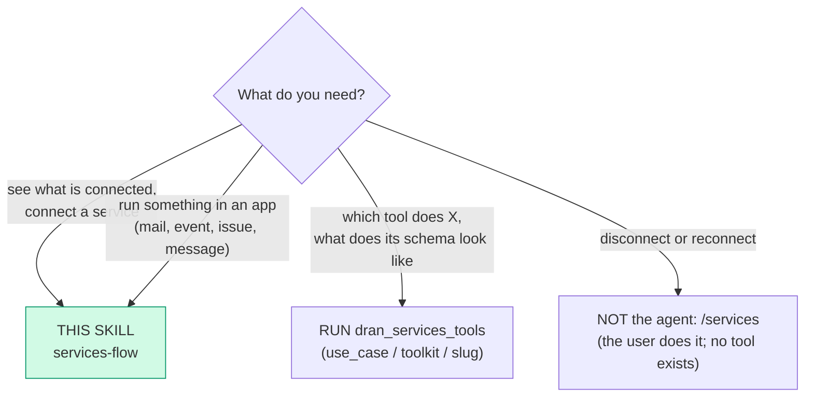
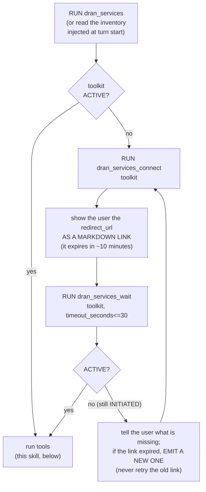
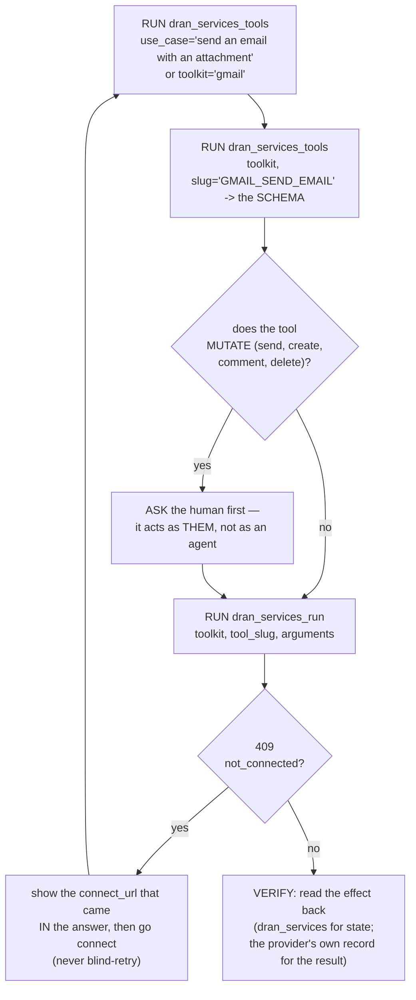

# services-flow — Connect the user's apps and run their tools

The **services** surface: the user's own apps (mail, calendar, issues and pull
requests, chat messages, files) connected to THEIR account and used by their
agent. Five fixed tools, all thin clients over `/api/services`. The catalog
travels as **data** — there is no per-service tool and nothing here grows with
the toolkits connected.

## Entry router

## Parse contract

CONSUMES: an intent over the user's OWN apps + the profile's `DRAN_API_KEY`.
PRODUCES: a connection that is `ACTIVE` **as read from the server**, and the
real result of the tool that ran. Never invent a toolkit, a tool slug or an
argument name — all three are discovered. The agent **never disconnects** and
never answers "it is connected" from the fact that it opened a link.

## The five tools

| Tool | Route it hits | Use it for |
| --- | --- | --- |
| `dran_services` | `GET /api/services` | which services the instance exposes + what THIS reader has connected, with the lifecycle state and the provider identity |
| `dran_services_connect` | `POST /api/services/:toolkit/connect` | a hosted authorization link for one toolkit — **you paste it for the user** |
| `dran_services_tools` | `GET /api/services/:toolkit/tools[?slug=]` · `GET /api/services/search?q=` | discovery: a toolkit's tools, one tool's full schema, or a use case |
| `dran_services_run` | `POST /api/services/execute` | run one tool of a toolkit |
| `dran_services_wait` | `GET /api/services` in a short loop (cap 30s) | wait for `ACTIVE` instead of running too early |

**Disconnecting has NO tool.** Deleting a connection (and its upstream
revocation) is irreversible and lives in the `/services` surface, where the UI
warns first — the user does it. Do not promise it, and do not call the REST
`DELETE` by hand.

## Connecting is a trip to the user's browser

- **The state is a lifecycle read from the server**: `INITIATED` (the user
  opened the link, the consent is not complete) → `ACTIVE` (it runs) /
  `EXPIRED` (reconnect = a NEW link); `INACTIVE` does not run tools. The return
  trip from the provider's consent proves nothing.
- The link is valid **~10 minutes**: re-emit, never retry an expired one.
- `dran_services_wait` polls with a cap — it is not a long-lived block, and a
  timeout is a status, not a failure.

## Discovering and running

- **Discover, then run.** The compact listing gives slugs; only the `slug=` call
  brings a schema. Passing arguments the schema does not declare is how a tool
  fails for the wrong reason.
- **A `not_connected` answer carries the fresh link.** Show it; do not retry.
  The server never forwards the provider's error there.
- **Only the owner's connection, and only if the instance exposes the service.**
  Both gates are server-side; there is nothing to pass to widen them (no
  `user_id`, no `session_id` — the credential IS the identity).

## Failure modes (what the server answers, and what you do)

| Answer | Meaning | What you do |
| --- | --- | --- |
| `configured: false` (200) | the instance has no services integration | report the state; do not retry |
| `503` + `code: not_configured` | same, from a write | report the state; do not retry |
| `403` + `code: not_allowed` | the instance does not expose that service | don't insist: the owner decides the list in Settings (admin) |
| `409` + `code: not_connected` + `connect_url` | the connection is not `ACTIVE` | show the link, then connect |
| `wait` → `active: false` | the consent was never completed | re-emit a NEW link and say so |

## Pitfalls

- **Inventing a per-service tool.** The catalog is data: `dran_services_tools`
  with a `use_case` or a `toolkit`.
- **Treating the tool's `ok` as state.** Read the connection back with
  `dran_services`; the transport said nothing about the world.
- **Polling for the inventory.** It is injected at turn start (same cadence as
  memory recall); asking again just burns a call.
- **Running before `ACTIVE`.** `INITIATED` is not connected: run, get 409, and
  the user sees a failure that looks like yours.
- **Retrying an expired link.** Reconnect = emit a NEW one.
- **Sending `user_id` / `session_id`.** They don't exist here; the key is the
  identity, and the session is the server's business.
- **Promising to disconnect (or "pausing" a service).** There is no tool and no
  pause: the user disconnects in `/services`, and the revocation is
  irreversible.
- **Running a mutating tool without asking.** It writes as the user — a mail
  that left is a mail that left.

## Checklist

- [ ] Toolkit and `tool_slug` came from discovery, never from memory
- [ ] `ACTIVE` confirmed by reading the state (not by the link being opened)
- [ ] Link shown as markdown, with the ~10-minute warning
- [ ] Mutating tools confirmed with the human first (ASK)
- [ ] `409` → the `connect_url` was shown; nothing was blind-retried
- [ ] The effect was read back before reporting success
- [ ] Nothing was disconnected by the agent

## Cross-references

- Plugin-side surface (schemas + dispatch): `hermes_plugin/dran/__init__.py`
- Routes and the write gate: `lib/dran_web/router.ex`
- User surface and instance policy: `/services`, `/admin/instance` (owner),
  `/admin/system` (integration state)