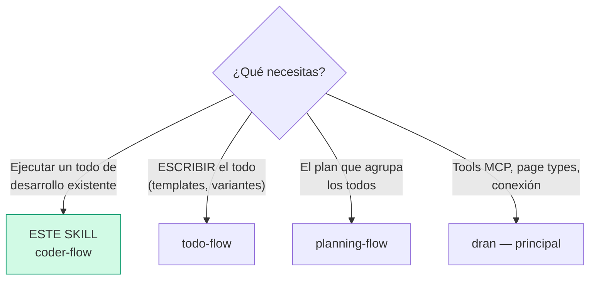
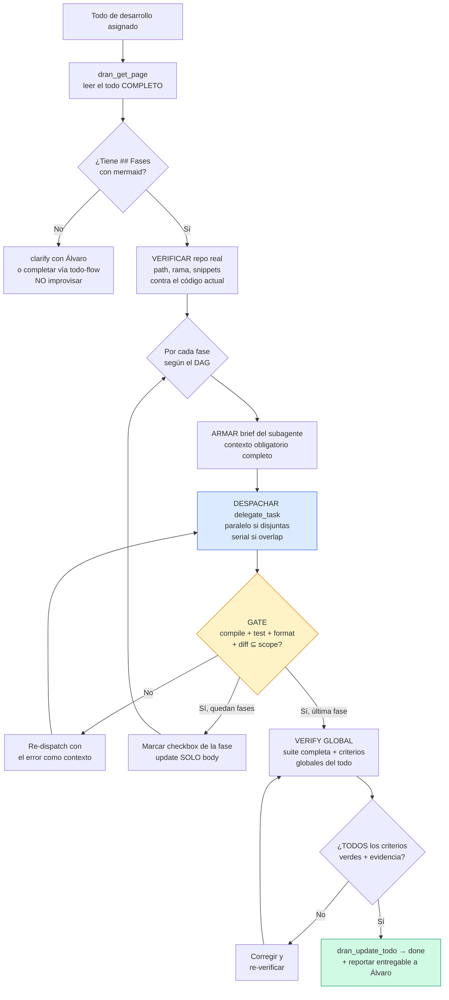

# coder-flow — Ejecutar un todo de desarrollo

Este skill toma un todo de desarrollo (variante 3 de `todo-flow`: con
`## Fases` en mermaid) y lo **ejecuta**: parsea el mermaid como spec, despacha
subagentes por fase, valida gates entre fases y cierra solo con evidencia real.

## Entry router



Si el todo NO tiene `## Fases` con mermaid, no está listo para este skill —
vuelve a `todo-flow` y complétalo primero.

## Flujo operativo — sigue este DAG al pie de la letra



Cada nodo es obligatorio: leer el todo completo, verificar el repo real antes
de despachar, gate después de CADA fase, verificación global antes de `done`.
`done` solo con TODOS los criterios en verde — nunca "ya casi".

## Parse contract

### Qué CONSUME este skill
- Un todo de desarrollo Dran con `## Fases` (mermaid), snippet(s) de código y
  criterios de aceptación por fase
- Acceso al repo real donde se ejecuta (path, rama de trabajo)

### Qué PRODUCE este skill

| # | Artefacto | Propósito |
|---|-----------|-----------|
| 1 | Fases implementadas con commits limpios | Código real, verificado |
| 2 | Checkboxes del todo marcados por fase | Progreso visible en Dran |
| 3 | Gates pasados (compile, test, format, diff) | Evidencia de calidad |
| 4 | Todo en `done` vía `dran_update_todo` | Cierre honesto con entregable reportado |

**Sin evidencia real no hay `done`** — tests rojos, warnings o diff fuera de
scope = la fase NO pasó, se re-despacha con el error como contexto.

## Cómo leer el mermaid de fases (obligatorio)

El mermaid de `## Fases` es la **especificación del DAG**, no una ilustración:

1. **Nodos = fases.** Cada nodo es una unidad de trabajo despachable.
2. **Flechas entrantes** = fases que deben estar `done` antes de empezar esta.
3. **Flechas salientes** = fases que esta habilita al pasar su gate.
4. **Fases sin dependencia entre sí** → despachables **en paralelo** (un
   subagente por fase) SI tocan archivos distintos.
5. **Si dos fases tocan el mismo archivo** → **serializar** (una tras otra).

**Regla dura:** el mermaid es el contrato. Si la realidad del repo no coincide
(módulo renombrado, función movida), NO improvises: reporta la discrepancia y
pide actualización del todo.

## Vocabulario de verbos → tools

Los nodos de ejecución detallada (dentro de cada fase) usan **solo estos 6
verbos**. No son tool names — son acciones semánticas que se traducen a tools:

| Verbo | Significado | Tool | Ejemplo de traducción |
|-------|-------------|------|----------------------|
| `READ path:line` | Leer archivo/sección | `read_file` | `read_file(path, offset, limit)` |
| `EDIT path — x` | Modificar archivo | `patch` | `patch(path, old_string, new_string)` |
| `CREATE path — x` | Archivo nuevo | `write_file` | `write_file(path, content)` |
| `RUN cmd` | Ejecutar comando | `terminal` | `terminal(command=cmd)` |
| `VERIFY cond` | Comprobación de gate | `terminal` + assert | `git diff --name-only` vs scope |
| `ASK pregunta` | Clarify con humano | `clarify` | `clarify(question, choices)` |

**Regla:** si un nodo no empieza con uno de estos 6 verbos, el todo está mal
formado → no ejecutar; pedir corrección vía `todo-flow`.

## Despacho de subagentes

### Contexto obligatorio de cada brief

Cada `delegate_task` DEBE incluir:

1. **Repo path** y rama de trabajo
2. **Archivos de su fase** — los ÚNICOS que puede tocar
3. **Criterios de aceptación de la fase** (los del todo)
4. **Reglas:** no tocar archivos fuera del scope; commit por feature sin
   arrastrar WIP ajeno
5. **Idioma de respuesta** si aplica (ej. español)

### Paralelo vs serial

| Situación | Decisión |
|-----------|----------|
| Fases disjuntas (archivos distintos, sin dependencia en el DAG) | Un subagente por fase, **en paralelo** |
| Dos fases tocan el mismo archivo | **Serializar** |
| Fases con dependencia en el DAG (flecha entre ellas) | **Serializar** respetando el orden |

⚠️ **Git race:** subagentes paralelos que commitean al mismo repo compiten
por el git index y revuelven tareas en un solo commit. Prevención: despachar
las tareas que commitean **en serial**, o que el agente padre haga los
commits después de verificar el trabajo de cada subagente. Recuperación:
`git reset --soft origin/main` y re-commit por tarea.

## Gates de validación (padre → hijo)

El padre verifica ANTES de marcar el checkbox de la fase o despachar la
siguiente:

- [ ] `mix compile --warnings-as-errors` pasa
- [ ] Tests del scope pasan (`mix test <archivo(s)>`)
- [ ] `mix format --check-formatted` sin diffs extra
- [ ] Diff revisado: solo archivos del scope, sin basura
- [ ] Commit limpio por feature (mensaje claro, sin WIP ajeno)

**Gate reprobado** → re-dispatch con el error exacto como contexto (mismo
brief + output del gate). Nunca se avanza con un gate rojo.

## Verificación global (antes de `done`)

- [ ] TODOS los criterios de aceptación por fase pasaron
- [ ] Los criterios globales del todo (`## Cómo verificar`) pasan
- [ ] Suite completa verde (en Elixir: `mix precommit` o equivalente del repo)
- [ ] El entregable existe y es real (PR, archivo, reporte)

## Actualización del todo durante la ejecución

```
1. Checkbox de fase cumplida → dran_update_page con SOLO body
   (pasar meta junto con body strippearía los mermaid del todo)
2. Status → dran_update_todo (merge meta) — la única vía segura
3. done → dran_update_todo({ slug, kanban_status: "done" })
   SOLO con la verificación global en verde
4. Reportar a Álvaro: entregable + evidencia (tests, commits)
```

## Pitfalls

- **Improvisar contra el mermaid** — el mermaid es el contrato; si el repo no
  coincide, reportar y pedir actualización del todo.
- **Snippet inventado** — los snippets del todo deben ser REALES, verificados
  contra el repo antes de despachar. Si cambió, actualizar el todo primero.
- **Paralelizar fases que se pisan** — si comparten archivo, van en serial.
- **Commits de subagentes paralelos** — git race en el index; padre commitea
  o serial (ver § Despacho).
- **Avanzar con gate rojo** — la siguiente fase hereda el error y se compone.
- **`done` con warnings** — `--warnings-as-errors` es parte del gate.
- **Marcar `done` sin evidencia** — "debería funcionar" no es evidencia.
- **Tocar archivos fuera del scope** — el diff se revisa contra la lista de
  archivos de la fase; cualquier extra se revierte o se justifica con Álvaro.

## Quick reference

| Tool | Args mínimos | Retorna |
|------|--------------|---------|
| `dran_get_page` | `slug` del todo | Body completo (fases + snippets) |
| `delegate_task` | `goal` + `context` (brief completo) | Resultado del subagente |
| `dran_update_page` | `slug`, `body` (SOLO body) | Checkboxes marcados |
| `dran_update_todo` | `slug`, `kanban_status` | Status actualizado (merge) |
| `terminal` | `mix compile --warnings-as-errors` / `mix test <file>` | Gates |

## Cuándo NO usar este skill

- **El todo no es de código** → ejecución manual normal, marca checks y done
- **Vas a ESCRIBIR el todo** → `todo-flow`
- **Vas a definir la ruta de alto nivel** → `planning-flow`
- **Es investigación, no implementación** → `research-flow`

## Cross-references

- Cómo se escribe el todo con fases: `todo-flow`
- Plan que agrupa los todos: `planning-flow`
- Commit hygiene para subagentes: skill `git-workflow`
- Dispatch de fases en proyectos grandes: skill
  `delegated-implementation-planning`
- Referencia MCP: `dran` — skill principal
