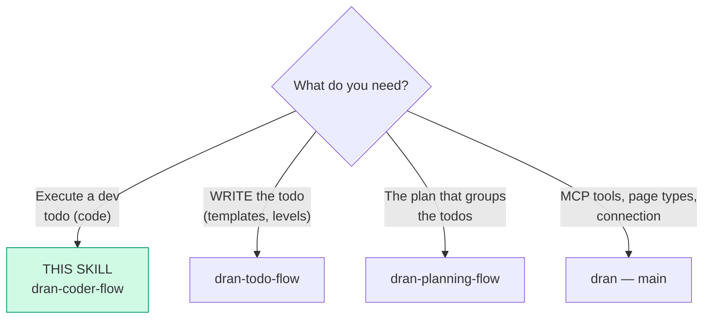
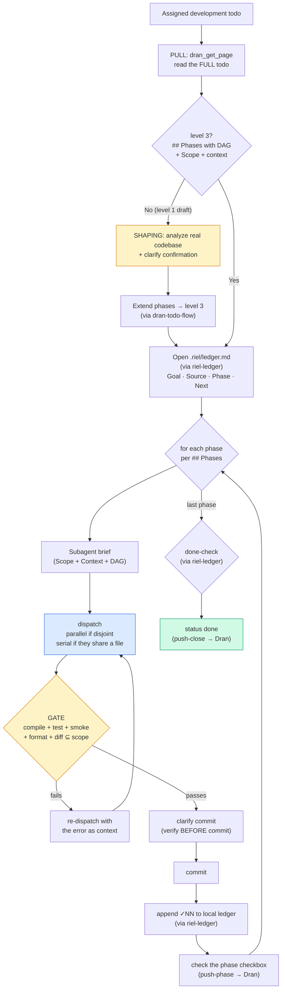

# dran-coder-flow — Execute a development todo (code)

This skill takes a Dran development todo (level 3 of `dran-todo-flow`:
`## Goal` + `## Phases` with code) and **executes** it: it does shaping if it
arrived as a draft, dispatches subagents per phase, validates gates (with
smoke **before** commit) and closes with real evidence.

## Layer separation (riel)

`dran-coder-flow` does **not reimplement the ledger** — it delegates local state to
`riel-ledger`, and only acts as the **adapter** to Dran:

| Layer | Skill | Responsibility |
|---|---|---|
| Local state (✓NN, recovery, done-check) | `riel-ledger` | `.riel/ledger.md` — never touches Dran |
| Orchestration (shaping, subagents, gates) | `dran-coder-flow` | execute the todo |
| Dran adapter (minimal) | `dran-coder-flow` | `pull` (read todo) + `push-phase` (checkbox) + `push-close` (status done) |

**Hard rule:** the `✓NN` (evidence with verifier + coverage) lives ONLY in the
local ledger. Dran only receives *checked checkboxes* and *status* — never
accumulated evidence in the body.

## Entry router



If the todo is of another type (manual, non-code research), it is not for this
skill — go back to `dran-todo-flow` or execute manually.

## Operational flow — follow this DAG to the letter



## Parse contract

### What this skill CONSUMES
- A Dran development todo (level 3, or a level 1 draft that will get shaping)
  with `## Goal` + `## Phases` + `## Verification`
- Access to the real repo where it runs (path, working branch)

### What this skill PRODUCES

| # | Artifact | Purpose |
|---|-----------|-----------|
| 1 | Phases implemented with clean commits | Real, verified code |
| 2 | Todo checkboxes checked per phase | Visible progress in Dran |
| 3 | Gates passed (compile, test, smoke, format, diff) | Quality evidence |
| 4 | Todo in `done` via `dran_update_todo` | Honest close |

**Without real evidence there is no `done`** — red tests, warnings, failed
smoke, or out-of-scope diff = the phase did NOT pass, it gets re-dispatched
with the error.

## Shaping — from draft (level 1) to level 3

A todo can arrive at level 1 (draft, phases in prose). **It is not rejected —
it is extended** by analyzing the real codebase. Shaping is the *senior
reviewing a junior* pattern: nothing is invented, everything is grounded in
evidence.

### Procedure (technical discovery)

1. Read the todo's `## Goal` and turn the functional outcome into concrete
   questions: entry points, domain modules, data paths, interfaces, tests,
   reusable patterns, migrations, authorization, risks.
2. Use `search_files` by **domain and behavior names**, not only by the
   proposed module name.
3. Use `read_file` on every relevant file, citing `path:line` — never cite
   search snippets as if the full implementation had been read.
4. Build the evidence table:

   | Area | Evidence (repo) | Finding | Proposed change | Risk |
   |---|---|---|---|---|
   | `<area>` | `<path:line>` | `<observed behavior>` | `<concrete approach>` | `<risk or none>` |

5. **Confirmation `clarify`** with the proposal (scope, sequence, test
   strategy, open assumptions, no-goals). Options like:

   ```json
   {
     "question": "I reviewed the codebase. How should I proceed with the shaping?",
     "choices": [
       "Approve the plan and extend the phases",
       "Reduce scope",
       "Adjust the approach (give me your correction)",
       "Stop — information is missing"
     ]
   }
   ```

6. After confirmation, **extend the phases** to level 3 (per phase: `Scope` +
   `Context (what exists now)` + `What changes` + `Instruction DAG`) and
   update the todo via `dran-todo-flow`. Only then execute.

**Hard rule:** if the repo's reality doesn't match what the todo says
(renamed module, moved function), do NOT improvise — report the discrepancy
and `clarify` the correction.

## How to read `## Phases` (level 3) — mandatory

The DAG in `## Phases` is the **specification**, not an illustration. Each
phase carries:

| Phase field | What it is | Used in |
|---|---|---|
| `**Scope**` | files it can touch (1 or several) | validating diff ⊆ scope |
| `**Context (what exists now)**` | current state of the code | subagent brief |
| `**What changes**` (+ algorithm) | the logic to implement | subagent brief |
| `**Instruction DAG**` | steps with verbs | subagent brief |

1. **Nodes = phases.** Each node is a dispatchable unit of work.
2. **Incoming arrows** = phases that must be `done` before starting.
3. **Phases without dependencies** → dispatchable in **parallel** IF they
   touch different files; if they share a file → **serialize**.
4. The **algorithm** (mermaid in `What changes`) describes the logic; the
   **instruction DAG** describes the editing steps. They are not the same.

## Verb vocabulary → tools

Execution nodes use **only these 6 verbs** — semantic actions, not tool names:

| Verb | Meaning | Tool | Example |
|-------|-------------|------|---------|
| `READ path:line` | Read file/section | `read_file` | `read_file(path, offset, limit)` |
| `EDIT path — x` | Modify file | `patch` | `patch(path, old_string, new_string)` |
| `CREATE path — x` | New file | `write_file` | `write_file(path, content)` |
| `RUN cmd` | Run command | `terminal` | `terminal(command=cmd)` |
| `VERIFY cond` | Gate check | `terminal` + assert | `git diff --name-only` vs scope |
| `ASK question` | Clarify with human | `clarify` | `clarify(question, choices)` |

**Rule:** if a node doesn't start with one of these 6 verbs, the todo is
malformed → do not execute; ask for a correction via `dran-todo-flow`.

## Local ledger (delegated to riel-ledger)

`dran-coder-flow` does not keep cross-phase state in its head — it delegates it to
the ledger. Load `riel-ledger` and follow its protocol:

1. **Open** `.riel/ledger.md` at the start: `Goal` ← the todo's `## Goal`,
   `Source` ← `todo:<slug>`, `Phase` ← first phase without a checkbox,
   `Next` ← first action.
2. **Re-read at every seam** (phase change, tool call, file, long gap).
3. **Append `✓NN`** with verifier + coverage when passing each gate.
4. **Recovery**: if the work degrades, go back to the last `✓NN` with a fresh
   plan.
5. **done-check** at the end: each line of the `## Goal` ↔ a `✓NN`.

Make sure `.riel/` is in the worktree's `.gitignore` before committing
anything.

## Subagent dispatch

### Mandatory context of each brief

1. **Repo path** and working branch.
2. **Scope** of its phase — the ONLY files it can touch.
3. The phase's **Context (what exists now)** and **What changes**.
4. The phase's **instruction DAG** (verbs).
5. **Rules:** don't touch files outside the scope; commit per feature.
6. Response **language** (Spanish).

### Parallel vs serial

| Situation | Decision |
|-----------|----------|
| Disjoint phases (different files, no dependency) | one subagent per phase, **in parallel** |
| Two phases touch the same file | **serialize** |
| Phases with a dependency in the DAG | **serialize** respecting the order |

⚠️ **Git race:** parallel subagents that commit compete for the git index.
Prevention: dispatch serially, or have the parent make the commits after
verifying each subagent's work. Recovery: `git reset --soft` and re-commit.

## Gates + confirmation before commit

Each phase's gate runs **before** commit, never after:

- [ ] `mix compile --warnings-as-errors` passes
- [ ] Scope tests pass (`mix test <file(s)>`)
- [ ] **Smoke test** — boot/runtime that touches what changed (starts the
  server, mounts the route, exercises the path). Mandatory for code.
- [ ] `mix format --check-formatted` without extra diffs
- [ ] Diff reviewed: only scope files

**Confirm before commit** — never commit automatically. After the green gate,
present files + message and `clarify`:

```json
{
  "question": "Green gate. Shall I commit?",
  "choices": ["Commit", "Edit message", "Split commits", "Cancel"]
}
```

**Failed gate** → re-dispatch with the exact error as context. Never advance
with a red gate.

## Done-check and close

1. **done-check (riel-ledger):** each line of the `## Goal` ↔ a `✓NN` with
   coverage. If missing → no done.
2. Unclosed `?NN` → report to Álvaro (they don't go into the body).
3. **push-close:** `dran_update_todo({ slug, kanban_status: "done" })` — the
   only safe path (meta merge).
4. Report to Álvaro: deliverable + evidence (tests, smoke, commits).

## clarify rules

1. **One blocking question per turn** — ask only for the input that unblocks
   the most; never a questionnaire.
2. **No re-ask** — never ask for what was already given in the conversation
   or returned by a tool call.
3. **TDD with human validation** — before writing production code, validate
   the test behavior via `clarify` (what is tested, what is expected), then
   red → green → refactor.
4. **Don't modify tests without validation** — modify/delete/downgrade an
   existing test only if strictly necessary and after `clarify`.
5. **Confirm between phases** — if the mode is "one by one", `clarify`
   between phases: `['Next phase', 'Review diff', 'Modify plan', 'Stop']`. In
   "continuous run" mode, the technical gates suffice.

## Updating the todo during execution (Dran adapter)

```
1. Completed phase checkbox → dran_update_page with ONLY body
   (passing meta together with body would strip the todo's mermaid)
2. Status → dran_update_todo (meta merge) — the only safe path
3. done → dran_update_todo({ slug, kanban_status: "done" })
   ONLY with a green done-check
4. Report to Álvaro: deliverable + evidence (tests, smoke, commits)
```

## Pitfalls

- **Improvising against the codebase** — the mermaid and the shaping are
  grounded in real evidence (`path:line`); if it doesn't match, `clarify`,
  don't invent.
- **Committing before verifying** — the gate (including smoke) runs BEFORE the
  commit, never after.
- **Accumulating `✓NN` in Dran** — the evidence lives in the local ledger;
  Dran only receives checkboxes + status.
- **Reimplementing the ledger** — delegate to `riel-ledger`, don't duplicate.
- **Parallelizing phases that overlap** — if they share a file, serialize.
- **Advancing with a red gate** — the next phase inherits the error.
- **`done` with warnings** — `--warnings-as-errors` is part of the gate.
- **Skipping the smoke test** — it's mandatory for code.
- **Committing `.riel/`** — make sure the worktree `.gitignore` first.
- **Touching files outside the scope** — the diff is reviewed against the
  `Scope`.

## Quick reference

| Tool | Minimal args | Returns |
|------|--------------|---------|
| `dran_get_page` | todo `slug` | Full body (phases + context) |
| `delegate_task` | `goal` + `context` (full brief) | Subagent result |
| `dran_update_page` | `slug`, `body` (ONLY body) | Checked checkboxes |
| `dran_update_todo` | `slug`, `kanban_status` | Updated status (merge) |
| `terminal` | `mix compile --warnings-as-errors` / `mix test <file>` / smoke | Gates |

## When NOT to use this skill

- **The todo is not code** → manual execution or `dran-todo-flow` (level 2 research)
- **You're going to WRITE the todo** → `dran-todo-flow`
- **You're going to define the high-level path** → `dran-planning-flow`
- **It's research, not implementation** → `dran-research-flow`

## Cross-references

- How the todo is written (levels 1/2/3): `dran-todo-flow`
- Local state (ledger ✓NN): `riel-ledger`
- mermaid and verb contract: `riel-contract`
- Plan that groups the todos: `dran-planning-flow`
- Commit hygiene for subagents: `git-workflow`
- MCP reference: `dran` — main skill
