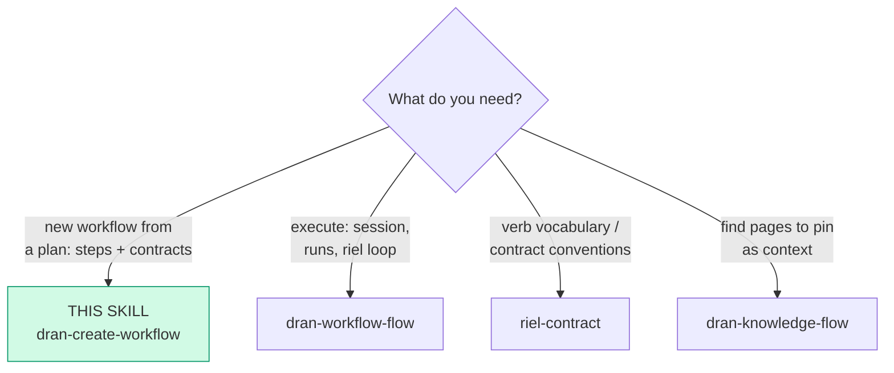
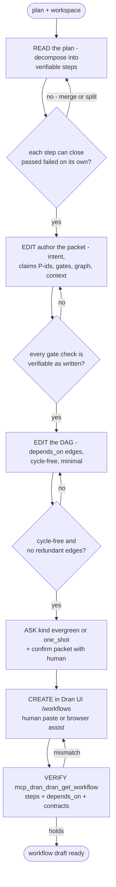

# dran-create-workflow — Turn a plan into a workflow DAG

Authoring layer: takes a plan (prose, checklist, mermaid, existing doc)
and produces a Dran workflow — definition only. Execution is
dran-workflow-flow; this skill never opens sessions.

Surface fact: **MCP and REST have NO workflow/step authoring tools**
(`lib/dran/mcp.ex` and the router expose reads + execution only).
Creation happens in the Dran UI (`/:workspace/workflows`). This skill
authors the contract offline, materializes it (human or browser assist),
and verifies via MCP readback.

## Entry router

Run ONLY the flow you landed on. If the diagram sends you to another
skill, **stop here** and hand off.

## Parse contract

CONSUMES: a plan in any shape, a workspace slug, an optional goal slug
to link (`goal_id`). PRODUCES: **a workflow packet** — every step with
its full contract, the `depends_on` DAG, and the kind — confirmed in
Dran by a `dran_get_workflow` readback. **A step without claims and
gates is not a step, it is a title.**

## The packet schema (per step)

| Field | Shape | Rules |
| --- | --- | --- |
| `title` | string ≤ 500 | imperative, one deliverable |
| `intent` | one sentence | opens the brief as "We need <intent>" |
| `claims` | `id` (P1, P2…), `claim`, `verify` | pre-registered; a failed claim is refuted, never reinterpreted |
| `gates` | `name`, `check`, `expect`, `on_failure` | `check` is the done-criterion — OPEN: a runnable command, an expected output artifact (a rendered video, a report), or an inspection of the result (frame analysis). The gate decides; the check only probes |
| `graph` | nodes `id`/`verb`/`label`, edges `from`/`to` | verbs from the closed set `READ EDIT CREATE RUN VERIFY ASK` (same as riel-contract) |
| `context` | entries `type` (`page`\|`memory`), `id`, `why` | pin only what the step needs; every entry carries its why |

Workflow-level: `kind` — `evergreen` (default; re-runnable, N sessions)
or `one_shot`; **kind CHANGES are locked once the workflow has any
session** (`{:error, :kind_locked}`; same-kind writes pass). Status
starts `draft`; activation is an explicit human decision, never yours.

## Operational flow

## Rules of authoring

- **Decomposition heuristic:** a step = one deliverable that can close
  `passed`/`failed` on its own gates. Two steps sharing all their gates
  are one step; a step that needs "and then" is two.
- **Gates are the verification funnel:** at least one gate per step, and
  the last gate must verify the step's claims. "Review the code" is not
  a gate; `mix test test/path/` with `expect: exit 0` is — but so is
  "video renderizado en outputs/" with `expect: archivo existe`, or a
  frame-analysis check. `check` is free text the pulling agent
  interprets.
- **Claims before work:** the P-ids written here are what the executor's
  run is audited against (dran-workflow-flow). Do not soften them to
  make them easier to pass.
- **Context triage:** pin pages/memories with the exact slug/id + why.
  An entry without a why is noise for the pulling agent; the brief's
  `## Context` renders one-liners and the fetch command per entry.
- **UI materialization facts:** workflow form = title + kind (+ optional
  goal); one step modal per step; edges connect on the canvas as
  `dependent → prereq`. Steps append at `position` max+100; the canvas
  auto-layouts by topological level until dragged.
- **Never activate or open a session here.** Hand off to
  dran-workflow-flow when the human wants to run the plan.

## Pitfalls

- **Looking for `dran_create_workflow` on MCP or REST** — it does not
  exist; authoring is UI-only. MCP is read + execute.
- **Gates that are not verifiable** — a gate whose `check` cannot be
  probed (run the command, inspect the output, check the artifact
  exists) cannot close a run honestly. Prefer a command when one
  exists; an artifact or inspection check is equally valid.
- **Flipping `kind` after the first session** — `{:error, :kind_locked}`;
  choose evergreen unless the plan is one-pass by nature.
- **Redundant diamond edges** — cycle-safety is enforced server-side
  (`Dran.Contracts`), but a redundant edge still serializes steps that
  could run in parallel.
- **Skipping the readback** — a UI paste is a write like any other;
  `dran_get_workflow` is the done-check.

## Checklist

- [ ] Every step: intent + at least one claim + one gate with a verifiable check
- [ ] Graph verbs inside the closed 6-verb set
- [ ] Context entries: type + exact id + why
- [ ] DAG cycle-free; kind chosen and confirmed with the human (ASK)
- [ ] Materialized in the UI; verified by `dran_get_workflow` readback
- [ ] Execution handed off to dran-workflow-flow (never run from here)
