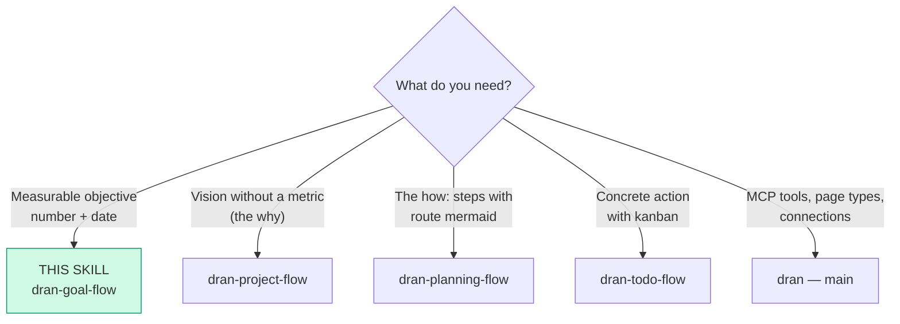
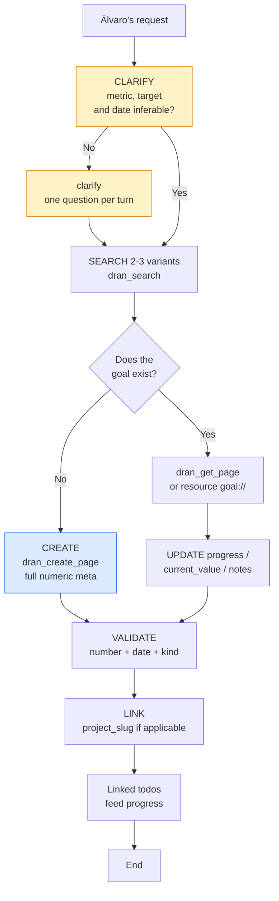

# dran-goal-flow — Create and manage goals in Dran

The goal is the **strategic level with a metric**: an objective with a number
and a date. **If it can't be measured, it's a wish** — and wishes go as a
project (vision) or as a plan, not as a goal.

A **goal** is the measurable objective (metric + date). **Todos** are the
actions that help fulfill a plan/goal/project — a todo's `## Objective` is its
concrete deliverable, NOT a goal.

## Entry router



Execute ONLY the section you arrived at. If the diagram sends you to another
skill, **stop here** and hand off.

## Operational flow — follow this DAG to the letter



Each node is a mandatory step: clarify the metric if it isn't inferable,
search before creating, full numeric meta, and linking to the project.

## Parse contract

### What this skill CONSUMES
- Álvaro's request: a new objective, progress update, goal review, or an
  existing goal page with its current `meta`

### What this skill PRODUCES

| # | Artifact | Purpose |
|---|----------|---------|
| 1 | `goal` page with `## Why` (+ optional `## Notes`) | Justification and log |
| 2 | Full numeric `meta` (metric, target_value, current_value, unit, dates) | The measurement lives in meta, NOT in the body |
| 3 | Auto-calculated progress or `progress_manual: true` | Know whether we're on track without asking |

**Hard rule: number + date, or it is NOT a goal.** A goal without
`target_value` + `target_date` is malformed — it's a wish in disguise.

## Flow description

| Aspect | Rule |
|--------|------|
| What it is | Measurable objective with target and date |
| Horizon | Weeks/months |
| Question it answers | How much, by when, how do we measure? |
| Title | The full objective: "Migrate all projects to X" |

**Golden rules:**

1. **One goal = one metric.** Don't mix objectives in a single goal — if they
   are two numbers, they are two goals.
2. **Everything numeric lives in the `meta`, NOT in the body.** The body
   explains the why; the meta measures.
3. **Manual health and progress only when Álvaro asks** — the agent doesn't
   move `health` on its own initiative.

## Shaping — questioning before creating

Before creating, verify against reality and ask whatever isn't inferable:

1. **Metric** — what number measures it? (`metric` + `unit`)
2. **Target** — how far do we want to get? (`target_value`)
3. **Date** — by when? (`target_date`)
4. **Measurement** — is it measured only with linked todos, or manually?
   (`progress_manual: true` if manual)

One blocking question per turn. If the metric is obvious from the request
("100% coverage"), don't ask what you already know.

### If there is no measurable metric

Use `clarify` before creating — never create a goal without a number:

```json
{
  "question": "The objective has no measurable metric. How do we define it?",
  "choices": [
    "Give a KPI with number and date",
    "Leave it qualitative (risk: success can't be measured)",
    "Validate the problem first (it's not a goal yet)"
  ]
}
```

## Content template — minimal body

| # | Section | Purpose |
|---|---------|---------|
| 1 | `## Why` | 1 paragraph: why this objective matters now |
| 2 | `## Notes` (optional) | Progress, blockers, findings — living log |

```markdown
## Why

Document and test the 18 MCP tools so the agent doesn't depend on human
memory to operate Dran.

## Notes

- 2026-08-08: 12/18 tools with green smoke test.
```

## Using Dran

### Key meta

| Field | Values | Note |
|-------|--------|------|
| `kind` | personal / coding / business / learning / health / finance / other / investing / marketing / product / writing / career / relationship / travel | |
| `metric` | free text ("MCP tools documented") | WHAT is measured |
| `target_value` | number | How far we get |
| `current_value` | number | Where we stand |
| `unit` | text ("tools", "users", "%") | |
| `start_date` / `target_date` | ISO dates | |
| `health` | green / yellow / red | Manual — only if Álvaro asks |
| `progress` | 0-100 | Auto-calculated unless manual |
| `progress_manual` | true/false | `true` = measured manually |
| `project_slug` | slug | Independent link to the project |

### Recipe — create

```
1. clarify metric/target/date if they aren't inferable
2. dran_search({ context: "personal", query: "<objective>" })   → exists? UPDATE
3. dran_create_page({
     context: "personal",
     page_type: "goal",
     title: "<full objective>",
     body: "## Why\n\n<1 paragraph>",
     meta: {
       kind: "coding",
       metric: "MCP tools documented",
       target_value: 17,
       current_value: 0,
       unit: "tools",
       start_date: "2026-08-01",
       target_date: "2026-09-30",
       project_slug: "<project>"        → optional
     },
     owner: "alvaro",  # from the key's actor, not settable
     created_by: "chaos manager"  # derived server-side, not settable
   })
```

### Recipe — update progress

```
1. dran_search the slug (or resource goal://{context}/{slug} — goal + todos/plans in JSON)
2. dran_get_page to read the current state
3. dran_update_page:
   - new current_value → FULL meta (update_page REPLACES meta)
   - progress note → body with updated ## Notes
   - body + meta together OK here (goals don't usually carry mermaid);
     if the body has mermaid → ONLY body
```

### Status workflow

- **Health** (`green`/`yellow`/`red`) — manual, only when Álvaro asks.
- **Progress** — auto-calculated from linked todos (done/total), unless
  `progress_manual: true`.
- There's no kanban `status` — the goal lives off its metric and its todos.
- **Implicit auto-`done`:** when `current_value` reaches `target_value`,
  report it to Álvaro — don't close anything without his approval.

### When to review a goal

When the metric no longer reflects the real objective (the market moved, the
priority changed). Update `metric`/`target_value` — don't create a new goal
for the same objective.

**Assisted review:** the Dran `goal_review` prompt (MCP prompts) reviews a
goal with its linked todos and plans.

## Pitfalls

- **Goal without a number or date** — it's a wish; goes as a project or plan.
- **Mixing two metrics in one goal** — split into two goals.
- **Metric in the body** — numbers go in `meta`; the body is the why.
- **Forgetting `progress_manual: true`** — if the metric isn't derived from
  todos (e.g. "weight 75kg"), without the flag progress is calculated wrong
  (0% or weird).
- **Moving health on your own initiative** — only when Álvaro asks.
- **`dran_update_page` passing partial meta** — it REPLACES the entire meta;
  always pass the full meta.
- **Creating without search** — updating wins over duplicating.

## Quick reference

| Tool | Minimal args | Returns |
|------|--------------|---------|
| `dran_search` | `query`, `type: "goal"` | Ranked list |
| `dran_get_page` | `slug` | Body markdown |
| `dran_create_page` | `page_type: "goal"`, `title`, `meta` | Created goal + slug |
| `dran_update_page` | `slug` + full meta | Updated goal |
| Resource `goal://{context}/{slug}` | — | Goal + linked todos/plans (JSON) |
| Prompt `goal_review` | goal slug | Assisted review |

## When NOT to use this skill

- **No metric** (it's vision) → `dran-project-flow`
- **The request is how to achieve it (steps)** → `dran-planning-flow`
- **It's a concrete action** → `dran-todo-flow`
- **It's a question with a reusable answer** → `dran-note-taking-flow` (query)

## Cross-references

- MCP reference (tools, meta fields): `dran` — main skill
- Project that groups the goal: `dran-project-flow`
- Plans that execute toward the goal: `dran-planning-flow`
- Todos that feed progress: `dran-todo-flow`
- `goal_slug` link (independent): `dran-relations-flow`
- Anchored opening + trajectory maintenance: `riel-protocol`
