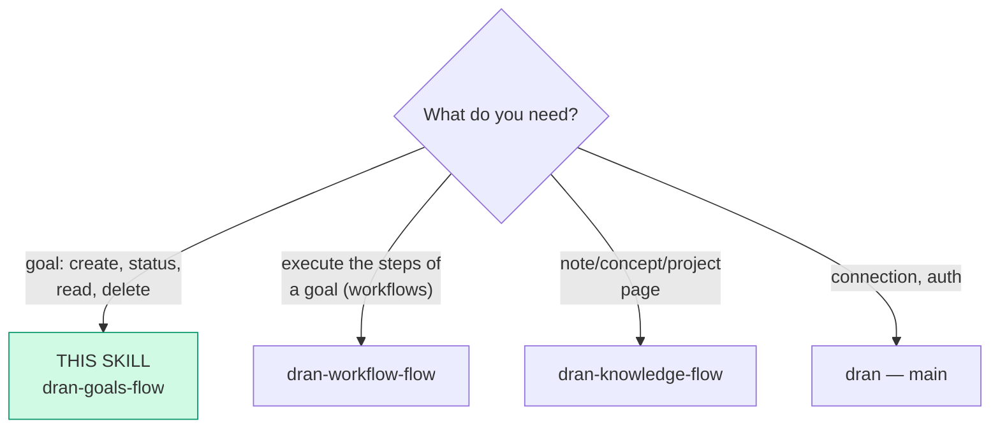
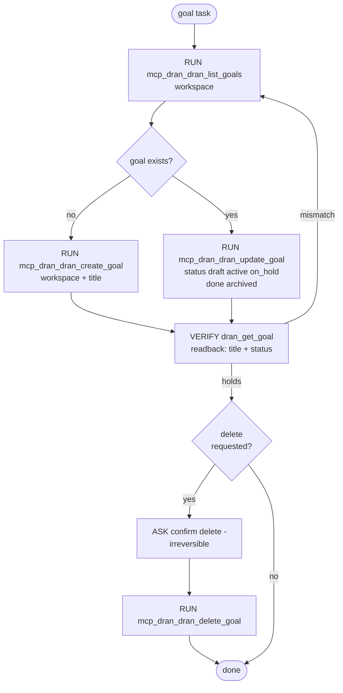

# dran-goals-flow — Create and manage goals

A goal is the objective page with a lifecycle (`draft → active → on_hold →
done → archived`). Goals are **human-managed OKRs**: the agent creates and
updates them on request, but the checklist is Álvaro's territory.

## Entry router

## Parse contract

CONSUMES: an objective to track (title, optional summary). PRODUCES: a goal
confirmed by `dran_get_goal` readback. **A write without readback is not
done.**

## Operational flow

## The checklist boundary (hard rule)

`dran_goal_checklist_add / _toggle / _remove` exist as **convenience for
Álvaro's own tooling, not as agent writeback**. Decisions:

- The checklist is the human OKR surface: only mark/toggle items when
  Álvaro explicitly asks for that operation.
- The agent's durable progress evidence lives in workflow **runs**
  (dran-workflow-flow) — a step whose run closed `passed` renders checked
  in the DAG; that is the machine-side ✓NN.
- Memory (dran-memory-flow) and goal checklists are **not** riel
  checkpoints; never route execution state into either.

## Notes on the calls

- `dran_create_goal` requires `workspace` + `title`; status enum: `draft`,
  `active`, `on_hold`, `done`, `archived`. Goals have no own `progress`
  field — rollup is computed from linked structure.
- `dran_get_goal` accepts slug or UUID; prefer slug when known.
- Workflows attach to goals (`goal_id`); to see the execution side, read
  `dran_list_workflows` / `dran_get_workflow` (dran-workflow-flow owns
  those).
- MCP surface for goals: `dran_create_goal`, `dran_get_goal`,
  `dran_update_goal`, `dran_delete_goal`, `dran_list_goals`, and the three
  checklist tools. Goals have no `parent_goal` write path over MCP.

## Pitfalls

- **Treating the checklist as the agent's todo list** — it isn't; ask-first
  or don't touch.
- **Re-creating a goal that exists with different title casing** —
  `list_goals` first; the board dislikes duplicates.
- **Marking `done` from MCP on execution hunch** — status transitions on
  request or with evidence (passed sessions), never vibes.

## Checklist

- [ ] list_goals checked before create (no duplicates)
- [ ] Write verified by get_goal readback
- [ ] Checklist untouched unless Álvaro asked
- [ ] delete went through ASK
