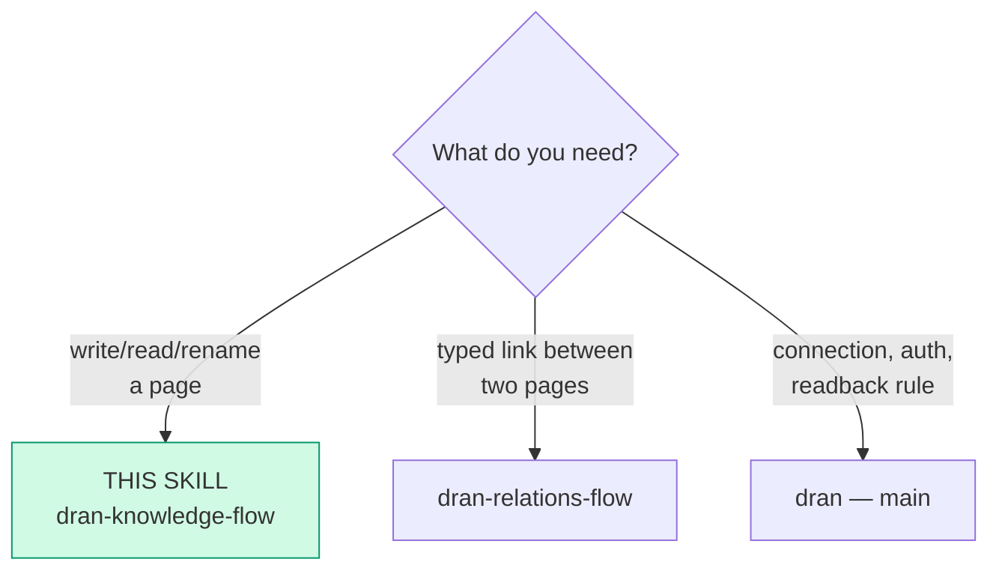
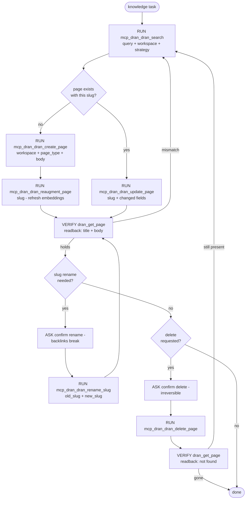

# dran-knowledge-flow — Create and edit knowledge pages

Pages are the unit of knowledge: `note`, `idea`, `project`, `knowledge`,
`technical`, `entity`, `concept`, `reference`.
This flow owns the write loop: search first,
then create or update, then verify by readback.

## Entry router

## Parse contract

CONSUMES: a knowledge item to persist (title, body, type) or a query
against existing pages. PRODUCES: a page whose state is confirmed by
`dran_get_page` readback. **A write without readback is not done.**

## Operational flow

## Notes on the calls

- `page_type` enum comes from `Dran.PageRegistry` (8 types): `note`
  (free-form capture), `idea` (idea/question/hypothesis/spark), `project`
  (project/plan/goal/milestone — with horizon/status meta), `knowledge`
  (quote/summary/highlight/excerpt), `technical` (code/snippet/debug/
  recipe/config/command/template/pattern/method), `entity`, `concept`
  (free), `reference`.
  `dran_create_note` / `dran_update_note` are title+slug shorthands for
  `note`.
- Search `strategy` (not `mode`): `auto / fts / fuzzy / semantic / hybrid`.
  Run search before any create — duplicates are the main graph rot.
- `summary` on pages is **machine-owned** (set via create/update/nightly
  job; the UI never edits it). Keep it a real one-liner.
- Confidence levels for claims recorded in pages: low / medium / high /
  verified.
- After create/update with body changes, `dran_reaugment_page` refreshes
  embeddings — skip it only when the body is untouched.
- `dran_list_pages` takes optional type/status filters for audits;
  `dran_get_stats` for counts; `dran_get_page` for one slug.

## Pitfalls

- **Creating a page that already exists under another slug** — search
  variants (accents, hyphens) first.
- **Renaming slugs casually** — embeds (`![[slug]]`) and backlinks break;
  ASK, rename, then re-read `dran_get_links` both sides.
- **Trusting the create `ok`** — verify with `dran_get_page`; the readback
  IS the done-check.

## Checklist

- [ ] Search ran before write; slug confirmed fresh or update chosen
- [ ] Write + reaugment done
- [ ] Readback verified (get_page; for delete: gone)
- [ ] Rename/delete went through ASK
