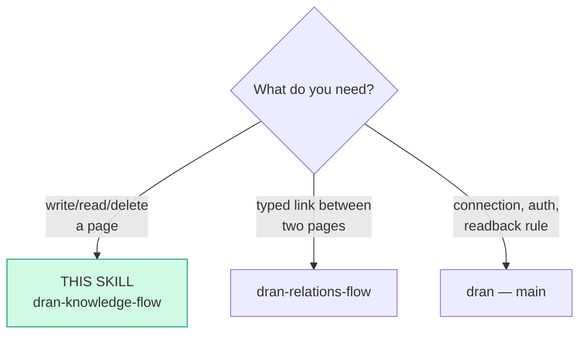
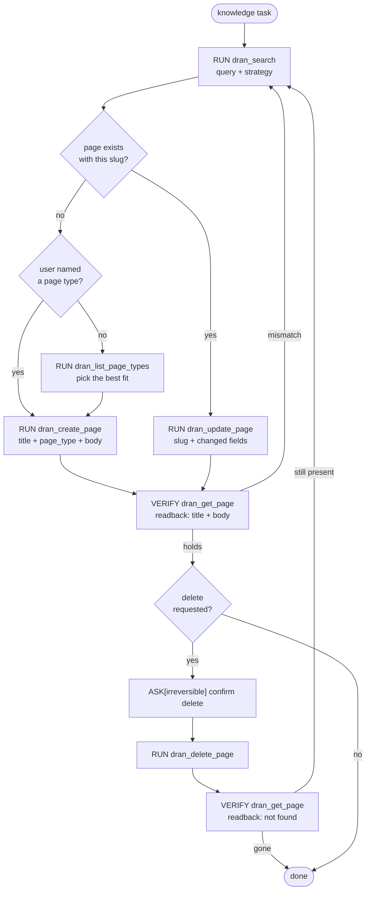

# dran-knowledge-flow — Create and edit knowledge pages

Pages are the unit of knowledge. There are **four built-in page types** —
`note`, `entity`, `concept`, `reference` — and a workspace may declare **its
own** (`recipe`, `trip`, …). There is no `meta.kind`: the type is the only
classifier. This flow owns the write loop: search first, then create or
update, then verify by readback. When the type was not named, list the
workspace's types first and decide before creating.

The tools come from the Dran Hermes plugin (`dran_*`), which talks to Dran
over its REST API.

## Entry router

## Parse contract

CONSUMES: a knowledge item to persist (title, body, type) or a query
against existing pages. PRODUCES: a page whose state is confirmed by
`dran_get_page` readback. **A write without readback is not done.**

## Operational flow

## Notes on the calls

- **List the types before creating when the type was not named.** Run
  `dran_list_page_types` — it returns the workspace's effective types with
  their full definitions (slug, label, plural, path, icon, color, meta
  fields) — then pick the best fit. `note` is the safe default only when
  nothing more specific matches.
- `page_type` must be one of the workspace's **effective** types: the four
  built-in (`note`, `entity`, `concept`, `reference`) ∪ the workspace's custom
  types. Validation is fail-closed — an unknown type (a retired slug, or
  another workspace's custom type) is refused, and the error lists the valid
  ones. There is **no `meta.kind`**; the type is the only classifier, and
  `meta.props` is a free key-value bag available on every type. When unsure
  which type fits, follow the decision tree in `docs/page-types.md`:
  - `note` — quick capture, journal, no structure yet (meta: date)
  - `entity` — a named thing: person, company, tool, place
    (meta: location, external_url)
  - `concept` — an abstract notion you define
    (meta: domain, parent_concept)
  - `reference` — an external source you point at
    (meta: source_url, published_at)
  - a custom type — whatever the workspace declares (e.g. `recipe`); use it
    when `dran_list_pages` or the error message shows it exists.
- **`dran_update_page` only changes the fields you pass** — send the fields
  to change and leave the rest out.
- Search `strategy`: `auto / fts / fuzzy / semantic / hybrid`.
  Run search before any create — duplicates are the main graph rot.
- `summary` on pages is **machine-owned** (set via create/update/nightly
  job; the UI never edits it). Keep it a real one-liner.
- Confidence levels for claims recorded in pages: low / medium / high /
  verified.
- `dran_list_pages` takes an optional `page_type`; `dran_list_page_types`
  returns the effective types with their full definitions; `dran_stats` for
  counts; `dran_get_page` for one slug.
- Every write is attributed server-side and nothing is client-settable:
  `created_by` is the `X-Hermes-Agent` header when it came (the Hermes
  profile), otherwise the API key name; `owner_user_id` is the OWNER of the
  key (`api_keys.created_by_user_id`). The header lands in `agent_name` —
  attribution, never authorization: it never widens access.

## Pitfalls

- **Creating a page that already exists under another slug** — search
  variants (accents, hyphens) first.
- **Trusting the create `ok`** — verify with `dran_get_page`; the readback
  IS the done-check.
- **Deleting without confirmation** — `dran_delete_page` is irreversible
  and takes the page's relations with it; ASK first.
- **Assuming a rename tool exists** — the plugin has no `rename_slug`; to
  move a page, update its `title` (the slug is auto-managed) and re-check
  `dran_get_links` on both sides.

## Checklist

- [ ] Search ran before write; slug confirmed fresh or update chosen
- [ ] Page type chosen: named by the user, or decided from `dran_list_page_types`
- [ ] Write done with only the changed fields
- [ ] Readback verified (get_page; for delete: gone)
- [ ] Delete went through ASK
