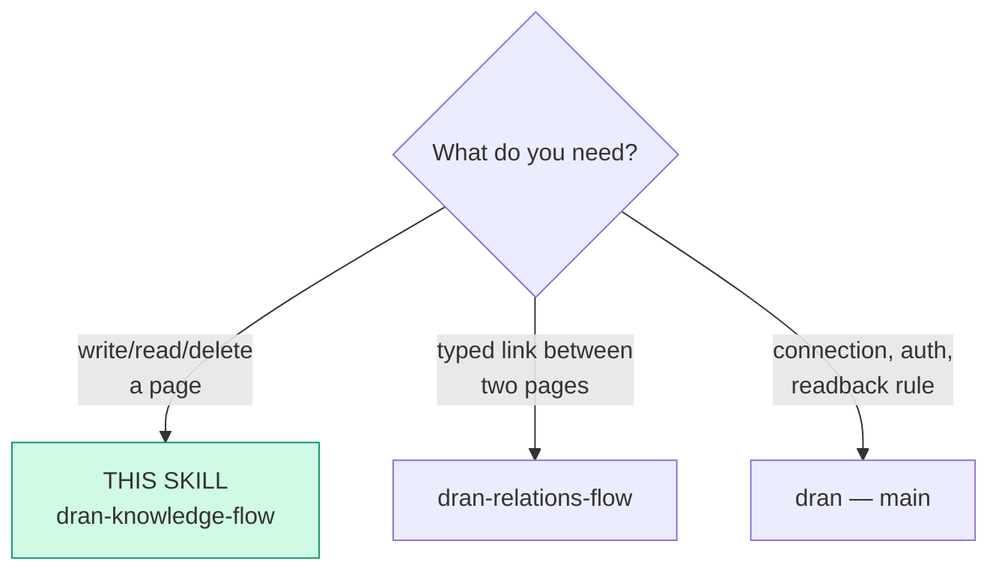
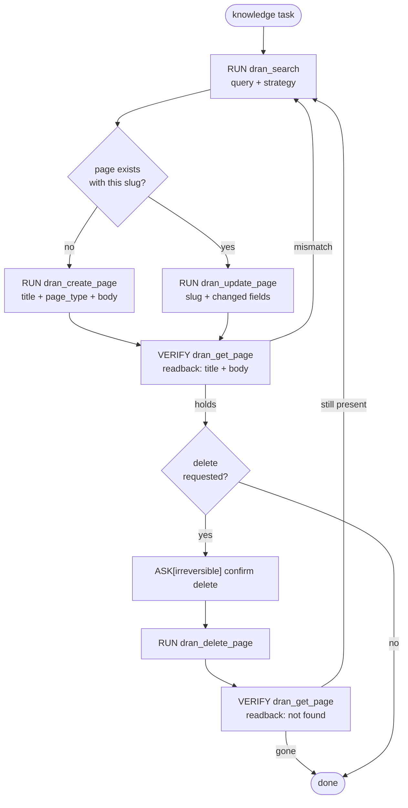

# dran-knowledge-flow — Create and edit knowledge pages

Pages are the unit of knowledge: `note`, `idea`, `knowledge`,
`technical`, `entity`, `concept`, `reference`, `food`.
This flow owns the write loop: search first,
then create or update, then verify by readback.

The tools come from the Dran Hermes plugin (`dran_*`), which talks to Dran
over its REST API.

## Entry router

## Parse contract

CONSUMES: a knowledge item to persist (title, body, type) or a query
against existing pages. PRODUCES: a page whose state is confirmed by
`dran_get_page` readback. **A write without readback is not done.**

## Operational flow

## Notes on the calls

- `page_type` enum comes from `Dran.PageRegistry` (8 types). Kinds
  (`meta.kind`; the lists in `PageMeta.changeset/3` are the contract) and
  type-specific meta fields. When unsure which type fits, follow the
  decision tree in `docs/page-types.md`:
  - `note` — quick capture, journal, no structure yet (free kind)
  - `idea` — a thought that wants to be developed;
    kinds: idea/question/hypothesis/spark
  - `knowledge` — someone else's words you extracted;
    kinds: quote/summary/highlight/excerpt; extra meta: source_url, date
  - `technical` — how-to: code, commands, configs, dev recipes;
    kinds: code/snippet/debug/recipe/config/command/
    template/pattern/method; extra meta: language, version
  - `entity` — a named thing: person, company, tool, place;
    kinds: person/company/product/tool/place/event/language/
    framework/hardware/protocol; extra meta: location, external_url
  - `concept` — an abstract notion you define (free kind;
    domain, parent_concept)
  - `reference` — an external source you point at;
    kinds: article/paper/video/podcast/book/newsletter/
    spec/code/release/website/repo/api; extra meta: source_url, published_at
  - `food` — cooking: recipes, ingredients, dishes;
    kinds: recipe/ingredient/dish/meal/cuisine/restaurant/
    drink/technique; extra meta: cuisine, servings, prep_time, cook_time,
    source_url

  Every type also takes `meta.props` (free key-value bag). Kind
  classifies/filters only — never changes behavior.
- **`dran_update_page` only changes the fields you pass** — send the fields
  to change and leave the rest out.
- Search `strategy`: `auto / fts / fuzzy / semantic / hybrid`.
  Run search before any create — duplicates are the main graph rot.
- `summary` on pages is **machine-owned** (set via create/update/nightly
  job; the UI never edits it). Keep it a real one-liner.
- Confidence levels for claims recorded in pages: low / medium / high /
  verified.
- `dran_list_pages` takes an optional `page_type`; `dran_stats` for counts;
  `dran_get_page` for one slug.
- Every write is attributed server-side: the key's actor sets `created_by`
  (and `owner_user_id` when the actor has an owner), and the active profile
  lands in `agent_name` via `X-Hermes-Agent`. Neither is client-settable.

## Pitfalls

- **Creating a page that already exists under another slug** — search
  variants (accents, hyphens) first.
- **Trusting the create `ok`** — verify with `dran_get_page`; the readback
  IS the done-check.
- **Deleting without confirmation** — `dran_delete_page` is irreversible
  and takes the page's relations with it; ASK first.
- **Assuming a rename tool exists** — the plugin has no `rename_slug`; to
  move a page, update its `title` (the slug is auto-managed) and re-check
  `dran_get_links` on both sides.

## Checklist

- [ ] Search ran before write; slug confirmed fresh or update chosen
- [ ] Write done with only the changed fields
- [ ] Readback verified (get_page; for delete: gone)
- [ ] Delete went through ASK
