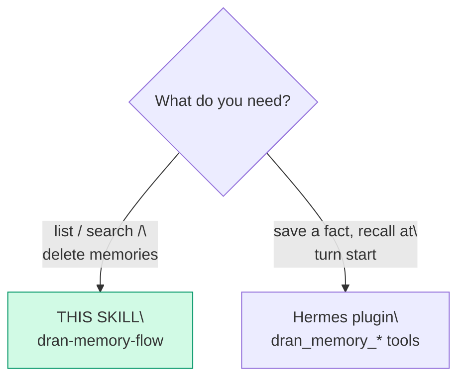
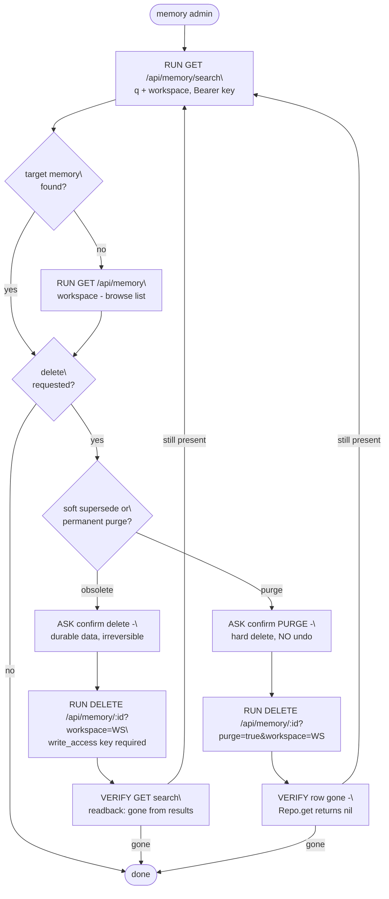

# dran-memory-flow — Administer shared agent memories

Memory is the **shared recall of agents**, written through the Hermes
plugin (`hermes_plugin/dran/` — `dran_memory_add` tool, auto-capture on
session end). This flow covers ADMINISTRATION only — list, search, delete —
because memory is not part of the MCP surface.

## Entry router

## Parse contract

CONSUMES: an admin intent over stored memories (find, prune) + a
`DRAN_API_KEY`. PRODUCES: confirmed state via readback (the memory appears/
disappears in `GET /api/memory/search`). **Never writes memories by hand.**

## Operational flow

## The REST surface (no MCP)

| Route | Method | Access |
| --- | --- | --- |
| `/api/memory` | GET | key valid (read always allowed) |
| `/api/memory/search` | GET (`q`, `workspace`, `limit`) | key valid |
| `/api/memory` | POST | `write_access` — **plugin's job, not this flow's** |
| `/api/memory/feedback` | POST | `write_access` — plugin's job |
| `/api/memory/ingest` | POST | `write_access` — plugin's job (session end) |
| `/api/memory/:id` | DELETE | `write_access` — soft-delete (superseded); **API keys MUST pass `?workspace=<slug>`** |
| `/api/memory/:id?purge=true&workspace=<slug>` | DELETE | `write_access` — **hard delete, permanent** |

- Base URL is the profile's Dran (`$HERMES_HOME/dran_memory.json →
  base_url`); same `DRAN_API_KEY` as MCP.
- `created_by` on every memory is attributed server-side from the key's
  actor — never trust a client-set author.

## Pitfalls

- **`POST /api/memory` by hand to "save" something** — writes belong to the
  plugin so the provenance (`X-Hermes-Agent`, actor) stays honest; a
  manual POST forges the author's context.
- **Purge ≠ delete** — plain DELETE soft-supersedes (status flips, row
  stays, excluded from search); `?purge=true` hard-deletes the row, and
  the fact can be re-stored later (no dedupe ghost).
- **DELETE /api/memory/:id without `?workspace=<slug>` 403s for API
  keys** — the write-access plug resolves the workspace from
  `conn.params` only; with no `workspace` param it gets `nil` →
  `"API key does not have write access to this workspace"` even for a
  valid write key. Query params populate `conn.params`, so appending
  `&workspace=<slug>` fixes it.
- **GET /api/memory caps at 100 rows regardless of `limit`** — paginate
  with `offset` (loop until a page returns < 100) before claiming a
  total count; the first page lies about the size of the workspace.
- **No bulk purge endpoint** — full wipe = per-id loop of
  `DELETE /:id?purge=true&workspace=<slug>`, then re-enumerate until 0
  remain; the UI-only "Borrar obsoletos" covers superseded rows only.
- **Deleting the whole workspace's recall on a bad review** — delete by
  specific id, one confirmation each.
- **Expecting `dran_memory_*` MCP tools** — zero on MCP; only the plugin
  and REST exist.
- **Confusing memory with page knowledge** — memories are agent-facts
  (dedupe + trust server-side); knowledge that humans read goes through
  dran-knowledge-flow.

## Checklist

- [ ] Admin-only: no manual POST/ingest from this flow
- [ ] Search + browse to locate exact ids before any delete
- [ ] Delete confirmed by the human, verified by readback (gone)
- [ ] Purge (`?purge=true`) explicitly flagged as permanent to the human
- [ ] API-key DELETEs carry `?workspace=<slug>` (else 403)
- [ ] Totals counted with offset pagination (limit caps at 100)
