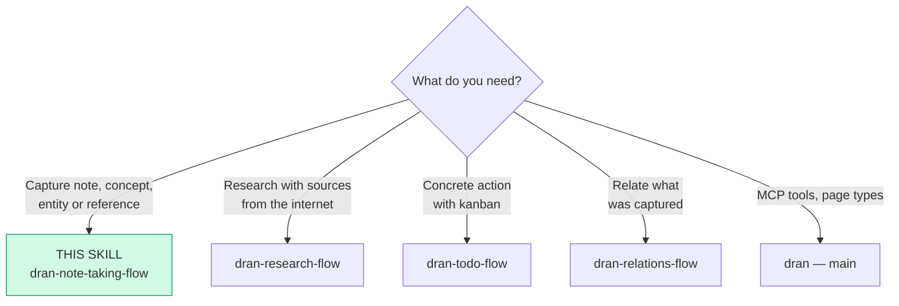
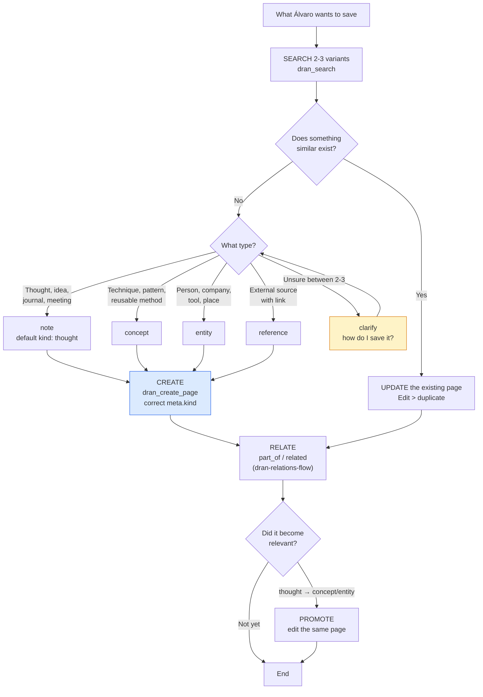

# dran-note-taking-flow — Capturing knowledge in Dran

Everything that is NOT execution (project/goal/plan/todo) is capture: notes,
concepts, entities, references. The mother rule: **when in doubt, `note` with
`kind: thought`** — promoting later is free.

## Entry router



## Operational flow — follow this DAG to the letter



## Parse contract

### What this skill CONSUMES
- What Álvaro wants to save: thought, learning, a fact about a person/
  company, link, quote, meeting minutes

### What this skill PRODUCES

| # | Artifact | Purpose |
|---|-----------|-----------|
| 1 | Page with the correct `page_type` + `meta.kind` | Search and the graph handle it well |
| 2 | Typed relations to related content | PageRank and context |
| 3 | Promotion of thought → concept/entity when it applies | Knowledge matures without duplicating |

**Without the correct `meta.kind` the capture is malformed** — the page gets
created, but search and filters lose it.

## Flow description

| Type | When | Example |
|------|--------|---------|
| `note` | On the spot — quick capture (default) | idea, journal, meeting, quote |
| `concept` | Distilled reusable knowledge | technique, pattern, framework |
| `entity` | Person/company/product that keeps appearing | FAL.ai, Hermes, Anthropic |
| `reference` | Useful external source | article, video, paper |

**Strategies:**

- **Quick capture** → `note` (kind thought) → **promote** to
  `concept`/`entity` when it becomes relevant. Edit > duplicate — promoting
  means editing the SAME page (body, meta.kind), never creating another.
- **Search before create** (2-3 variants); if it exists, update.
- **Type doubt** → default `note` thought; if the doubt changes what you're
  capturing (note vs entity vs reference), clarify with 2-3 candidates.
- **Always relate** (`related`/`part_of`) — feeds PageRank and search (see
  `dran-relations-flow`).

### Kinds by type (operational summary)

**Note:** thought (default), journal, idea, meeting, question, quote,
reminder. **Concept:** technique, pattern, framework, method, principle.
**Entity:** person, company, product, tool, place, event. **Reference:**
article, paper, video, podcast, book — always with `source_url`.

The full list of kinds lives in the `dran` skill (§3).

## Using Dran

### Recipes

**Quick capture:**
```
1. dran_search({ context: "personal", query: "<keywords>" })   → exists? UPDATE
2. dran_create_page({
     context: "personal",
     page_type: "note",
     body: "Today I learned...",
     meta: { kind: "thought" },
     tags: ["elixir"],
     owner: "alvaro", created_by: "chaos manager"  # owner from API key, created_by overrideable
   })
```

**Distilled concept:**
```
dran_create_page({ page_type: "concept", title: "Circuit Breaker",
  meta: { kind: "pattern", domain: "resilience" } })
```

**Entity (with props):**
```
dran_create_page({ page_type: "entity", title: "Anthropic",
  meta: { kind: "company", external_url: "https://...",
          props: { location: "sf", framework: "claude" } } })
```

**Reference (with the why rule):**
```
dran_create_page({ page_type: "reference", title: "Paper X",
  body: "## Why\n\n<why I'm saving it>",
  meta: { kind: "paper", source_url: "https://arxiv.org/..." } })
```

**Promote thought → concept:**
```
1. dran_get_page the original note
2. dran_update_page: meta.kind "permanent"/rewrite the distilled body,
   or change page_type via a new version of the meta — ALWAYS the same page
3. dran_reaugment_page if the change is significant
```

**Code notes:** `meta.kind: "code"` + `meta.language: "elixir"` to filter by
language.

### Props when capturing (meta.props)

Any page can carry `meta.props`: a free key-value bag (strings only, max 10).
The keys `role`, `tier`, `location`, `language`, `framework` materialize
automatic edges; custom keys are stored and can be filtered when searching,
but they don't generate an edge (details in `dran-relations-flow`).

**Where it fits naturally:** tool entity → `language` + `framework`; person
entity → `role` + `location`; concept with tier → `tier`; reference → nothing
(use `source_url`/`kind`).

**Search by props (AND):**
```
dran_search({ query: "elixir", props: { language: "elixir" } })
dran_list_pages({ type: "entity", props: { framework: "phoenix" } })
```

### Brainstorming (generating ideas)

1. **Clarify** — topic, scope, and why
2. **Search before create** — what do we already have on the topic?
3. **Generate** — interlinked notes `kind: idea` (`related`), or Dran's
   `brainstorm` prompt (5-10 ideas as interlinked pages)
4. **Research what's worth it** → `dran-research-flow`
5. **Distill** — promote the good ones to `concept`/`entity`
6. **Present + prioritize** — clarify to choose which ones become
   projects/goals/plans/todos (hand-off to the corresponding flow)

## Pitfalls

- **Create without search** — duplicates that fragment the graph.
- **Duplicate instead of promote** — a thought that matured gets EDITED, not
  cloned as a new concept.
- **Generic `note` without kind** — `meta.kind` is what makes it findable.
- **Reference without `source_url` or why** — noise.
- **Capture without relating** — an orphan page that search doesn't pick up.
- **Asking the obvious** — a pending task is a todo, a quote is a note quote;
  clarify only when the type changes what you capture.

## Quick reference

| Tool | Minimal args | Returns |
|------|--------------|---------|
| `dran_search` | `query` (2-3 variants) | Does it already exist? |
| `dran_create_page` | `page_type`, `body`, `meta.kind` | Page + slug |
| `dran_update_page` | `slug` + fields | Promotion/editing |
| `dran_create_relation` | `source_slug`, `target_slug`, `relation_type` | Typed edge |
| Prompt `brainstorm` | topic | Interlinked ideas |

## When NOT to use this skill

- **Research with web sources** → `dran-research-flow`
- **Pending task/action** → `dran-todo-flow`
- **Project/goal/plan definition** → `dran-project-flow` / `dran-goal-flow` /
  `dran-planning-flow`

## Cross-references

- Full list of kinds and page types: `dran` — main skill
- Sources with full research: `dran-research-flow`
- Relations and props: `dran-relations-flow`
- Orphans and cleanup: `dran-maintenance-flow`
