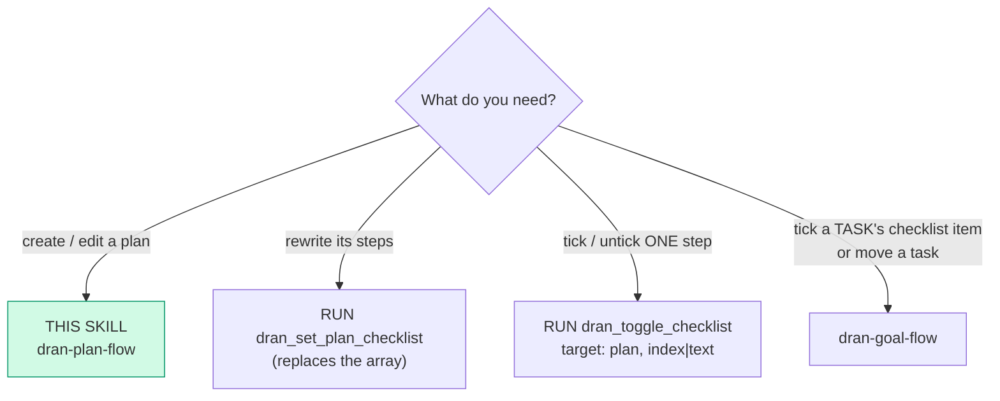
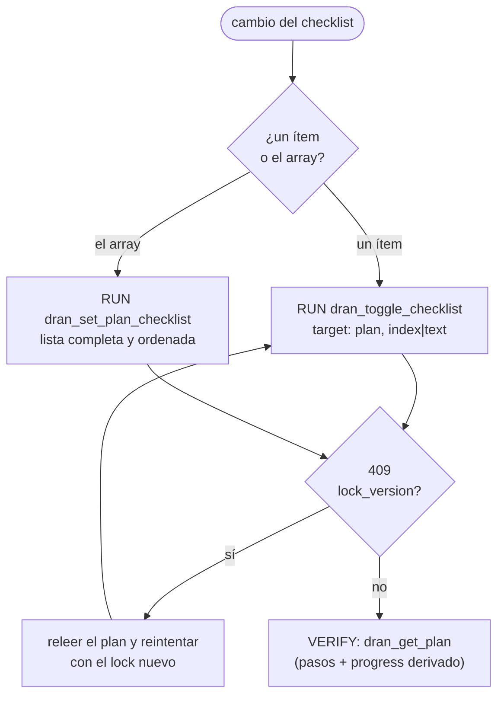

# dran-plan-flow — Plans and their checklist

The **plan** is an ENTITY with its own surface (`/plans`), not a page type: its
steps are the same ordered jsonb checklist as a task's, and its `progress` is
DERIVED from that checklist. Everything is a thin client over `/api/plans` and
`/api/checklist/toggle`. Goals and tasks are the other container — see
`dran-goal-flow`.

## Entry router

## Parse contract

CONSUMES: an intent over plans (create, edit, replace/step the checklist,
delete, read) + the profile's `DRAN_API_KEY`. PRODUCES: confirmed state via
readback (`dran_get_plan` / `dran_list_plans`). **Never** write the checklist
through the plan-update door, and never invent a step index.

## The doors

| Change | Tool | Why this one |
|---|---|---|
| Alta de un plan | `dran_create_plan` | El `checklist` **nace con el plan**; el destino (`scope`) se declara acá |
| Contenido: título, cuerpo, resumen, estado, fechas, archivado | `dran_update_plan` | La puerta del contenido — **nunca** el checklist |
| Los pasos, de una vez | `dran_set_plan_checklist` | **Reemplaza** el array ordenado completo (`[{text, done}]`) |
| UN paso | `dran_toggle_checklist` (`target: "plan"`, por `index` o `text`) | Tacha/destacha un ítem sin reescribir el resto |
| Lectura | `dran_list_plans` · `dran_get_plan` | El readback, con el `progress` derivado |
| Borrar | `dran_delete_plan` | Se lleva sus aristas del grafo: **ASK** antes |

## Checklist semantics

- El checklist es un array jsonb ordenado `[{"text": …, "done": …}]` que se
  reescribe entero: **no crea ni mueve tasks**. Tachar un ítem no es completar
  una task.
- El `lock_version` protege el read-modify-write: una mano lenta recibe **409**,
  nunca pisa a la rápida.
- El `progress` (`done`/`total`) es **derivado** del checklist — no es un campo
  que se escriba.

## Destinations (`scope`)

- El **alta** sin destino toma el default del perfil (*Write scope* / *Group
  slug* del panel); una **edición** sólo mueve el destino si lo declara.
- Un grupo del que el dueño de la credencial no es miembro, o inexistente, es
  **422 y no deja fila** (falla cerrado, nunca `private` en silencio). El slug
  se elige por NOMBRE con `dran_list_groups` (`dran-goal-flow` lo explica).

## Pitfalls

- **Mandar el checklist a `dran_update_plan`**: se **ignora en silencio** (200 y
  nada cambió). Tiene sus dos puertas propias.
- **Escribir el `progress`**: es derivado; escribirlo no existe como operación.
- **Adivinar el `index` de un paso**: leé el plan primero (`dran_get_plan`); un
  índice inventado toca el paso equivocado (o ninguno).
- **Un plan no es un tipo de página**: no se crea con `dran_create_page` ni
  aparece en `/notes` — vive en `/plans` con su propia tabla.
- **Dar el cambio por hecho sin readback**: el `ok` de la tool es transporte.
- **Borrar sin preguntar**: irreversible y se lleva aristas del grafo. **ASK**.

## Cross-references

- Plugin-side surface (schemas + dispatch): `hermes_plugin/dran/__init__.py`
- Routes y la puerta de escritura: `lib/dran_web/router.ex`
- Endpoint reference: `docs/api.md` (§ Goals, tasks and plans)
- El otro contenedor (goals · tasks · destino): `dran-goal-flow`