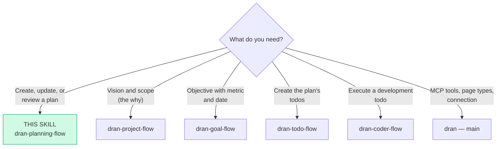
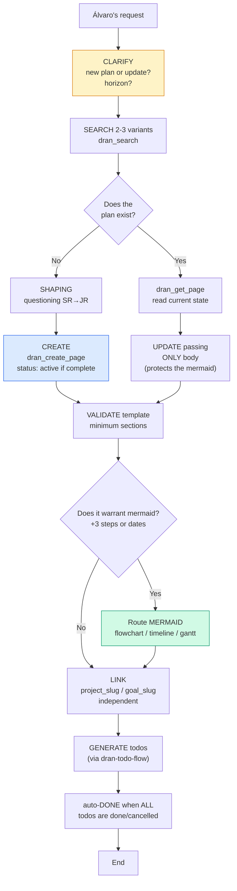
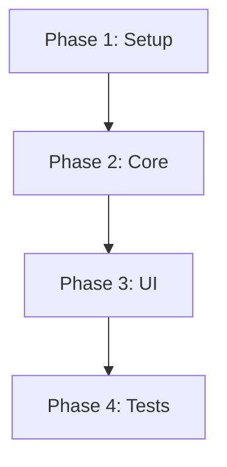
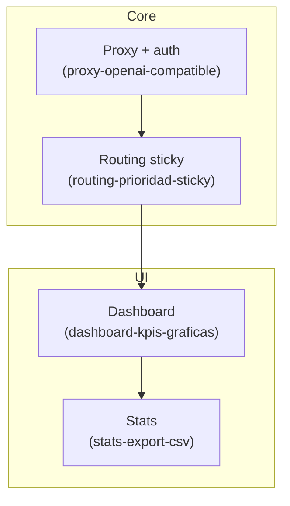
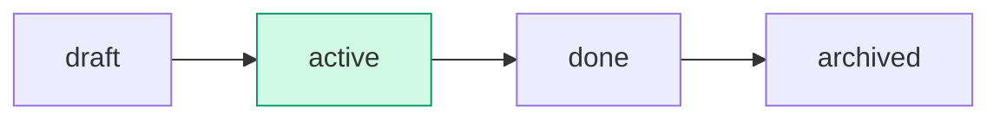

# dran-planning-flow — Create and manage plans in Dran

The plan is the **tactical/strategic** level: the "how" something will be executed.
Sequence of steps, execution architecture, route mermaid. If a plan
doesn't generate todos, it's not a plan — it's a note.

**Todos** are the **actions** needed to fulfill the plan. A todo's
`## Objective` is its concrete deliverable (execution level), NOT a
goal (measurable objective) nor the plan's objective — it contributes to them.

Unlike the todo (which merges the deliverable into `## Objective`), the plan
keeps `## Objective` and `## Deliverable / Outcome` separate: at the
tactical level the deliverable can differ from the objective.

## Entry router



Execute ONLY the section you reached. If the diagram sends you to another
skill, **stop here** and hand off.

## Operational flow — follow this DAG to the letter



Each node is a mandatory step: clarify, search, shaping, template with
deliverable, route mermaid if warranted, independent links, and the todos
that execute the plan.

## Parse contract

### What this skill CONSUMES
- Álvaro's request: new plan, route adjustment, plan review, or an existing
  plan page with its current `meta` and mermaid

### What this skill PRODUCES

| # | Artifact | Purpose |
|---|----------|---------|
| 1 | `plan` page with minimum sections | Complete executable definition |
| 2 | Parseable route mermaid | High-level map; each node can expand into a todo |
| 3 | Valid `meta` (kind, horizon, period, links) | Temporal and strategic positioning |
| 4 | List of todos to create (checklist with slugs) | A plan without todos is not a plan |

**Without `## Deliverable / Outcome` the plan is malformed** — the deliverable
is the plan's done criterion; without it there is no way to close it.

## Flow description

| Aspect | Rule |
|--------|------|
| What it is | The "how" it will be done: steps, architecture, mermaid |
| Horizon | Days/weeks |
| Question it answers | How are we going to do it, step by step? |
| Life | One plan = one execution. If the nature changes → new plan |

**Golden rules:**

1. **Born `active` if already fully defined** (objective + deliverable +
   execution + todos). `draft` only while being built.
2. **The mermaid is the route map** — each node can expand into a todo
   with its own detailed mermaid (that's `dran-todo-flow` / `dran-coder-flow`).
3. **Annexes outside the plan** — system diagrams, glossaries, architecture
   → their own pages (`concept`/`note`) related with `part_of`/`related`.
   The plan only embeds with `![[slug]]` if it needs them visible.
4. **Auto-`done`** when ALL linked todos are done/cancelled
   (= deliverable met if the todos cover the outcome).

## Shaping — questioning before creating

1. **Objective** — what gets executed with this plan? (1-2 sentences)
2. **Deliverable** — what is produced when finished? (done criterion)
3. **Horizon** — week, month, quarter, year? (`horizon` + `period`)
4. **Steps** — what are the phases? (feed the mermaid and the todos)
5. **Pitfalls** — what project rules must the executor respect?
   (feed `## Gotchas`)

One blocking question per turn. Reuse what is already in the conversation.

### Technical questioning (SR reviewing JR — code plans)

Before creating a code plan, inspect the real codebase with
`search_files`/`read_file` and ground each decision in evidence
(`path:line`). Then `clarify` with concrete options:

- **Scope feasibility** — does the change touch 5+ modules or require a
  migration? Question the scope.
- **Existing solutions** — is there already a plan/todo covering this? Search
  before duplicating.
- **Dependencies** — are there in-flight todos that block?

```json
{
  "question": "I reviewed the codebase before creating this plan. How should I proceed?",
  "choices": [
    "Create the plan (manageable risks)",
    "Reduce scope",
    "Split into 2 plans",
    "Cancel — something related already exists"
  ]
}
```

Only proceed to `dran_create_page` after confirmation.

## Content template — common minimum structure

| # | Section | Purpose | Required |
|---|---------|---------|----------|
| 1 | `## Objective` | What gets executed, 1-2 sentences | Yes |
| 2 | `## Deliverable / Outcome` | What is produced when finished — the plan's done criterion | Yes |
| 3 | `## Plan context` | Stack, key modules, business objective (for coding: the executor doesn't re-read the whole repo) | Optional |
| 4 | `## Execution` | HIGH-LEVEL mermaid (only if warranted: +3 steps or dates) | Conditional |
| 5 | `## Tasks` | Checklist of the actual todos to be created (with slugs) | Yes |
| 6 | `## Gotchas` | Project-specific pitfalls/rules the executor must respect | Optional |

### Mermaid type by plan

| Type | When | Example |
|------|------|---------|
| `flowchart` | Phase sequence (technical, code) | `F1[Setup] --> F2[Core]` |
| `timeline` | Schedule by dates (trips, events) | `2026-09-01 : Departure` |
| `gantt` | Dates and durations (launches) | bars per task |

### Mermaid detail level

**Normal plan — high level (phases only):**



**Large plan (+3 todos) — route map with subgraphs per module**, each node
labeled with the slug of the todo that executes it — the plan becomes a
navigable index of the work:



The detailed execution mermaid (READ/EDIT/CREATE/RUN/VERIFY verbs) does NOT go
in the plan — it goes in each phase's todo (see `dran-todo-flow` and `dran-coder-flow`).

## Using Dran

### Key meta

| Field | Values | Note |
|-------|--------|------|
| `kind` | personal / coding / business / learning / health / finance / other / investing / marketing / product / writing / career / relationship / travel | |
| `horizon` | weekly / monthly / quarterly / yearly | |
| `period` | e.g. `2026-Q3`, `2026-08` | |
| `status` | draft / active / done / archived | Born active if complete |
| `project_slug` | slug | Independent link |
| `goal_slug` | slug | Independent link |

### Recipe — create

```
1. clarify scope + shaping
2. dran_search({ context: "personal", query: "<plan>" })   → exists? UPDATE
3. dran_create_page({
     context: "personal",
     page_type: "plan",
     title: "Q3 2026 — Document MCP tools",
     body: "## Objective\n\n...\n\n## Deliverable / Outcome\n\n...\n\n## Execution\n\n```mermaid\n...\n```\n\n## Tasks\n\n- [ ] ...",
     meta: {
       kind: "coding",
       horizon: "quarterly",
       period: "2026-Q3",
       status: "active",
       project_slug: "<project>",   → optional, independent
       goal_slug: "<goal>"          → optional, independent
     },
     owner: "alvaro",  # from the key's actor, not settable
     created_by: "chaos manager"  # derived server-side, not settable
   })
4. Create the listed todos (via dran-todo-flow) with plan_slug pointing here
```

### Recipe — update (⚠️ mermaid)

```
1. dran_search the slug
2. dran_get_page to read the current state
3. dran_update_page passing ONLY body (NOT meta)
   → if you pass meta together with body, TipTap re-parses and STRIPS the mermaid
4. Check off the ## Tasks checkboxes as todos become done
```

### Status workflow



- **create** → `draft` while being built; `active` when complete
- **auto-`done`** — when ALL linked todos are done/cancelled
- **`archived`** — manual; old plans with historical value are archived,
  not deleted

### When to review a plan

When the steps are no longer valid or a better path is discovered. Edit the
same plan (body only) — don't create another plan for the same execution. If
the **nature** of the work changed (a different deliverable), then yes: new plan.

## Pitfalls

- **`meta` + `body` together on update** — strips the mermaid. ONLY body.
- **Plan without deliverable** — no done criterion; it's a note in disguise.
- **Plan without todos** — it's not a plan, it's a note. Generate the todos or rethink.
- **Execution mermaid in the plan** — the plan carries the high-level route;
  the detailed execution (verbs) goes in each todo.
- **Annexes inside the plan** — system/architecture diagrams go in their own
  related pages; the plan embeds them with `![[slug]]` if at all.
- **Operators in mermaid labels** — `==`, `!=`, `<=`, `>=` and `$` break
  the parser. Use quotes (`B{"type matches?"}`) or rephrase with words.
- **Line breaks without quotes** — labels with `\n` go in double
  quotes: `A["text\nmore"]`.
- **Creating status draft and forgetting it** — if the plan is complete when
  created, it's born `active`.

## Quick reference

| Tool | Minimum args | Returns |
|------|--------------|---------|
| `dran_search` | `query`, `type: "plan"` | Ranked list |
| `dran_get_page` | `slug` | Markdown body (with mermaid) |
| `dran_create_page` | `page_type: "plan"`, `title`, `body`, `meta` | Created plan + slug |
| `dran_update_page` | `slug`, `body` (ONLY body) | Updated plan |
| `dran_list_pages` | `type: "plan"`, `status` | Filtered list |

## When NOT to use this skill

- **The request is vision/why** → `dran-project-flow`
- **The request is a measurable objective** → `dran-goal-flow`
- **The request is an executable action** → `dran-todo-flow`
- **You're going to EXECUTE a todo's code** → `dran-coder-flow`
- **It's knowledge capture** → `dran-note-taking-flow`

## Cross-references

- MCP reference (tools, page types, meta fields): `dran` — main skill
- Project/goal the plan serves: `dran-project-flow`, `dran-goal-flow`
- Creation of the plan's todos: `dran-todo-flow`
- Execution of development todos: `dran-coder-flow`
- Review of PRs against a todo: `dran-review-flow`
- Links `project_slug`/`goal_slug`/`plan_slug`: `dran-relations-flow`
- Anchored opening + trajectory maintenance: `riel-protocol`
- mermaid and verb contract: `riel-contract`
