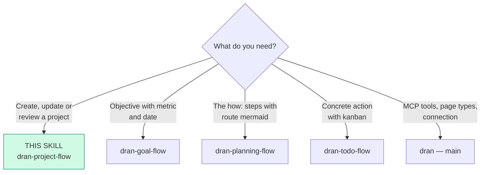
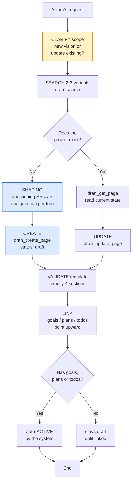
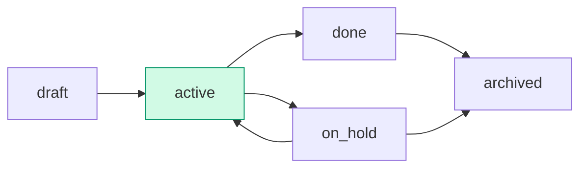

# dran-project-flow — Create and manage projects in Dran

The project is the **strategic** level: vision and purpose. The "what" and the
"for whom" — never the "how" (that's `dran-planning-flow`).

**Hierarchy:** `project` (vision) → `goal` (metric) → `plan` (how) → `todo`
(action). A todo's `## Goal` is its concrete deliverable (action), NOT a
goal nor the plan/project objective — it contributes to them.

## Entry router



Run ONLY the section you landed on. If the diagram sends you to another
skill, **stop here** and hand off.

## Operational flow — follow this DAG to the letter



Each node is a mandatory step: clarify first, search before creating,
shaping with questioning, 4-section template, and upward linking.

## Parse contract

### What this skill CONSUMES
- Álvaro's request: project idea, vision/scope change, project review,
  or an existing project page with its current `meta`

### What this skill PRODUCES

| # | Artifact | Purpose |
|---|----------|---------|
| 1 | `project` page with exactly 4 sections | Strategic axis of the work |
| 2 | Valid `meta` (status, priority, health, dates) | Tracking and kanban of projects |
| 3 | Incoming links (goals/plans/todos point to the project) | The project activates and groups execution |

**Without the 4 sections the output is malformed** — a project without
explicit scope grows unchecked; without a clear objective there's no way to
know if it's going well.

## Flow description

| Aspect | Rule |
|--------|------|
| What it is | Vision and purpose. The "what" and the "for whom" |
| What it is NOT | Architecture, code, operational steps → that goes in plans |
| Horizon | Months/years |
| Question it answers | What do we want to achieve and why? |
| Title | Functional/descriptive name (not thematic) |

**Golden rule:** if a section doesn't add value, don't include it. Metrics →
goals, steps → plans, actions → todos, decisions/notes → related note pages.
The project is the strategic axis, not the diary.

**Link direction:** lower levels point TOWARD the project (goal/plan/todo
carry `project_slug`). The project NEVER lists its children in `meta` — the
relation lives in the children.

## Shaping — questioning before creating

Content is built **during the conversation**, not by blindly filling in the
template. Question like a senior reviewing a junior's proposal:

1. **Origin** — where did it come from? (feeds `## Original idea`)
2. **Objective** — what is achieved in 1-2 sentences WITHOUT the how?
3. **For whom** — who uses it or benefits?
4. **Anti-scope** — what does it NOT include? (as important as what it includes)

One blocking question per turn — never a questionnaire. If the request already
carries the answer, don't ask again (reuse the context).

## Content template — 4 sections, not one more

| # | Section | Purpose |
|---|---------|---------|
| 1 | `## Original idea` | Where the spark came from, origin context. Does not change over time |
| 2 | `## Objective` | What we want to achieve, 1-2 sentences, WITHOUT the how |
| 3 | `## Description` | What it is and for whom. One-paragraph executive summary |
| 4 | `## Scope` | Bullet list **Includes** / **Does not include** (explicit anti-scope) |

```markdown
## Original idea

Dran v2 was born from the frustration of losing context between agent sessions...

## Objective

Turn Dran into Álvaro's operational second brain: capture, search,
and execution of work in a single graph.

## Description

Personal knowledge-graph MCP server: typed pages connected by
relations, operated by agents via MCP. For Álvaro and his agents.

## Scope

- Includes: MCP server, 9 page types, autonomous agents, web UI, kanban
- Does not include: mobile app, multi-tenant SaaS, sync with Notion/Obsidian
```

## Using Dran

### Key meta

| Field | Values | Note |
|-------|--------|------|
| `status` | draft / active / on_hold / done / archived | See status workflow |
| `priority` | low / medium / high / urgent | |
| `health` | green / yellow / red | Derived from goals unless manual |
| `health_source` | derived / manual | `manual` = Álvaro sets it |
| `start_date` / `target_date` | ISO dates | |

### Recipe — create

```
1. clarify scope + shaping (see § Shaping)
2. dran_search({ context: "personal", query: "<name>" })   → exists? UPDATE
3. dran_create_page({
     context: "personal",
     page_type: "project",
     title: "<functional name>",
     body: "<4 sections>",
     meta: {
       status: "draft",
       priority: "high",
       health: "green",
       start_date: "2026-08-01",
       target_date: "2026-12-31"
     },
     owner: "alvaro",  # from API key, not settable
     created_by: "chaos manager"  # overrideable
   })
```

### Recipe — update

```
1. dran_search the slug
2. dran_get_page to read the current state
3. dran_update_page with the new body/meta
4. If the body has mermaid → pass ONLY body (not meta) or it gets stripped
5. dran_reaugment_page if the content changed significantly
```

### Status workflow



- **create** → `draft`
- **auto-`active`** — when a goal/plan/todo gets linked (the system moves it)
- **`done` / `on_hold` / `archived`** — manual, only when Álvaro asks
- **health** — derived from the linked goals unless `health_source: "manual"`

### When to review a project

When the vision or the market changes. The review updates `## Objective` and
`## Scope` — the `## Original idea` **is not touched** (it's the historical
record).

## Pitfalls

- **Putting the how in** — architecture, stack, steps → that's `dran-planning-flow`.
- **Metrics in the project** — numbers go in goals; the project inherits them
  via derived health.
- **Diary in the body** — progress updates go in related notes or in the
  goals/todos, not in the project.
- **Links from the project downward** — children point upward with
  `project_slug`; don't list children in the project's meta.
- **Creating without search** — if it already exists, UPDATE; never a
  duplicate project with "v2" in the title.
- **Archiving without clarify** — archive is recoverable, but confirm first.

## Quick reference

| Tool | Minimal args | Returns |
|------|--------------|---------|
| `dran_search` | `query` | Ranked list (excerpts) |
| `dran_get_page` | `slug` | Full markdown body |
| `dran_create_page` | `page_type`, `title`, `body`, `meta` | Created page + slug |
| `dran_update_page` | `slug` + fields to change | Updated page |
| `dran_list_pages` | `type: "project"` | Filtered list |

## When NOT to use this skill

- **The request has a number + date** → `dran-goal-flow`
- **The request is the how (steps, architecture)** → `dran-planning-flow`
- **It's an action executable now** → `dran-todo-flow`
- **It's knowledge capture, not execution** → `dran-note-taking-flow`

## Cross-references

- MCP reference (tools, page types, meta fields): `dran` — main skill
- Goals that measure the project: `dran-goal-flow`
- Plans that execute the project: `dran-planning-flow`
- Todos that execute: `dran-todo-flow`
- `project_slug` links and relations: `dran-relations-flow`
- Anchored opening + trajectory maintenance: `riel-protocol`
