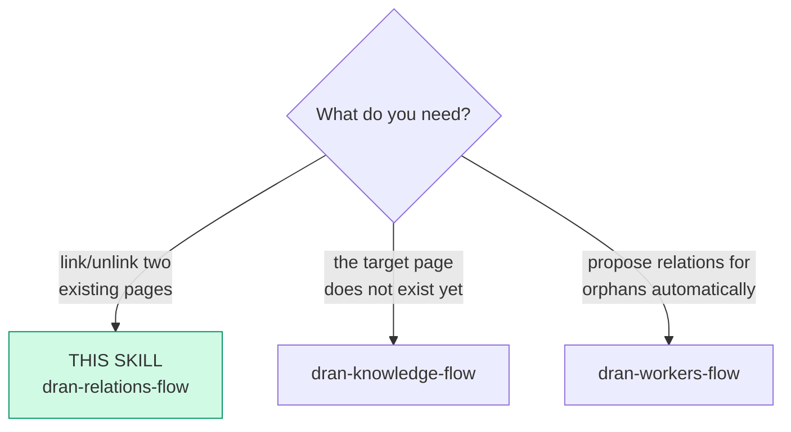
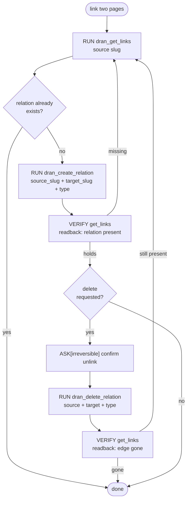

# dran-relations-flow — Link pages with typed relations

Relations are directed and typed: the graph queryability depends on choosing
the right type, not more edges. This flow owns create/delete of relations
between existing pages.

## Entry router

## Parse contract

CONSUMES: two existing page slugs + the semantic between them. PRODUCES: a
typed directed edge confirmed present by `dran_get_links`. **A relation
created without readback is a mood.**

## Operational flow

## Choosing the type (closed enum)

| Type | Direction means |
| --- | --- |
| `related` | generic link, weak semantics — default |
| `part_of` | source is a component of target |
| `supersedes` | source replaces / outdates target |
| `contradicts` | source disagrees with target |
| `embeds` | source embeds target (usually auto from `![[slug]]`) |

- **Creatable types are exactly these 5**: `related`, `part_of`,
  `supersedes`, `contradicts`, `embeds`. The schema accepts 13 types
  server-side, but the rest are machine-owned: `semantic` comes from the
  augmenter (embeddings), `mentions` from the entity linker, and
  `works_in`/`has_tier`/`based_in`/`written_in`/`built_with` from props
  materialization.
- Direction matters: `part_of` from the child TO the parent.
- Duplicate relations on the same pair+type are idempotent — safe to retry.
- `dran_delete_relation` takes an OPTIONAL `relation_type`: **omitting it
  deletes ALL relations between the pair in BOTH directions** — always pass
  the type unless wiping the pair is the intent.
- The tools come from the Dran Hermes plugin (`dran_*`), which talks to Dran
  over its REST API. Both endpoints accept `{source_slug, target_slug,
  relation_type}` / `{source_slug, target_slug}`; the plugin resolves slugs
  server-side.
- `dran_delete_relation` **requires the slug pair** (`source_slug` +
  `target_slug`); deleting by id is a different REST route with no tool.
  Omitting `relation_type` deletes every relation between the pair, both
  directions.
- Missing slug on either side → error, not silent drop: create the page
  first (dran-knowledge-flow).
- Five `meta.props` keys (`role`, `tier`, `location`, `language`,
  `framework`) auto-materialize into edges — prefer them over manual
  relations for taxonomy-style links.

## Pitfalls

- **`related` as a dumping ground** — if you can say `part_of` or
  `supersedes`, say it; generic edges dilute traversal.
- **Inverting direction** — before creating, restate the sentence: "X is
  part of Y" ⇒ source=X, target=Y.
- **Deleting without unlinking knowledge** — an orphaned page after unlink
  should get a link proposal or a home page; check with `dran_get_page`.

## Checklist

- [ ] Both slugs exist (dran_get_links confirms the source side)
- [ ] Type chosen deliberately, not defaulted by laziness
- [ ] Readback confirmed the edge (or its removal)
