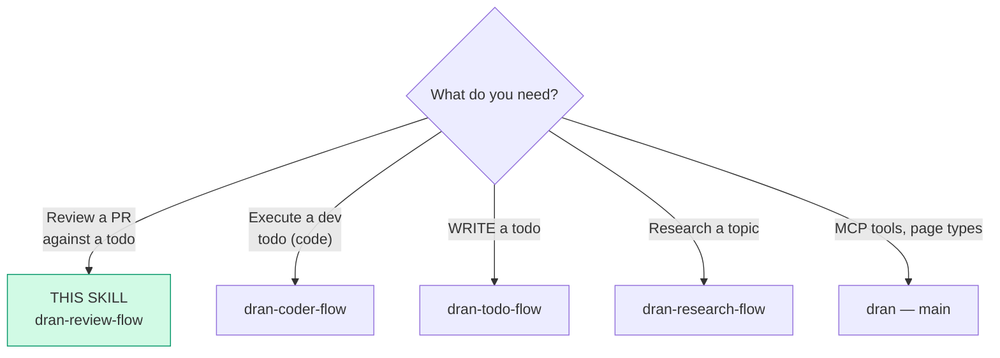
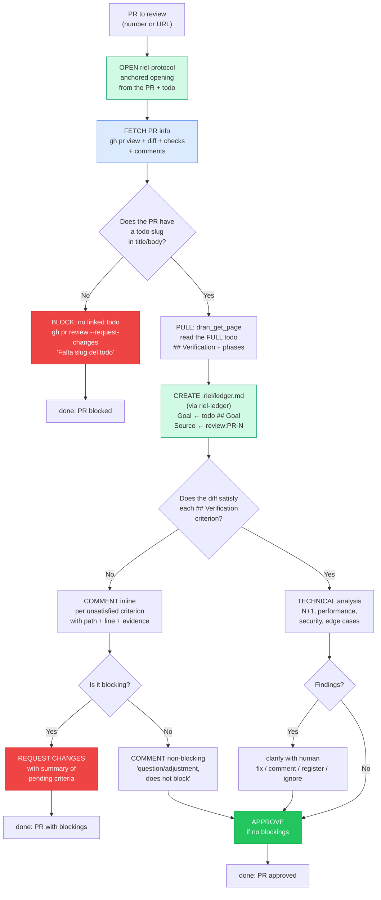

# dran-review-flow — Review a PR against its Dran todo

This skill reviews an **existing PR** against its linked Dran todo. The todo
is the **only source of truth** for what should be delivered — the PR body
is a human summary, not the contract.

> **Not this skill:** creating/executing a todo (`dran-coder-flow`), writing a
> todo (`dran-todo-flow`), research (`dran-research-flow`).

## Entry router



## Layer separation (riel)

Same as `dran-coder-flow` — the review flow does NOT reimplement local
state, it delegates to riel:

| Layer | Skill | Responsibility |
|---|---|---|
| Communication (anchored opening + maintenance) | `riel-protocol` | steers the review interaction |
| Local state (✓NN for review findings) | `riel-ledger` | `.riel/ledger.md` — tracks what was verified |
| Orchestration (diff analysis, commenting, blocking) | `dran-review-flow` | execute the review |

## Operational flow — follow this DAG to the letter



## Parse contract

### What this skill CONSUMES
- A PR number or URL to review
- The linked Dran todo (via slug in PR title/body) with `## Verification`
  and `## Phases` (level 3)

### What this skill PRODUCES

| # | Artifact | Purpose |
|---|-----------|-----------|
| 1 | Review comments (inline + general) | Feedback to the author |
| 2 | Request changes or approval | Gate decision |
| 3 | Ledger with ✓NN per verified criterion | Evidence trail |

**Without the linked todo there is no review** — a PR without a todo slug is
blocked immediately. The todo defines what "done" means.

## Opening — riel-protocol + ledger (mandatory, first)

1. **Open with `riel-protocol`**: anchored opening built from the PR + todo —
   "Necesitamos revisar el PR-N contra el todo <slug>…" + minimal surface.
2. **Create the ledger with `riel-ledger`**: `.riel/ledger.md` — `Goal` ←
   the todo's `## Goal`, `Source` ← `review:PR-N`, `Phase` ← "Review". Each
   verified criterion gets a `✓NN`. Re-read at every seam.

## How to review — the todo is the contract

The PR body is a human summary. The reviewer does NOT look for acceptance
criteria in the PR body — **everything lives in the todo**:

- **For each `## Verification` criterion:** does the diff implement it?
- **Against `## Phases` (level 3):** does the diff touch only the scope
  declared in each phase's `**Alcance**`?
- **Hard rule:** if the diff does something the todo doesn't ask for, or
  doesn't do something the todo does ask for → comment (and possibly block).

## Fetching PR info

| What | Command |
|---|---|
| Summary + state | `gh pr view <PR> --json number,title,body,headRefName,baseRefName,state,mergeable,reviewDecision,url` |
| Diff | `gh pr diff <PR>` |
| Checks | `gh pr checks <PR>` |
| Comments | `gh pr view <PR> --comments` |
| Inline threads | `gh api repos/:owner/:repo/pulls/<N>/comments` |

Extract the todo slug from the PR title or body (look for `[[slug]]` or
`todo:slug` or a plain slug reference).

## Technical analysis of the diff

The reviewer analyzes the diff **actively** looking for quality problems.
Not just "does it pass AC?" — "is the code correct, secure, and performant?":

- **N+1 queries:** queries in loop, missing `Repo.preload`, per-item counts
  or associations, missing batch/cache.
- **Performance:** O(n²) algorithms, queries without index, N paginations
  where 1 suffices, cache without invalidation.
- **Security:** missing authorization, unvalidated UUIDs, data exposure,
  scope bypass, unsanitized input, SQL injection, hardcoded secrets.
- **Edge cases:** logic errors, uncovered branches, potential regressions,
  code smells affecting maintainability.

When a finding is discovered, **use `clarify` to help the human decide**:

```json
{
  "question": "Encontré [tipo de problema] en [path:línea]: [descripción]. ¿Qué hacemos?",
  "choices": [
    "Contribuir el fix directamente al PR",
    "Comentar (no-blocking) para que lo resuelva el autor",
    "Comentar (blocking) — es un problema serio",
    "Registrar en el todo como hallazgo pendiente",
    "No hacer nada — es aceptable"
  ]
}
```

> **Do not skip this step.** The review is not just "does it pass AC?" — the
> reviewer adds value with technical knowledge.

## Acting on the review (gh)

| Action | Command | When |
|---|---|---|
| Comment inline | `gh api repos/:owner/:repo/pulls/<N>/comments -f body="..." -F path="..." -F line=<N>` | Finding on a specific line |
| Comment general | `gh pr comment <N> --body "..."` | Question / non-blocking |
| Request changes | `gh pr review <N> --request-changes --body "..."` | Unsatisfied criterion (blocking) |
| Approve | `gh pr review <N> --approve --body "..."` | All criteria met, no blockings |
| Block without todo | `gh pr review <N> --request-changes --body "Falta slug del todo en title/body"`` | No linked todo |

## Comment classification

| Class | Means | Action |
|---|---|---|
| `real bug` | correctness, regression, security, data, compatibility, AC failed | Block if affects AC; comment with evidence |
| `style` | readability/convention without defect | Comment non-blocking, never block on style alone |
| `question` | asks for rationale or evidence | Respond; approve if everything else OK |

## Completion matrix

| Step | Required | Action if missing |
|---|---|---|
| PR with todo slug | Slug in title/body | Block (request-changes) |
| Todo accessible | `dran_get_page` returns body with `## Verification` | Report blocker ("todo not accessible") |
| Criteria satisfied | Diff implements each criterion | Comment/request-changes per criterion |
| Technical analysis | Review N+1, perf, security; present findings with `clarify` | Do not approve without doing it |
| No blockings | Request-changes resolved | Do not approve until resolved |

## Pitfalls

- **Reviewing without the todo** — the todo defines what is delivered. Without
  the slug, there is no contract. Block immediately.
- **Approving with pending criteria** — if there is an open request-changes or
  an unsatisfied criterion, do NOT `--approve`.
- **Skipping the technical analysis** — the review is not just "does it pass
  AC?". Actively look for N+1, performance, security, logic errors. Use
  `clarify` to present findings.
- **Assuming code is correct because tests pass** — tests cover the happy
  path; the reviewer looks for edge cases, regressions, and structural
  problems tests don't cover.
- **Not creating the ledger** — the review flow opens with riel-protocol +
  ledger, same as the coder-flow. Each verified criterion gets a ✓NN.
- **Looking for AC in the PR body** — the PR body is human prose. Everything
  lives in the todo's `## Verification`.

## Quick reference

| Tool | Minimal args | Returns |
|------|--------------|---------|
| `gh pr view` | `<PR> --json ...` | PR metadata |
| `gh pr diff` | `<PR>` | Full diff |
| `gh pr checks` | `<PR>` | CI status |
| `gh pr review` | `<N> --approve / --request-changes` | Review decision |
| `gh api` | `repos/:owner/:repo/pulls/<N>/comments` | Inline comment threads |
| `dran_get_page` | todo `slug` | Full body (verification + phases) |

## When NOT to use this skill

- **You're going to EXECUTE a todo** → `dran-coder-flow`
- **You're going to WRITE a todo** → `dran-todo-flow`
- **It's research, not a PR review** → `dran-research-flow`
- **It's knowledge capture** → `dran-note-taking-flow`

## Cross-references

- Execution of development todos (creates the PR): `dran-coder-flow`
- How the todo is written (verification, phases, gates): `dran-todo-flow`
- Anchored opening + trajectory maintenance: `riel-protocol`
- Local state (ledger ✓NN): `riel-ledger`
- mermaid and verb contract: `riel-contract`
- MCP reference: `dran` — main skill
