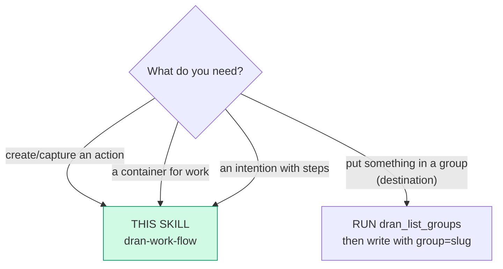
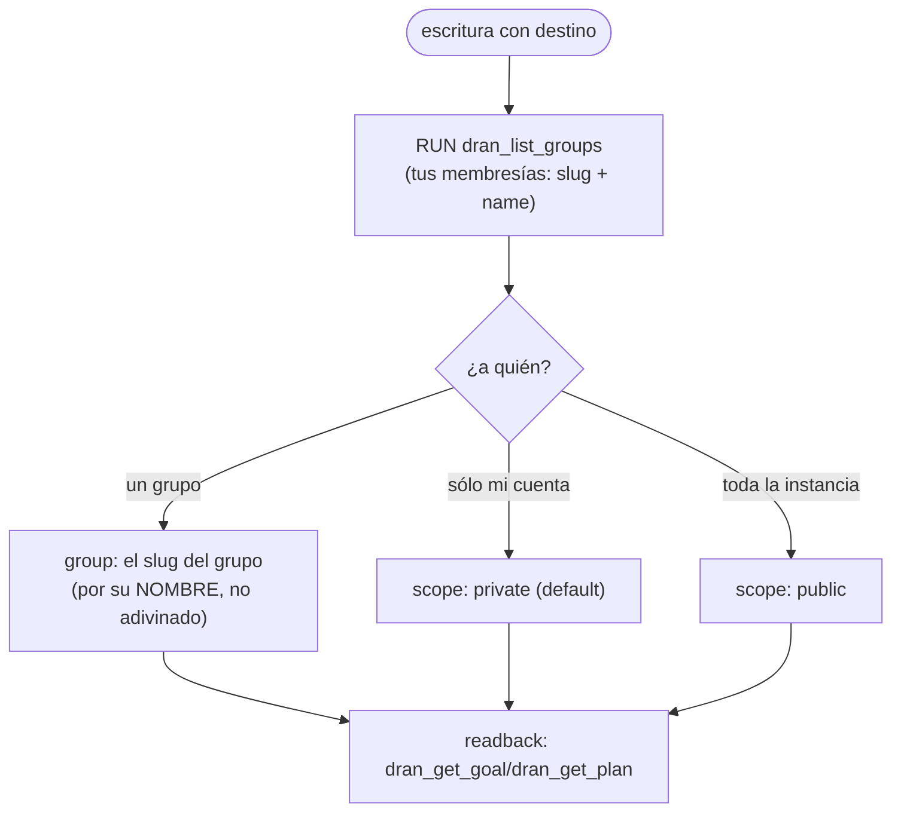

# dran-work-flow — Goals, tasks, plans and their checklist

The **work** surface: the container (`goal`), the action (`task`), the intention
with steps (`plan`). Everything is a thin client over the REST
(`/api/goals`, `/api/tasks`, `/api/plans`, `/api/capture`,
`/api/checklist/toggle`) through the plugin tools — there is no other protocol.

## Entry router

## Parse contract

CONSUMES: an intent over work items (create, capture, edit, move, check off,
delete) + the profile's `DRAN_API_KEY`. PRODUCES: confirmed state via readback
(the item appears/lands where it was sent in the `list`/`get` tool). **Never**
invent an id or a destination, and never assume a write landed.

## The four doors (one per kind of change)

| Change | Tool | Why this one |
|---|---|---|
| Content of a **goal** or a **task**: título, cuerpo, prioridad, horizonte/fechas, asignado, pasos, recurrencia, archivado, `completed_at` | `dran_update_goal` · `dran_update_task` | Es la puerta del contenido (`status` NO está acá) |
| **Estado / posición / goal de una task** | `dran_move_task` | Única puerta de la columna: mantiene las posiciones de ambas y exige `lock_version` (409 si perdió la carrera) |
| Pasos de un plan | `dran_set_plan_checklist` (reemplaza el array) o `dran_toggle_checklist` (UN ítem, por `index` o `text`) | `dran_update_plan` **nunca** toca el checklist |
| Alta | `dran_create_goal` · `dran_create_task` · `dran_create_plan` (`checklist` nace con el plan) · `dran_capture` | `capture` = captura rápida, sin goal, a la bandeja |
| Lectura | `dran_list_goals` · `dran_get_goal` · `dran_list_tasks` · `dran_get_task` · `dran_list_plans` · `dran_get_plan` | El readback: el `ok` de una escritura no es estado |

`dran_create_task` sin `goal` también aterriza en la **bandeja del dueño**. El
goal de una task es su contenedor: **una task no existe sin goal**.

## Destinations (`scope`): privado, público o un grupo por NOMBRE

- El destino se declara **por escritura** y **nunca** como estado del cliente.
- El **alta** de un goal o un plan sin destino toma el default del perfil
  (*Write scope* / *Group slug* del panel). Una **edición** sólo mueve el destino
  si lo declara.
- Un grupo del que el dueño de la credencial no es miembro, o inexistente, es
  **422 y no deja fila**: falla cerrado, nunca `private` en silencio.
- **Las tasks no declaran visibilidad**: la heredan del goal. Por eso mover una
  task a un goal que no podés leer es **404 y no mueve nada** — y por eso
  alcanza con compartir el goal.

## Checklist (el MISMO de los dos contenedores)

Array jsonb ordenado `[{"text": …, "done": …}]`. Tachar un ítem reescribe el
array: **no crea ni mueve tasks**. El `lock_version` protege el RMW — una mano
lenta recibe 409, nunca pisa a la rápida (releé y reintentá con el lock nuevo).
El `progress` de un plan es **derivado** del checklist (`done`/`total`), no un
campo que se escribe.

## Pitfalls

- **Cambiar el estado con `dran_update_task`**: el `status` no está en la
  whitelist de escritura de la task, así que se **ignora en silencio** (200 y
  nada cambió). Es `dran_move_task`.
- **Mandar el checklist de un plan a `dran_update_plan`**: mismo silencio; tiene
  su propia puerta.
- **Adivinar el slug del grupo**: `dran_list_groups` existe para eso; un slug
  inventado es 422.
- **Dar una escritura por hecha sin readback**: el `ok` de la tool es
  transporte, no estado. Confirmá con `dran_get_task` / `dran_get_goal` /
  `dran_list_plans`.
- **Borrar sin preguntar**: `dran_delete_goal` se lleva sus tasks (FK
  `delete_all`) y `dran_delete_task`/`dran_delete_plan` borran aristas del
  grafo. Irreversible: **ASK** antes.

## Cross-references

- Plugin-side surface (schemas + dispatch): `hermes_plugin/dran/__init__.py`
- Routes y la puerta de escritura: `lib/dran_web/router.ex`
- Endpoint reference: `docs/api.md` (§ Goals, tasks and plans)
- Quién lee qué: `Dran.ContentVisibility` (own ∪ public ∪ shared con tus grupos)