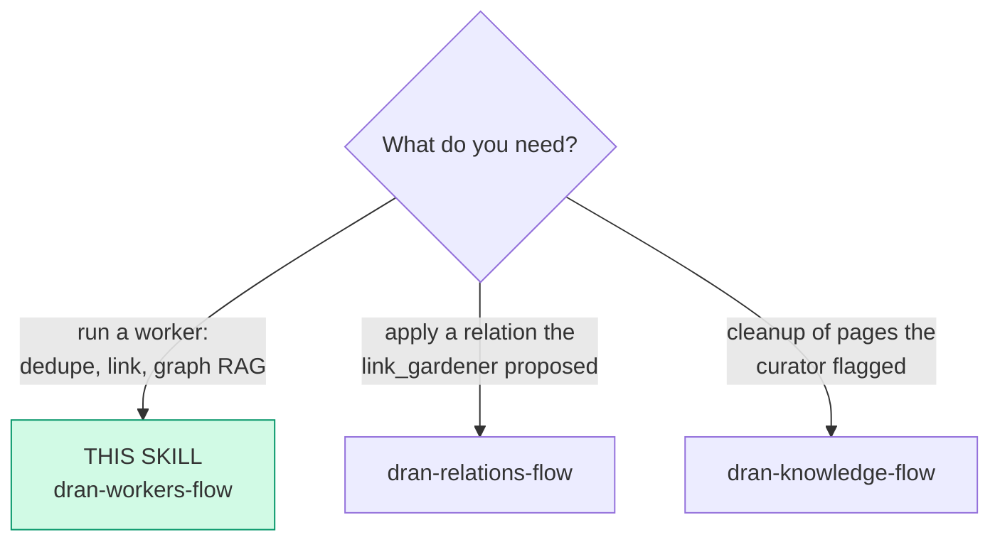
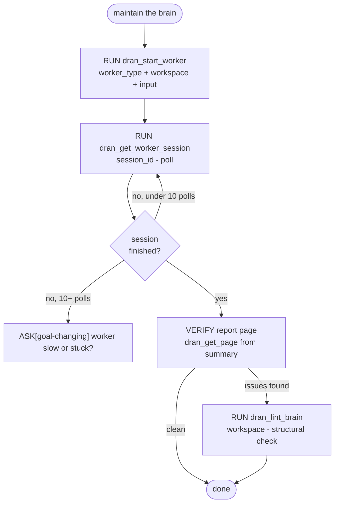

# dran-workers-flow — Fire and poll the autonomous workers

Workers are **scheduled crons with manual triggers, not general agents**:
`curator` (duplicates/conflicts → report), `link_gardener` (relation
proposals for orphans), `graph_rag` (GraphRAG answers). This flow owns
start → poll → verify the report/answer.

## Entry router

## Parse contract

CONSUMES: a maintenance or graph question mapped to a worker type +
workspace + input. PRODUCES: a finished worker session whose report page or
answer is read back and surfaced. **A fire-and-forget without poll is an
unverified run.**

## Operational flow

## Notes on the calls

- `worker_type` enum: `curator` | `link_gardener` | `graph_rag`. Start
  returns `session_id` + `track_url` **immediately** — execution is async
  server-side.
- Poll `dran_get_worker_session(session_id)` with patience (steps stream
  in); the session summary references the created `report` page — read it
  with `dran_get_page`.
- `graph_rag` answers cite pages; quote slugs when surfacing results.
- Nightly jobs (PageRank, communities, maintenance, page summaries) run on
  Quantum server-side from Admin → Jobs (`/admin/jobs`, owner-only);
  manual "run now" is the UI's job, not an agent's.
- The tools come from the Dran Hermes plugin (`dran_*`); MCP is retired.
  `POST /api/workers` starts a session (write access required — a worker
  writes pages) and `GET /api/workers/:id` polls it.

## Pitfalls

- **Treating workers as agents you can steer** — they are fixed ReAct
  crons; if their policy is wrong, that is a code change in
  `lib/dran/worker/`, not a prompt.
- **Re-firing while a session runs** — check pending sessions first;
  double curator runs fight over the same duplicates.
- **Applying link_gardener proposals blindly** — they are PROPOSALS:
  review each with dran-relations-flow (choose the real type, not always
  `related`).

## Checklist

- [ ] Worker type chosen against the actual question
- [ ] Polled to terminal state (or escalated past 10 polls)
- [ ] Report/answer read back and surfaced with slugs
- [ ] Proposals → verified before any relation is created
