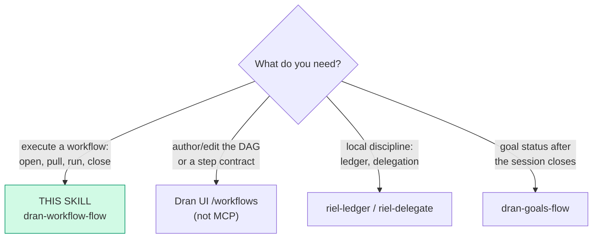
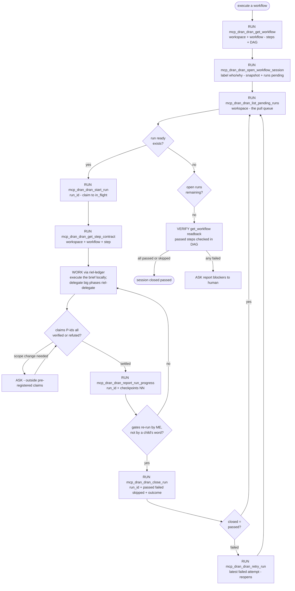

# dran-workflow-flow — Execute the workflow loop (Riel over MCP)

The riel execution cycle over Dran: **Dran declares what to verify** (the
step contract: intent, pre-registered claims, gates), **the agent executes
with its local ledger** (riel-ledger) and reports back. Runs are the only
riel ledger in Dran — memory and goal checklists are NOT part of this loop.

## Entry router



## Parse contract

CONSUMES: a workflow slug in a workspace, a write-capable key. PRODUCES:
a session whose runs carry ✓NN progress and passed/failed outcomes; passed
steps render **checked in the DAG**. **A run closed without re-running its
gates is a false checkpoint.**

## Context section of the brief (what it gives you, what to do with it)

`dran_get_step_contract` renders `## Context` with each entry RESOLVED —
you don't get bare uuids:

```
- page **Spec de contratos** (74ffd947…) — spec de referencia > Una línea de resumen · fetch: MCP dran_get_page (workspace: personal, id: 74ffd947…)
- memory **Decisión previa: los steps llevan contrato puro** (b6437467…) — decisión previa > … · fetch: GET /api/memory?workspace=personal then filter id b6437467…
- page uuid-fantasma (unresolved — not found in workspace)
```

Each line = title + why + summary + the EXACT command to fetch the full
content. How to work it:

- The **summary is the triage layer**: read the one-liners first and decide
  per entry whether it matters for THIS step. Fetching everything is waste.
- **Fetch on demand** with the given command — `dran_get_page` (pages) or
  `GET /api/memory` (memories). The id is the exact handle.
- **`unresolved` entries** are stale (page/memory deleted after the
  contract was written): note it in the run outcome, don't chase the id.
- The brief's DO NOT stands: do not invent context outside the snapshot —
  fetching MORE from the graph is fine, fabricating context is not.

## Operational flow



## Rules of the loop

- **Claim before working.** `start_run` transitions to `in_flight`; a run
  already claimed by another executor is rejected — pull the NEXT ready
  run, do not steal.
- **Readiness is ALL prereqs**: every `depends_on` step must have its
  latest attempt `passed` **in the same session**. A failed prereq blocks
  its whole downstream until retried.
- **The brief is the contract, not a suggestion.** `get_step_contract`
  returns the contract map AND the rendered riel-brief (9 sections, opens
  with "We need <intent>"). Claims P-ids are pre-registered: a failed
  claim is refuted, never reinterpreted; a needed scope change goes to
  ASK.
- **`close_run passed` only after re-running each gate command yourself**
  (exit code checked, unpiped). A ✓NN without coverage is a mood.
- **Subagents never touch run ids.** The parent is the only claimant:
  children execute and return `output_schema` JSON; the parent translates
  verdicts into `report_run_progress` / `close_run`.
- **Checkpoints ride in `progress`** as a map merged onto the run
  (`{"01": "✓ gate passed: mix test, covering sign+verify"}`); final ones
  may also go on `close_run`'s `checkpoints`.
- Closing the last open run auto-closes the session (passed when every
  step's latest attempt is passed/skipped). `retry_run` on the latest
  failed attempt creates attempt+1 pending and **reopens** a session that
  closed as failed.

## REST mirror (same semantics)

`POST /api/workflows/:workflow_id/sessions` · `POST
/api/workflow-runs/:id/{start,close,retry}` · `PUT
/api/workflow-runs/:id/progress` · `GET /api/workflow-sessions/:id` ·
`GET /api/pending-workflow-runs?workspace=`.

## Pitfalls

- **Closing `passed` on a child's report** — self-reports are not
  evidence; re-run the gates.
- **Treating `skipped` as failure** — skipped closes a step without
  blocking readiness downstream.
- **Editing steps/contracts over the pull** — the session runs against the
  frozen snapshot; edits affect the NEXT session, never the current one.
- **Claiming from two sessions on one key** — one actor: serialize claims
  or use one key per agent.
- **Routing execution state to goal checklists or memory** — neither is
  riel; the run ledger is the writeback.

## Checklist

- [ ] Session opened with a label; snapshot runs created
- [ ] Every claim executed after a successful start_run
- [ ] ✓NN reported as gates passed (not batched to the end)
- [ ] Gates re-run by the parent before close passed
- [ ] Failed attempts retried, blockers escalated with ASK
- [ ] Final readback: session/run states and DAG checked
