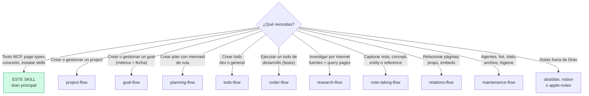
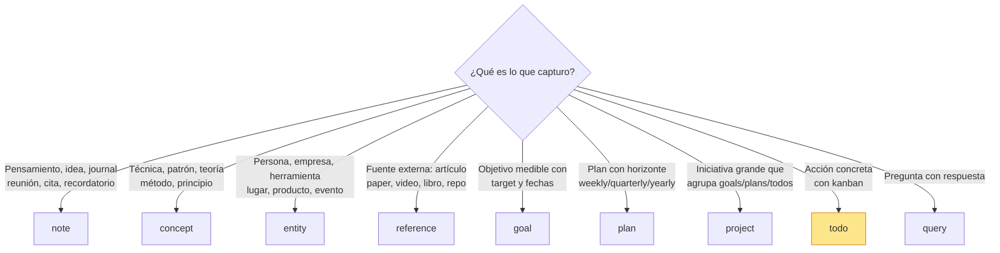
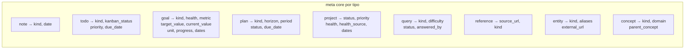
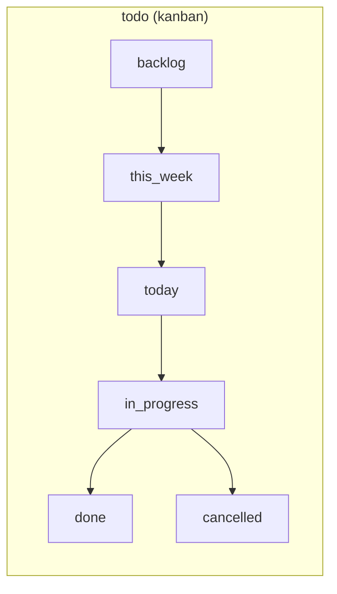
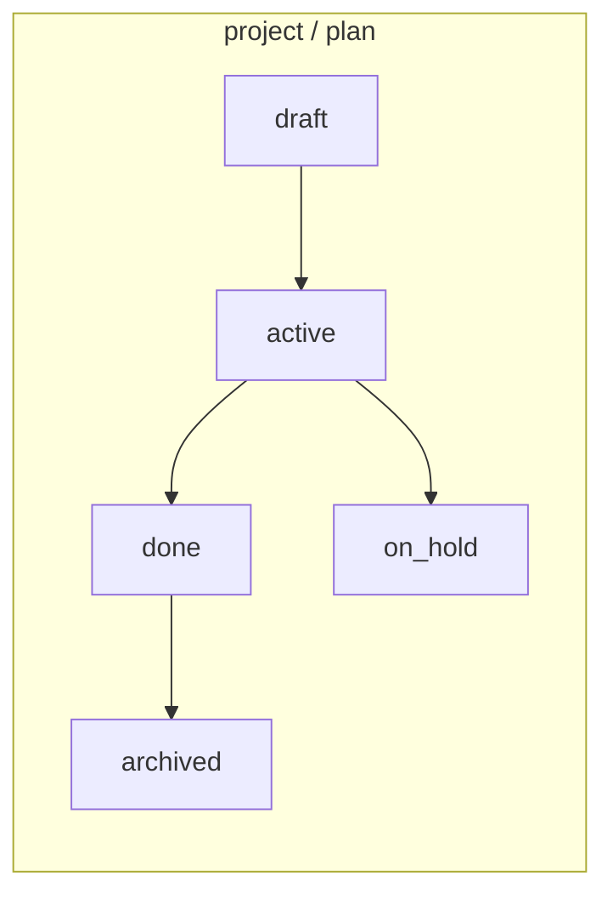
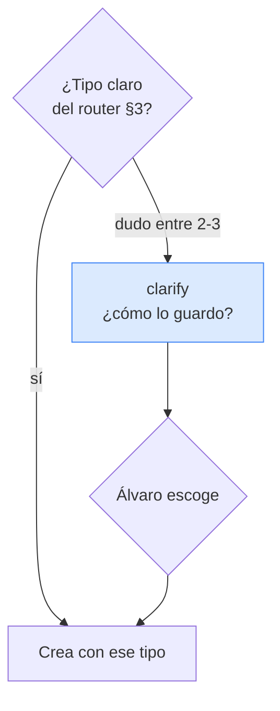
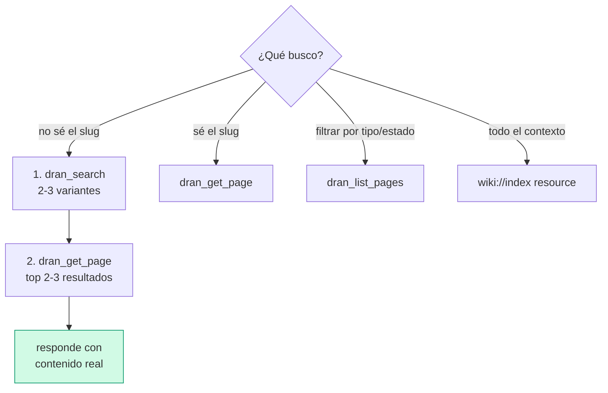

# dran — MCP reference + suite router

Este es el skill **principal** de la suite Dran. Carga aquí primero: te dice si
necesitas un flow específico, y te da la referencia MCP completa (tools, page
types, meta fields, conexión).

## Entry router

¿Estás en el skill correcto? Sigue este diagrama:



Ejecuta SOLO la sección a la que llegaste. Si el diagrama te manda a otro
skill, **paras aquí** y haces hand-off — no absorbes ese trabajo.

## Los 9 flows de la suite

| Flow | Cuándo cargarlo |
| --- | --- |
| `project-flow` | Crear, actualizar o revisar un project (visión, alcance, health) |
| `goal-flow` | Goals con métrica + fecha; progress auto/manual |
| `planning-flow` | Plans tácticos con mermaid de ruta, todos y gotchas |
| `todo-flow` | Crear todos (dev o generales): templates, kanban, assignee |
| `coder-flow` | Ejecutar un todo de desarrollo: fases, subagentes, gates |
| `research-flow` | Investigar por internet: web, fuentes, query pages |
| `note-taking-flow` | Captura de notes, concepts, entities, references |
| `relations-flow` | Relaciones tipadas, props materializadas, embeds |
| `maintenance-flow` | Agentes autónomos, lint, stats, archive, higiene |

## Instalación y configuración de la suite

Los 10 skills viven en el repo Dran bajo `skills/`:

```
skills/
  dran/               ← este skill (principal) + references/ + scripts/
  project-flow/
  goal-flow/
  planning-flow/
  todo-flow/
  coder-flow/
  research-flow/
  note-taking-flow/
  relations-flow/
  maintenance-flow/
```

### Instalar en Hermes

```bash
DRAN_REPO=/path/to/dran   # repo clonado
mkdir -p ~/.hermes/skills/dran
cp -R "$DRAN_REPO/skills/"* ~/.hermes/skills/dran/
```

Quedan como categoría `dran` en Hermes. Para actualizar tras un `git pull`,
repite el `cp -R`. Si prefieres vivir al filo del repo, usa symlinks:

```bash
for s in "$DRAN_REPO/skills/"*/; do
  ln -sfn "$s" ~/.hermes/skills/dran/$(basename "$s")
done
```

### Configurar el MCP server

En `~/.hermes/config.yaml`:

```yaml
mcp_servers:
  dran:
    enabled: true
    url: http://<host>/api/mcp
    headers:
      Authorization: Bearer <token>
```

- **Endpoint** — `POST http://<host>/api/mcp`, MCP spec **2025-03-26**,
  Streamable HTTP.
- **Token** — legacy admin (`DRAN_API_TOKEN`), per-user, o context API key
  (Settings → API Keys en la web de Dran; plaintext se muestra una sola vez).
- **Verificación** — las 18 tools `mcp__dran__*` deben aparecer cargadas en el
  agente; si no, revisa token (401) y contexto (403).

## 1. What is Dran

Dran is a **personal second-brain / knowledge-graph server**. Every piece of
knowledge is a typed **page** connected by typed **relations**, all operated
through a single MCP endpoint.

- **Pages** are the atoms. Each has a `page_type`, a markdown `body`, and a
  JSONB `meta` whose valid fields depend on the type.
- **Relations** are directed links. `semantic` relations are created
  automatically by the augmenter after every create/update; the rest
  (`related`, `part_of`, `supersedes`, `contradicts`, `embeds`,
  `works_in`, `has_tier`, `based_in`, `written_in`, `built_with`) are explicit
  or materialized from `meta.props` (ver `relations-flow`).
- **Search** fuses FTS + semantic via reciprocal-rank fusion with a PageRank
  authority boost — well-linked pages rank higher.
- **Contexts** partition the brain (e.g. `personal`, `work`). Pages, relations
  and search are always scoped to one context.

## 2. Connection

| Item | Value |
| --- | --- |
| Transport | Streamable HTTP, MCP spec **2025-03-26** |
| Endpoint | `POST http://<host>/api/mcp` |
| Auth | `Authorization: Bearer <token>` — legacy admin, per-user, or context API key |
| Default context | **`personal`** — do not ask, do not switch unless Álvaro says so |

Auth accepts three token kinds, checked in order:

1. **Legacy admin** — the `DRAN_API_TOKEN` env token: access to all contexts.
2. **Per-user token** — one `api_token` per user, covering their assigned
   contexts.
3. **Context API key** — scoped to a single context (managed in Settings →
   API Keys; plaintext shown once at creation, revocable, restorable,
   regenerable).

Requests return `401` for invalid/revoked tokens and `403` for contexts the
token isn't allowed to touch.

## 3. Page types (10)

Cada página tiene UN `page_type`. Este decide qué `meta` acepta y cómo la
trata la búsqueda / kanban / grafo.



| Type | Use it for | Subtypes (`meta.kind`) |
| --- | --- | --- |
| `note` | Thoughts, journal, ideas, meetings, questions, quotes, reminders | thought, journal, idea, meeting, question, quote, reminder, fleeting, permanent, moc, comparison, code, snippet, recipe, debug, checklist, outline, summary, decision, draft, template, log, brainstorm |
| `concept` | Techniques, patterns, disciplines, theories | technique, pattern, discipline, theory, principle, framework, method, model, law, heuristic, strategy, convention |
| `entity` | People, companies, products, tools, places, events | person, company, product, tool, place, event, language, framework, service, hardware, protocol, course, community, asset, brand |
| `reference` | External sources | article, paper, video, podcast, book, document, code, design, deliverable, file, tweet, docs, course, newsletter, forum, spec, release, website, repo, api, guide, interview, talk |
| `project` | Larger initiatives grouping goals/plans/todos | — |
| `goal` | Objectives with a measurable target | personal, coding, business, learning, health, finance, other, investing, marketing, product, writing, career, relationship, travel |
| `plan` | Time-horizoned plans (weekly/monthly/quarterly/yearly) | personal, coding, business, learning, health, finance, other, investing, marketing, product, writing, career, relationship, travel |
| `todo` | Actionable items with kanban status | personal, coding, business, learning, health, finance, other, investing, marketing, product, writing, career, relationship, travel |
| `query` | Questions with answers | factual, conceptual, how_to, opinion, exploration, report, status, decision, comparison |
| `report` | System-created run logs — **no se crea por MCP**, lo escribe `Dran.Jobs` | log |

`report` es second-citizen: vive fuera del grafo, el journey, embeddings y
`mcp_create`; aparece en el activity log y tiene vista en `/reports/<slug>`.
No lo uses para capturar conocimiento — es salida de sistema (ver §4 Jobs).

Default to `note` with `meta.kind: "thought"` when unsure — promote later.
La creación de cada tipo vive en su flow (`note-taking-flow`, `goal-flow`,
`planning-flow`, `project-flow`, `todo-flow`).

Notes with `meta.kind: "code"` may carry `meta.language` (e.g. `elixir`,
`python`) to filter by programming language.

### Meta fields por tipo (los que de verdad acepta cada uno)

Fuente: `dran_create_page` en `lib/dran/mcp.ex`. Campos clave:



- **goal**: `health` (green/yellow/red), `metric` + `target_value` +
  `current_value` + `unit` para medir, `progress`, `start_date`, `target_date`.
- **plan**: `horizon` (weekly/monthly/quarterly/yearly), `period` (ej
  `2026-Q3`), `status` (draft/active/done/archived), `due_date`.
- **project**: `status` (draft/active/on_hold/done/archived), `priority`,
  `health`, `health_source` (manual/derived), fechas.
- **todo**: `kanban_status` (backlog/this_week/today/in_progress/done/
  cancelled), `priority` (low/medium/high/urgent), `due_date`.
- **query**: la pregunta + respuesta; `status` es **`answer_status` a nivel de
  negocio** (open/answered/verified), `difficulty`, `answered_by`.

### Custom properties — `meta.props`

Every page may carry `meta.props`: a namespaced, free-form key-value bag for
metadata that doesn't fit the typed fields (e.g.
`props: {"role": "sales", "tier": "vip"}`). Props survive round-trips and are
covered by the meta GIN index.

**Props the graph can see (materialized into typed relations)** — these keys
auto-create edges during augmentation (Dran.PropsMaterializer):

| Prop key | Relation | Target page | Example |
|---|---|---|---|
| `role` | `works_in` | entity | `role: "sales"` → person works_in Sales |
| `tier` | `has_tier` | concept | `tier: "vip"` → person has_tier VIP |
| `location` | `based_in` | entity | `location: "cdmx"` |
| `language` | `written_in` | entity | `language: "elixir"` |
| `framework` | `built_with` | entity | `framework: "phoenix"` |

Any other key is stored but generates no edge. Edge weight 0.7, joins
community detection. Materialization runs on create/update (augmenter) and
is inference-independent — works even with the LLM off.

**Backfill**: Settings → Brain → "Run backfill" re-materializes props for
every existing page with non-empty `meta.props` (Dran.PropsBackfill).

**Buscar por props (AND)** — `dran_search` y `dran_list_pages` aceptan
`props: { key: value }` y exigen TODOS los pares:
`dran_search({ query, props: { role: "sales" } })` /
`dran_list_pages({ type: "entity", props: { tier: "vip" } })`. Límites: máx
10 props por página, solo strings como valores.

El uso operativo de props y relaciones vive en `relations-flow`.

### Per-context page type disabling

Each context can **disable page types** (`disabled_page_types`). A disabled
type is hidden in the web UI and **rejected by the MCP API**: creating or
listing it returns an error (`page type 'X' is disabled in context 'Y'`).
Before creating a page of an unusual type in an unfamiliar context, expect the
possibility that it's disabled.

### Link model — independent slugs

Any page may carry any combination of `meta.project_slug`, `meta.goal_slug`
and `meta.plan_slug` — **0, 1, 2, or all 3**. Each one materializes its own
`part_of` relation automatically. No precedence, no derivation. Orphans (no
links) are legitimate GTD-style inbox items. In `dran_list_pages`, the value
`"none"` filters pages without that link.

## 4. Tools (18)

Grouped by workflow: capture → read/find → organize → maintain → automate.

### Capture

| Tool | Purpose |
| --- | --- |
| `dran_create_page` | Create any page type **except todos** |
| `dran_create_todo` | Create a todo with kanban status, priority, due date, and independent project/goal/plan links |

### Read & find

| Tool | Purpose |
| --- | --- |
| `dran_search` | **Use FIRST** — unified FTS/fuzzy/semantic/hybrid search, PageRank-boosted. Supports `limit`, `offset`, `type` filter |
| `dran_get_page` | Full markdown body of one page — always read before answering |
| `dran_list_pages` | Filtered list (type, tag, status, owner, assignee, project/goal/plan slug, `"none"` for orphans) |
| `dran_get_links` | Inbound + outbound relations for a page |

### Organize

| Tool | Purpose |
| --- | --- |
| `dran_update_page` | Update title/body/tags/meta — **replaces `meta` entirely**. ⚠️ When updating a page with mermaid diagrams, pass only `body` (no `meta`) or TipTap re-parses and strips the mermaid blocks |
| `dran_update_todo` | Update todo status/priority/date/links — **merges `meta`** (the only safe way to change todo status) |
| `dran_rename_slug` | Rename a slug; rewrites all `![[old-slug]]` embeds in the context |
| `dran_create_relation` | Explicit typed relation: `related`, `part_of`, `supersedes`, `contradicts`, `embeds`, plus prop-materialized types `works_in`, `has_tier`, `based_in`, `written_in`, `built_with`. **Never `semantic`** (automatic) |
| `dran_delete_relation` | Delete relations between two pages |
| `dran_delete_page` | Delete a page — **irreversible**, confirm with Álvaro first |

### Maintain

| Tool | Purpose |
| --- | --- |
| `dran_get_stats` | Totals, pages by type, todos by status, orphans, relations |
| `dran_lint_brain` | Orphans, stale pages (>90d), contested knowledge. Surface results — don't auto-fix |
| `dran_reaugment_page` | Re-run augmentation (summary/tags/embedding/relations) for a page |
| `dran_generate_community_summaries` | Generate LLM summaries for all detected graph communities |

### Automate

| Tool | Purpose |
| --- | --- |
| `dran_start_agent` | Launch an autonomous agent (`curator`, `link_gardener`, `graph_rag`) — operación completa en `maintenance-flow` |
| `dran_get_agent_session` | Poll an agent session for status, steps, summary |

### Jobs programados (Dran.Jobs)

Los 5 crons de Quantum (`curator_daily`, `pagerank_nightly`,
`community_summaries_nightly`, `graph_maintenance_nightly`,
`link_gardener_weekly`) pasan por `Dran.Jobs.run_scheduled/1` y se controlan
desde **Settings → Brain → "Jobs programados"**: toggle por job (afecta SOLO
las corridas programadas), "Correr ahora" (siempre ejecuta, ignora el toggle)
y último run con link al reporte. Cada corrida escribe una página `report`
(kind `log`) en `/reports/<slug>` con status/trigger/duración; se conservan
las 20 más recientes por job y las viejas se archivan. Programáticamente:
`Dran.Jobs.list/0`, `set_enabled/2`, `run_now/1`, `run_scheduled/1`.

## 5. Resources & prompts

Resources (read-only, prefer over looping `dran_list_pages`):
- `page://{context}/{slug}` — full page markdown
- `goal://{context}/{slug}` — goal + linked todos/plans as JSON
- `wiki://{context}/index` — full context index in one call

Prompts: `brainstorm` (generate interlinked idea pages), `goal_review`
(review a goal with its todos/plans).

## 6. Working rules (transversales)

Estas reglas aplican en TODOS los flows:

1. **Default context `personal`.** Don't ask, don't switch.
2. **Search before create.** 2-3 `dran_search` variants before every create.
   If it exists, update it.
3. **Read before answer.** Never answer from search excerpts — `dran_get_page`
   the top 2-3 results first.
4. **Edit > duplicate.** Updating beats creating a near-copy.
5. **Right `page_type` + `meta.kind`.** Action item → `todo` via
   `dran_create_todo`. External source → `reference`. Named thing in the world
   → `entity`. Abstract knowledge/technique → `concept`. Loose thought → `note`.
6. **Ownership defaults:** `owner: "alvaro"`, `created_by: "chaos manager"`
   on everything you create. For todos, ALWAYS `clarify` the `assignee`
   (`alvaro` / `chaos manager` / other — specify) before creating.
7. **Ask when risky, infer when obvious.** Ask before deleting, renaming, or
   when goal/plan/project required fields (metric, horizon, priority) aren't
   inferable.
8. **Never create `semantic` relations manually.** They're automatic.
9. **Link liberally.** `part_of`/`related`/`embeds` boost PageRank → better
   search recall.
10. **Archive over delete.** Pages have an `archived` flag (set via
    `dran_update_page` with `archived: true`) — hidden from lists/search but
    recoverable. Delete only true junk, after confirmation.
11. **Todos without links are fine.** They land in the global kanban inbox —
    don't force links.
12. **`[[slug]]` wikilinks don't exist.** Use `![[slug]]` for embeds,
    `dran_create_relation` for typed links.

## 7. Status workflows





- **todo** — create in `backlog`, move to `in_progress` immediately with
  `dran_update_todo`, `done` only after verifying + committing. One
  `in_progress` at a time.
- **project** — create `draft`; auto-`active` when linked to a plan/todo/goal;
  `done`/`on_hold`/`archived` manual.
- **plan** — create `draft`; auto-`active` when a task executes; auto-`done`
  when ALL linked todos are done/cancelled; `archived` manual.
- **goal** — fully manual (`health`, `progress` only when Álvaro asks).
- **goal.progress** — auto-calculated from linked todos unless
  `progress_manual: true`.
- **project.health** — derived from linked goals unless
  `health_source: "manual"`.

## 8. Recipes transversales

Recetas de USO que no pertenecen a un flow específico. Las recetas de
creación por tipo viven en su flow correspondiente.

### 8.1 Escoger el page_type cuando el agente duda

Si tras el router de §3 todavía no queda claro el tipo, **pregunta con
`clarify`** ofreciendo 2-3 candidatos reales — no adivines.



```
# Ejemplo: "guarda lo de la reunión con el proveedor"
clarify(
  question: "¿Cómo lo registro?",
  choices: [
    "note (kind: meeting) — solo el resumen de la reunión",
    "entity (kind: company) — la empresa como entidad reutilizable",
    "reference — si hay un documento/contrato externo"
  ]
)
```

Regla: clarify SOLO cuando el tipo cambia lo que capturas (nota vs entidad vs
referencia). Si es obvio (un pendiente → todo), no preguntes.

### 8.2 Leer y buscar info



Reglas:
- **Nunca respondas desde el excerpt del search** — `dran_get_page` primero.
- `dran_search` acepta `type` para acotar (ej `type: "todo"`).
- `dran_list_pages` con `status` filtra todos por kanban; `"none"` = huérfanos.
- `dran_search` / `dran_list_pages` con `props: { key: value }` filtran por
  custom properties (AND — todos los pares deben coincidir).
- Para overview completo, lee el resource `wiki://{context}/index` (una
  llamada).

## 9. Common mistakes

- **Creating without searching** — always search 2-3 variants first.
- **`dran_create_page` for todos** — use `dran_create_todo`.
- **`dran_update_page` for todo status** — use `dran_update_todo` (merges meta).
- **`meta` + `body` together on pages with mermaid** — strips the diagrams;
  pass only `body`.
- **Manually creating `semantic` relations** — automatic only.
- **Assuming link precedence** — project/goal/plan slugs are independent.
- **Passing `status` for `query` pages** — the field is `answer_status`.
- **Forgetting `progress_manual: true`** on goals not measured by todos.
- **Deleting without confirmation** — irreversible; prefer archive.
- **Answering from search excerpts** — read the page first.
- **Not clarifying the type when it changes what you capture** — a meeting
  note, a company entity and a contract reference are 3 different pages; ask.
- **Absorbing a flow's job** — si el pedido es de un flow (crear un goal,
  ejecutar un todo de código, relacionar páginas), carga ese flow y haz
  hand-off; no lo improvises desde aquí.

## References (desarrollo interno del MCP)

En `references/` — cargar solo al trabajar el servidor MCP o auditar este
skill:

- `mcp-gotchas.md` — quirks de las tools (filtros, respuestas markdown vs JSON)
- `testing-mcp-tools.md` — cómo probar tools MCP end-to-end
- `mcp-tool-wrapping-agent.md` — envolver tools con un agente
- `mcp-description-tuning.md` — afinar descriptions de tools
- `adding-dran-agents.md` — agregar agentes autónomos nuevos
- `dran-internals-audit.md` — auditoría de internals
- `auditing-this-skill.md` — cómo auditar esta suite
- `updating-readme.md` — mantener README/docs sincronizados

En `scripts/`: `mcp_smoke.sh` — smoke test de las 18 tools contra un server
vivo.
