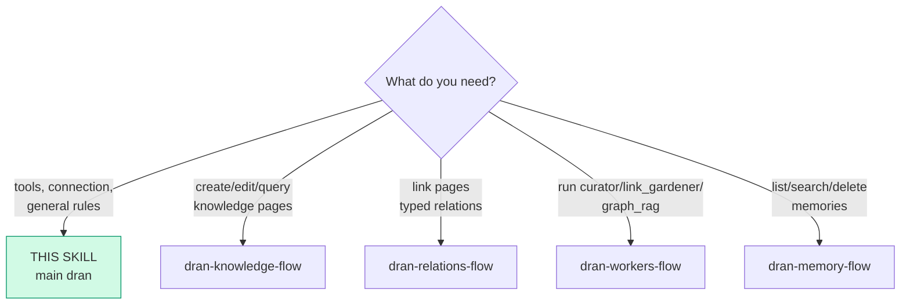
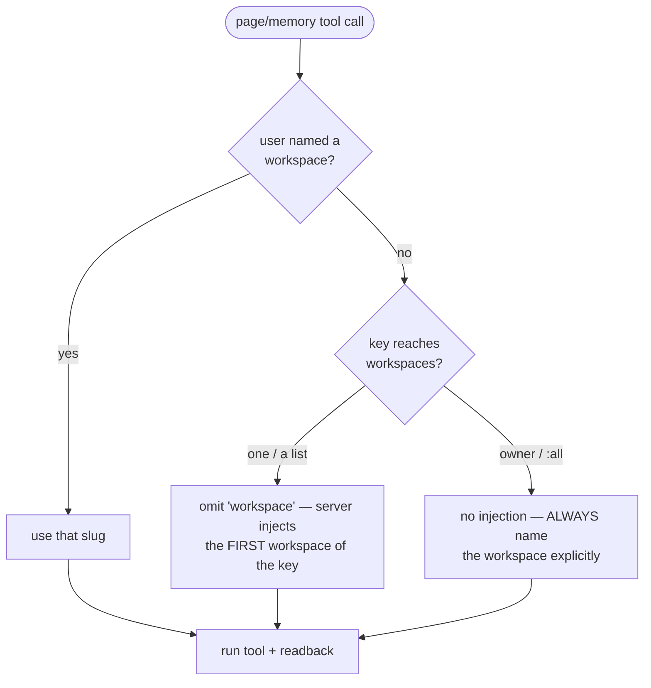
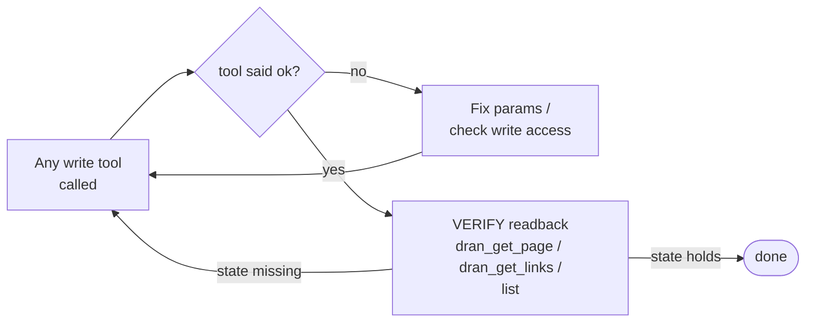

# dran — plugin tools reference + suite router

Main skill of the Dran suite. Load it first: it routes to the per-action
flows and holds what every flow shares — connection, auth, the readback
rule. Dran is the second brain: knowledge (pages) and memory. The agent's
local execution discipline (ledger, briefs, delegation) is riel — this
suite owns only the Dran call sequences.

The agent consumes Dran through the **Hermes plugin tools** (`dran_*`); the
The plugin registers its toolset via `register(ctx)` in
`hermes_plugin/dran/__init__.py`, so the tools are available whenever the
`dran` plugin is enabled for the profile. Every tool is a thin client over
Dran's REST API — there is no other protocol surface.

## Entry router

Run ONLY the flow you landed on. If the diagram sends you to another skill,
**stop here** and hand off — don't absorb that work.

### Changing Dran itself

The flows above are for USING Dran. To CHANGE its code, load the matching
`dran-dev-*` skill (they ship in `skills/dev/` of this repo, versioned with it):

| Skill | For |
| --- | --- |
| `dran-dev-actor-model` | identity/ownership: actors, keys, attribution |
| `dran-dev-auth-surface` | REST authorization layers + audit method |
| `dran-dev-page-types` | adding/changing page types or kinds |
| `dran-dev-settings-config` | settings-backed config and admin forms |
| `dran-dev-slug-management` | slug creation/update policy |
| `dran-dev-ui-tweaks` | Web UI edits from inspector snippets |
| `dran-dev-inference-providers` | embeddings/chat provider config |

These are developer skills, not agent flows: they assume you are editing this
repo, not operating a Dran instance.

## Connection (once per Hermes profile)

- The plugin is enabled per profile: `plugins.enabled` in the profile's
  `config.yaml` must list `dran`, and the plugin directory is symlinked into
  `~/.hermes/profiles/<perfil>/plugins/dran`.
- The secret lives ONCE in the profile's `.env` (`DRAN_API_KEY`); the memory
  provider and the tools resolve the same var — one key, one actor.
- Config comes from `$HERMES_HOME/dran/config.json` (base URL + workspace),
  the same file the memory panel writes.
- **One key = one actor.** Attribution (`owner_user_id`/`created_by`) is
  derived server-side from the key — never client-settable. Each write also
  carries `X-Hermes-Agent` (the active profile) which the server persists as
  `agent_name`.
- **Write gate**: keys with `read` access get `403` on every write tool.
- **Memory tools** (`dran_memory_*`) come from the memory provider; the
  knowledge tools (`dran_search`, `dran_create_page`, …) come from the same
  plugin's toolset.

## Workspace selection (every call is workspace-scoped)

- The instance default workspace (`Dran.Auth.default_workspace_slug/0`,
  Settings → /admin/system, fallback `personal`) is what web/seeds use —
  NOT necessarily what your key reaches.
- One key = one actor with its own workspace matrix (Dran → Settings →
  Agents). Owner keys and `:all` keys get no injection — always name the
  workspace explicitly with those.
- The memory provider's workspace is configured in the panel and validated
  against the key's matrix on connect; do not assume it equals the workspace
  you use for pages.
- Discover valid slugs with `dran_list_pages` (empty query) or `dran_search`;
  a failing call answers `context 'x' not found`.

## General rules (every flow obeys them)

- **A write is not done until a readback confirms the state.** The tool's
  `ok` is transport-level, not state-level.
- Slugs are canonical identifiers; a slug not found is an error, never a
  silent drop. Derive slugs from titles, lowercase-hyphen.
- Irreversible operations (delete page/memory) require an explicit human
  confirmation first — every flow marks them with ASK.

## The flows of the suite

| Flow | When to load it |
| --- | --- |
| `dran-knowledge-flow` | Create, update, search or delete pages (note, idea, knowledge, technical, entity, concept, reference, food…) |
| `dran-relations-flow` | Link two pages with a typed relation |
| `dran-workers-flow` | Fire and poll curator / link_gardener / graph_rag |
| `dran-memory-flow` | Administer shared agent memories (provider tools + REST) |

## Pitfalls

- **Absorbing a flow you were routed away from** — the router is the
  contract; hand off.
- **Assuming a tool exists because it sounds natural** — the plugin's
  toolset is the truth (`hermes_plugin/dran/__init__.py`); read the
  registered names instead of guessing.
- **Expecting the knowledge tools to cover memory** — memory is
  `dran_memory_*` from the provider; the knowledge toolset has no memory
  operations.

## Cross-references

- Plugin-side surface (tool definitions, schemas): `hermes_plugin/dran/__init__.py`
- Server-side routes and the write gate: `lib/dran_web/router.ex`
- Endpoint reference: `docs/api.md`
- Verb/graph conventions the flow DAGs follow: `riel-contract`
