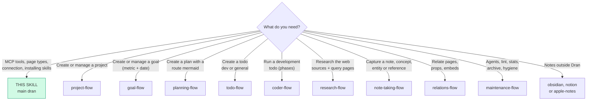
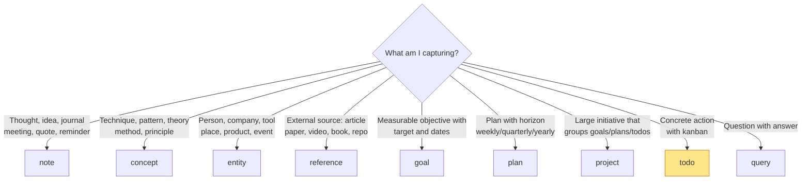
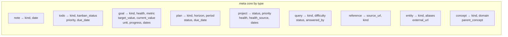
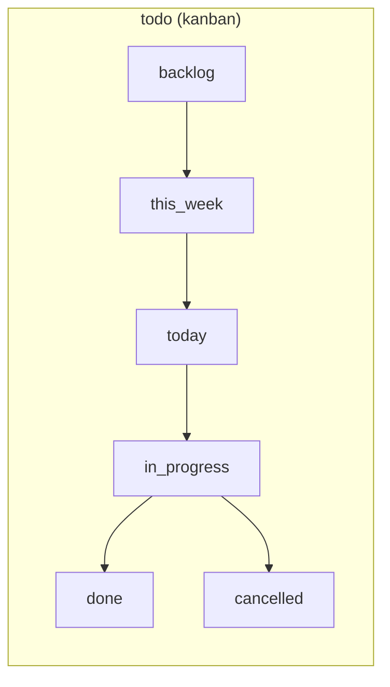
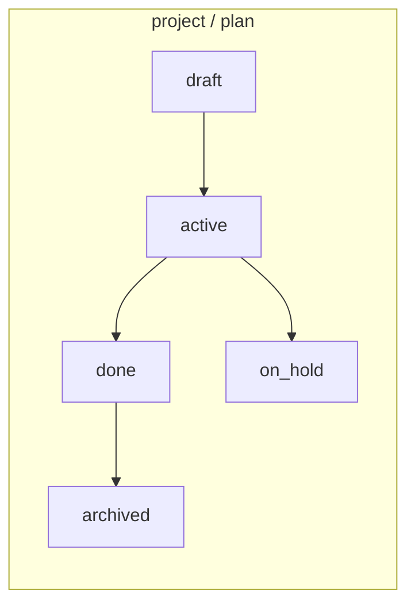
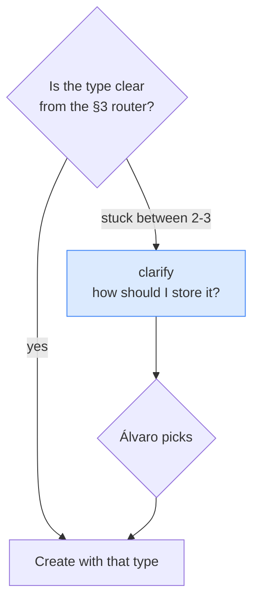
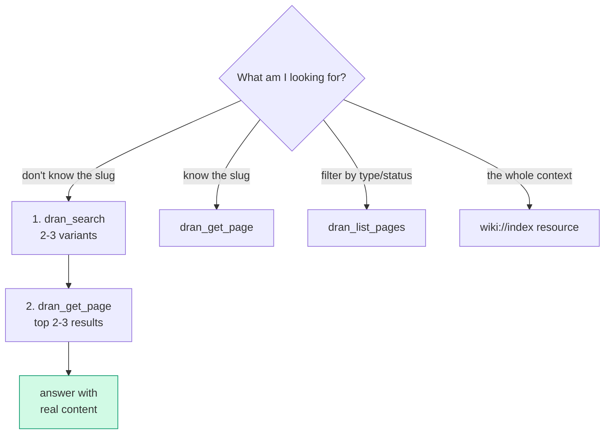

# dran — MCP reference + suite router

This is the **main** skill of the Dran suite. Load it first: it tells you whether
you need a specific flow, and gives you the complete MCP reference (tools, page
types, meta fields, connection).

## Entry router

Are you in the right skill? Follow this diagram:



Run ONLY the section you landed on. If the diagram sends you to another skill,
**stop here** and hand off — don't absorb that work.

## The 9 flows of the suite

| Flow | When to load it |
| --- | --- |
| `project-flow` | Create, update or review a project (vision, scope, health) |
| `goal-flow` | Goals with metric + date; auto/manual progress |
| `planning-flow` | Tactical plans with route mermaid, todos and gotchas |
| `todo-flow` | Create todos (dev or general): templates, kanban, assignee |
| `coder-flow` | Run a development todo: phases, subagents, gates |
| `research-flow` | Research online: web, sources, query pages |
| `note-taking-flow` | Capture notes, concepts, entities, references |
| `relations-flow` | Typed relations, materialized props, embeds |
| `maintenance-flow` | Autonomous agents, lint, stats, archive, hygiene |

## Installing and configuring the suite

The 10 skills live in the Dran repo under `skills/`:

```
skills/
  dran/               ← this skill (main) + references/ + scripts/
  project-flow/
  goal-flow/
  planning-flow/
  todo-flow/
  coder-flow/
  research-flow/
  note-taking-flow/
  relations-flow/
  maintenance-flow/
```

### Install in Hermes

**Recommended — symlinks (bleeding edge):** the installed skills always point
at the repo, so a `git pull` updates them with no extra step. Skills not in
the repo (e.g. `dran-provenance-audit`) stay as copies.

```bash
DRAN_REPO=/path/to/dran   # cloned repo
mkdir -p ~/.hermes/skills/dran
for s in "$DRAN_REPO/skills/"*/; do
  ln -sfn "$s" ~/.hermes/skills/dran/$(basename "$s")
done
```

**Alternative — copies:** if you prefer isolation (repo changes don't affect
the installed skills until you sync), copy instead:

```bash
cp -R "$DRAN_REPO/skills/"* ~/.hermes/skills/dran/
```

To update after a `git pull` with copies, repeat the `cp -R`.

### Configure the MCP server

In `~/.hermes/config.yaml`:

```yaml
mcp_servers:
  dran:
    enabled: true
    url: http://<host>/api/mcp
    headers:
      Authorization: Bearer ***
```

- **Endpoint** — `POST http://<host>/api/mcp`, MCP spec **2025-03-26**,
  Streamable HTTP.
- **Token** — legacy admin (`DRAN_API_TOKEN`), per-user, or context API key
  (Settings → API Keys in the Dran web UI; plaintext is shown only once).
- **Verification** — the 18 `mcp__dran__*` tools must show up as loaded in the
  agent; if not, check token (401) and context (403).

## 1. What is Dran

Dran is a **personal second-brain / knowledge-graph server**. Every piece of
knowledge is a typed **page** connected by typed **relations**, all operated
through a single MCP endpoint.

- **Pages** are the atoms. Each has a `page_type`, a markdown `body`, and a
  JSONB `meta` whose valid fields depend on the type.
- **Relations** are directed links. `semantic` relations are created
  automatically by the augmenter after every create/update; the rest
  (`related`, `part_of`, `supersedes`, `contradicts`, `embeds`,
  `works_in`, `has_tier`, `based_in`, `written_in`, `built_with`) are explicit
  or materialized from `meta.props` (see `relations-flow`).
- **Search** fuses FTS + semantic via reciprocal-rank fusion with a PageRank
  authority boost — well-linked pages rank higher.
- **Contexts** partition the brain (e.g. `personal`, `work`). Pages, relations
  and search are always scoped to one context.

## 2. Connection

| Item | Value |
| --- | --- |
| Transport | Streamable HTTP, MCP spec **2025-03-26** |
| Endpoint | `POST http://<host>/api/mcp` |
| Auth | `Authorization: Bearer *** — legacy admin, per-user, or context API key |
| Default context | **`personal`** — do not ask, do not switch unless Álvaro says so |

Auth accepts three token kinds, checked in order:

1. **Legacy admin** — the `DRAN_API_TOKEN` env token: access to all contexts.
2. **Per-user token** — one `api_token` per user, covering their assigned
   contexts.
3. **Context API key** — scoped to a single context (managed in Settings →
   API Keys; plaintext shown once at creation, revocable, restorable,
   regenerable).

**Roles** — `is_admin` (full access, all contexts), `is_editor` (panel +
dashboard access, assigned contexts), regular user (wiki-only). The panel
(`/panel/*`) is gated by the `admin_or_editor` pipeline; the wiki is open to
all logged-in users.

**Owner / created_by** — `owner` is derived from the API key name and is NOT
client-settable. `created_by` defaults to the authenticated identity (API
key name or user email) but can be overridden via the `created_by` parameter.
On the web (no API key), `owner` is `"system"` and `created_by` is the
logged-in user's email.

**`write_access`** — API keys are **read-only by default**. A key with
`write_access: false` (the default) can call all read tools but write tools
return `403`. The 10 write tools are: `dran_create_page`, `dran_update_page`,
`dran_delete_page`, `dran_create_todo`, `dran_update_todo`,
`dran_create_relation`, `dran_delete_relation`, `dran_rename_slug`,
`dran_reaugment_page`, `dran_start_agent`. Toggle per-key in Settings →
API Keys. Legacy admin and per-user tokens always have write access.

Requests return `401` for invalid/revoked tokens and `403` for contexts the
token isn't allowed to touch (or write tools on a read-only key).

## 3. Page types (10)

Each page has ONE `page_type`. It decides which `meta` it accepts and how
search / kanban / graph treat it.



| Type | Use it for | Subtypes (`meta.kind`) |
| --- | --- | --- |
| `note` | Thoughts, journal, ideas, meetings, questions, quotes, reminders | thought, journal, idea, meeting, question, quote, reminder, fleeting, permanent, moc, comparison, code, snippet, recipe, debug, checklist, outline, summary, decision, draft, template, log, brainstorm |
| `concept` | Techniques, patterns, disciplines, theories | technique, pattern, discipline, theory, principle, framework, method, model, law, heuristic, strategy, convention |
| `entity` | People, companies, products, tools, places, events | person, company, product, tool, place, event, language, framework, service, hardware, protocol, course, community, asset, brand |
| `reference` | External sources | article, paper, video, podcast, book, document, code, design, deliverable, file, tweet, docs, course, newsletter, forum, spec, release, website, repo, api, guide, interview, talk |
| `project` | Larger initiatives grouping goals/plans/todos | — |
| `goal` | Objectives with a measurable target | personal, coding, business, learning, health, finance, other, investing, marketing, product, writing, career, relationship, travel |
| `plan` | Time-horizoned plans (weekly/monthly/quarterly/yearly) | personal, coding, business, learning, health, finance, other, investing, marketing, product, writing, career, relationship, travel |
| `todo` | Actionable items with kanban status | personal, coding, business, learning, health, finance, other, investing, marketing, product, writing, career, relationship, travel |
| `query` | Questions with answers | factual, conceptual, how_to, opinion, exploration, report, status, decision, comparison |
| `report` | System-created run logs — **not created via MCP**, written by `Dran.Jobs` | log |

`report` is a second-class citizen: it lives outside the graph, the journey,
embeddings and `mcp_create`; it appears in the activity log and has a view at
`/panel/reports/<slug>`. Don't use it to capture knowledge — it's system output
(see §4 Jobs).

Default to `note` with `meta.kind: "thought"` when unsure — promote later.
Creating each type lives in its flow (`note-taking-flow`, `goal-flow`,
`planning-flow`, `project-flow`, `todo-flow`).

Notes with `meta.kind: "code"` may carry `meta.language` (e.g. `elixir`,
`python`) to filter by programming language.

### Meta fields by type (what each one actually accepts)

Source: `dran_create_page` in `lib/dran/mcp.ex`. Key fields:



- **goal**: `health` (green/yellow/red), `metric` + `target_value` +
  `current_value` + `unit` for measuring, `progress`, `start_date`, `target_date`.
- **plan**: `horizon` (weekly/monthly/quarterly/yearly), `period` (e.g.
  `2026-Q3`), `status` (draft/active/done/archived), `due_date`.
- **project**: `status` (draft/active/on_hold/done/archived), `priority`,
  `health`, `health_source` (manual/derived), dates.
- **todo**: `kanban_status` (backlog/this_week/today/in_progress/done/
  cancelled), `priority` (low/medium/high/urgent), `due_date`.
- **query**: the question + answer; `status` is **`answer_status` at the
  business level** (open/answered/verified), `difficulty`, `answered_by`.

### Custom properties — `meta.props`

Every page may carry `meta.props`: a namespaced, free-form key-value bag for
metadata that doesn't fit the typed fields (e.g.
`props: {"role": "sales", "tier": "vip"}`). Props survive round-trips and are
covered by the meta GIN index.

**Props the graph can see (materialized into typed relations)** — these keys
auto-create edges during augmentation (Dran.PropsMaterializer):

| Prop key | Relation | Target page | Example |
|---|---|---|---|
| `role` | `works_in` | entity | `role: "sales"` → person works_in Sales |
| `tier` | `has_tier` | concept | `tier: "vip"` → person has_tier VIP |
| `location` | `based_in` | entity | `location: "cdmx"` |
| `language` | `written_in` | entity | `language: "elixir"` |
| `framework` | `built_with` | entity | `framework: "phoenix"` |

Any other key is stored but generates no edge. Edge weight 0.7, joins
community detection. Materialization runs on create/update (augmenter) and
is inference-independent — works even with the LLM off.

**Backfill**: Settings → Brain → "Run backfill" re-materializes props for
every existing page with non-empty `meta.props` (Dran.PropsBackfill).

**Searching by props (AND)** — `dran_search` and `dran_list_pages` accept
`props: { key: value }` and require ALL pairs to match:
`dran_search({ query, props: { role: "sales" } })` /
`dran_list_pages({ type: "entity", props: { tier: "vip" } })`. Limits: max
10 props per page, only strings as values.

Operational use of props and relations lives in `relations-flow`.

### Per-context page type disabling

Each context can **disable page types** (`disabled_page_types`). A disabled
type is hidden in the web UI and **rejected by the MCP API**: creating or
listing it returns an error (`page type 'X' is disabled in context 'Y'`).
Before creating a page of an unusual type in an unfamiliar context, expect the
possibility that it's disabled.

### Link model — independent slugs

Any page may carry any combination of `meta.project_slug`, `meta.goal_slug`
and `meta.plan_slug` — **0, 1, 2, or all 3**. Each one materializes its own
`part_of` relation automatically. No precedence, no derivation. Orphans (no
links) are legitimate GTD-style inbox items. In `dran_list_pages`, the value
`"none"` filters pages without that link.

## 4. Tools (18)

Grouped by workflow: capture → read/find → organize → maintain → automate.

### Capture

| Tool | Purpose |
| --- | --- |
| `dran_create_page` | Create any page type **except todos**. `owner` is derived from the API key (not client-settable); `created_by` defaults to auth identity, overrideable. ⚠️ **Write tool** — requires `write_access: true` on API keys |
| `dran_create_todo` | Create a todo with kanban status, priority, due date, and independent project/goal/plan links. Same owner/created_by behavior as `dran_create_page`. ⚠️ **Write tool** |

### Read & find

| Tool | Purpose |
| --- | --- |
| `dran_search` | **Use FIRST** — unified FTS/fuzzy/semantic/hybrid search, PageRank-boosted. Supports `limit`, `offset`, `type` filter |
| `dran_get_page` | Full markdown body of one page — always read before answering |
| `dran_list_pages` | Filtered list (type, tag, status, owner, assignee, project/goal/plan slug, `"none"` for orphans) |
| `dran_get_links` | Inbound + outbound relations for a page |

### Organize

| Tool | Purpose |
| --- | --- |
| `dran_update_page` | Update title/body/tags/meta — **replaces `meta` entirely AND `body` entirely** (no append, no partial). ⚠️ When updating a page with mermaid diagrams, pass only `body` (no `meta`) or TipTap re-parses and strips the mermaid blocks. **Never split a body update across calls** — the second call wipes the first; for bodies over the tool-call token limit, write the full body to a local file and `PUT /api/pages/:slug?context=X` with curl. ⚠️ **Write tool** |
| `dran_update_todo` | Update todo status/priority/date/links — **merges `meta`** (the only safe way to change todo status). ⚠️ **Write tool** |
| `dran_rename_slug` | Rename a slug; rewrites all `![[old-slug]]` embeds in the context. ⚠️ **Write tool** |
| `dran_create_relation` | Explicit typed relation (real params: `source_slug` + `target_slug`): `related`, `part_of`, `supersedes`, `contradicts`, `embeds` — the real enum does NOT include the prop-materialized types (`works_in`, `has_tier`, `based_in`, `written_in`, `built_with`); those are ONLY materialized via `meta.props`. **Never `semantic`** (automatic). ⚠️ **Write tool** |
| `dran_delete_relation` | Delete relations between two pages. ⚠️ **Write tool** |
| `dran_delete_page` | Delete a page — **irreversible**, confirm with Álvaro first. ⚠️ **Write tool** |

### Maintain

| Tool | Purpose |
| --- | --- |
| `dran_get_stats` | Totals, pages by type, todos by status, orphans, relations |
| `dran_lint_brain` | Orphans, stale pages (>90d), contested knowledge. Surface results — don't auto-fix |
| `dran_reaugment_page` | Re-run augmentation (summary/tags/embedding/relations) for a page. ⚠️ **Write tool** |
| `dran_generate_community_summaries` | Generate LLM summaries for all detected graph communities |

### Automate

| Tool | Purpose |
| --- | --- |
| `dran_start_agent` | Launch an autonomous agent (`curator`, `link_gardener`, `graph_rag`) — full operation in `maintenance-flow`. ⚠️ **Write tool** |
| `dran_get_agent_session` | Poll an agent session for status, steps, summary |

### Scheduled jobs (Dran.Jobs)

The 5 Quantum crons (`curator_daily`, `pagerank_nightly`,
`community_summaries_nightly`, `graph_maintenance_nightly`,
`link_gardener_weekly`) go through `Dran.Jobs.run_scheduled/1` and are
controlled from **Settings → Brain → "Scheduled jobs"**: per-job toggle
(affects ONLY scheduled runs), "Run now" (always executes, ignores the toggle)
and last run with link to the report. Each run writes a `report` page
(kind `log`) at `/panel/reports/<slug>` with status/trigger/duration; the 20
most recent per job are kept and old ones are archived. Programmatically:
`Dran.Jobs.list/0`, `set_enabled/2`, `run_now/1`, `run_scheduled/1`.

## 5. Resources & prompts

Resources (read-only, prefer over looping `dran_list_pages`):
- `page://{context}/{slug}` — full page markdown
- `goal://{context}/{slug}` — goal + linked todos/plans as JSON
- `wiki://{context}/index` — full context index in one call

Prompts: `brainstorm` (generate interlinked idea pages), `goal_review`
(review a goal with its todos/plans).

## 6. Working rules (cross-cutting)

These rules apply in ALL flows:

1. **Default context `personal`.** Don't ask, don't switch.
2. **Search before create.** 2-3 `dran_search` variants before every create.
   If it exists, update it.
3. **Read before answer.** Never answer from search excerpts — `dran_get_page`
   the top 2-3 results first.
4. **Edit > duplicate.** Updating beats creating a near-copy.
5. **Right `page_type` + `meta.kind`.** Action item → `todo` via
   `dran_create_todo`. External source → `reference`. Named thing in the world
   → `entity`. Abstract knowledge/technique → `concept`. Loose thought → `note`.
6. **Ownership defaults:** `owner` is derived from the API key name — do NOT
   pass it manually. `created_by` defaults to the authenticated identity but
   can be overridden (e.g. `created_by: "chaos manager"`). For todos, ALWAYS
   `clarify` the `assignee` (`alvaro` / `chaos manager` / other — specify)
   before creating.
7. **Ask when risky, infer when obvious.** Ask before deleting, renaming, or
   when goal/plan/project required fields (metric, horizon, priority) aren't
   inferable.
8. **Never create `semantic` relations manually.** They're automatic.
9. **Link liberally.** `part_of`/`related`/`embeds` boost PageRank → better
   search recall.
10. **Archive over delete.** Pages have an `archived` flag (set via
    `dran_update_page` with `archived: true`) — hidden from lists/search but
    recoverable. Delete only true junk, after confirmation.
11. **Todos without links are fine.** They land in the global kanban inbox —
    don't force links.
12. **`[[slug]]` wikilinks don't exist.** Use `![[slug]]` for embeds,
    `dran_create_relation` for typed links.

## 7. Status workflows





- **todo** — create in `backlog`, move to `in_progress` immediately with
  `dran_update_todo`, `done` only after verifying (coverage + done-check) +
  committing. One `in_progress` at a time.
- **project** — create `draft`; auto-`active` when linked to a plan/todo/goal;
  `done`/`on_hold`/`archived` manual.
- **plan** — create `draft`; auto-`active` when a task executes; auto-`done`
  when ALL linked todos are done/cancelled; `archived` manual.
- **goal** — fully manual (`health`, `progress` only when Álvaro asks).
- **goal.progress** — auto-calculated from linked todos unless
  `progress_manual: true`.
- **project.health** — derived from linked goals unless
  `health_source: "manual"`.

## 8. Cross-cutting recipes

Usage recipes that don't belong to a specific flow. Type-specific creation
recipes live in their corresponding flow.

### 8.1 Choosing the page_type when the agent hesitates

If after the §3 router the type still isn't clear, **ask with `clarify`**
offering 2-3 real candidates — don't guess.



```
# Example: "save the vendor meeting notes"
clarify(
  question: "How should I record it?",
  choices: [
    "note (kind: meeting) — just the meeting summary",
    "entity (kind: company) — the company as a reusable entity",
    "reference — if there is an external document/contract"
  ]
)
```

Rule: clarify ONLY when the type changes what you capture (note vs entity vs
reference). If it's obvious (a pending item → todo), don't ask.

### 8.2 Reading and searching info



Rules:
- **Never answer from the search excerpt** — `dran_get_page` first.
- `dran_search` accepts `type` to narrow down (e.g. `type: "todo"`).
- `dran_list_pages` with `status` filters todos by kanban; `"none"` = orphans.
- `dran_search` / `dran_list_pages` with `props: { key: value }` filter by
  custom properties (AND — all pairs must match).
- For a full overview, read the `wiki://{context}/index` resource (one
  call).

## 9. Common mistakes

- **Creating without searching** — always search 2-3 variants first.
- **`dran_create_page` for todos** — use `dran_create_todo`.
- **`dran_update_page` for todo status** — use `dran_update_todo` (merges meta).
- **`meta` + `body` together on pages with mermaid** — strips the diagrams;
  pass only `body`.
- **Splitting a big body update into multiple `dran_update_page` calls** —
  each call REPLACES the whole body, so the second call destroys the first
  (real incidents: plan sections lost, todo phases lost). Write the full body
  to a local file and send it in ONE call, or use REST
  `PUT /api/pages/:slug?context=X` via curl/execute_code (host+token from
  `~/.hermes/config.yaml` → `mcp_servers.dran`, strip `/api/mcp` from the
  url). REST GET returns metadata only (`body: null`) — verify integrity by
  comparing the page `body_hash` against sha256 of the body you sent.
- **Manually creating `semantic` relations** — automatic only.
- **Assuming link precedence** — project/goal/plan slugs are independent.
- **Passing `status` for `query` pages** — the field is `answer_status`.
- **Forgetting `progress_manual: true`** on goals not measured by todos.
- **Deleting without confirmation** — irreversible; prefer archive.
- **Answering from search excerpts** — read the page first.
- **Not clarifying the type when it changes what you capture** — a meeting
  note, a company entity and a contract reference are 3 different pages; ask.
- **Absorbing a flow's job** — if the request belongs to a flow (creating a
  goal, running a code todo, relating pages), load that flow and hand off;
  don't improvise it from here.
- **Write tools on a read-only API key** — API keys are read-only by default
  (`write_access: false`). If a write tool returns `403`, check whether the
  key has `write_access` enabled in Settings → API Keys. Legacy admin and
  per-user tokens always have write access.

## References (MCP internals)

In `references/` — load only when working on the MCP server or auditing this
skill:

- `mcp-gotchas.md` — tool quirks (filters, markdown vs JSON responses)
- `testing-mcp-tools.md` — how to test MCP tools end-to-end
- `mcp-tool-wrapping-agent.md` — wrapping tools with an agent
- `mcp-description-tuning.md` — tuning tool descriptions
- `adding-dran-agents.md` — adding new autonomous agents
- `dran-internals-audit.md` — internals audit
- `auditing-this-skill.md` — how to audit this suite
- `updating-readme.md` — keeping README/docs in sync

In `scripts/`: `mcp_smoke.sh` — smoke test of the 18 tools against a live
server.
