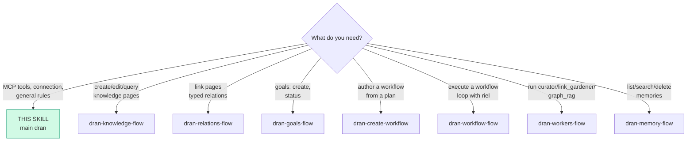
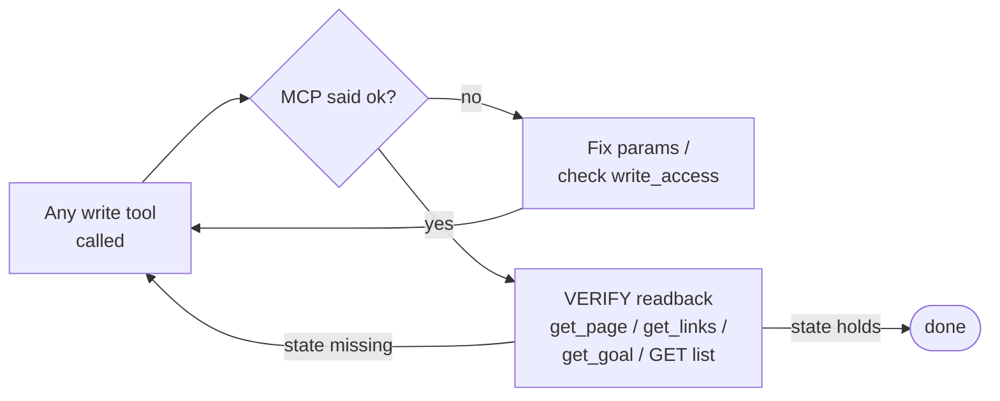

# dran — MCP reference + suite router

Main skill of the Dran suite. Load it first: it routes to the per-action
flows and holds what every flow shares — connection, auth, the readback
rule. Dran is the board: plan (workflows/steps), evidence (runs), knowledge
(pages/goals). The agent's local execution discipline (ledger, briefs,
delegation) is riel — this suite owns only the MCP/REST call sequences.

## Entry router

Run ONLY the flow you landed on. If the diagram sends you to another skill,
**stop here** and hand off — don't absorb that work.

## Connection (once per Hermes profile)

- `config.yaml` → `mcp_servers.dran: { url: "http://localhost:4000/api/mcp",
  headers: { Authorization: "Bearer ${DRAN_API_KEY}" } }`. The secret lives
  ONCE in the profile's `.env` (`DRAN_API_KEY`); the memory plugin resolves
  the same var — one key, one actor. Restart the session after adding the
  server (no hot-reload).
- Hermes registers each tool as `mcp_<server>_<tool>` → with server `dran`,
  calls look like `mcp_dran_dran_search`.
- **One key = one actor.** Attribution (`owner`/`created_by`, run claims) is
  derived server-side from the key — never client-settable.
- **Write gate**: keys with `write_access: false` get `403` on every write
  tool (`@write_tools` in the server: pages, goals, relations, run
  lifecycle, workers).
- **Memory is NOT in the MCP surface** — REST `/api/memory` + Hermes plugin
  only. Do not look for `dran_memory_*` MCP tools.
- MCP resources: `page://<ws>/<slug>`, `goal://<ws>/<slug>`,
  `home://<ws>/index`. Prompts: `brainstorm` (topic), `goal_review`
  (goal_slug).
- Step briefs (`dran_get_step_contract`) render `## Context` RESOLVED:
  title + why + one-line summary + the exact fetch command per entry
  (`dran_get_page` / `GET /api/memory`). Triage on the summaries; fetch
  only what the step needs.

## General rules (every flow obeys them)

- **A write is not done until a readback confirms the state.** The MCP `ok`
  is transport-level, not state-level.
- Slugs are canonical identifiers; a slug not found is an error, never a
  silent drop. Derive slugs from titles, lowercase-hyphen.
- Irreversible operations (delete page/goal/memory, rename slug) require an
  explicit human confirmation first — every flow marks them with ASK.
- The goal checklist is human-managed (Álvaro's OKR); the agent's durable
  evidence of execution is the workflow run (dran-workflow-flow).

## The 7 flows of the suite

| Flow | When to load it |
| --- | --- |
| `dran-knowledge-flow` | Create, update, search or rename pages (note, concept, entity, reference…) |
| `dran-relations-flow` | Link two pages with a typed relation |
| `dran-goals-flow` | Goals: create, status lifecycle, read |
| `dran-create-workflow` | Author a workflow from a plan: steps, contracts, context, DAG (materialize in UI) |
| `dran-workflow-flow` | Execute a workflow with riel: session → pull → brief → ledger → close |
| `dran-workers-flow` | Fire and poll curator / link_gardener / graph_rag |
| `dran-memory-flow` | Administer shared agent memories (REST) |

## Pitfalls

- **Absorbing a flow you were routed away from** — the router is the
  contract; hand off.
- **Reading the tool list off the MCP `initialize` output once and never
  again** — the surface grows; `dran_list_*` and the server docs are the
  truth, this suite is the map.
- **Expecting `dran_memory_*` or workflow-editing tools on MCP** — memory
  is REST/plugin; workflow/step authoring is UI (`/workflows`), driven by
  dran-create-workflow.

## Cross-references

- Server-side surface (tool definitions, write gate, execution domain):
  `lib/dran/mcp.ex` + `lib/dran/executions.ex` in this repo
- Execution discipline inside dran-workflow-flow: `riel-ledger`,
  `riel-delegate`, `riel-briefs`
- Verb/graph conventions the flow DAGs follow: `riel-contract`
