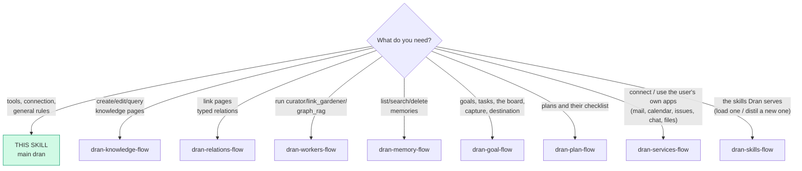
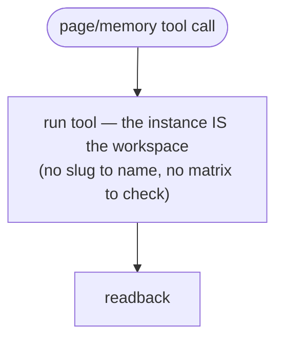
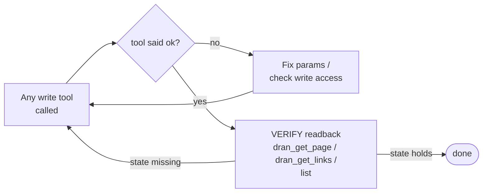

# dran — plugin tools reference + suite router

Main skill of the Dran suite. Load it first: it routes to the per-action
flows and holds what every flow shares — connection, auth, the readback
rule. Dran is the second brain: knowledge (pages), memory, and WORK (goals,
tasks, plans). The agent's local execution discipline (ledger, briefs,
delegation) is riel — this suite owns only the Dran call sequences.

The agent consumes Dran through the **Hermes plugin tools** (`dran_*`); the
The plugin registers its toolset via `register(ctx)` in
`hermes_plugin/dran/__init__.py`, so the tools are available whenever the
`dran` plugin is enabled for the profile. Every tool is a thin client over
Dran's REST API — there is no other protocol surface.

## Entry router

```mermaid
flowchart TD
  Q{What do you need?} -->|"tools, connection,\ngeneral rules"| SELF["THIS SKILL\nmain dran"]
  Q -->|"create/edit/query\nknowledge pages"| K[dran-knowledge-flow]
  Q -->|"link pages\ntyped relations"| R[dran-relations-flow]
  Q -->|"run curator/link_gardener/\ngraph_rag"| X[dran-workers-flow]
  Q -->|"list/search/delete\nmemories"| M[dran-memory-flow]

  Q -->|"goals, tasks, the board,\ncapture, destination"| W[dran-goal-flow]

  Q -->|"plans and their checklist"| PL[dran-plan-flow]

  Q -->|"connect / use the user's own apps\n(mail, calendar, issues, chat, files)"| SV[dran-services-flow]

  Q -->|"the skills Dran serves\n(load one / distil a new one)"| SK[dran-skills-flow]

  style SELF fill:#d1fae5,stroke:#059669
```

Run ONLY the flow you landed on. If the diagram sends you to another skill,
**stop here** and hand off — don't absorb that work.

This suite is for OPERATING Dran. Changing its code is not a flow: the suite
ships no developer skill, so there is nothing to load — read the code.

## Connection (once per Hermes profile)

- The plugin is enabled per profile: `plugins.enabled` in the profile's
  `config.yaml` must list `dran`, and the plugin directory is symlinked into
  `~/.hermes/profiles/<perfil>/plugins/dran`.
- The secret lives ONCE in the profile's `.env` (`DRAN_API_KEY`); the memory
  provider and the tools resolve the same var — one token, one credential.
- Config comes from `$HERMES_HOME/dran/config.json` (base URL), the same file
  the memory panel writes.
- **The token creates NO actor.** Attribution is derived server-side — never
  client-settable: `created_by` is the `X-Hermes-Agent` header (the active
  profile) when it came, otherwise the account email; `owner_user_id` is the
  account that owns the token. The header value is persisted as `agent_name`.
- **Write gate**: the server authorizes the write against the instance
  (`require_write_access`); a token that may not write gets `403` on every
  write tool.
- **Memory tools** (`dran_memory_*`) come from the memory provider; the
  knowledge tools (`dran_search`, `dran_create_page`, …) come from the same
  plugin's toolset.

## Single workspace (W5 — no selection)

```mermaid
flowchart TD
  S([page/memory tool call]) --> W["run tool — the instance IS the workspace\n(no slug to name, no matrix to check)"]
  W --> R[readback]
```

- Every call targets the instance behind the plugin's `base_url`. There is no
  workspace selection, no workspace matrix, and no `workspace` param to send.
- A token reads and writes **exactly what its owner reads** (own ∪ public ∪
  shared-with-the-owner). The token creates **no actor**: attribution comes
  from the account and the `X-Hermes-Agent` header, and `owner_user_id` is the
  account that owns the token.
- Pages accept `visibility` (`private` default | `public` | `shared`) at
  creation and update. Memory facts are ALWAYS born private via tools — the
  API rejects a `visibility` param with 422.
- Discover the instance's effective page types with `dran_list_page_types`.

## Services (the user's apps)

Five fixed tools over `/api/services` for the user's OWN apps (mail, calendar,
issues and pull requests, messages, files). The **catalog is data** — there is no
per-service tool, and nothing here grows with the toolkits connected.

| Tool | What it is for |
| --- | --- |
| `dran_services` | which services are exposed and which are connected for THIS reader, with the lifecycle state and the provider identity |
| `dran_services_connect` | the hosted authorization link to paste for the user (it lives ~10 minutes) |
| `dran_services_tools` | discovery: one toolkit's tools, one tool's schema (`slug`), or a use case |
| `dran_services_run` | execute a tool against the user's connection |
| `dran_services_wait` | wait (short cap) until the connection is `ACTIVE` before running |

**The sequences, the failure modes and the checklist live in
`dran-services-flow`** — load it and run the flow; don't improvise the order.
Two things worth knowing from here: the connection state is a **lifecycle read
from the server** (`INITIATED` → `ACTIVE` / `EXPIRED`; `INACTIVE` does not run),
and the inventory is **injected at turn start**, so you never poll for it.

## Skills (instructions Dran serves to agents)

Four fixed tools over `/api/skills`: the catalog is DATA and the body travels by
tool. A skill lives ONLY in Dran — unlike the suite you are reading, it is not a
file on disk and there is no anonymous index of them.

| Tool | What it is for |
| --- | --- |
| `dran_skills` | the LIVE catalog this token can read (never carries bodies) |
| `dran_skill` | ONE body by slug, framed with slug, version and `content_hash` |
| `dran_skill_save` | create (new slug) or update — **ASK the user first** |
| `dran_skill_delete` | delete by slug — **ASK the user first** |

The block the prompt carries is a snapshot from session start: `dran_skills` is
the live truth. `dran_skill` answers `unchanged` when the hash did not move since
you loaded that slug in this session. **The sequences, the failure modes and the
ASK live in `dran-skills-flow`** — load it and run the flow.

## General rules (every flow obeys them)

```mermaid
flowchart LR
  W["Any write tool\ncalled"] --> G{"tool said ok?"}
  G -->|"no"| F["Fix params /\ncheck write access"] --> W
  G -->|"yes"| V["VERIFY readback\ndran_get_page / dran_get_links /\nlist"]
  V -->|"state holds"| E([done])
  V -->|"state missing"| W
```

- **A write is not done until a readback confirms the state.** The tool's
  `ok` is transport-level, not state-level.
- Slugs are canonical identifiers; a slug not found is an error, never a
  silent drop. Derive slugs from titles, lowercase-hyphen.
- Irreversible operations (delete page/memory) require an explicit human
  confirmation first — every flow marks them with ASK.

## The flows of the suite

| Flow | When to load it |
| --- | --- |
| `dran-knowledge-flow` | Create, update, search or delete pages (4 built-in types + the instance's custom ones; lists the effective types first when none is named) |
| `dran-relations-flow` | Link two pages with a typed relation |
| `dran-workers-flow` | Fire and poll curator / link_gardener / graph_rag |
| `dran-memory-flow` | Administer shared agent memories (provider tools + REST) |
| `dran-goal-flow` | Goals and their tasks: alta, captura rápida, movimiento de columna, checklist de una task y destino (`scope`/grupo) |
| `dran-plan-flow` | Plans (entidad propia) y su checklist: alta, contenido, los pasos de una vez o de a uno |
| `dran-services-flow` | The user's own apps: connect (hosted link), wait for `ACTIVE`, discover the catalog by toolkit/use case, run a tool, and what every failure answer means |
| `dran-skills-flow` | The skills Dran serves to agents: list the live catalog, load one body by tool, distil a new one (ASK), retire one (ASK) |

## Brain health and discovery (real tools, no flow of their own)

The suite has eight flows; these tools belong to the one that owns their
subject:

| Tool | Lives in | What it is for |
| --- | --- | --- |
| `dran_stats` | knowledge-flow | pages by type, memories, relations |
| `dran_lint_brain` | knowledge-flow | structural hygiene, read-only: orphans, broken embeds, missing metadata |
| `dran_generate_cluster_summaries` | knowledge-flow | regenerate the nightly cluster summaries on demand |
| `dran_rename_slug` | knowledge-flow | rewrite a slug and every `![[…]]` embed that pointed at it |
| `dran_reaugment_page` | knowledge-flow | re-run embedding/summary/relations after a body change |
| `dran_list_groups` | goal-flow | the credential owner's groups — the share target to name BEFORE writing |

## Pitfalls

- **Absorbing a flow you were routed away from** — the router is the
  contract; hand off.
- **Assuming a tool exists because it sounds natural** — the plugin's
  toolset is the truth (`hermes_plugin/dran/__init__.py`); read the
  registered names instead of guessing.
- **Expecting the knowledge tools to cover memory** — memory is
  `dran_memory_*` from the provider; the knowledge toolset has no memory
  operations.
- **Looking for a developer skill** — there are none: the suite carries no
  `dran-dev-*` (nothing about changing Dran's code). To change the code, read
  the code.

## Cross-references

- Plugin-side surface (tool definitions, schemas): `hermes_plugin/dran/__init__.py`
- Server-side routes and the write gate: `lib/dran_web/router.ex`
- Endpoint reference: `docs/api.md`
- Verb/graph conventions the flow DAGs follow: `riel-contract`
