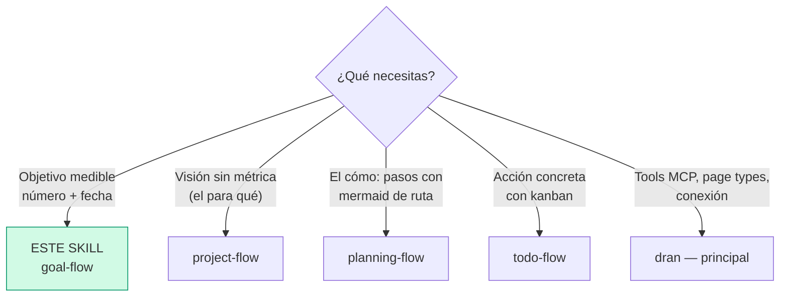
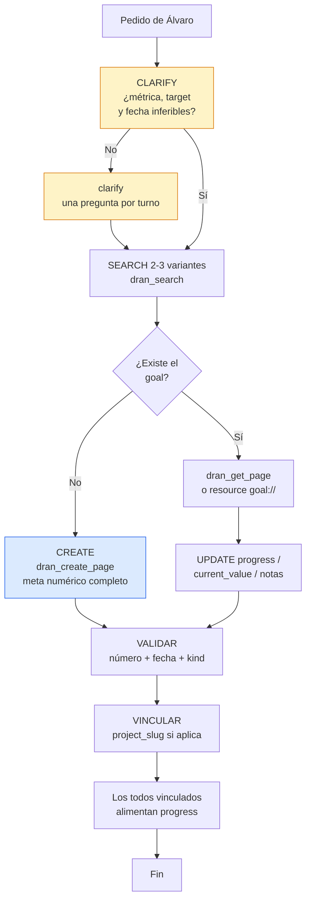

# goal-flow — Crear y gestionar goals en Dran

El goal es el nivel **estratégico con métrica**: un objetivo con número y
fecha. **Si no se puede medir, es un wish** — y los wishes van como project
(visión) o como plan, no como goal.

## Entry router



Ejecuta SOLO la sección a la que llegaste. Si el diagrama te manda a otro
skill, **paras aquí** y haces hand-off.

## Flujo operativo — sigue este DAG al pie de la letra



Cada nodo es un paso obligatorio: clarify la métrica si no es inferible,
search antes de crear, meta numérico completo, y vinculación al project.

## Parse contract

### Qué CONSUME este skill
- Pedido de Álvaro: objetivo nuevo, actualización de progreso, revisión de
  goal, o página goal existente con su `meta` actual

### Qué PRODUCE este skill

| # | Artefacto | Propósito |
|---|-----------|-----------|
| 1 | Página `goal` con `## Por qué` (+ `## Notas` opcional) | Justificación y bitácora |
| 2 | `meta` numérico completo (metric, target_value, current_value, unit, fechas) | La medición vive en meta, NO en el body |
| 3 | Progress auto-calculado o `progress_manual: true` | Saber si vamos bien sin preguntar |

**Regla dura: número + fecha, o NO es goal.** Un goal sin `target_value` +
`target_date` está mal formado — es un wish disfrazado.

## Descripción del flujo

| Aspecto | Regla |
|---------|-------|
| Qué es | Objetivo medible con target y fecha |
| Horizonte | Semanas/meses |
| Pregunta que responde | ¿Cuánto, para cuándo, cómo medimos? |
| Título | El objetivo completo: "Migrar todos los proyectos a X" |

**Reglas de oro:**

1. **Un goal = una métrica.** No mezclar objetivos en un solo goal — si son
   dos números, son dos goals.
2. **Todo lo numérico vive en el `meta`, NO en el body.** El body explica el
   por qué; el meta mide.
3. **Health y progress manuales solo cuando Álvaro lo pida** — el agente no
   mueve `health` por iniciativa propia.

## Shaping — questioning antes de crear

Antes de crear, verifica contra la realidad y pregunta lo que no sea
inferible:

1. **Métrica** — ¿qué número lo mide? (`metric` + `unit`)
2. **Target** — ¿a cuánto queremos llegar? (`target_value`)
3. **Fecha** — ¿para cuándo? (`target_date`)
4. **Medición** — ¿se mide solo con los todos vinculados, o a mano?
   (`progress_manual: true` si es a mano)

Una pregunta bloqueante por turno. Si la métrica es obvia del pedido ("100%
de coverage"), no preguntes lo que ya sabes.

## Template de contenido — body mínimo

| # | Sección | Propósito |
|---|---------|-----------|
| 1 | `## Por qué` | 1 párrafo: por qué importa este objetivo ahora |
| 2 | `## Notas` (opcional) | Progreso, bloqueos, hallazgos — bitácora viva |

```markdown
## Por qué

Documentar y probar las 17 tools MCP para que el agente no dependa de
memoria humana para operar Dran.

## Notas

- 2026-08-08: 12/17 tools con smoke test verde.
```

## Uso de Dran

### Meta clave

| Campo | Valores | Nota |
|-------|---------|------|
| `kind` | personal / coding / business / learning / health / finance / other / investing / marketing / product / writing / career / relationship / travel | |
| `metric` | texto libre ("MCP tools documentadas") | QUÉ se mide |
| `target_value` | número | A cuánto se llega |
| `current_value` | número | Dónde vamos |
| `unit` | texto ("tools", "users", "%") | |
| `start_date` / `target_date` | ISO dates | |
| `health` | green / yellow / red | Manual — solo si Álvaro lo pide |
| `progress` | 0-100 | Auto-calculado salvo manual |
| `progress_manual` | true/false | `true` = se mide a mano |
| `project_slug` | slug | Link independiente al project |

### Recipe — crear

```
1. clarify métrica/target/fecha si no son inferibles
2. dran_search({ context: "personal", query: "<objetivo>" })   → existe? UPDATE
3. dran_create_page({
     context: "personal",
     page_type: "goal",
     title: "<objetivo completo>",
     body: "## Por qué\n\n<1 párrafo>",
     meta: {
       kind: "coding",
       metric: "MCP tools documentadas",
       target_value: 17,
       current_value: 0,
       unit: "tools",
       start_date: "2026-08-01",
       target_date: "2026-09-30",
       project_slug: "<project>"        → opcional
     },
     owner: "alvaro",  # from API key, not settable
     created_by: "chaos manager"  # overrideable
   })
```

### Recipe — actualizar progreso

```
1. dran_search el slug (o resource goal://{context}/{slug} — goal + todos/plans en JSON)
2. dran_get_page para leer el estado actual
3. dran_update_page:
   - current_value nuevo → meta COMPLETO (update_page REEMPLAZA meta)
   - nota de progreso → body con ## Notas actualizado
   - body + meta juntos OK aquí (los goals no llevan mermaid normalmente);
     si el body tiene mermaid → SOLO body
```

### Status workflow

- **Health** (`green`/`yellow`/`red`) — manual, solo cuando Álvaro lo pida.
- **Progress** — auto-calculado de los todos vinculados (done/total), salvo
  `progress_manual: true`.
- No hay `status` de kanban — el goal vive de su métrica y sus todos.
- **Auto-`done` implícito:** cuando `current_value` llega a `target_value`,
  reportarlo a Álvaro — no cerrar nada sin su visto bueno.

### Cuándo revisar un goal

Cuando la métrica ya no refleja el objetivo real (se movió el mercado, cambió
la prioridad). Actualizar `metric`/`target_value` — no crear un goal nuevo
para el mismo objetivo.

**Review asistido:** el prompt `goal_review` de Dran (MCP prompts) revisa un
goal con sus todos y planes vinculados.

## Pitfalls

- **Goal sin número o sin fecha** — es un wish; va como project o plan.
- **Mezclar dos métricas en un goal** — partir en dos goals.
- **Métrica en el body** — los números van en `meta`; el body es el por qué.
- **Olvidar `progress_manual: true`** — si la métrica no se deriva de todos
  (ej. "peso 75kg"), sin el flag el progress se calcula mal (0% o raro).
- **Mover health por iniciativa propia** — solo cuando Álvaro lo pide.
- **`dran_update_page` pasando meta parcial** — REEMPLAZA todo el meta;
  siempre pasar el meta completo.
- **Crear sin search** — actualizar gana sobre duplicar.

## Quick reference

| Tool | Args mínimos | Retorna |
|------|--------------|---------|
| `dran_search` | `query`, `type: "goal"` | Lista rankeada |
| `dran_get_page` | `slug` | Body markdown |
| `dran_create_page` | `page_type: "goal"`, `title`, `meta` | Goal creado + slug |
| `dran_update_page` | `slug` + meta completo | Goal actualizado |
| Resource `goal://{context}/{slug}` | — | Goal + todos/plans vinculados (JSON) |
| Prompt `goal_review` | slug del goal | Revisión asistida |

## Cuándo NO usar este skill

- **No hay métrica** (es visión) → `project-flow`
- **El pedido es cómo lograrlo (pasos)** → `planning-flow`
- **Es una acción concreta** → `todo-flow`
- **Es una pregunta con respuesta reutilizable** → `note-taking-flow` (query)

## Cross-references

- Referencia MCP (tools, meta fields): `dran` — skill principal
- Project que agrupa el goal: `project-flow`
- Plans que ejecutan hacia el goal: `planning-flow`
- Todos que alimentan el progress: `todo-flow`
- Link `goal_slug` (independiente): `relations-flow`
