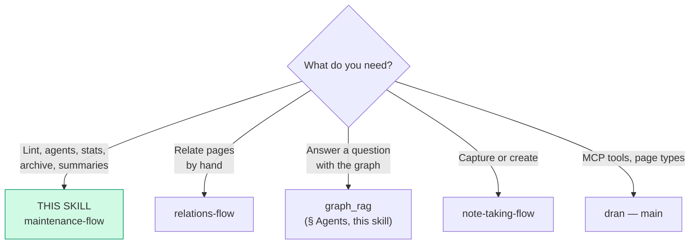
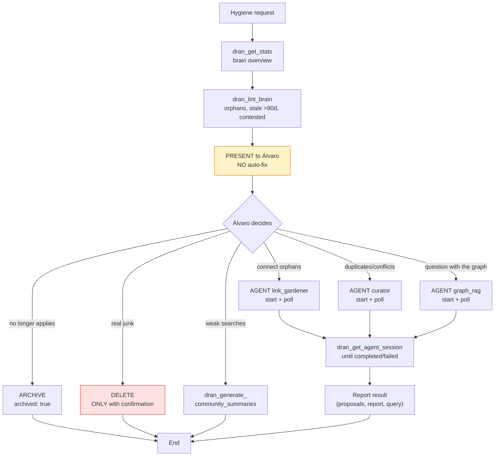
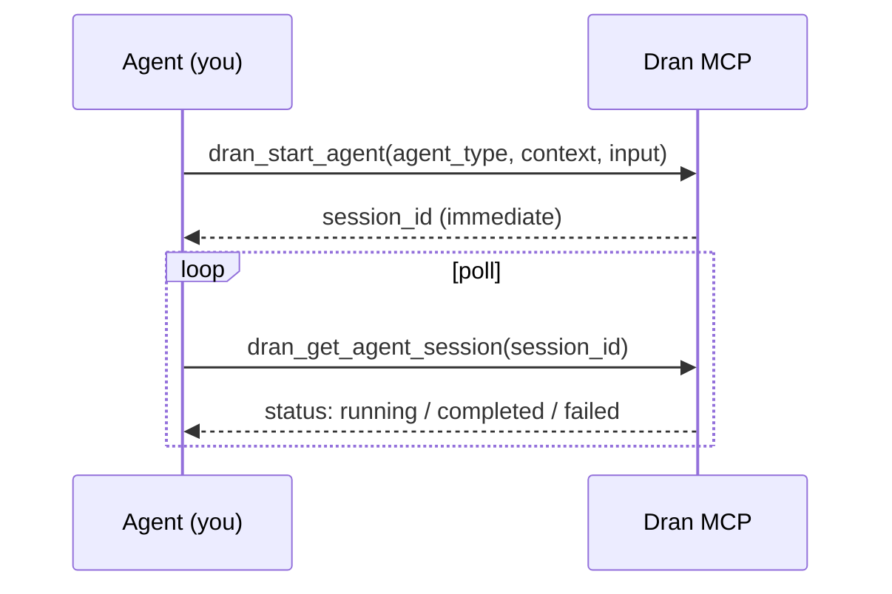

# maintenance-flow — Keeping the brain healthy

Brain hygiene: detect orphans and stale pages, launch autonomous agents,
regenerate community summaries, archive what no longer applies.
**Mother rule: present, do not auto-fix** — clean-up decisions belong to
Álvaro.

## Entry router



## Operational flow — follow this DAG to the letter



## Parse contract

### What this skill CONSUMES
- A hygiene request ("clean the brain", "there are duplicates", "connect the
  orphans"), or a question that warrants `graph_rag`

### What this skill PRODUCES

| # | Artifact | Purpose |
|---|----------|---------|
| 1 | Lint report presented to Álvaro | Informed decision, without touching anything |
| 2 | Completed agent sessions | Link proposals, duplicate reports, query pages |
| 3 | Archived pages (recoverable) | Clean brain with no irreversible loss |
| 4 | Regenerated community summaries | Sharper global search |

**Auto-fixing without presenting is forbidden** — the agent proposes, Álvaro
disposes.

## Autonomous agents (3)

| Agent | Purpose | When to launch | Limits/session |
|-------|---------|----------------|----------------|
| `curator` | Near-duplicates (embedding < 0.05), disputed knowledge, writes report | Periodic / after mass capture | 20 flags |
| `link_gardener` | Proposes typed relations for orphans and under-linked pages (incl. transitive `part_of` A→C via B) | When there are orphans | 10 proposals |
| `graph_rag` | Answers questions with GraphRAG (local = neighbors, global = community summaries, drift = hybrid) and creates query pages with citations | A question whose answer is worth saving | 10 searches, 5 expands, 3 communities, 1 query |

### Lifecycle



Sessions persist at every step and track `meta.tokens_used` + `meta.model`.

### Scheduled jobs (Quantum) — they run on their own; control in Settings → Brain

| Job | Schedule | What it does |
|-----|----------|--------------|
| `curator_daily` | 06:00 daily | Scans duplicates/conflicts |
| `pagerank_nightly` | 03:00 | Recomputes authority scores |
| `community_summaries_nightly` | 03:30 | Regenerates LLM summaries |
| `graph_maintenance_nightly` | 03:45 | Cleans graph edges/orphans |
| `link_gardener_weekly` | Sun 07:00 | Proposes relations for orphans |

All target the default context and are disabled in test. They go through
`Dran.Jobs.run_scheduled/1`, which respects the job toggle and writes a
`report` page (kind `log`, `/panel/reports/<slug>`) per run — there you see
status, trigger and duration (the 20 most recent per job are kept).

**Control:** Settings → Brain → "Scheduled jobs" — per-job toggle (affects
ONLY scheduled runs), "Run now" (manual, always executes) and last run with
link to the report. Programmatically: `Dran.Jobs.list/0`,
`set_enabled/2`, `run_now/1`.

## Using Dran

### Recipe — full hygiene

```
1. dran_get_stats({ context: "personal" })        → overview: totals, by type, kanban
2. dran_lint_brain({ context: "personal" })       → orphans, stale, contested
3. PRESENT to Álvaro (prioritized list)           → NO auto-fix
4. Based on the decision:
   dran_start_agent({ agent_type: "link_gardener", context: "personal", input: "orphaned pages" })
   dran_get_agent_session({ session_id: "..." })  → poll until completed
5. Report the agent's proposals
```

### Recipe — archive vs delete

```
# Archive (default — recoverable, hidden from lists/search):
dran_update_page({ slug: "<slug>", archived: true })

# Delete (irreversible — ONLY true junk, ONLY with Álvaro's confirmation):
dran_delete_page({ slug: "<slug>" })
```

### Recipe — re-augment after major changes

```
dran_reaugment_page({ slug: "<slug>" })
# Re-runs the page's summary/tags/embedding/relations
```

### Recipe — weak global searches

```
dran_generate_community_summaries({ context: "personal" })
# Regenerates LLM summaries per community — run after significant capture
```

### Recipe — answering with the graph (graph_rag)

```
1. dran_search first — if the answer already exists, use it
2. dran_start_agent({ agent_type: "graph_rag", context: "personal", input: "<question>" })
3. Poll until completed → query page created with cited sources
4. Deliver summary + link to the query page
```

## Pitfalls

- **Auto-fixing the lint** — present orphans/stale to Álvaro; he decides.
- **Delete without confirmation** — irreversible; archive is the default.
- **Launching agents recklessly** — they have per-session limits; one clear
  goal per `input`.
- **Not waiting for the poll** — the agent runs async; without `completed`
  there is no result to report.
- **Running community summaries daily** — after significant capture or when
  global search feels weak, not out of routine (the crons already run).
- **Re-augmenting pages without changes** — only when the content changed
  significantly.
- **Forgetting the crons exist** — curator and link_gardener already run
  on their own; launch manually only if urgent.

## Quick reference

| Tool | Minimal args | Returns |
|------|--------------|---------|
| `dran_get_stats` | `context` | Totals, types, kanban, orphans |
| `dran_lint_brain` | `context` | Orphans, stale, contested |
| `dran_start_agent` | `agent_type`, `context`, `input` | `session_id` |
| `dran_get_agent_session` | `session_id` | status + steps + summary |
| `dran_generate_community_summaries` | `context` | Summaries per community |
| `dran_reaugment_page` | `slug` | Re-run augmentation |
| `dran_update_page` | `slug`, `archived: true` | Archived |
| `dran_delete_page` | `slug` (with confirmation) | Deleted (irreversible) |

## When NOT to use this skill

- **Relating specific pages by hand** → `relations-flow`
- **Capturing new content** → `note-taking-flow`
- **Internet research** → `research-flow`

## Cross-references

- MCP reference (tools maintain/automate): `dran` — main skill
- Relations that link_gardener proposes: `relations-flow`
- Query pages that graph_rag creates: `research-flow`
