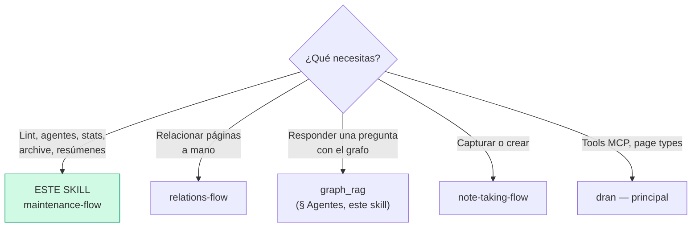
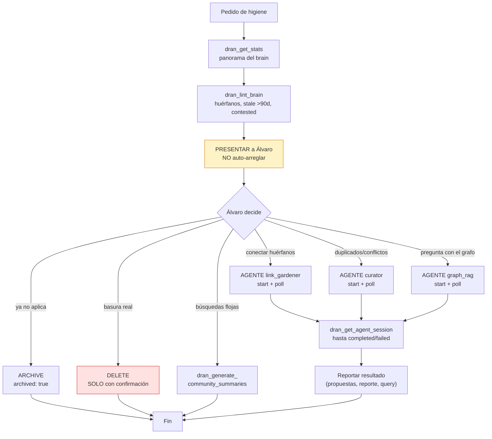

# maintenance-flow — Mantener el brain sano

La higiene del brain: detectar huérfanos y páginas viejas, lanzar agentes
autónomos, regenerar resúmenes de comunidades, archivar lo que ya no aplica.
**Regla madre: presentar, no auto-arreglar** — las decisiones de limpieza son
de Álvaro.

## Entry router



## Flujo operativo — sigue este DAG al pie de la letra



## Parse contract

### Qué CONSUME este skill
- Pedido de higiene ("limpia el brain", "hay duplicados", "conecta los
  huérfanos"), o pregunta que amerita `graph_rag`

### Qué PRODUCE este skill

| # | Artefacto | Propósito |
|---|-----------|-----------|
| 1 | Reporte de lint presentado a Álvaro | Decisión informada, sin tocar nada |
| 2 | Sesiones de agente completadas | Propuestas de links, reportes de duplicados, query pages |
| 3 | Páginas archivadas (recoverables) | Brain limpio sin pérdida irreversible |
| 4 | Community summaries regenerados | Global search afilado |

**Auto-arreglar sin presentar está prohibido** — el agente propone, Álvaro
dispone.

## Agentes autónomos (3)

| Agente | Para qué | Cuándo lanzarlo | Límites/sesión |
|--------|----------|-----------------|----------------|
| `curator` | Near-duplicados (embedding < 0.05), conocimiento en disputa, escribe reporte | Periódico / tras captura masiva | 20 flags |
| `link_gardener` | Propone relaciones tipadas pa' huérfanos y sub-linkeados (incl. `part_of` transitivo A→C via B) | Cuando hay huérfanos | 10 propuestas |
| `graph_rag` | Responde preguntas con GraphRAG (local = vecinos, global = community summaries, drift = híbrido) y crea query pages con citas | Pregunta cuya respuesta vale guardarse | 10 searches, 5 expands, 3 communities, 1 query |

### Lifecycle


Las sesiones persisten cada paso y trackean `meta.tokens_used` + `meta.model`.

### Jobs programados (Quantum) — corren solos, NO se lanzan a mano

| Job | Horario | Qué hace |
|-----|---------|----------|
| `curator_daily` | 06:00 diario | Scan de duplicados/conflictos |
| `pagerank_nightly` | 03:00 | Recomputa authority scores |
| `community_summaries_nightly` | 03:30 | Regenera resúmenes LLM |
| `graph_maintenance_nightly` | 03:45 | Limpia edges/orphans del grafo |
| `link_gardener_weekly` | Dom 07:00 | Propone relaciones pa' huérfanos |

Todos apuntan al contexto default y están deshabilitados en test.

## Uso de Dran

### Recipe — higiene completa

```
1. dran_get_stats({ context: "personal" })        → panorama: totales, por tipo, kanban
2. dran_lint_brain({ context: "personal" })       → huérfanos, stale, contested
3. PRESENTAR a Álvaro (lista priorizada)          → NO auto-arreglar
4. Según decisión:
   dran_start_agent({ agent_type: "link_gardener", context: "personal", input: "orphaned pages" })
   dran_get_agent_session({ session_id: "..." })  → poll hasta completed
5. Reportar propuestas del agente
```

### Recipe — archive vs delete

```
# Archive (default — recoverable, oculto de listas/search):
dran_update_page({ slug: "<slug>", archived: true })

# Delete (irreversible — SOLO true junk, SOLO con confirmación de Álvaro):
dran_delete_page({ slug: "<slug>" })
```

### Recipe — re-augment tras cambios grandes

```
dran_reaugment_page({ slug: "<slug>" })
# Re-corre summary/tags/embedding/relations de la página
```

### Recipe — búsquedas globales flojas

```
dran_generate_community_summaries({ context: "personal" })
# Regenera resúmenes LLM por comunidad — correr tras captura significativa
```

### Recipe — responder con el grafo (graph_rag)

```
1. dran_search primero — si la respuesta ya existe, úsala
2. dran_start_agent({ agent_type: "graph_rag", context: "personal", input: "<pregunta>" })
3. Poll hasta completed → query page creada con fuentes citadas
4. Entregar resumen + link a la query page
```

## Pitfalls

- **Auto-arreglar el lint** — presentar huérfanos/stale a Álvaro; él decide.
- **Delete sin confirmación** — irreversible; archive es el default.
- **Lanzar agentes a lo loco** — tienen límites por sesión; un objetivo claro
  por `input`.
- **No esperar el poll** — el agente corre async; sin `completed` no hay
  resultado que reportar.
- **Correr community summaries a diario** — tras captura significativa o
  cuando global search se sienta flojo, no por rutina (los crons ya corren).
- **Re-augment páginas sin cambios** — solo cuando el contenido cambió
  significativamente.
- **Olvidar que los crons existen** — curator y link_gardener ya corren
  solos; lanzar manual solo si urge.

## Quick reference

| Tool | Args mínimos | Retorna |
|------|--------------|---------|
| `dran_get_stats` | `context` | Totales, tipos, kanban, huérfanos |
| `dran_lint_brain` | `context` | Huérfanos, stale, contested |
| `dran_start_agent` | `agent_type`, `context`, `input` | `session_id` |
| `dran_get_agent_session` | `session_id` | status + steps + summary |
| `dran_generate_community_summaries` | `context` | Resúmenes por comunidad |
| `dran_reaugment_page` | `slug` | Augmentación re-corrida |
| `dran_update_page` | `slug`, `archived: true` | Archivado |
| `dran_delete_page` | `slug` (con confirmación) | Eliminado (irreversible) |

## Cuándo NO usar este skill

- **Relacionar páginas específicas a mano** → `relations-flow`
- **Capturar contenido nuevo** → `note-taking-flow`
- **Research de internet** → `research-flow`

## Cross-references

- Referencia MCP (tools maintain/automate): `dran` — skill principal
- Relaciones que propone link_gardener: `relations-flow`
- Query pages que crea graph_rag: `research-flow`
