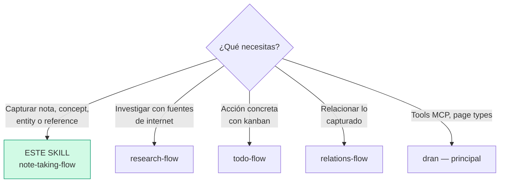
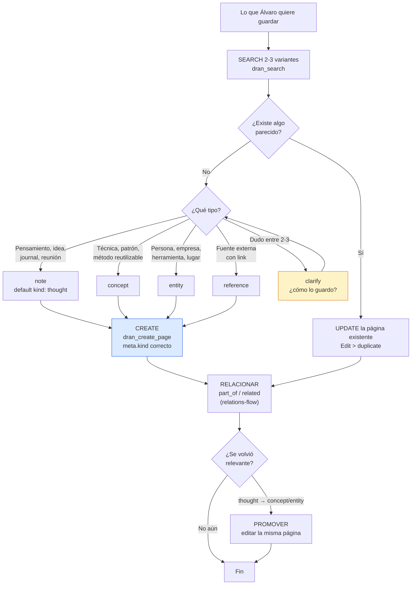

# note-taking-flow — Captura de conocimiento en Dran

Todo lo que NO es ejecución (project/goal/plan/todo) es captura: notes,
concepts, entities, references. La regla madre: **cuando dudes, `note` con
`kind: thought`** — promover después es gratis.

## Entry router



## Flujo operativo — sigue este DAG al pie de la letra



## Parse contract

### Qué CONSUME este skill
- Lo que Álvaro quiere guardar: pensamiento, aprendizaje, dato de una persona/
  empresa, link, cita, minuta de reunión

### Qué PRODUCE este skill

| # | Artefacto | Propósito |
|---|-----------|-----------|
| 1 | Página con `page_type` + `meta.kind` correctos | Búsqueda y grafo la tratan bien |
| 2 | Relaciones tipadas hacia lo relacionado | PageRank y contexto |
| 3 | Promoción de thought → concept/entity cuando aplica | El conocimiento madura sin duplicarse |

**Sin `meta.kind` correcto la captura está mal formada** — la página se crea,
pero la búsqueda y los filtros la pierden.

## Descripción del flujo

| Tipo | Cuándo | Ejemplo |
|------|--------|---------|
| `note` | En el momento — captura rápida (default) | idea, journal, meeting, quote |
| `concept` | Conocimiento reutilizable destilado | técnica, patrón, framework |
| `entity` | Persona/empresa/producto que aparece repetido | FAL.ai, Hermes, Anthropic |
| `reference` | Fuente externa útil | artículo, video, paper |

**Estrategias:**

- **Captura rápida** → `note` (kind thought) → **promover** a
  `concept`/`entity` cuando se vuelve relevante. Edit > duplicate — promover
  es editar la MISMA página (body, meta.kind), nunca crear otra.
- **Search before create** (2-3 variantes); si existe, actualizar.
- **Duda del tipo** → default `note` thought; si la duda cambia lo que
  capturas (nota vs entidad vs referencia), clarify con 2-3 candidatos.
- **Relacionar siempre** (`related`/`part_of`) — alimenta PageRank y la
  búsqueda (ver `relations-flow`).

### Kinds por tipo (resumen operativo)

**Note:** thought (default), journal, idea, meeting, question, quote,
reminder. **Concept:** technique, pattern, framework, method, principle.
**Entity:** person, company, product, tool, place, event. **Reference:**
article, paper, video, podcast, book — siempre con `source_url`.

La lista completa de kinds vive en el skill `dran` (§3).

## Uso de Dran

### Recipes

**Captura rápida:**
```
1. dran_search({ context: "personal", query: "<keywords>" })   → existe? UPDATE
2. dran_create_page({
     context: "personal",
     page_type: "note",
     body: "Today I learned...",
     meta: { kind: "thought" },
     tags: ["elixir"],
     owner: "alvaro", created_by: "chaos manager"  # owner from API key, created_by overrideable
   })
```

**Concept destilado:**
```
dran_create_page({ page_type: "concept", title: "Circuit Breaker",
  meta: { kind: "pattern", domain: "resilience" } })
```

**Entity (con props):**
```
dran_create_page({ page_type: "entity", title: "Anthropic",
  meta: { kind: "company", external_url: "https://...",
          props: { location: "sf", framework: "claude" } } })
```

**Reference (con la regla del por qué):**
```
dran_create_page({ page_type: "reference", title: "Paper X",
  body: "## Por qué\n\n<para qué la guardo>",
  meta: { kind: "paper", source_url: "https://arxiv.org/..." } })
```

**Promover thought → concept:**
```
1. dran_get_page el note original
2. dran_update_page: meta.kind "permanent"/reescribir body destilado,
   o cambiar page_type vía nueva versión del meta — SIEMPRE la misma página
3. dran_reaugment_page si el cambio es significativo
```

**Notas de código:** `meta.kind: "code"` + `meta.language: "elixir"` para
filtrar por lenguaje.

### Props al capturar (meta.props)

Cualquier página puede llevar `meta.props`: bag libre key-value (solo
strings, máx 10). Las keys `role`, `tier`, `location`, `language`,
`framework` materializan edges automáticos; las custom keys se guardan y se
pueden filtrar al buscar, pero no generan edge (detalle en `relations-flow`).

**Dónde natural:** entity de tool → `language` + `framework`; entity de
persona → `role` + `location`; concept con tier → `tier`; reference → nada
(usa `source_url`/`kind`).

**Buscar por props (AND):**
```
dran_search({ query: "elixir", props: { language: "elixir" } })
dran_list_pages({ type: "entity", props: { framework: "phoenix" } })
```

### Brainstorming (generar ideas)

1. **Clarify** — tema, alcance y para qué
2. **Search before create** — ¿qué ya tenemos del tema?
3. **Generar** — notes `kind: idea` interlinkeadas (`related`), o el prompt
   `brainstorm` de Dran (5-10 ideas como pages interlinkeadas)
4. **Investigar lo que vale** → `research-flow`
5. **Destilar** — promover lo bueno a `concept`/`entity`
6. **Presentar + priorizar** — clarify para elegir cuáles se vuelven
   projects/goals/plans/todos (hand-off al flow correspondiente)

## Pitfalls

- **Crear sin search** — duplicados que fragmentan el grafo.
- **Duplicar en vez de promover** — un thought que maduró se EDITA, no se
  clona como concept nuevo.
- **`note` genérico sin kind** — `meta.kind` es lo que lo hace encontrable.
- **Reference sin `source_url` ni por qué** — ruido.
- **Captura sin relacionar** — página huérfana que el search no levanta.
- **Preguntar lo obvio** — un pendiente es todo, una cita es note quote;
  clarify solo cuando el tipo cambia lo que capturas.

## Quick reference

| Tool | Args mínimos | Retorna |
|------|--------------|---------|
| `dran_search` | `query` (2-3 variantes) | ¿Ya existe? |
| `dran_create_page` | `page_type`, `body`, `meta.kind` | Página + slug |
| `dran_update_page` | `slug` + campos | Promoción/edición |
| `dran_create_relation` | `source_slug`, `target_slug`, `relation_type` | Edge tipado |
| Prompt `brainstorm` | tema | Ideas interlinkeadas |

## Cuándo NO usar este skill

- **Investigación con fuentes web** → `research-flow`
- **Pendiente/acción** → `todo-flow`
- **Definición de proyecto/objetivo/plan** → `project-flow` / `goal-flow` /
  `planning-flow`

## Cross-references

- Lista completa de kinds y page types: `dran` — skill principal
- Fuentes con research completo: `research-flow`
- Relaciones y props: `relations-flow`
- Huérfanos y limpieza: `maintenance-flow`
