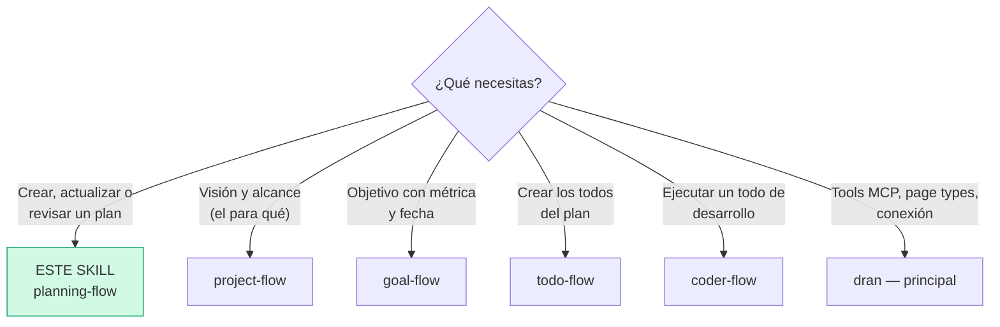
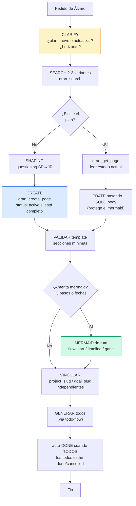
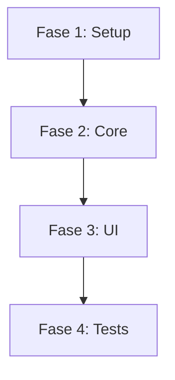
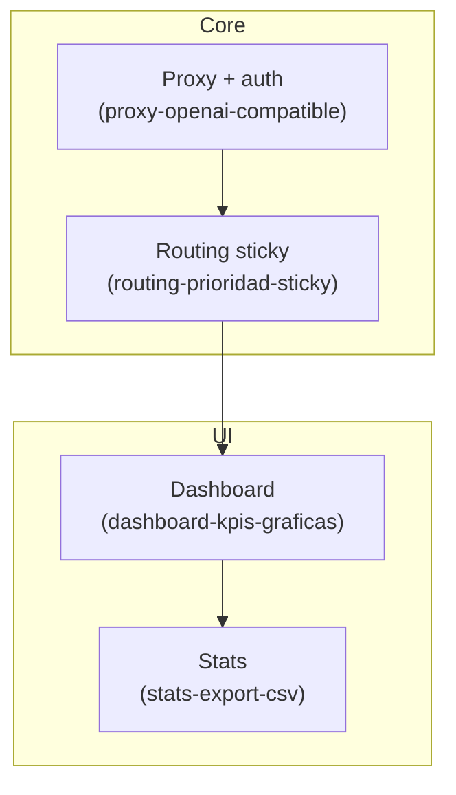
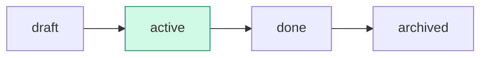

# planning-flow — Crear y gestionar plans en Dran

El plan es el nivel **táctico**: el "cómo" se hará. Secuencia de pasos,
arquitectura de la ejecución, mermaid de ruta. Si un plan no genera todos,
no es plan — es nota.

## Entry router



Ejecuta SOLO la sección a la que llegaste. Si el diagrama te manda a otro
skill, **paras aquí** y haces hand-off.

## Flujo operativo — sigue este DAG al pie de la letra



Cada nodo es un paso obligatorio: clarify, search, shaping, template con
entregable, mermaid de ruta si lo amerita, links independientes, y los todos
que ejecutan el plan.

## Parse contract

### Qué CONSUME este skill
- Pedido de Álvaro: nuevo plan, ajuste de ruta, revisión de plan, o página
  plan existente con su `meta` y mermaid actuales

### Qué PRODUCE este skill

| # | Artefacto | Propósito |
|---|-----------|-----------|
| 1 | Página `plan` con secciones mínimas | Definición ejecutoria completa |
| 2 | Mermaid de ruta parseable | Mapa de alto nivel; cada nodo puede expandirse en un todo |
| 3 | `meta` válido (kind, horizon, period, links) | Ubicación temporal y estratégica |
| 4 | Lista de todos a crear (checklist con slugs) | El plan sin todos no es plan |

**Sin `## Entregable / Resultado` el plan está mal formado** — el entregable
es el criterio de done del plan; sin él no hay forma de cerrar.

## Descripción del flujo

| Aspecto | Regla |
|---------|-------|
| Qué es | El "cómo" se hará: pasos, arquitectura, mermaid |
| Horizonte | Días/semanas |
| Pregunta que responde | ¿Cómo lo vamos a hacer, paso a paso? |
| Vida | Un plan = una ejecución. Si la naturaleza cambia → plan nuevo |

**Reglas de oro:**

1. **Nace `active` si ya está definido completo** (objetivo + entregable +
   ejecución + todos). `draft` solo mientras se construye.
2. **El mermaid es el mapa de ruta** — cada nodo puede expandirse en un todo
   con su propio mermaid detallado (eso es `todo-flow` / `coder-flow`).
3. **Anexos fuera del plan** — diagramas de sistema, glosarios, arquitectura
   → páginas propias (`concept`/`note`) relacionadas con `part_of`/`related`.
   El plan solo embebe con `![[slug]]` si los necesita visibles.
4. **Auto-`done`** cuando TODOS los todos vinculados están done/cancelled
   (= entregable cumplido si los todos cubren el resultado).

## Shaping — questioning antes de crear

1. **Objetivo** — ¿qué se ejecuta con este plan? (1-2 frases)
2. **Entregable** — ¿qué se produce al terminar? (criterio de done)
3. **Horizonte** — ¿semana, mes, quarter, año? (`horizon` + `period`)
4. **Pasos** — ¿cuáles son las fases? (alimentan el mermaid y los todos)
5. **Trampas** — ¿qué reglas del proyecto debe respetar quien ejecute?
   (alimentan `## Gotchas`)

Una pregunta bloqueante por turno. Reusa lo que ya esté en la conversación.

## Template de contenido — estructura mínima común

| # | Sección | Propósito | Obligatoria |
|---|---------|-----------|-------------|
| 1 | `## Objetivo` | Qué se ejecuta, 1-2 frases | Sí |
| 2 | `## Entregable / Resultado` | Qué se produce al terminar — criterio de done del plan | Sí |
| 3 | `## Contexto del plan` | Stack, módulos clave, objetivo de negocio (para coding: el ejecutor no re-lee todo el repo) | Opcional |
| 4 | `## Ejecución` | Mermaid a ALTO NIVEL (solo si lo amerita: +3 pasos o fechas) | Condicional |
| 5 | `## Todos` | Checklist de los todos reales que se crearán (con slugs) | Sí |
| 6 | `## Gotchas` | Trampas/reglas específicas del proyecto que el ejecutor debe respetar | Opcional |

### Tipo de mermaid según el plan

| Tipo | Cuándo | Ejemplo |
|------|--------|---------|
| `flowchart` | Secuencia de fases (técnico, código) | `F1[Setup] --> F2[Core]` |
| `timeline` | Cronograma por fechas (viajes, eventos) | `2026-09-01 : Salida` |
| `gantt` | Fechas y duraciones (lanzamientos) | barras por tarea |

### Nivel de detalle del mermaid

**Plan normal — alto nivel (solo fases):**



**Plan grande (+3 todos) — mapa de ruta con subgraphs por módulo**, cada nodo
etiquetado con el slug del todo que lo ejecuta — el plan se vuelve índice
navegable del trabajo:



El mermaid detallado de ejecución (verbos READ/EDIT/CREATE/RUN/VERIFY) NO va
en el plan — va en el todo de cada fase (ver `todo-flow` y `coder-flow`).

## Uso de Dran

### Meta clave

| Campo | Valores | Nota |
|-------|---------|------|
| `kind` | personal / coding / business / learning / health / finance / other / investing / marketing / product / writing / career / relationship / travel | |
| `horizon` | weekly / monthly / quarterly / yearly | |
| `period` | ej. `2026-Q3`, `2026-08` | |
| `status` | draft / active / done / archived | Nace active si completo |
| `project_slug` | slug | Link independiente |
| `goal_slug` | slug | Link independiente |

### Recipe — crear

```
1. clarify alcance + shaping
2. dran_search({ context: "personal", query: "<plan>" })   → existe? UPDATE
3. dran_create_page({
     context: "personal",
     page_type: "plan",
     title: "Q3 2026 — Documentar MCP tools",
     body: "## Objetivo\n\n...\n\n## Entregable / Resultado\n\n...\n\n## Ejecución\n\n```mermaid\n...\n```\n\n## Todos\n\n- [ ] ...",
     meta: {
       kind: "coding",
       horizon: "quarterly",
       period: "2026-Q3",
       status: "active",
       project_slug: "<project>",   → opcional, independiente
       goal_slug: "<goal>"          → opcional, independiente
     },
     owner: "alvaro",
     created_by: "chaos manager"
   })
4. Crear los todos listados (vía todo-flow) con plan_slug apuntando aquí
```

### Recipe — actualizar (⚠️ mermaid)

```
1. dran_search el slug
2. dran_get_page para leer el estado actual
3. dran_update_page pasando SOLO body (NO meta)
   → si pasas meta junto con body, TipTap re-parsea y STRIPEA los mermaid
4. Marca los checkboxes de ## Todos conforme los todos van quedando done
```

### Status workflow



- **create** → `draft` mientras se construye; `active` al estar completo
- **auto-`done`** — cuando TODOS los todos vinculados están done/cancelled
- **`archived`** — manual; planes viejos con valor histórico se archivan,
  no se borran

### Cuándo revisar un plan

Cuando los pasos ya no son válidos o se descubre un camino mejor. Se edita el
mismo plan (solo body) — no se crea otro plan para la misma ejecución. Si la
**naturaleza** del trabajo cambió (otro entregable), entonces sí: plan nuevo.

## Pitfalls

- **`meta` + `body` juntos en update** — strippea los mermaid. SOLO body.
- **Plan sin entregable** — no hay criterio de done; es nota disfrazada.
- **Plan sin todos** — no es plan, es nota. Generar los todos o replantear.
- **Mermaid de ejecución en el plan** — el plan lleva la ruta de alto nivel;
  la ejecución detallada (verbos) va en cada todo.
- **Anexos dentro del plan** — diagramas de sistema/arquitectura van en
  páginas propias relacionadas; el plan los embebe con `![[slug]]` si acaso.
- **Operadores en labels de mermaid** — `==`, `!=`, `<=`, `>=` y `$` rompen
  el parser. Usa comillas (`B{"type coincide?"}`) o reformula con palabras.
- **Saltos de línea sin comillas** — labels con `\n` van entre comillas
  dobles: `A["texto\nmás"]`.
- **Crear status draft y olvidarlo** — si el plan está completo al crearlo,
  nace `active`.

## Quick reference

| Tool | Args mínimos | Retorna |
|------|--------------|---------|
| `dran_search` | `query`, `type: "plan"` | Lista rankeada |
| `dran_get_page` | `slug` | Body markdown (con mermaid) |
| `dran_create_page` | `page_type: "plan"`, `title`, `body`, `meta` | Plan creado + slug |
| `dran_update_page` | `slug`, `body` (SOLO body) | Plan actualizado |
| `dran_list_pages` | `type: "plan"`, `status` | Lista filtrada |

## Cuándo NO usar este skill

- **El pedido es visión/para qué** → `project-flow`
- **El pedido es un objetivo medible** → `goal-flow`
- **El pedido es una acción ejecutable** → `todo-flow`
- **Vas a EJECUTAR código de un todo** → `coder-flow`
- **Es captura de conocimiento** → `note-taking-flow`

## Cross-references

- Referencia MCP: `dran` — skill principal
- Project/goal que el plan sirve: `project-flow`, `goal-flow`
- Creación de los todos del plan: `todo-flow`
- Ejecución de todos de desarrollo: `coder-flow`
- Links `project_slug`/`goal_slug`/`plan_slug`: `relations-flow`
