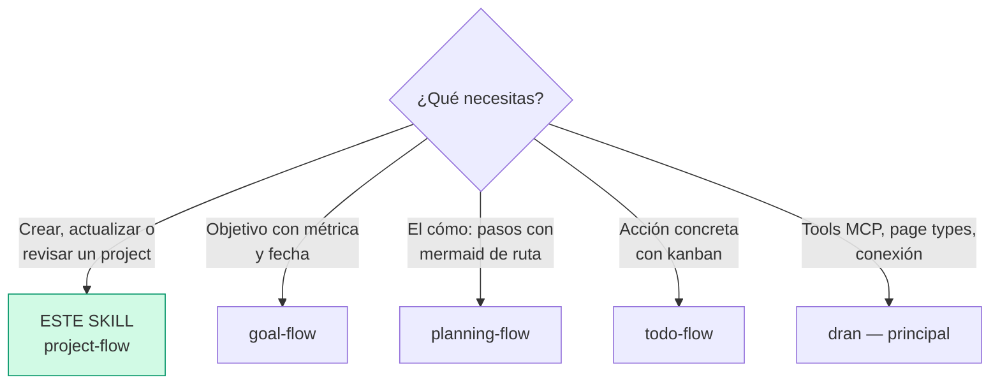
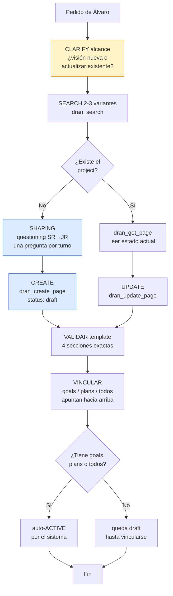
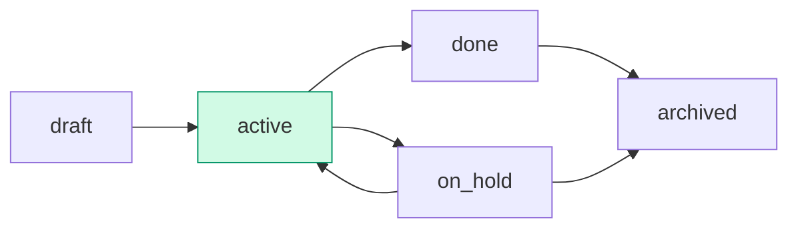

# project-flow — Crear y gestionar projects en Dran

El project es el nivel **estratégico**: visión y propósito. El "qué" y el
"para quién" — nunca el "cómo" (eso es `planning-flow`).

## Entry router



Ejecuta SOLO la sección a la que llegaste. Si el diagrama te manda a otro
skill, **paras aquí** y haces hand-off.

## Flujo operativo — sigue este DAG al pie de la letra



Cada nodo es un paso obligatorio: clarify primero, search antes de crear,
shaping con questioning, template de 4 secciones, y vinculación hacia arriba.

## Parse contract

### Qué CONSUME este skill
- Pedido de Álvaro: idea de proyecto, cambio de visión/alcance, revisión de
  project, o página project existente con su `meta` actual

### Qué PRODUCE este skill

| # | Artefacto | Propósito |
|---|-----------|-----------|
| 1 | Página `project` con 4 secciones exactas | Eje estratégico del trabajo |
| 2 | `meta` válido (status, priority, health, fechas) | Tracking y kanban de projects |
| 3 | Links entrantes (goals/plans/todos apuntan al project) | El project se activa y agrupa ejecución |

**Sin las 4 secciones el output está mal formado** — un project sin alcance
explícito crece sin freno; sin objetivo claro no hay forma de saber si va bien.

## Descripción del flujo

| Aspecto | Regla |
|---------|-------|
| Qué es | Visión y propósito. El "qué" y el "para quién" |
| Qué NO es | Arquitectura, código, pasos operativos → eso va en plans |
| Horizonte | Meses/años |
| Pregunta que responde | ¿Qué queremos lograr y por qué? |
| Título | Nombre funcional/descriptivo (no temático) |

**Regla de oro:** si una sección no aporta, no se pone. Métricas → goals,
pasos → plans, acciones → todos, decisiones/notas → pages note relacionadas.
El project es el eje estratégico, no el diario.

**Dirección de los links:** los niveles inferiores apuntan HACIA el project
(goal/plan/todo llevan `project_slug`). El project NUNCA lista sus hijos en
`meta` — la relación vive en los hijos.

## Shaping — questioning antes de crear

El contenido se arma **durante la conversación**, no rellenando el template a
ciegas. Cuestiona como un senior revisando la propuesta de un junior:

1. **Origen** — ¿de dónde salió? (alimenta `## Idea original`)
2. **Objetivo** — ¿qué se logra en 1-2 frases SIN el cómo?
3. **Para quién** — ¿quién lo usa o se beneficia?
4. **Anti-scope** — ¿qué NO incluye? (tan importante como lo que incluye)

Una pregunta bloqueante por turno — nunca un cuestionario. Si el pedido ya
trae la respuesta, no preguntes de nuevo (reusa el contexto).

## Template de contenido — 4 secciones, ni una más

| # | Sección | Propósito |
|---|---------|-----------|
| 1 | `## Idea original` | De dónde salió el chispazo, contexto del origen. No cambia con el tiempo |
| 2 | `## Objetivo` | Qué queremos lograr, 1-2 frases, SIN el cómo |
| 3 | `## Descripción` | Qué es y para quién. Resumen ejecutivo de un párrafo |
| 4 | `## Alcance` | Bullet list **Incluye** / **No incluye** (anti-scope explícito) |

```markdown
## Idea original

Dran v2 nació de la frustración de perder contexto entre sesiones del agente...

## Objetivo

Convertir Dran en el segundo cerebro operativo de Álvaro: captura, búsqueda
y ejecución de trabajo en un solo grafo.

## Descripción

Servidor MCP de knowledge-graph personal: páginas tipadas conectadas por
relaciones, operado por agentes vía MCP. Para Álvaro y sus agentes.

## Alcance

- Incluye: MCP server, 9 page types, agentes autónomos, web UI, kanban
- No incluye: mobile app, multi-tenant SaaS, sync con Notion/Obsidian
```

## Uso de Dran

### Meta clave

| Campo | Valores | Nota |
|-------|---------|------|
| `status` | draft / active / on_hold / done / archived | Ver status workflow |
| `priority` | low / medium / high / urgent | |
| `health` | green / yellow / red | Derivado de goals salvo manual |
| `health_source` | derived / manual | `manual` = Álvaro lo fija |
| `start_date` / `target_date` | ISO dates | |

### Recipe — crear

```
1. clarify alcance + shaping (ver § Shaping)
2. dran_search({ context: "personal", query: "<nombre>" })   → existe? UPDATE
3. dran_create_page({
     context: "personal",
     page_type: "project",
     title: "<nombre funcional>",
     body: "<4 secciones>",
     meta: {
       status: "draft",
       priority: "high",
       health: "green",
       start_date: "2026-08-01",
       target_date: "2026-12-31"
     },
     owner: "alvaro",
     created_by: "chaos manager"
   })
```

### Recipe — actualizar

```
1. dran_search el slug
2. dran_get_page para leer el estado actual
3. dran_update_page con el nuevo body/meta
4. Si el body tiene mermaid → pasar SOLO body (no meta) o se strippean
5. dran_reaugment_page si el contenido cambió significativamente
```

### Status workflow



- **create** → `draft`
- **auto-`active`** — cuando un goal/plan/todo se vincula (el sistema lo mueve)
- **`done` / `on_hold` / `archived`** — manual, solo cuando Álvaro lo pide
- **health** — derivado de los goals vinculados salvo `health_source: "manual"`

### Cuándo revisar un project

Cuando cambia la visión o el mercado. La revisión actualiza `## Objetivo` y
`## Alcance` — la `## Idea original` **no se toca** (es el registro histórico).

## Pitfalls

- **Meter el cómo** — arquitectura, stack, pasos → eso es `planning-flow`.
- **Métricas en el project** — los números van en goals; el project los hereda
  vía health derivado.
- **Diario en el body** — updates de progreso van en notes relacionadas o en
  los goals/todos, no en el project.
- **Links desde el project hacia abajo** — los hijos apuntan hacia arriba con
  `project_slug`; no listes hijos en el meta del project.
- **Crear sin search** — si ya existe, UPDATE; nunca un project duplicado con
  "v2" en el título.
- **Archivar sin clarify** — archive es recoverable, pero confirma antes.

## Quick reference

| Tool | Args mínimos | Retorna |
|------|--------------|---------|
| `dran_search` | `query` | Lista rankeada (excerpts) |
| `dran_get_page` | `slug` | Body markdown completo |
| `dran_create_page` | `page_type`, `title`, `body`, `meta` | Página creada + slug |
| `dran_update_page` | `slug` + campos a cambiar | Página actualizada |
| `dran_list_pages` | `type: "project"` | Lista filtrada |

## Cuándo NO usar este skill

- **El pedido tiene número + fecha** → `goal-flow`
- **El pedido es el cómo (pasos, arquitectura)** → `planning-flow`
- **Es una acción ejecutable ahora** → `todo-flow`
- **Es captura de conocimiento, no ejecución** → `note-taking-flow`

## Cross-references

- Referencia MCP (tools, page types, meta fields): `dran` — skill principal
- Goals que miden el project: `goal-flow`
- Plans que ejecutan el project: `planning-flow`
- Links `project_slug` y relaciones: `relations-flow`
