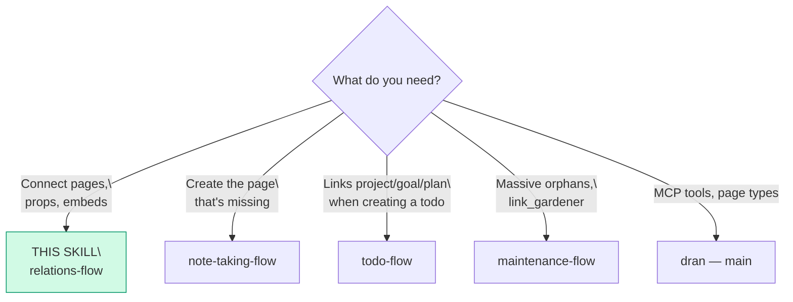
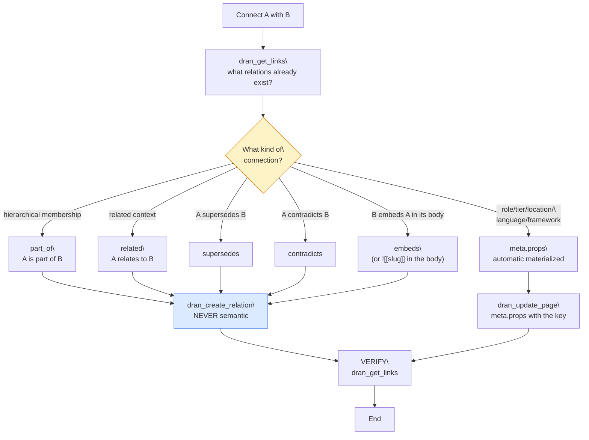

# relations-flow — Connecting pages in Dran

Relations are the heart of the graph: they feed PageRank, semantic search,
and communities. **Link liberally** — a well-connected page ranks better and
gets found on its own.

## Entry router



## Operational flow — follow this DAG to the letter



## Parse contract

### What this skill CONSUMES
- Two pages to connect (slugs) + the nature of their relation, or a page
  whose `meta.props` must materialize edges

### What this skill PRODUCES

| # | Artifact | Purpose |
|---|----------|---------|
| 1 | Explicit typed relation (`dran_create_relation`) | Directed edge with meaning |
| 2 | Materialized props (5 keys) | Automatic edges from meta |
| 3 | Embeds `![[slug]]` in bodies | Content visible in context |

**Creating `semantic` by hand is forbidden** — those are generated by the
augmenter automatically after every create/update.

## The relation types — when to use which

| Relation | Meaning | Example |
|----------|---------|---------|
| `related` | Related context (the most common) | note ↔ concept that inspires it |
| `part_of` | Hierarchical membership | todo → plan, concept → framework |
| `supersedes` | A replaces/supersedes B | new decision → old decision |
| `contradicts` | A contradicts B | two conflicting sources |
| `embeds` | B embeds A in its body | plan embeds architecture diagram |
| `semantic` | **Automatic** (augmenter) — never manual | — |

**Direction rule:** execution levels point UP — the todo/plan carries the
parent's slugs (`project_slug`, `goal_slug`, `plan_slug`); the parent NEVER
lists children in its meta.

### Materialized by props (automatic)

These 5 keys in `meta.props` create edges on their own during augmentation
(weight 0.7, they enter community detection):

| Prop key | Relation | Target page | Example |
|----------|----------|-------------|---------|
| `role` | `works_in` | entity | `role: "sales"` → works_in Sales |
| `tier` | `has_tier` | concept | `tier: "vip"` → has_tier VIP |
| `location` | `based_in` | entity | `location: "cdmx"` |
| `language` | `written_in` | entity | `language: "elixir"` |
| `framework` | `built_with` | entity | `framework: "phoenix"` |

**Any other key is stored without an edge** — it is passive metadata: you can
filter on it when searching, but the graph doesn't see it (neither PageRank
nor communities).

**Materializer limits** (verified in `lib/dran/props_materializer.ex`):
- Max **10 props** per page — the rest are ignored when materializing.
- **Strings only** as values — integers/booleans are ignored.
- Runs in the augmenter after every create/update (idempotent).
- **Backfill:** Settings → Brain → "Run backfill" re-materializes props of
  existing pages.

### Searching by props (AND)

Both `dran_search` and `dran_list_pages` accept `props` — the page must have
ALL the key-value pairs (AND logic):

```
dran_search({ query: "maria", props: { role: "sales" } })
dran_list_pages({ type: "entity", props: { role: "sales", tier: "vip" } })
```

- `dran_list_pages` filters in the DB (`meta->'props'->>key = value`);
  `dran_search` filters the ranked results.
- Works for the 5 materialized keys AND for custom keys.

### Independent slugs (link model)

Any page can carry `meta.project_slug` + `meta.goal_slug` +
`meta.plan_slug` — **0, 1, 2, or all 3**. Each one materializes its own
`part_of`. No precedence, no derivation. Orphans (no links) are legitimate
GTD-style inbox items — don't force it.

### Embeds

- `![[slug]]` in the body embeds the page (visible in context).
- `[[slug]]` wikilinks **don't exist** — only embeds with `!`.
- `dran_rename_slug` renames and **rewrites all `![[old]]`** in the context
  automatically.

## Using Dran

### Recipes

**Create an explicit relation:**
```
1. dran_get_links({ slug: "a" })   → does the relation already exist?
2. dran_create_relation({ source_slug: "a", target_slug: "b", relation_type: "part_of" })
   → REAL MCP params: source_slug / target_slug (NOT from/to)
   → real relation_type enum: related, contradicts, supersedes, part_of, embeds
     Prop-materialized types (works_in, has_tier, based_in, written_in,
     built_with) are NOT created by hand — they only come via meta.props
```

**Props that materialize:**
```
dran_create_page({ page_type: "entity", title: "María",
  meta: { kind: "person", props: { role: "sales", location: "cdmx" } } })
# → works_in→Sales and based_in→CDMX edges, automatic
```

**Embed in a body:**
```
dran_update_page({ slug: "plan-x",
  body: "...\n\n![[diagrama-arquitectura]]\n\n..." })
# body ONLY — with meta it would strip mermaid/embeds
```

**Delete a relation:**
```
dran_delete_relation({ source_slug: "a", target_slug: "b" })   → clarify if bulk
```

**Explore the neighborhood:**
```
dran_get_links({ slug: "a" })   → inbound + outbound
```

## Pitfalls

- **Creating `semantic` by hand** — forbidden; those belong to the augmenter.
- **Assuming precedence between slugs** — project/goal/plan are independent.
- **Forcing links on orphans** — the GTD inbox is legitimate; only connect
  what makes sense.
- **Downward links** — the parent doesn't list children; children point up.
- **`[[slug]]` without `!`** — doesn't exist; use embeds with `![[slug]]`.
- **Renaming embeds by hand** — `dran_rename_slug` rewrites them on its own.
- **Deleting relations in bulk without clarifying** — confirm first.

## Quick reference

| Tool | Minimal args | Returns |
|------|--------------|---------|
| `dran_get_links` | `slug` | Inbound + outbound |
| `dran_create_relation` | `source_slug`, `target_slug`, `relation_type` | Edge created |
| `dran_delete_relation` | `source_slug`, `target_slug` | Deleted |
| `dran_rename_slug` | `old_slug`, `new_slug` | Renamed + embeds rewritten |
| `dran_update_page` | `slug`, `meta.props` | Props → automatic edges |
| `dran_search` | `query`, `props` | Filters results by props (AND) |
| `dran_list_pages` | `type`, `props` | List filtered by props (AND) |

## When NOT to use this skill

- **The page doesn't exist yet** → `note-taking-flow` (create it first)
- **Massive orphans / automatic suggestions** → `maintenance-flow`
  (`link_gardener` agent)
- **Links when creating a todo** → `todo-flow` (slugs in `dran_create_todo`)

## Cross-references

- MCP reference (full relations table): `dran` — main skill
- Capturing pages to connect: `note-taking-flow`
- `link_gardener` proposes automatic relations: `maintenance-flow`
- Slugs in todos: `todo-flow`
