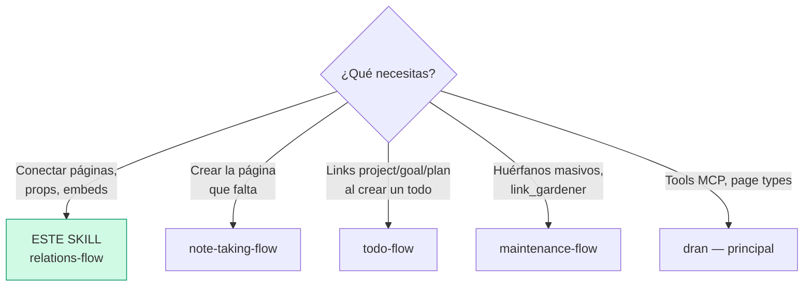
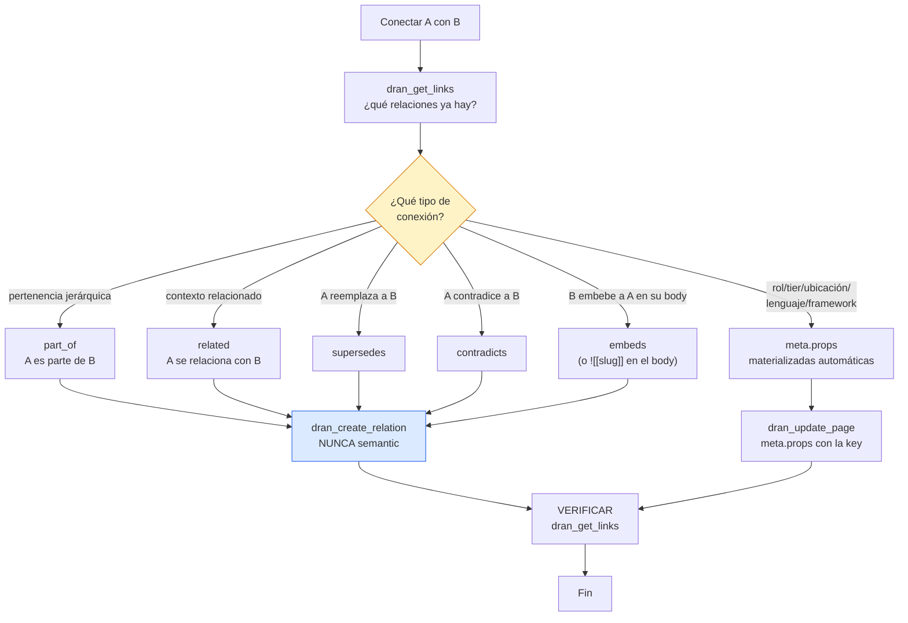

# relations-flow — Relacionar páginas en Dran

Las relaciones son el corazón del grafo: alimentan PageRank, la búsqueda
semántica y las comunidades. **Link liberally** — una página bien conectada
rankea mejor y se encuentra sola.

## Entry router



## Flujo operativo — sigue este DAG al pie de la letra



## Parse contract

### Qué CONSUME este skill
- Dos páginas a conectar (slugs) + la naturaleza de su relación, o una página
  cuyos `meta.props` deben materializar edges

### Qué PRODUCE este skill

| # | Artefacto | Propósito |
|---|-----------|-----------|
| 1 | Relación tipada explícita (`dran_create_relation`) | Edge dirigido con significado |
| 2 | Props materializadas (5 keys) | Edges automáticos desde meta |
| 3 | Embeds `![[slug]]` en bodies | Contenido visible en contexto |

**Crear `semantic` a mano está prohibido** — esas las genera el augmenter
automáticamente tras cada create/update.

## Los tipos de relación — cuándo cuál

| Relación | Significado | Ejemplo |
|----------|-------------|---------|
| `related` | Contexto relacionado (la más común) | note ↔ concept que inspira |
| `part_of` | Pertenencia jerárquica | todo → plan, concept → framework |
| `supersedes` | A reemplaza/supera a B | decisión nueva → decisión vieja |
| `contradicts` | A contradice a B | dos fuentes en conflicto |
| `embeds` | B embebe A en su body | plan embebe diagrama de arquitectura |
| `semantic` | **Automática** (augmenter) — nunca manual | — |

**Regla de dirección:** los niveles de ejecución apuntan HACIA ARRIBA — el
todo/plan lleva los slugs del superior (`project_slug`, `goal_slug`,
`plan_slug`); el superior NUNCA lista hijos en su meta.

### Materializadas por props (automáticas)

Estas 5 keys en `meta.props` crean edges solas durante la augmentación
(peso 0.7, entran a community detection):

| Prop key | Relation | Target page | Ejemplo |
|----------|----------|-------------|---------|
| `role` | `works_in` | entity | `role: "sales"` → works_in Sales |
| `tier` | `has_tier` | concept | `tier: "vip"` → has_tier VIP |
| `location` | `based_in` | entity | `location: "cdmx"` |
| `language` | `written_in` | entity | `language: "elixir"` |
| `framework` | `built_with` | entity | `framework: "phoenix"` |

**Cualquier otra key se guarda sin edge** — es metadata pasiva: se puede
filtrar al buscar, pero el grafo no la ve (ni PageRank ni communities).

**Límites del materializer** (verificado en `lib/dran/props_materializer.ex`):
- Máx **10 props** por página — el resto se ignora al materializar.
- **Solo strings** como valores — integers/booleans se ignoran.
- Corre en el augmenter tras cada create/update (idempotente).
- **Backfill:** Settings → Brain → "Run backfill" re-materializa props de
  páginas existentes.

### Buscar por props (AND)

Tanto `dran_search` como `dran_list_pages` aceptan `props` — la página debe
tener TODOS los pares key-value (lógica AND):

```
dran_search({ query: "maria", props: { role: "sales" } })
dran_list_pages({ type: "entity", props: { role: "sales", tier: "vip" } })
```

- `dran_list_pages` filtra en la DB (`meta->'props'->>key = value`);
  `dran_search` filtra los resultados rankeados.
- Funciona para las 5 keys materializadas Y para custom keys.

### Independent slugs (link model)

Cualquier página puede llevar `meta.project_slug` + `meta.goal_slug` +
`meta.plan_slug` — **0, 1, 2 o los 3**. Cada uno materializa su propio
`part_of`. Sin precedencia, sin derivación. Huérfanos (sin links) son
inbox items legítimos estilo GTD — no forzar.

### Embeds

- `![[slug]]` en el body embebe la página (visible en contexto).
- `[[slug]]` wikilinks **no existen** — solo embeds con `!`.
- `dran_rename_slug` renombra y **reescribe todos los `![[old]]`** del
  contexto automáticamente.

## Uso de Dran

### Recipes

**Crear relación explícita:**
```
1. dran_get_links({ slug: "a" })   → ¿ya existe la relación?
2. dran_create_relation({ from: "a", to: "b", relation_type: "part_of" })
```

**Props que materializan:**
```
dran_create_page({ page_type: "entity", title: "María",
  meta: { kind: "person", props: { role: "sales", location: "cdmx" } } })
# → edges works_in→Sales y based_in→CDMX automáticos
```

**Embeber en un body:**
```
dran_update_page({ slug: "plan-x",
  body: "...\n\n![[diagrama-arquitectura]]\n\n..." })
# SOLO body — con meta strippearía mermaid/embeds
```

**Borrar relación:**
```
dran_delete_relation({ from: "a", to: "b" })   → clarify si es masivo
```

**Explorar el vecindario:**
```
dran_get_links({ slug: "a" })   → inbound + outbound
```

## Pitfalls

- **Crear `semantic` a mano** — prohibido; son del augmenter.
- **Asumir precedencia entre slugs** — project/goal/plan son independientes.
- **Forzar links en huérfanos** — el inbox GTD es legítimo; relaciona solo lo
  que tiene sentido.
- **Links hacia abajo** — el superior no lista hijos; los hijos apuntan arriba.
- **`[[slug]]` sin `!`** — no existe; embeds con `![[slug]]`.
- **Renombrar a mano los embeds** — `dran_rename_slug` los reescribe solo.
- **Borrar relaciones masivamente sin clarify** — confirma primero.

## Quick reference

| Tool | Args mínimos | Retorna |
|------|--------------|---------|
| `dran_get_links` | `slug` | Inbound + outbound |
| `dran_create_relation` | `from`, `to`, `relation_type` | Edge creado |
| `dran_delete_relation` | `from`, `to` | Eliminado |
| `dran_rename_slug` | `old_slug`, `new_slug` | Renombrado + embeds reescritos |
| `dran_update_page` | `slug`, `meta.props` | Props → edges automáticos |
| `dran_search` | `query`, `props` | Filtra resultados por props (AND) |
| `dran_list_pages` | `type`, `props` | Lista filtrada por props (AND) |

## Cuándo NO usar este skill

- **La página no existe todavía** → `note-taking-flow` (crearla primero)
- **Huérfanos masivos / propuestas automáticas** → `maintenance-flow`
  (agente `link_gardener`)
- **Links al crear un todo** → `todo-flow` (slugs en `dran_create_todo`)

## Cross-references

- Referencia MCP (tabla completa de relaciones): `dran` — skill principal
- Captura de páginas a conectar: `note-taking-flow`
- `link_gardener` propone relaciones automáticas: `maintenance-flow`
- Slugs en todos: `todo-flow`
