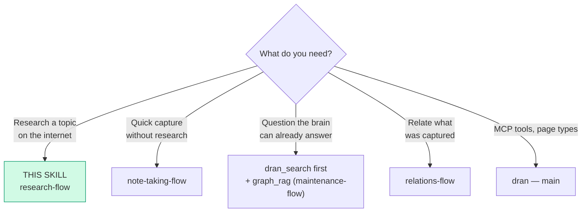
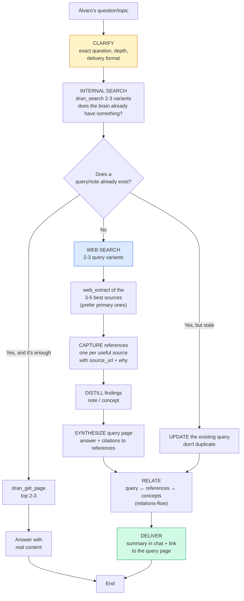

# research-flow — Research the internet and land it in Dran

Research = a bundle: **references** (sources) + a **query page** synthesized with
citations + distilled **concepts/notes**. The query page is the index that ties
everything together. A link saved without context is noise, not knowledge.

## Entry router



Before researching outside, search inside: if the brain already has the answer,
update that page instead of duplicating.

## Operational flow — follow this DAG to the letter



## Parse contract

### What this skill CONSUMES
- Álvaro's question or topic + agreed depth and delivery format

### What this skill PRODUCES

| # | Artifact | Purpose |
|---|-----------|-----------|
| 1 | `reference` per useful source (with `source_url` and the why) | Traceable sources |
| 2 | `query` page with the synthesized answer and citations | Reusable answer |
| 3 | Distilled `note`/`concept` | Knowledge that outlives the source |
| 4 | Relations between all of the above | The graph learns (PageRank) |

**A reference without a why is malformed** — if you don't know why you're
saving it, don't save it.

## Flow description

| Aspect | Rule |
|---------|-------|
| Primary sources first | Official docs, papers, repos, cited sources > blogs of blogs |
| Distill or die | The value is in what you extract, not the link |
| Internal vs external research | Internal (the brain) → `graph_rag`; external (internet) → this flow |
| One-off vs reusable | One-off question → answer in chat; answer worth reusing → query page |

**Why rule:** every reference is saved with a purpose ("what am I saving it
for?"). **Always link:** reference → concept/query/project it serves.

## Source management — where everything lives

| What | Type (kind) | Key fields |
|-----|-------------|--------------|
| Loose link / article | `reference` (article) | `source_url` |
| Paper | `reference` (paper) | `source_url`, `author`, `published_at` |
| Video / podcast | `reference` (video / podcast) | `source_url` |
| Book | `reference` (book) | `source_url`, `author` |
| Person/company/product behind the link | `entity` | `external_url`, `aliases` |
| Synthesized research | `query` | answer + citations |

**Media → transcribe before distilling:** video/podcast → transcribe (skills
`youtube-content` / `social-video-transcription`) → distill into a concept/note.
Paper → `web_extract` (supports PDFs) → distill.

**Browser bookmarks ≠ Dran** — bookmarks are the browser's quick access;
Dran is knowledge with context. Don't sync automatically — promote to
reference only what's worth it. Unused reference → archive (don't delete).

## Using Dran

### Recipes

**Capture a source:**
```
dran_create_page({
  context: "personal",
  page_type: "reference",
  title: "<source title>",
  body: "## Why\n\n<why I'm saving it, what it adds>\n\n## Key findings\n\n- ...",
  meta: { kind: "article", source_url: "https://...",
          props: { language: "elixir" } },
  owner: "alvaro", created_by: "chaos manager"  # owner from API key, created_by overrideable
})
```

**Synthesize the query page:**
```
dran_create_page({
  context: "personal",
  page_type: "query",
  title: "<the question>",
  body: "## Answer\n\n<synthesis with citations: according to [[slug-reference-1]]...>\n\n## Sources\n\n- ![[slug-reference-1]]\n- ![[slug-reference-2]]",
  meta: { kind: "conceptual", difficulty: "moderate", status: "answered", answered_by: "agent" }
})
# ⚠️ the field is status/answer_status: open/answered/verified — NOT "done"
```

**Relate:**
```
dran_create_relation({ source_slug: "<query-slug>", target_slug: "<reference-slug>", relation_type: "related" })
dran_create_relation({ source_slug: "<concept-slug>", target_slug: "<query-slug>", relation_type: "part_of" })
```

### Props when capturing (meta.props)

`meta.props` is a free key-value bag (strings only, max 10). The keys
`role`, `tier`, `location`, `language`, `framework` materialize automatic
edges (e.g. `language: "elixir"` → `written_in` → entity "elixir"); custom
keys are stored and filterable when searching, but don't generate an edge
(details in `relations-flow`).

**Where it's natural in research:** paper reference → `language`; entity of the
researched tool → `framework` + `language`; entity of the company →
`location` + `role`.

**Search by props (AND):**
```
dran_search({ query: "elixir", props: { language: "elixir" } })
dran_list_pages({ type: "reference", props: { language: "elixir" } })
```

**Internal brain research (no internet):** the `graph_rag` agent answers
with local/global/drift search and creates the query page with citations —
operation in `maintenance-flow`.

## Pitfalls

- **Answering from search excerpts** — `dran_get_page` before replying.
- **Saving links without a why** — noise, not knowledge.
- **Duplicating an existing query** — internal search first; if it exists, UPDATE.
- **Only blogs of blogs** — prefer primary sources (docs, papers, repos).
- **Query with `status: "done"`** — the field is `answer_status`
  (open/answered/verified).
- **Not citing** — a query page without cited references is unsupported opinion.
- **Syncing bookmarks recklessly** — promote to reference only what's worth it.

## Quick reference

| Tool | Minimal args | Returns |
|------|--------------|---------|
| `web_search` | `query` (2-3 variants) | Candidates |
| `web_extract` | URLs (3-5 best) | Clean content |
| `dran_search` | `query` | Do we already have it? |
| `dran_create_page` | `page_type: "reference"` / `"query"` | Page + slug |
| `dran_create_relation` | `source_slug`, `target_slug`, `relation_type` | Typed edge |

## When NOT to use this skill

- **The answer is already in the brain** → `dran_search` + `graph_rag`
- **Quick capture without sources** → `note-taking-flow`
- **You're going to implement code** → `coder-flow`

## Cross-references

- Capturing what was distilled: `note-taking-flow`
- Relations query ↔ references ↔ concepts: `relations-flow`
- `graph_rag` agent (internal research): `maintenance-flow`
- MCP reference: `dran` — main skill
