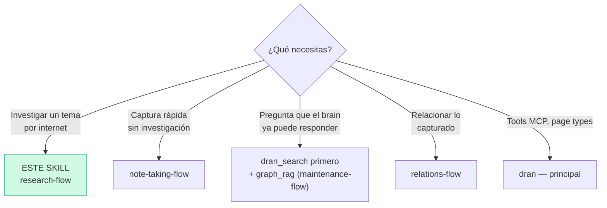
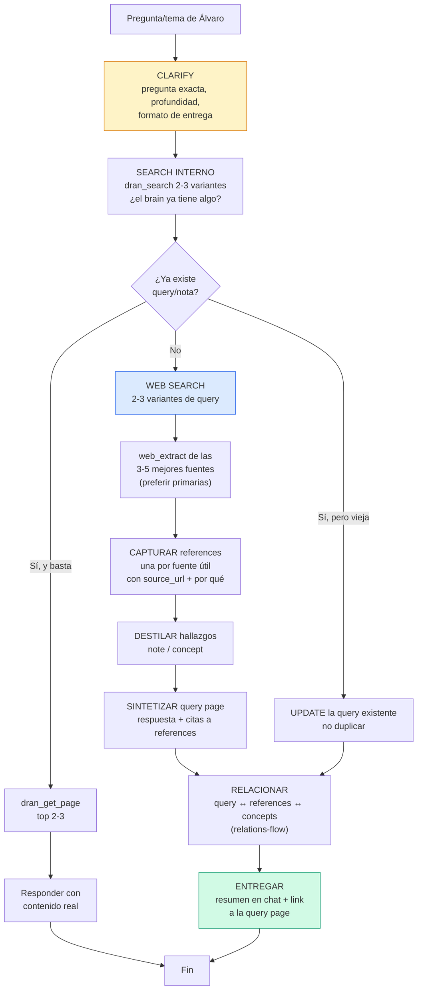

# research-flow — Investigar por internet y aterrizarlo en Dran

Research = conjunto: **references** (fuentes) + **query page** sintetizada con
citas + **concepts/notes** destilados. La query page es el índice que une todo.
Un link guardado sin contexto es ruido, no conocimiento.

## Entry router



Antes de investigar afuera, busca adentro: si el brain ya tiene la respuesta,
actualiza esa página en vez de duplicar.

## Flujo operativo — sigue este DAG al pie de la letra



## Parse contract

### Qué CONSUME este skill
- Pregunta o tema de Álvaro + profundidad y formato de entrega acordados

### Qué PRODUCE este skill

| # | Artefacto | Propósito |
|---|-----------|-----------|
| 1 | `reference` por fuente útil (con `source_url` y el por qué) | Fuentes trazables |
| 2 | `query` page con la respuesta sintetizada y citas | Respuesta reutilizable |
| 3 | `note`/`concept` destilados | Conocimiento que trasciende la fuente |
| 4 | Relaciones entre todo lo anterior | El grafo aprende (PageRank) |

**Una reference sin por qué está mal formada** — si no sabes para qué la
guardas, no la guardes.

## Descripción del flujo

| Aspecto | Regla |
|---------|-------|
| Fuentes primarias primero | Docs oficiales, papers, repos, fuentes citadas > blogs de blogs |
| Destilar o morir | El valor está en lo que extraes, no en el link |
| Research interno vs externo | Interno (el brain) → `graph_rag`; externo (internet) → este flujo |
| Una sola vez vs reutilizable | Pregunta de una vez → responde en chat; respuesta que vale reutilizar → query page |

**Regla del por qué:** toda reference se guarda con propósito ("¿para qué la
guardo?"). **Linkear siempre:** reference → concept/query/project al que sirve.

## Gestión de fuentes — dónde vive cada cosa

| Qué | Tipo (kind) | Campos clave |
|-----|-------------|--------------|
| Link suelto / artículo | `reference` (article) | `source_url` |
| Paper | `reference` (paper) | `source_url`, `author`, `published_at` |
| Video / podcast | `reference` (video / podcast) | `source_url` |
| Libro | `reference` (book) | `source_url`, `author` |
| Persona/empresa/producto del link | `entity` | `external_url`, `aliases` |
| Research sintetizado | `query` | answer + citas |

**Media → transcribir antes de destilar:** video/podcast → transcribir (skills
`youtube-content` / `social-video-transcription`) → destilar a concept/note.
Paper → `web_extract` (soporta PDFs) → destilar.

**Browser bookmarks ≠ Dran** — bookmarks son accesos rápidos del navegador;
Dran es conocimiento con contexto. No sincronizar automáticamente — promover
a reference solo lo que vale. Reference sin uso → archivar (no borrar).

## Uso de Dran

### Recipes

**Capturar una fuente:**
```
dran_create_page({
  context: "personal",
  page_type: "reference",
  title: "<título de la fuente>",
  body: "## Por qué\n\n<para qué la guardo, qué aporta>\n\n## Hallazgos clave\n\n- ...",
  meta: { kind: "article", source_url: "https://...",
          props: { language: "elixir" } },
  owner: "alvaro", created_by: "chaos manager"  # owner from API key, created_by overrideable
})
```

**Sintetizar la query page:**
```
dran_create_page({
  context: "personal",
  page_type: "query",
  title: "<la pregunta>",
  body: "## Respuesta\n\n<síntesis con citas: según [[slug-reference-1]]...>\n\n## Fuentes\n\n- ![[slug-reference-1]]\n- ![[slug-reference-2]]",
  meta: { kind: "conceptual", difficulty: "moderate", status: "answered", answered_by: "agent" }
})
# ⚠️ el campo es status/answer_status: open/answered/verified — NO "done"
```

**Relacionar:**
```
dran_create_relation({ from: "<query-slug>", to: "<reference-slug>", relation_type: "related" })
dran_create_relation({ from: "<concept-slug>", to: "<query-slug>", relation_type: "part_of" })
```

### Props al capturar (meta.props)

`meta.props` es un bag libre key-value (solo strings, máx 10). Las keys
`role`, `tier`, `location`, `language`, `framework` materializan edges
automáticos (ej. `language: "elixir"` → `written_in` → entity "elixir"); las
custom keys se guardan y se pueden filtrar al buscar, pero no generan edge
(detalle en `relations-flow`).

**Dónde natural en research:** reference de paper → `language`; entity de la
herramienta investigada → `framework` + `language`; entity de la empresa →
`location` + `role`.

**Buscar por props (AND):**
```
dran_search({ query: "elixir", props: { language: "elixir" } })
dran_list_pages({ type: "reference", props: { language: "elixir" } })
```

**Research interno del brain (sin internet):** el agente `graph_rag` responde
con local/global/drift search y crea la query page con citas — operación en
`maintenance-flow`.

## Pitfalls

- **Responder desde excerpts de search** — `dran_get_page` antes de contestar.
- **Guardar links sin por qué** — ruido, no conocimiento.
- **Duplicar una query existente** — search interno primero; si existe, UPDATE.
- **Solo blogs de blogs** — preferir fuentes primarias (docs, papers, repos).
- **Query con `status: "done"`** — el campo es `answer_status`
  (open/answered/verified).
- **No citar** — la query page sin references citadas es opinión sin soporte.
- **Sincronizar bookmarks a lo loco** — promover a reference solo lo que vale.

## Quick reference

| Tool | Args mínimos | Retorna |
|------|--------------|---------|
| `web_search` | `query` (2-3 variantes) | Candidatos |
| `web_extract` | URLs (3-5 mejores) | Contenido limpio |
| `dran_search` | `query` | ¿Ya lo tenemos? |
| `dran_create_page` | `page_type: "reference"` / `"query"` | Página + slug |
| `dran_create_relation` | `from`, `to`, `relation_type` | Edge tipado |

## Cuándo NO usar este skill

- **La respuesta ya está en el brain** → `dran_search` + `graph_rag`
- **Captura rápida sin fuentes** → `note-taking-flow`
- **Vas a implementar código** → `coder-flow`

## Cross-references

- Captura de lo destilado: `note-taking-flow`
- Relaciones query ↔ references ↔ concepts: `relations-flow`
- Agente `graph_rag` (research interno): `maintenance-flow`
- Referencia MCP: `dran` — skill principal
