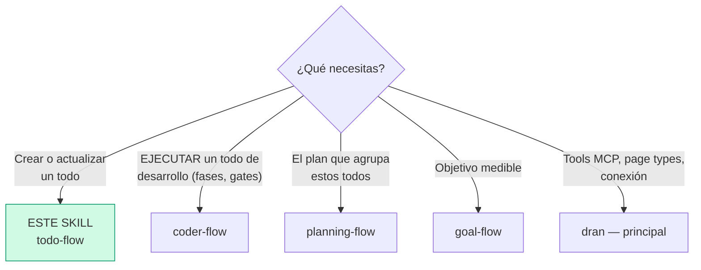
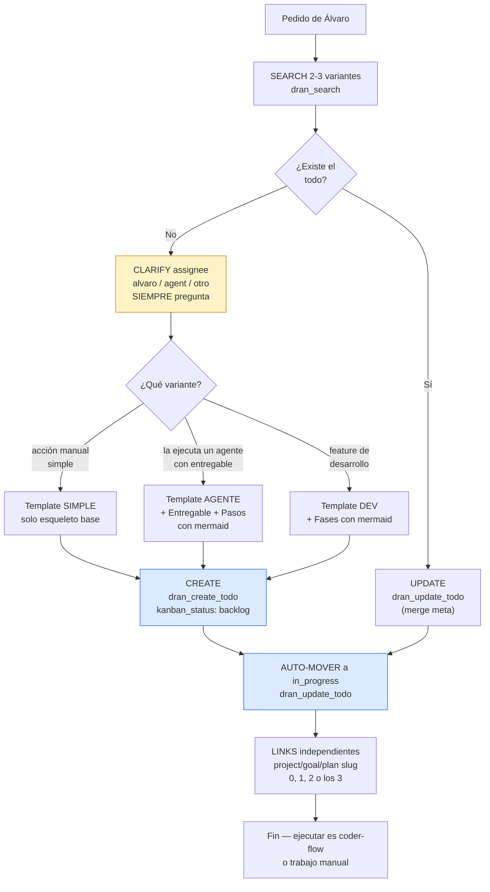
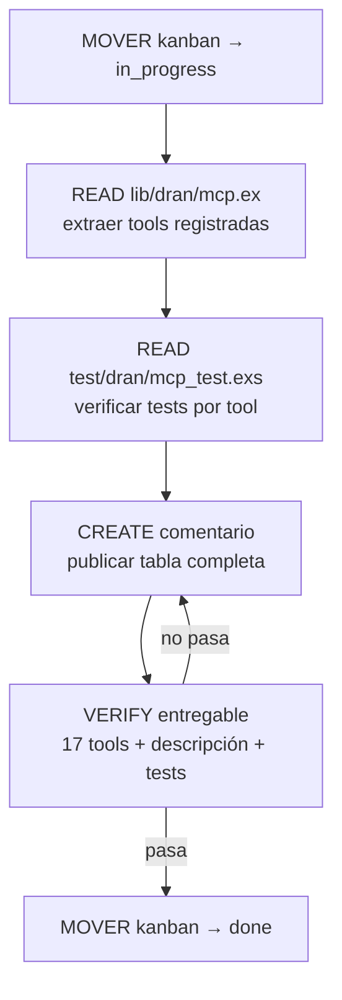
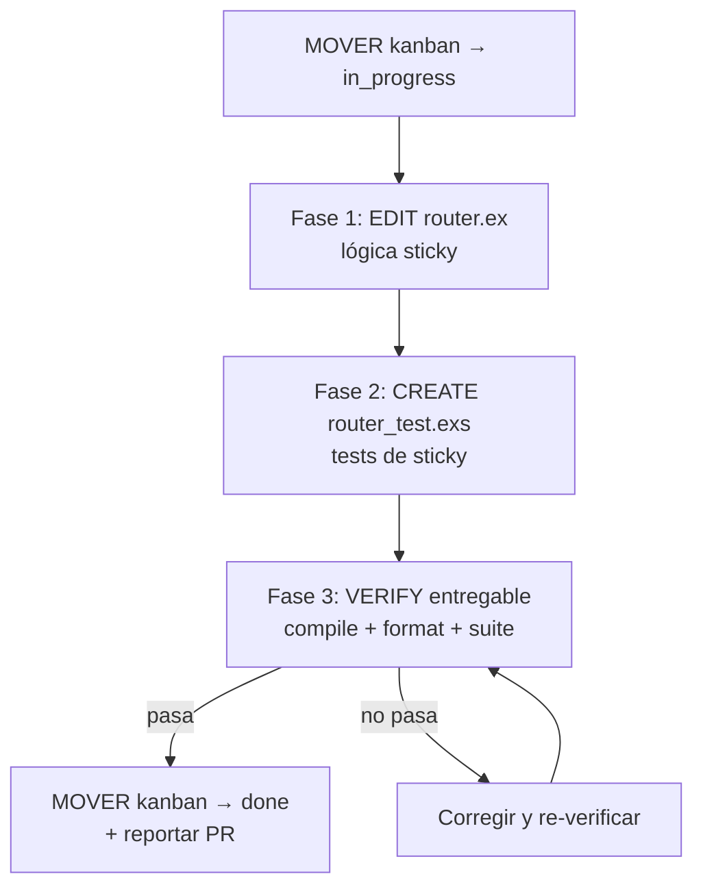
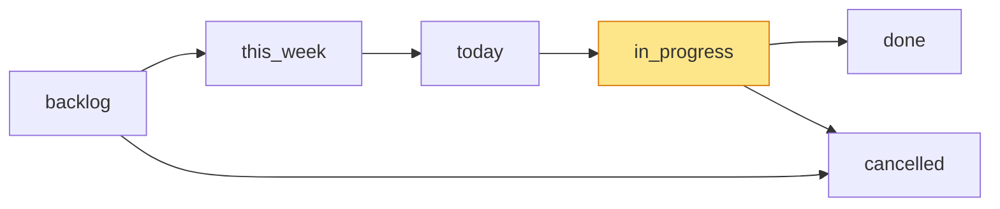

# todo-flow — Crear todos en Dran (dev y generales)

El todo es el nivel de **ejecución**: una acción verificable start-to-finish.
No micro-tasks — los pasos intermedios van como checklist interna del body,
nunca como todos hijos.

## Entry router



Este skill es para **escribir** todos bien formados. Si vas a **ejecutar** un
todo de desarrollo (fases, subagentes, gates), carga `coder-flow`.

## Flujo operativo — sigue este DAG al pie de la letra



Cada nodo es obligatorio: search antes de crear, **SIEMPRE clarify assignee**,
variante correcta de template, `dran_create_todo` (nunca `dran_create_page`),
auto-move a `in_progress`, y links solo si aplican (huérfanos son legítimos).

## Parse contract

### Qué CONSUME este skill
- Pedido de Álvaro: pendiente, tarea, acción, feature por hacer; o todo
  existente con su `meta` y checklist actual

### Qué PRODUCE este skill

| # | Artefacto | Propósito |
|---|-----------|-----------|
| 1 | Todo con esqueleto base (`## Qué hacer` + `## Cómo verificar`) | Acción ejecutable y verificable |
| 2 | `meta` válido (kanban_status, priority, assignee, kind) | Kanban y asignación correctos |
| 3 | Status en `in_progress` tras crear | El trabajo empieza ya |
| 4 | Links independientes (0-3 slugs) | Ubicación estratégica opcional |

**Un todo sin `## Cómo verificar` está mal formado** — sin criterios de done
no hay forma honesta de cerrarlo.

## Descripción del flujo

| Aspecto | Regla |
|---------|-------|
| Qué es | Acción verificable start-to-finish |
| Horizonte | Horas/días |
| Pregunta que responde | ¿Qué hago exactamente ahora? |
| Tamaño | UN todo = UNA acción completa. Las fases son DENTRO del todo, no todos aparte |

**Reglas de oro:**

1. **Anti-micro:** los pasos intermedios van como checklist interna del body
   (checkboxes), nunca como todos hijos.
2. **`done` solo con verificación real** — todos los checks verdes + evidencia
   (tests, commits, entregable). Nunca "ya casi".
3. **Huérfanos legítimos** — un todo sin links es un inbox item estilo GTD.
   No forzar `project_slug`/`goal_slug`/`plan_slug` si no aplican.
4. **Un `in_progress` a la vez** — si vas a empezar otro, mueve el actual
   primero.
5. **Pasos de ejecución con mermaid** — variantes 2 y 3: los pasos van como
   diagrama mermaid con verbos (`READ` / `EDIT` / `CREATE` / `RUN` / `VERIFY`
   / `ASK`), descritos uno por uno; el último paso SIEMPRE valida el
   entregable, y el flujo mueve el kanban (`in_progress` → `done`).

## Shaping — questioning antes de crear

1. **Assignee** — SIEMPRE clarify: ¿alvaro, agent, otro? (sin excepción)
2. **Variante** — ¿manual simple, agente con entregable, o feature de
   desarrollo con fases?
3. **Verificación** — ¿cómo se comprueba que quedó? (alimenta
   `## Cómo verificar`)
4. **Links** — ¿pertenece a un project/goal/plan? Solo si es obvio del
   contexto; si no, huérfano.

Una pregunta bloqueante por turno. El assignee NO es negociable — siempre se
pregunta, aunque parezca obvio.

## Templates de contenido

### Esqueleto base (TODOS los todos, sin excepción)

| # | Sección | Propósito |
|---|---------|-----------|
| 1 | `## Qué hacer` | La acción concreta, verbo + objeto |
| 2 | `## Cómo verificar` | Checklist de criterios de done observables |

### Variante 1 — Simple (manual)

Solo el esqueleto. Ejemplo: "Comprar boletos" → verificar boletos en inbox.

```markdown
## Qué hacer

Comprar los boletos de avión Mérida–CDMX para el 15 de septiembre.

## Cómo verificar

- [ ] Boletos en el correo / app de la aerolínea
- [ ] Fecha y horario correctos
```

### Variante 2 — Agente con entregable

Esqueleto **+** `## Entregable` **+** `## Pasos de ejecución` (mermaid de
verbos + descripción). El mermaid es el **flujo dependiente/secuencial** del
pedido: nodos con verbo (`READ` / `RUN` / `CREATE` / `VERIFY`), el último
paso SIEMPRE valida el entregable, y el flujo mueve el kanban
(`in_progress` → `done`):

```markdown
## Qué hacer

Auditar las 17 tools MCP actuales y listar su estado de documentación.

## Entregable

Comentario en este todo con la lista completa: tool, descripción, tests
existentes.

## Pasos de ejecución



1. **MOVER kanban → in_progress** — el todo arranca en ejecución.
2. **READ lib/dran/mcp.ex** — extraer las tools registradas.
3. **READ test/dran/mcp_test.exs** — verificar cobertura de tests por tool.
4. **CREATE comentario** — publicar la tabla tool/descripción/tests.
5. **VERIFY entregable** — el comentario cumple los criterios de
   `## Cómo verificar`; si no pasa, corregir y re-verificar.
6. **MOVER kanban → done** — solo con la validación en verde.

## Cómo verificar

- [ ] Lista completa en comentario (17 tools)
- [ ] Cada tool tiene descripción
- [ ] Tests existentes identificados por tool
```

### Variante 3 — Feature de desarrollo (con fases)

Esqueleto **+** `## Entregable` **+** mermaid `## Fases` **+** detalle por
fase **+** verificación global del entregable. Los pasos de ejecución SON
las fases: el mermaid es el DAG (nodos = fases con verbo, flechas =
dependencias), cada fase se describe con qué cambia (código) y cómo se
prueba, el último paso SIEMPRE valida el entregable y el flujo mueve el
kanban. Fases **disjuntas** (archivos distintos) o serializadas.

```markdown
## Qué hacer

Implementar routing sticky: las requests de un member caen siempre al mismo
upstream.

## Entregable

PR con la lógica de routing + tests verdes.

## Fases



### Fase 1: EDIT router.ex — lógica sticky

**Qué cambia:** `router.ex` gana selección sticky por member.

**Instrucciones (verbos):**
1. READ lib/routing/router.ex — leer la selección de upstream actual
2. EDIT lib/routing/router.ex — agregar selección sticky por member
3. RUN mix format lib/routing/router.ex

**Snippet de código** (real, verificado contra el repo — nunca inventado):
```elixir
# lib/.../router.ex — fragmento actual que se modifica o imita
```

**Cómo validar:**
- [ ] `mix test test/.../router_test.exs` pasa

## Cómo verificar (global)

- [ ] `mix compile --warnings-as-errors` pasa
- [ ] Suite completa verde
- [ ] Diff solo toca archivos del scope
- [ ] Entregable (PR) existe y es revisable
```

**La ejecución de estas fases** (despacho de subagentes, gates entre fases,
vocabulario de verbos) vive en `coder-flow` — este skill solo define cómo se
escribe el todo.

## Uso de Dran

### Meta clave

| Campo | Valores | Nota |
|-------|---------|------|
| `kind` | personal / coding / business / learning / health / finance / other / investing / marketing / product / writing / career / relationship / travel | |
| `kanban_status` | backlog / this_week / today / in_progress / done / cancelled | Ver kanban |
| `priority` | low / medium / high / urgent | |
| `assignee` | alvaro / agent / otro | SIEMPRE clarify |
| `due_date` | ISO date | Opcional |
| `project_slug` / `goal_slug` / `plan_slug` | slugs | Independientes, 0-3 |

### Recipe — crear

```
1. clarify assignee → alvaro / agent / otro        (SIEMPRE)
2. dran_search({ context: "personal", query: "<pendiente>" })   → existe? UPDATE
3. dran_create_todo({
     context: "personal",
     title: "<verbo + objeto>",
     body: "<template según variante>",
     kanban_status: "backlog",
     priority: "high",
     assignee: "alvaro",
     project_slug: "<project>",   → opcional, independiente
     goal_slug: "<goal>",         → opcional, independiente
     plan_slug: "<plan>"          → opcional, independiente
   })
4. dran_update_todo({ slug: "<slug>", kanban_status: "in_progress" })   → auto-move
```

### Recipe — actualizar status / checklist

```
1. Status SIEMPRE con dran_update_todo (MERGE meta)
   → NUNCA dran_update_page para todos (REPLACE meta, rompe campos)
2. Checkboxes del body: dran_update_page pasando SOLO body
3. done: marcar SOLO cuando todos los criterios pasan + evidencia real
```

### Kanban



- **create** → `backlog`, auto-move inmediato a `in_progress`
- **Un `in_progress` a la vez** por persona
- **`done`** — solo tras verificación real (checks + evidencia)
- **`cancelled`** — con razón en el body si aplica

## Operación continua (contrato del agente)

- **Marcar checkboxes** conforme se cumplen criterios (update SOLO body).
- **`done` solo con TODOS los checks verdes** + verificación real (tests,
  commits, entregable) — nunca marcar por marcar.
- **Plan padre** → cuando TODOS los todos vinculados están done/cancelled,
  el plan auto-cierra; reportarlo a Álvaro.
- **Goal padre** → el progress se recalcula solo desde los todos (salvo
  `progress_manual`).
- **Clarify ante la duda** — criterios ambiguos, entregable borroso,
  assignee incierto: pregunta, no adivines.

## Pitfalls

- **`dran_create_page` para todos** — SIEMPRE `dran_create_todo`.
- **`dran_update_page` para status** — REEMPLAZA meta y rompe campos; status
  SIEMPRE con `dran_update_todo` (merge).
- **Crear sin clarify assignee** — aunque parezca obvio, se pregunta.
- **Olvidar el auto-move** — crear en backlog y dejarlo ahí; mover a
  `in_progress` al crear.
- **Micro-tasks como todos** — pasos de una acción van como checklist interna.
- **Forzar links** — un todo huérfano es legítimo (inbox GTD).
- **`done` sin evidencia** — checks verdes + tests/commits/entregable real.
- **Más de un `in_progress`** — mover el actual antes de empezar otro.

## Quick reference

| Tool | Args mínimos | Retorna |
|------|--------------|---------|
| `dran_create_todo` | `title`, `assignee`, `kanban_status` | Todo creado + slug |
| `dran_update_todo` | `slug` + campos (merge meta) | Todo actualizado |
| `dran_update_page` | `slug`, `body` (SOLO body, checkboxes) | Body actualizado |
| `dran_search` | `query`, `type: "todo"` | Lista rankeada |
| `dran_list_pages` | `type: "todo"`, `status` / `assignee` | Lista filtrada |

## Cuándo NO usar este skill

- **Vas a EJECUTAR el todo de desarrollo** → `coder-flow`
- **Agrupar todos en una ejecución** → `planning-flow`
- **El pedido tiene métrica + fecha** → `goal-flow`
- **Es captura de conocimiento** → `note-taking-flow`

## Cross-references

- Referencia MCP: `dran` — skill principal
- Plan que lista estos todos: `planning-flow`
- Ejecución de todos de desarrollo: `coder-flow`
- Goal que recibe progress de los todos: `goal-flow`
- Links independientes: `relations-flow`
