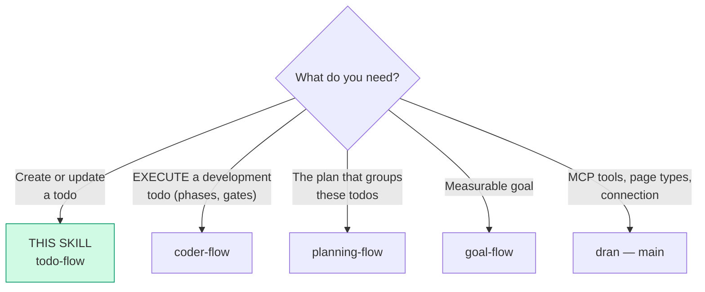
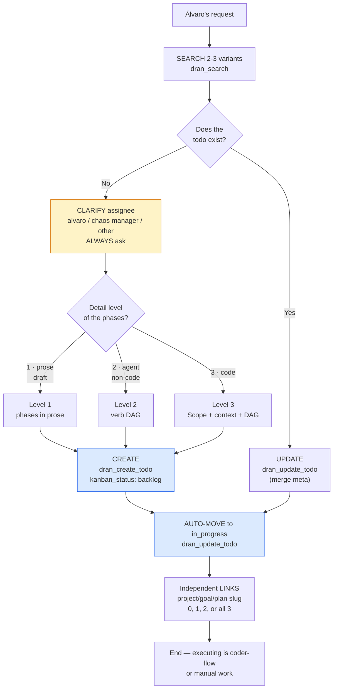
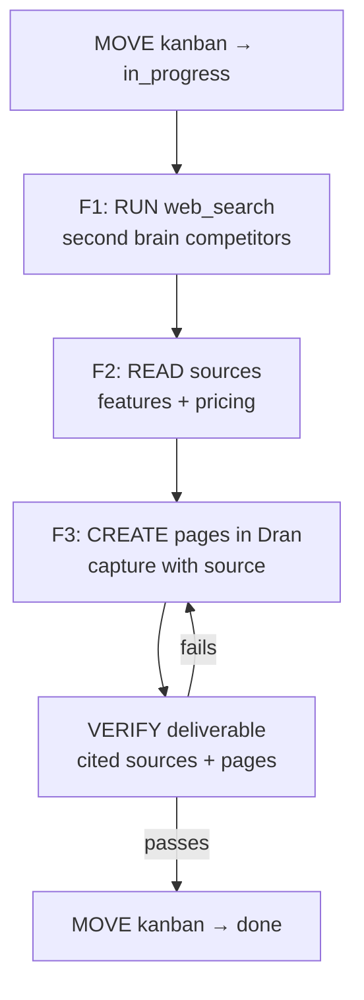
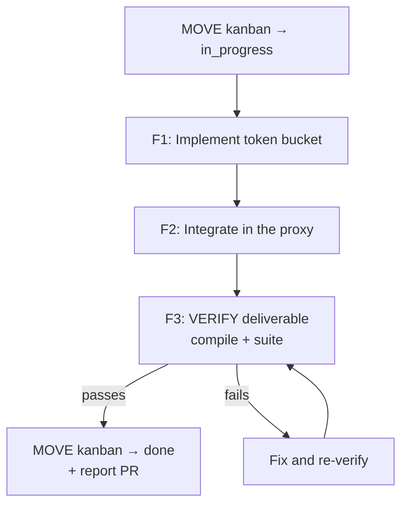
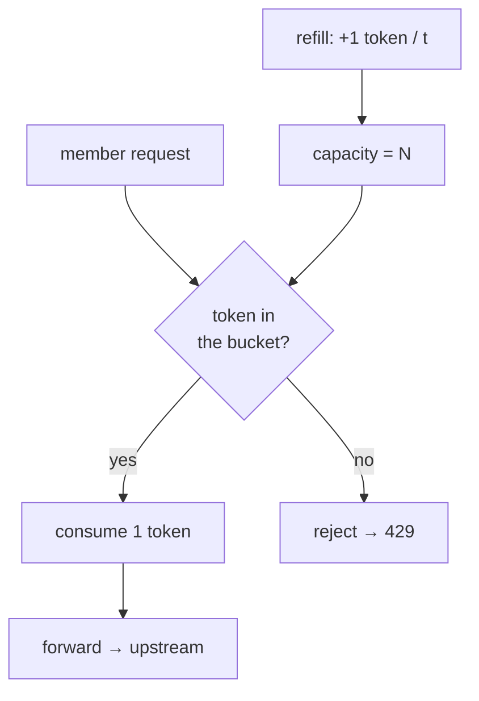
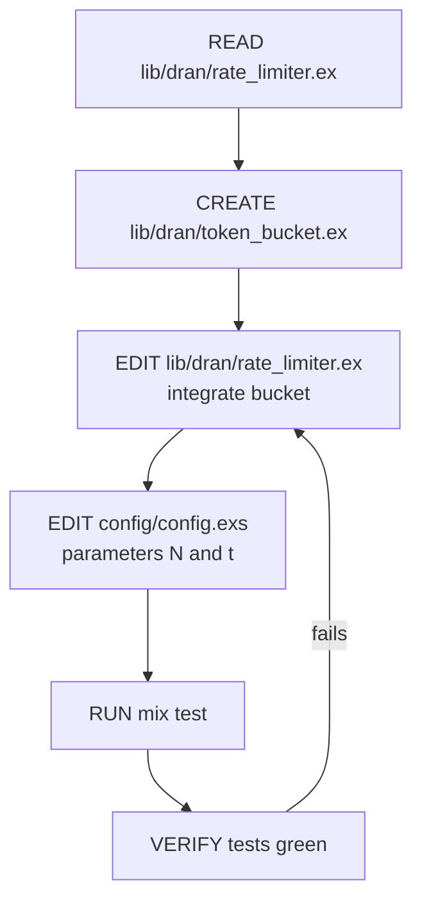
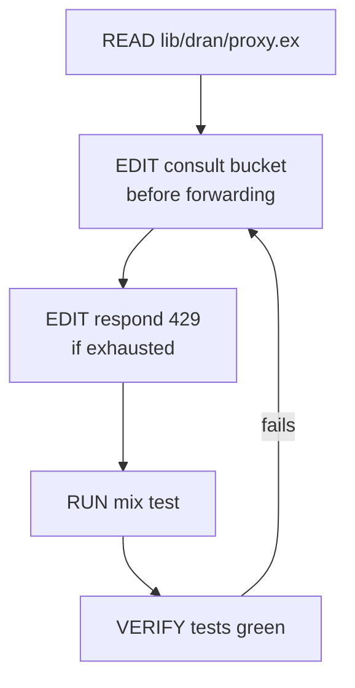
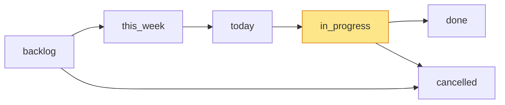

# todo-flow — Create todos in Dran

The todo is the **execution** level: a verifiable action start-to-finish.
No micro-tasks — intermediate steps go as phases of the todo itself, never
as child todos.

## Entry router



This skill is for **writing** well-formed todos. If you're going to **execute** a
development todo (phases, subagents, gates), load `coder-flow`.

## Canonical model — every todo, no exceptions

Every todo carries exactly **3 sections**, always in this order:

| Section | How many | What it is |
|---|---|---|
| `## Goal` | 1 | the deliverable, clear, in one simple sentence |
| `## Phases` | 1+ | atomic changes to achieve that goal |
| `## Verification` | 1 | checklist of how we validate it's done |

- The **Goal** is just ONE: a sentence that already names the deliverable. There
  is no separate "Deliverable" section — the goal IS the deliverable.
- The **Phases** are atomic changes: each phase produces an increment of the
  deliverable. They can be prose or a diagram (see levels below).
- The **Verification** is the validation checklist: what I check to declare
  "done". It is not filled during execution — it's the *plan* of validation.

**A todo without the 3 sections is malformed.**

### The todo's `## Goal` is NOT a goal nor the plan's objective

A **goal** is a **measurable** objective (metric + date). A **plan** is the
**strategic/tactical** part for executing something. The todo's `## Goal` is an
**execution action**: it contributes to a plan/goal/project, but it ISN'T that
plan or that goal. Hierarchy: `goal` (measurable) → `plan` (how) → `todo` (action).

## The 3 detail levels of the Phases

What distinguishes todos is **not the type**, but the **detail level of the
phases** (and therefore what you validate). A todo can be born at level 1 as a
**draft** and extend to level 2 or 3 when how it executes is defined.

### Level 1 — Prose

Phases described in prose: what to do, one or two lines per phase.
For manual or simple actions. **It's the default draft.**

### Level 2 — DAG (instruction for an agent, non-code)

Phases = a **verb DAG** (mermaid) + a description per phase. For instructions
to an agent about non-code work: research, capture, reports, audits. The DAG is
the dependent/sequential flow.

### Level 3 — Code

Phases = high-level DAG + **per phase**: `Scope` (files), `Context` (what
exists now), `What changes` (+ mermaid of the *algorithm* if the logic is
non-trivial) and `Instruction DAG` (verbs). For development features.

**Code → smoke test always, before commit:** boot/runtime check that touches
what changed (starts the server, mounts the route, exercises the path) — it's
not optional, it complements unit tests.

| Level | Phase content | What you validate |
|---|---|---|
| 1 · Prose | what to do (text) | observational |
| 2 · DAG | verb DAG + description | the deliverable |
| 3 · Code | Scope + context + algorithm + instruction DAG | technical gates (compile/test/smoke/diff) |

## Operational flow — follow this DAG to the letter



Every node is mandatory: search before creating, **ALWAYS clarify assignee**,
correct detail level, `dran_create_todo` (never `dran_create_page`), auto-move
to `in_progress`, and links only if they apply (orphans are legitimate).

## Parse contract

### What this skill CONSUMES
- Álvaro's request: pending item, task, action, feature to do; or an existing
  todo with its `meta` and current body

### What this skill PRODUCES

| # | Artifact | Purpose |
|---|-----------|-----------|
| 1 | Todo with `## Goal` + `## Phases` + `## Verification` | Executable and verifiable action |
| 2 | Valid `meta` (kanban_status, priority, assignee, kind) | Correct Kanban and assignment |
| 3 | Status in `in_progress` after creating | Work starts right away |
| 4 | Independent links (0-3 slugs) | Optional strategic placement |

**A todo without `## Verification` is malformed** — without done criteria
there's no honest way to close it.

## Content templates

### Canonical skeleton (all levels)

````markdown
## Goal

<deliverable in one simple sentence>

## Phases

<1 or more phases, atomic changes — according to the level>

## Verification

- [ ] <validation criterion>
````

### Level 1 — Prose (draft)

Phases in prose. It's the starting point and serves as a draft to extend later.

````markdown
## Goal

Mérida–CDMX plane tickets bought for September 15.

## Phases

### Phase 1 — Search flights
Search the airline's options for the date, compare times and price.

### Phase 2 — Buy
Buy the ticket with the card and confirm the reservation email.

## Verification

- [ ] Tickets in the airline's email / app
- [ ] Date and time correct
````

### Level 2 — DAG (instruction for an agent, non-code)

Phases = verb DAG + description per phase. The DAG is the
dependent/sequential flow; the last node validates the deliverable and moves
the kanban.

````markdown
## Goal

Competitor report on second brain tools, captured in Dran with cited sources.

## Phases



### Phase 1 — RUN web_search
Search for second brain tool competitors (Obsidian, Notion, Roam, Logseq, …).

### Phase 2 — READ sources
Read each source and extract features, pricing, and differentiator.

### Phase 3 — CREATE pages in Dran
Capture each competitor as a page with the cited source (URL).

## Verification

- [ ] Key competitors documented
- [ ] Each competitor with cited source (URL)
- [ ] Pages created in Dran and linked to the project
````

### Level 3 — Code

High-level DAG + per phase: `Scope` (files, 1 or several), `Context` (what
exists now), `What changes` (+ mermaid of the *algorithm* if the logic warrants
it) and `Instruction DAG` (verbs). Phases **disjoint** (different files) or
serialized.

````markdown
## Goal

PR with per-member rate limiting using token bucket: each member consumes
tokens and receives 429 when exhausted.

## Phases



### Phase 1 — Implement token bucket

**Scope:** `lib/dran/token_bucket.ex` · `lib/dran/rate_limiter.ex` · `config/config.exs`

**Context (what exists now):** there is no rate limiting; requests go straight
to the upstream without per-member control.

**What changes — the algorithm:** token bucket: each member has a bucket with
capacity N and a refill of 1 token every t. Before forwarding, one token is
consumed; no token → 429.



**Instruction DAG:**



### Phase 2 — Integrate in the proxy

**Scope:** `lib/dran/proxy.ex`

**Context (what exists now):** the proxy forwards without consulting rate
limiting.

**What changes:** before forwarding, consult the member's bucket; if exhausted,
respond 429.

**Instruction DAG:**



## Verification

- [ ] `mix compile --warnings-as-errors` passes
- [ ] `mix test test/dran/rate_limiter_test.exs` green
- [ ] Diff only touches scope files
- [ ] Smoke: exhausted member receives 429
````

**The execution of these phases** (subagent dispatch, gates between phases,
verb vocabulary) lives in `coder-flow` — this skill only defines how the todo
is written.

## Golden rules

1. **Anti-micro:** intermediate steps go as phases of the todo, never as child
   todos.
2. **Verify BEFORE commit, never after** — the verification (compile / test /
   format / smoke) runs and stays green BEFORE committing; the commit is the
   consequence of green, not something validated later. `done` only when the
   whole deliverable is verified and committed. Never "almost there".
3. **Legitimate orphans** — a todo without links is a GTD-style inbox item.
4. **One `in_progress` at a time** — if you're going to start another one, move
   the current one.
5. **Extensible:** a level 1 (draft) can be extended to level 2 or 3 when how
   it executes is defined. Don't rewrite the goal — only detail the phases and
   fine-tune the verification.
6. **Atomic phases:** each phase is an atomic change toward the deliverable. At
   level 2/3, nodes use only the 6 verbs (`READ` / `EDIT` / `CREATE` / `RUN` /
   `VERIFY` / `ASK`); the last node always validates.
7. **Code → mandatory smoke test:** every level 3 (code) todo carries a smoke
   test before each commit (boot/runtime that touches what changed), not just
   unit tests.

## Shaping — questioning before creating

1. **Assignee** — ALWAYS clarify: alvaro, agent, other? (no exceptions)
2. **Detail level** — prose (draft), DAG (agent), or code?
3. **Verification** — how do you check it's done? (feeds `## Verification`)
4. **Links** — does it belong to a project/goal/plan? Only if obvious.

One blocking question per turn. The assignee is NOT negotiable — always ask,
even if it seems obvious.

## Using Dran

### Key meta

| Field | Values | Note |
|-------|---------|------|
| `kind` | personal / coding / business / learning / health / finance / other / investing / marketing / product / writing / career / relationship / travel | |
| `kanban_status` | backlog / this_week / today / in_progress / done / cancelled | See kanban |
| `priority` | low / medium / high / urgent | |
| `assignee` | alvaro / chaos manager / other | ALWAYS clarify |
| `due_date` | ISO date | Optional |
| `project_slug` / `goal_slug` / `plan_slug` | slugs | Independent, 0-3 |

### Recipe — create

```
1. clarify assignee → alvaro / chaos manager / other        (ALWAYS)
2. dran_search({ context: "personal", query: "<pending>" })   → exists? UPDATE
3. dran_create_todo({
     context: "personal",
     title: "<verb + object>",
     body: "<template per level>",
     kanban_status: "backlog",
     priority: "high",
     assignee: "alvaro",
     project_slug: "<project>",   → optional, independent
     goal_slug: "<goal>",         → optional, independent
     plan_slug: "<plan>"          → optional, independent
   })
4. dran_update_todo({ slug: "<slug>", kanban_status: "in_progress" })   → auto-move
```

### Recipe — update status / checklist

```
1. Status ALWAYS with dran_update_todo (MERGE meta)
   → NEVER dran_update_page for todos (REPLACE meta, breaks fields)
2. Body checkboxes: dran_update_page passing ONLY body
3. done: mark ONLY when all criteria pass + real evidence
```

### Kanban



- **create** → `backlog`, immediate auto-move to `in_progress`
- **One `in_progress` at a time** per person
- **`done`** — only after real verification (checks + evidence)
- **`cancelled`** — with a reason in the body if applicable

## Pitfalls

- **`dran_create_page` for todos** — ALWAYS `dran_create_todo`.
- **`dran_update_page` for status** — REPLACES meta and breaks fields; status
  ALWAYS with `dran_update_todo` (merge).
- **Creating without clarify assignee** — even if it seems obvious, ask.
- **Forgetting the auto-move** — creating in backlog and leaving it there.
- **Micro-tasks as todos** — steps of an action go as phases.
- **Forcing links** — an orphan todo is legitimate (GTD inbox).
- **`done` without evidence** — green checks + tests/commits/real deliverable.
- **More than one `in_progress`** — move the current one before starting
  another.
- **Without the 3 sections** — `Goal` + `Phases` + `Verification` are mandatory
  in EVERY todo.

## Quick reference

| Tool | Minimal args | Returns |
|------|--------------|---------|
| `dran_create_todo` | `title`, `assignee`, `kanban_status` | Created todo + slug |
| `dran_update_todo` | `slug` + fields (merge meta) | Updated todo |
| `dran_update_page` | `slug`, `body` (ONLY body, checkboxes) | Updated body |
| `dran_search` | `query`, `type: "todo"` | Ranked list |
| `dran_list_pages` | `type: "todo"`, `status` / `assignee` | Filtered list |

## When NOT to use this skill

- **You're going to EXECUTE the development todo** → `coder-flow`
- **Grouping todos into an execution** → `planning-flow`
- **The request has a metric + date** → `goal-flow`
- **It's knowledge capture** → `note-taking-flow`

## Cross-references

- MCP reference: `dran` — main skill
- Plan that lists these todos: `planning-flow`
- Execution of development todos: `coder-flow`
- Goal that receives progress from the todos: `goal-flow`
- Independent links: `relations-flow`
- Vocabulary of 6 verbs and mermaid as contract: `riel-contract`
- Local state (`✓NN`) during execution: `riel-ledger`
