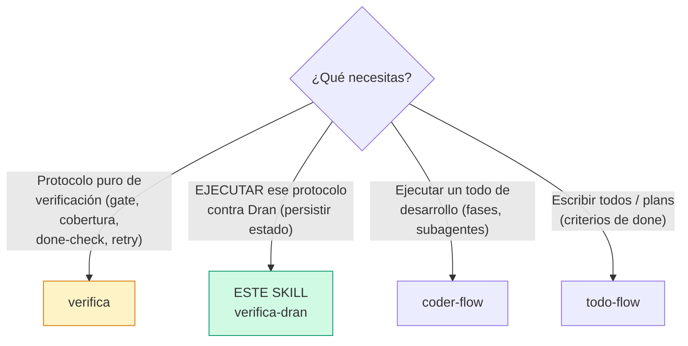
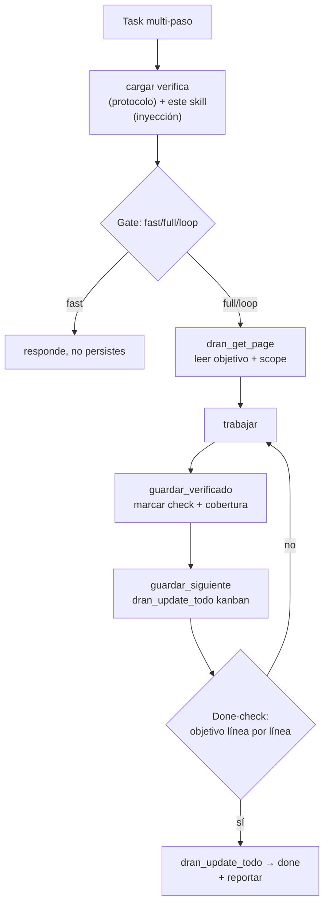

# verifica-dran — Adaptador de verifica para Dran

Conecta el protocolo `verifica` (verificación y cierre) con Dran. **No contiene
el protocolo** — lo referencia e **inyecta** el mapeo concreto a las tools MCP
de Dran, más las convenciones que `verifica` no puede saber por ser white label.

## Entry router



Carga este skill **junto con** `verifica`: primero `verifica` te da el protocolo
(gate, ledger, cobertura, done-check, retry, seams, clarify); este skill inyecta
cómo se persiste cada pieza en Dran.

## El todo ya existe — verifica-dran NO crea todos

Los todos los crea `todo-flow` (con `## Qué hacer` + `## Cómo verificar` +
variante). Este skill **no crea todos** — **mapea** el todo existente al ledger
de `verifica`. No hay estructura nueva: el ledger es un *lente* sobre lo que ya
está en Dran.

Dos escenarios al activarse:

1. **El todo ya existe** → `dran_get_page(slug)` y mapea sus secciones al
   ledger (tabla abajo). Si le falta `## Cómo verificar` bien formado, vuelve a
   `todo-flow` y complétalo antes de continuar (igual que `coder-flow` exige
   `## Fases`).
2. **El todo no existe** (pedido nuevo multi-paso) → primero `todo-flow` lo
   crea (con su `clarify assignee` + template), después este skill lo mapea.

Mapeo (ledger → sección/estado del todo, ya existente):

| Campo del ledger | Dónde vive hoy en el todo |
|---|---|
| Objetivo | `## Qué hacer` + `## Cómo verificar` |
| Núcleo | el scope: la fase actual de `## Fases` / los archivos que toca |
| Verificado | los `- [x]` de `## Cómo verificar` + cobertura añadida |
| Abierto | los `- [ ]` sin marcar + dudas |
| Siguiente | `kanban_status` + el próximo paso del body |

## La inyección (las partes que faltan)

`verifica` declara una interfaz de estado con 5 operaciones abstractas. Este
skill rellena cada hueco con la tool Dran correspondiente:

| Operación de `verifica` | Tool Dran inyectada | Detalle |
|---|---|---|
| `leer_objetivo()` | `dran_get_page(slug)` | Leer `## Qué hacer` + `## Cómo verificar` — eso ES "qué significa terminado" |
| `leer_nucleo()` | `dran_get_page(slug)` | El scope: qué archivos/ítems toca esta tarea (los 1-2 vivos) |
| `guardar_verificado(qué, con_qué, cobertura)` | `dran_update_page(slug, body)` | Marcar el check de `## Cómo verificar` **+ declarar cobertura** en el body |
| `leer_abiertos()` | `dran_get_page(slug)` | Los checks sin marcar de `## Cómo verificar` + dudas abiertas |
| `guardar_siguiente()` | `dran_update_todo(slug, kanban_status)` | Mover el kanban — la "siguiente acción" es el estado |

## La inyección clave: cobertura explícita

Dran ya exige "done solo con verificación real", pero **no exige declarar
cobertura**. `verifica` sí. La inyección: al marcar un check de
`## Cómo verificar`, escribe QUÉ lo verificó y QUÉ cubrió (y qué no).

En Elixir/Dran, "cobertura" se traduce a:

- `mix test <archivo(s)>` verde — y decir qué casos cubre
- `mix compile --warnings-as-errors` pasa
- `mix format --check-formatted` sin diffs extra
- Diff revisado: solo archivos del scope

Ejemplo de check marcado CON cobertura (lo que falta hoy):

```markdown
## Cómo verificar
- [x] provider_cost devuelve correcto para openai/anthropic/cohere
      → mix test test/.../cost_calculator_test.exs (47 casos, cubre happy path
      + borde vacío/máximo; NO cubre strings vacíos en el fallback)
```

## Convenciones Dran inyectadas (pitfalls que verifica no puede saber)

1. **Status SIEMPRE con `dran_update_todo`** (merge meta). NUNCA
   `dran_update_page` para status — replacea meta y rompe campos.
2. **Checkboxes del body con `dran_update_page` pasando SOLO `body`.** Si pasas
   `meta` junto, TipTap re-parsea y strippea los mermaid.
3. **`done` = `dran_update_todo({ slug, kanban_status: "done" })`** — SOLO tras
   el done-check en verde (objetivo re-leído línea por línea + cobertura).
4. **`clarify assignee` SIEMPRE antes de crear** (alvaro / chaos manager / otro).
5. **Contexto** — el que corresponda a la tarea; convención en skill `dran`.

## Flujo de uso



## Quick reference

| Operación | Tool + args mínimos |
|---|---|
| Leer objetivo | `dran_get_page(slug)` → `## Qué hacer` + `## Cómo verificar` |
| Marcar verificado | `dran_update_page(slug, body)` (SOLO body, check + cobertura) |
| Mover siguiente | `dran_update_todo(slug, kanban_status)` (merge meta) |
| Cerrar | `dran_update_todo(slug, kanban_status: "done")` tras done-check |

## Cross-references

- Protocolo puro (gate, cobertura, done-check, retry, seams): `verifica`
- Referencia MCP completa: `dran` — skill principal
- Ejecutar un todo de desarrollo: `coder-flow`
- Escribir el todo con `## Cómo verificar`: `todo-flow`
